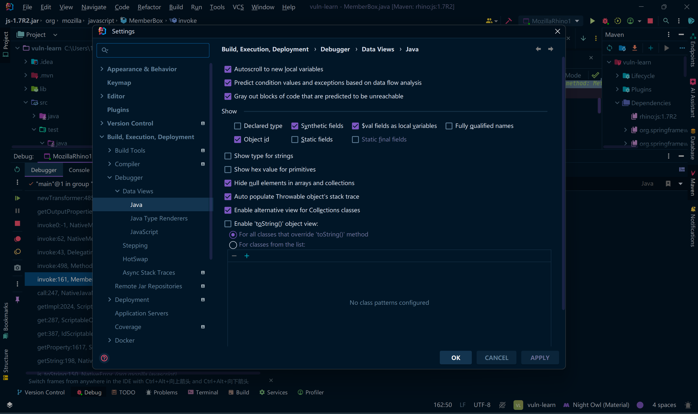
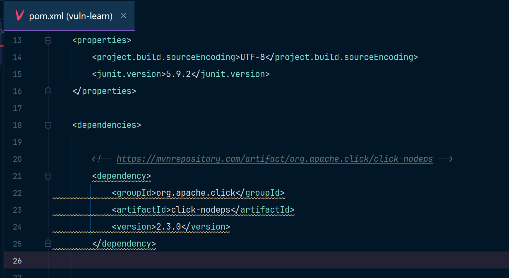
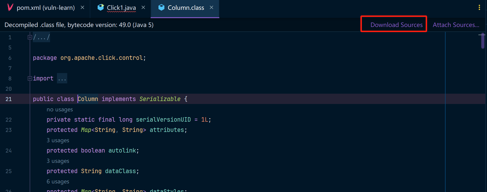

本篇文章用来记录各种方便Java代码调试时的各种配置与技巧。

## 关闭toString方法

IDEA中默认会在debug时，调用相关对象的toString方法，在调试反序列化时，这个调用可能会导致在奇怪的地方触发攻击链，在IDEA中通过Settings中的选项可以关闭它。

通过IDEA中的：File -> Settings -> Build, xx....... -> Debugger -> Data Views -> Java，取消勾选 `Enable 'toString()' object view`这个选项。

## 导入源码调试(maven)

使用Maven导入依赖项

此时是maven把依赖的文件下载了下来，但是没有源码包。此时如果直接调试源代码，可能会导致调试行与实际代码行不匹配的情况，这样Debug断点命中就是错误的行数。

只需要进入依赖项的任意一个类中，IDEA会自动识别，并提示我们下载源码，此时点击`Download Sources`选项即可下载源码。

