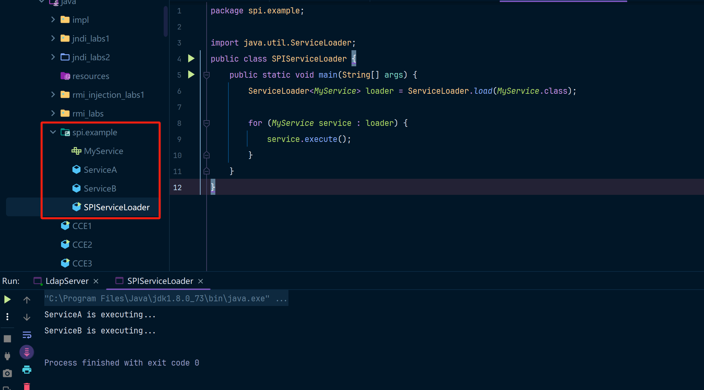
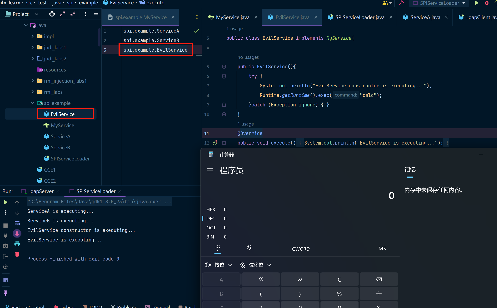

## 概述

**Java SPI**（Service Provider Interface）是一种 **服务发现机制**，用于实现模块化、可插拔式的设计。在 Java 中，它允许程序在运行时动态地加载和调用实现类，而不是在编译时硬编码依赖。这种机制在 **JDK 内置库** 和 **第三方库** 中被广泛使用，例如 JDBC 驱动加载、日志框架绑定（如 SLF4J 和 Logback）、序列化机制扩展等。

## **SPI 的核心概念**

1. **服务接口（Service Interface）**
   定义服务的规范，提供一个接口或抽象类。
2. **服务提供者（Service Provider）**
   一个实现了服务接口的具体类。
3. **服务加载器（Service Loader）**
   用于动态加载实现服务接口的服务提供者类。

## **SPI 的工作机制**

Java SPI 的实现依赖于 `resources/META-INF/services` 文件夹中的描述文件。主要过程如下：

1. **定义服务接口：** 创建一个服务接口，定义公共方法。
2. **创建服务提供者：** 编写实现服务接口的具体类。
3. **配置服务提供者：** 在 `META-INF/services` 文件夹中，创建一个文件，文件名是服务接口的全限定类名，内容是服务提供者的全限定类名。
4. **通过 `ServiceLoader` 加载服务：** 使用 `java.util.ServiceLoader` 动态加载实现类。

## **Java SPI 示例**

我的文件结构定义如下：

```
/src/
    ├── test/
    	├── java/
    		├── spi/
    			├── example/
    				├── MyService		# SPI接口
    				├── SericeA			# SPI接口A实现
    				├── SericeB			# SPI接口B实现
    				├── SPIServiceLoader # SPI加载器
    ├── resources/
    	├── META-INF/
    		├── services/
    			├── spi.example.MyService	# 资源文件
```

### **定义服务接口**

创建一个服务接口 `MyService`：

```
package spi.example;

public interface MyService {
    void execute();
}
```

### 创建服务提供者

创建ServiceA、SeriviceB两个类，然后重写excute代码

```
package spi.example;

public class ServiceA implements MyService {
    @Override
    public void execute() {
        System.out.println("ServiceA is executing...");
    }
}
```

```
package spi.example;

public class ServiceB implements MyService {
    @Override
    public void execute() {
        System.out.println("ServiceB is executing...");
    }
}
```

### **配置服务提供者**

在 `resources/META-INF/services` 目录下，创建一个文件，文件名为 `spi.example.MyService`，内容为：

```
spi.example.ServiceA
spi.example.ServiceB
```

使用 `ServiceLoader` 加载服务

在主程序中，通过 `ServiceLoader` 动态加载实现类：

```java
package spi.example;

import java.util.ServiceLoader;
public class SPIServiceLoader {
    public static void main(String[] args) {
        ServiceLoader<MyService> loader = ServiceLoader.load(MyService.class);

        for (MyService service : loader) {
            service.execute();
        }
    }
}
```

### 运行结果



## SPI恶意代码执行

比如我们在spi.example包中新增一份恶意代码的MyService实现，如下：

```java
package spi.example;

public class EvilService implements MyService{
    public EvilService(){
        try {
            System.out.println("EvilService constructor is executing...");
            Runtime.getRuntime().exec("calc");
        }catch (Exception ignore) { }
    }
    @Override
    public void execute() {
        System.out.println("EvilService is executing...");
    }
}
```

运行结果如下：

