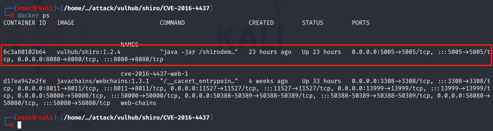

所有的Java程序调试逻辑都是一样的，都是通过开启jwdp来完成调试，这玩意儿是java的远程调试协议，说起来虽然很复杂，但是只要一个Java项目启动时使用了：`-agentlib:jdwp=transport=dt_socket,server=y,suspend=n,address=*:5005`这个参数就能开启调试，其中比较重要的参数是：

* suspend：`suspend` 的可选值为 `y` 或 `n`。当设置为 `y` 时，Java 在启动后会立即暂停，等待调试器客户端连接，只有在客户端成功连接后，程序才会继续执行后续的启动流程。此选项非常适用于调试服务初始化阶段的代码，确保开发者能够捕获关键的执行过程。
* address：`address` 用于指定监听的地址和端口。在 **Java 8 及以前**，默认监听所有地址，而 **Java 9 及以后** 默认仅监听本地地址（`127.0.0.1`）。在 **Docker 容器** 或 **云环境** 中，如果需要允许外部访问调试端口，应设置为 `0.0.0.0:5005` 或 `*:5005`，两者均表示监听所有网络接口。但在某些环境（如 `netty` 或 `bind` 操作）下，`*` 可能无法识别，推荐使用 `0.0.0.0` 以确保兼容性，例如：`-agentlib:jdwp=transport=dt_socket,server=y,address=0.0.0.0:5005,suspend=n`，这样可以保证调试端口对外可访问。

说白了就是，如果我想调试vulhub中的Java项目，那就也需要加这个参数，vulhub一般是自己打包的一个Docker镜像，通常命名是这样的：`vulhub/shiro:1.2.4`。

在vulhub中你找到`vulhub/base`这个目录，这个目录下存放了所有镜像的Dockerfile，比如我要调试`vulhub/shiro:1.2.4`，就找这个文件夹下的`shiro/1.2.4`，则可以找到对应的Dockerfile，就像这样：


然后Dockerfile是这样的：


如果你想自己打包一个调试的镜像的话，可以把CMD这条命令中加上jwdp的参数，就像这样的：

但是这种方法不太推荐，比较麻烦......

```dockerfile
CMD ["java", "-agentlib:jdwp=transport=dt_socket,server=y,suspend=n,address=0.0.0.0:5005", "-jar", "/shirodemo-1.0-SNAPSHOT.jar"]
```

可以通过修改环境中具体的docker-compose文件来动态加入参数，注意这里的`0.0.0.0`，有时候设置`*`是不太好用的，具体是Docker还是Java导致的，我也没太研究，不过`0.0.0.0`是个通用解。

```yaml
version: '2'
services:
 web:
   image: vulhub/shiro:1.2.4
   ports:
    - "8080:8080"
    - "5005:5005"
   environment:
    - JAVA_TOOL_OPTIONS=-agentlib:jdwp=transport=dt_socket,server=y,suspend=n,address=0.0.0.0:5005
```


然后正常使用`docker compose up -d`来启动这个漏洞环境即可。



在Windows中也clone一份vulhub的代码，使用IDEA打开你需要调试的源码，比如我当前调试的代码是`vulhub/base/shiro/1.2.4/code`。然后在`Run/Debug`中选中`Edit Configurations...`->`Add New Configuration` -> `Remote JVM Debug`，然后填完要调试的项目地址，保存即可。


点击Debug，Console中给出了已连接到目标VM的提示：

同时这里我想调试这个请求，可以看到这是个Shiro逻辑的重写方法，写死了`username=admin`、`password=vulhub`的校验参数。


然后来到页面上，填写数据让其能触发这块的逻辑。


放开断点，即可触发后续逻辑。


远程debug还是非常简单的，但是很多人不知道。

其实没有Java源码，只有jar包也是可以调试的，但是可能会有一些奇怪的问题。

比如，java在被编译之后的代码用IDEA反编译之后和源代码的行号是不一致的，可能会出现log打印的错误日志行号和实际对不上的情况，代码非常容易调飞，而且断点打的也不精准。