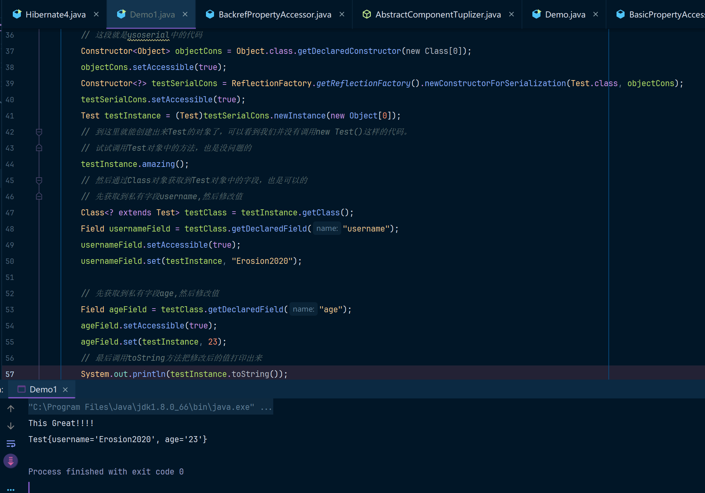

从ysoserial中学到的宇宙超级无敌牛逼的创建实例操作，震惊了我这个三年经验的开发码农。

先看一下ysoserial中的这段代码，对应`Reflections.createWithoutConstructor`：

```java
public class Reflections {
    // 当一个对象没有合适的构造方法时(甚至没有默认构造方法的情况下)，调用这个方法
    // 就可以达到new Target();的效果，其效果就和调用默认构造方法的效果差不多
    public static <T> T createWithoutConstructor ( Class<T> classToInstantiate )
        throws NoSuchMethodException, InstantiationException, IllegalAccessException, InvocationTargetException {
        // 该方法会构造Object.class,new Class[0]和new Object[0],作为默认参数
    return createWithConstructor(classToInstantiate, Object.class, new Class[0], new Object[0]);
	}
    @SuppressWarnings ( {"unchecked"} )
    public static <T> T createWithConstructor ( Class<T> classToInstantiate, Class<? super T> constructorClass, Class<?>[] consArgTypes, Object[] consArgs )
            throws NoSuchMethodException, InstantiationException, IllegalAccessException, InvocationTargetException {
        // 我们先看只调用createWithoutConstructor的情况下会发生什么
		// Object.class 指向 Object 类的 Class 对象。
		// .getDeclaredConstructor(new Class[0]) 查找无参数构造函数。
		//返回的 Constructor<Object> 是表示该构造函数的反射对象
        Constructor<? super T> objCons = constructorClass.getDeclaredConstructor(consArgTypes);
        // Object的访问权限其实都是public的，但是这个方法为了统一写法(兼容createWithoutConstructor和createWithConstructor)
        // 所以还是设置的Object构造方法为true
	    setAccessible(objCons);
        // 骚操作从这个开始了
        // 通过 ReflectionFactory 创建了一个特殊的构造函数，用于实例化 classToInstantiate 类对象。
        // ReflectionFactory.getReflectionFactory() 用于获取一个反射工厂实例。
        // newConstructorForSerialization(classToInstantiate, objCons) 使用 objCons（Object 类的无参构造函数）创建一个适用于 classToInstantiate 类的序列化构造函数。
        Constructor<?> sc = ReflectionFactory.getReflectionFactory().newConstructorForSerialization(classToInstantiate, objCons);
        // 给classToInstantiate的访问权限设置为允许访问
	    setAccessible(sc);
        // 此时的sc就是创建出来的目标对象的无参构造
        // 调用无参构造的newInstance方法即可创建目标对象实例
        // 此时的consArgs为new Object[0]，也就是空参
        return (T)sc.newInstance(consArgs);
    }
}
```

在没有构造函数的情况下还能通过默认构造函数构造对象实体。通过反射+序列化方式，直接忽略对象定义的构造方法，直接在外部使用自定义方式创建对象实例，这个代码真的太棒了！！！

是不是感觉还是晕晕的，来我们代入一个例子你就知道了：

```java
package beautiful;
import sun.reflect.ReflectionFactory;
import java.lang.reflect.Constructor;
public class Demo1 {
    // 这是一个没有默认构造函数的Test类
    class Test{
        private String username;
        private Integer age;

        // 因为声明了一个有参构造，同时没有显式声明Test的无参构造
        // 所以正常情况下在外部类中，想要创建Test的实例，只能通过new Test("Eroison2020", 27)
        // 这种有参传递的方式才能创建实例
        public Test(String username, Integer age) {
            this.username = username;
            this.age = age;
        }

        public void amazing(){
            System.out.println("This Great!!!!");
        }

        @Override
        public String toString() {
            return "Test{" +
                    "username='" + username + '\'' +
                    ", age='" + age + '\'' +
                    '}';
        }
    }

    public static void main(String[] args) throws Exception {
        // -----------------------这段就是ysoserial中的代码
        Constructor<Object> objectCons = Object.class.getDeclaredConstructor(new Class[0]);
        objectCons.setAccessible(true);
        Constructor<?> testSerialCons = ReflectionFactory.getReflectionFactory().newConstructorForSerialization(Test.class, objectCons);
        testSerialCons.setAccessible(true);
        Test testInstance = (Test)testSerialCons.newInstance(new Object[0]);
        // ------------------------到这里就能创建出来Test的对象了，可以看到我们并没有调用new Test()这样的代码。
        // 试试调用Test对象中的方法，也是没问题的
        testInstance.amazing();
        // 然后通过Class对象获取到Test对象中的字段，也是可以的
        // 先获取到私有字段username,然后修改值
        Class<? extends Test> testClass = testInstance.getClass();
        Field usernameField = testClass.getDeclaredField("username");
        usernameField.setAccessible(true);
        usernameField.set(testInstance, "Erosion2020");

        // 先获取到私有字段age,然后修改值
        Field ageField = testClass.getDeclaredField("age");
        ageField.setAccessible(true);
        ageField.set(testInstance, 23);
        // 最后调用toString方法把修改后的值打印出来
        System.out.println(testInstance.toString());
    }
}

```

运行效果如下：

