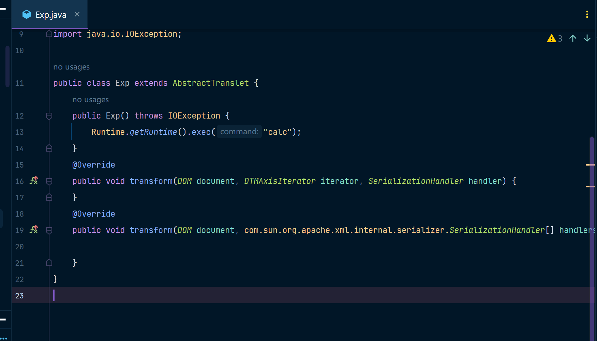

学Java安全的时候发现好多师傅分析漏洞的时候直接就给了一段Base64字节码，然后虽然一些师傅也会给出来对应的代码，但是有些小白是不知道怎么把一个java类转成Base64字节码的。

对于刚学Java安全的小白来说真的太不友好啦，也不知道这玩意儿是什么意思，所以这里写一个小工具，专门用来把Java类转成Base64字节码，以及把字节码转成.class文件，这样即便有些师傅只给了Base64我们也可以用这份代码还原一下师傅用的字节码文件。

## Java代码

```java
import javax.tools.JavaCompiler;
import javax.tools.ToolProvider;
import java.io.File;
import java.io.FileInputStream;
import java.io.FileOutputStream;
import java.io.IOException;
import java.net.MalformedURLException;
import java.net.URL;
import java.nio.file.Path;
import java.nio.file.Paths;
import java.util.Base64;

public class ByteJavaUtil {

    public static String toBase64Byte(String javaFilePath) throws Exception{
        // 获取 Java 编译器
        JavaCompiler compiler = ToolProvider.getSystemJavaCompiler();
        if (compiler == null) {
            throw new IllegalStateException("未找到 Java 编译器，请确保使用的是 JDK 而不是 JRE。");
        }
        // 编译 Java 文件
        int result = compiler.run(null, null, null, javaFilePath);
        if (result != 0) {
            throw new RuntimeException("Java 文件编译失败，请检查语法错误：" + javaFilePath);
        }
        // 获取 .class 文件路径
        String classFilePath = javaFilePath.replace(".java", ".class");
        // 读取 .class 文件内容为字节数组
        File classFile = new File(classFilePath);
        if (!classFile.exists()) {
            throw new RuntimeException(".class 文件未生成：" + classFilePath);
        }
        byte[] classBytes = readFileToByteArray(classFile);
        // 转换为 Base64 字符串
        return Base64.getEncoder().encodeToString(classBytes);
    }

    private static byte[] readFileToByteArray(File file) throws IOException {
        try (FileInputStream fis = new FileInputStream(file)) {
            byte[] buffer = new byte[(int) file.length()];
            int ignore = fis.read(buffer);
            return buffer;
        }
    }
    public static void toJavaClassFile(String targetPath, String base64Data) throws MalformedURLException {
        // 解码 Base64 数据
        byte[] classData = Base64.getDecoder().decode(base64Data);
        // 写入 .class 文件
        Path path = Paths.get(targetPath, "DecodedTest.class");
        try (FileOutputStream fos = new FileOutputStream(path.toFile())) {
            fos.write(classData);
            System.out.println("Class file decoded successfully!");
        } catch (IOException e) {
            e.printStackTrace();
        }
    }
    public static void main(String[] args) throws Exception {
        // 把指定的java文件转换成字节码，同时进行base64编码
        String base64Byte = ByteJavaUtil.toBase64Byte("...\\Exp.java");
        // 输出base64编码
        System.out.println(base64Byte);
		// 把base64字节码转换成.class文件，并且输出到指定的路径中
        ByteJavaUtil.toJavaClassFile("...\\Desktop", base64Byte);
    }
}
```

我要转换的Java代码如下：



然后执行脚本会有一些输出：

```bash
# 一些警告......
yv66vgAAADQAIQoABgATCgAUABUIABYKABQAFwcAGAcAGQEABjxpbml0PgEAAygpVgEABENvZGUBAA9MaW5lTnVtYmVyVGFibGUBAApFeGNlcHRpb25zBwAaAQAJdHJhbnNmb3JtAQCmKExjb20vc3VuL29yZy9hcGFjaGUveGFsYW4vaW50ZXJuYWwveHNsdGMvRE9NO0xjb20vc3VuL29yZy9hcGFjaGUveG1sL2ludGVybmFsL2R0bS9EVE1BeGlzSXRlcmF0b3I7TGNvbS9zdW4vb3JnL2FwYWNoZS94bWwvaW50ZXJuYWwvc2VyaWFsaXplci9TZXJpYWxpemF0aW9uSGFuZGxlcjspVgEAcihMY29tL3N1bi9vcmcvYXBhY2hlL3hhbGFuL2ludGVybmFsL3hzbHRjL0RPTTtbTGNvbS9zdW4vb3JnL2FwYWNoZS94bWwvaW50ZXJuYWwvc2VyaWFsaXplci9TZXJpYWxpemF0aW9uSGFuZGxlcjspVgcAGwEAClNvdXJjZUZpbGUBAAhFeHAuamF2YQwABwAIBwAcDAAdAB4BAARjYWxjDAAfACABABtmYXN0anNvbl9sYWJzL3ZlcnNpb24yMy9FeHABAEBjb20vc3VuL29yZy9hcGFjaGUveGFsYW4vaW50ZXJuYWwveHNsdGMvcnVudGltZS9BYnN0cmFjdFRyYW5zbGV0AQATamF2YS9pby9JT0V4Y2VwdGlvbgEAOWNvbS9zdW4vb3JnL2FwYWNoZS94YWxhbi9pbnRlcm5hbC94c2x0Yy9UcmFuc2xldEV4Y2VwdGlvbgEAEWphdmEvbGFuZy9SdW50aW1lAQAKZ2V0UnVudGltZQEAFSgpTGphdmEvbGFuZy9SdW50aW1lOwEABGV4ZWMBACcoTGphdmEvbGFuZy9TdHJpbmc7KUxqYXZhL2xhbmcvUHJvY2VzczsAIQAFAAYAAAAAAAMAAQAHAAgAAgAJAAAALgACAAEAAAAOKrcAAbgAAhIDtgAEV7EAAAABAAoAAAAOAAMAAAAMAAQADQANAA4ACwAAAAQAAQAMAAEADQAOAAEACQAAABkAAAAEAAAAAbEAAAABAAoAAAAGAAEAAAARAAEADQAPAAIACQAAABkAAAADAAAAAbEAAAABAAoAAAAGAAEAAAAVAAsAAAAEAAEAEAABABEAAAACABI=
Class file decoded successfully!

```

最终在你给出的路径下回输出一个

