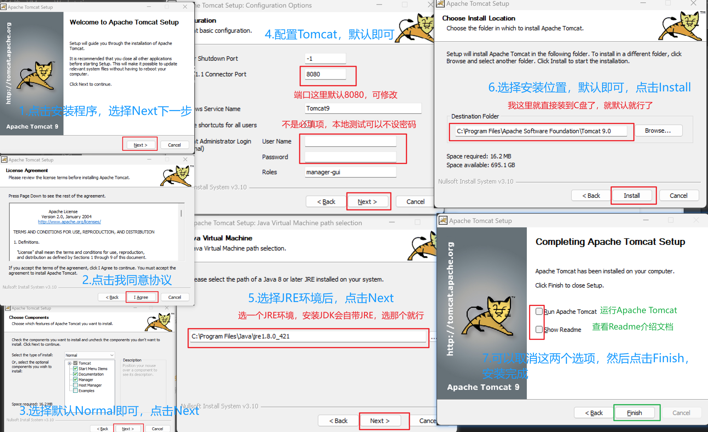
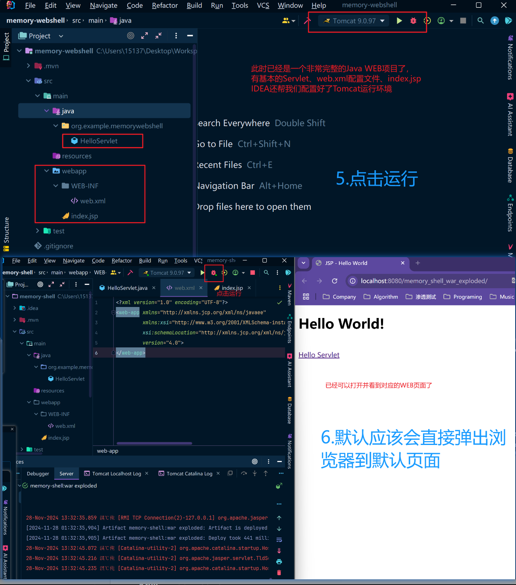
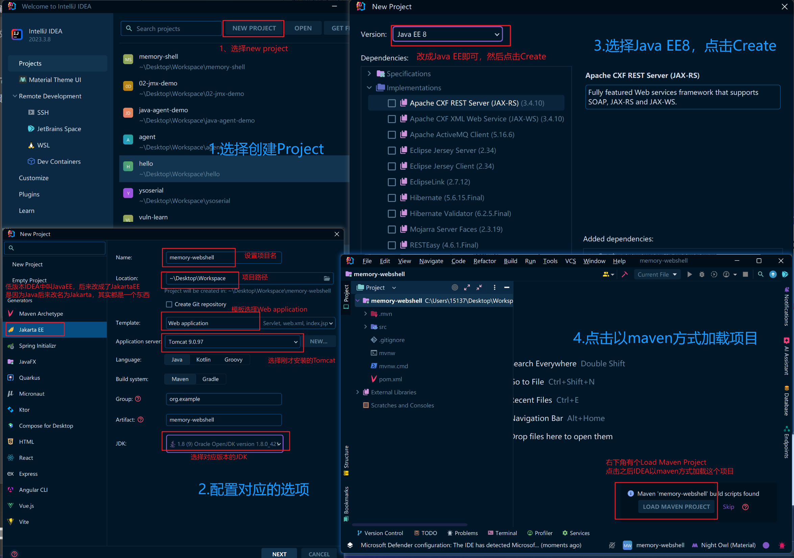
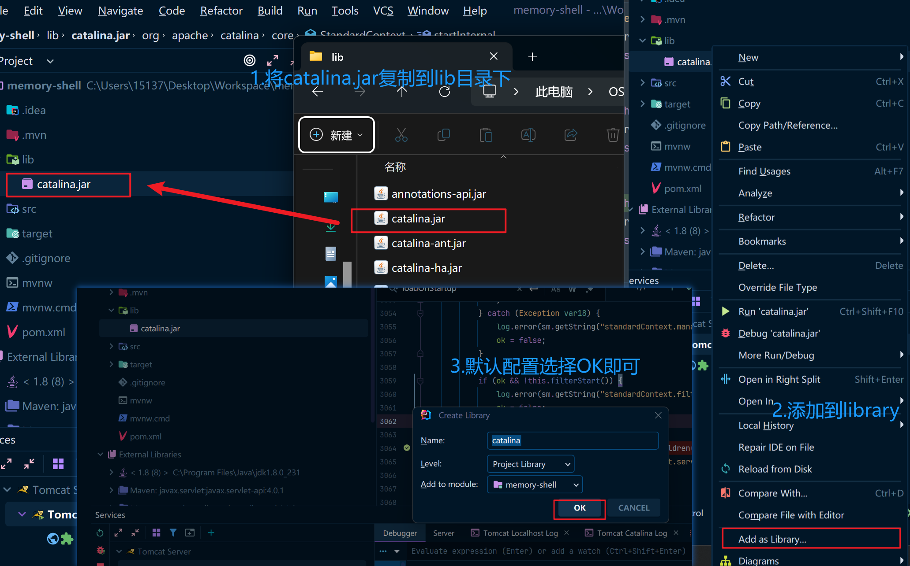
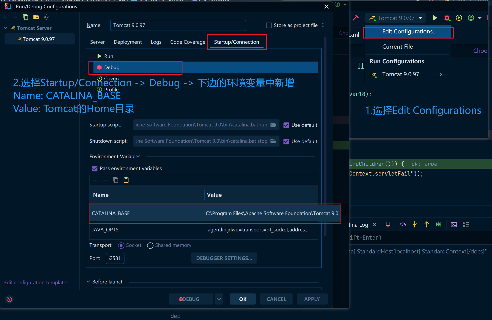
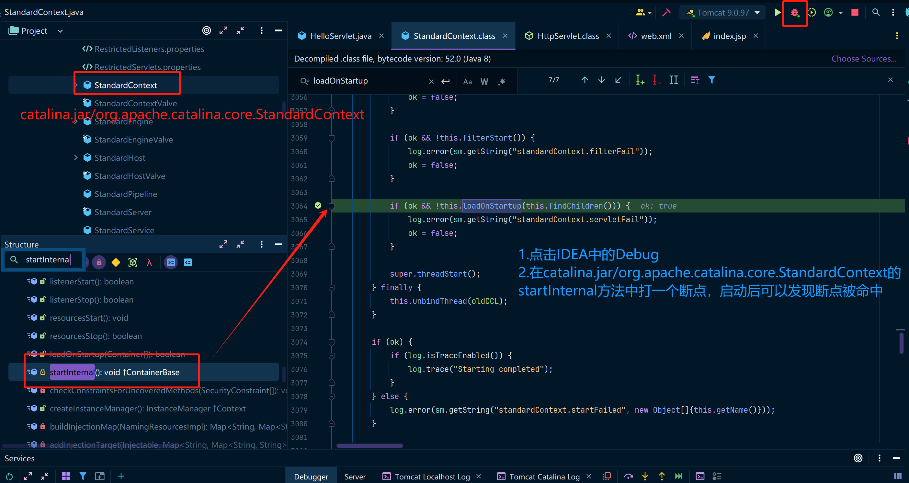

## 概述

写了一半想起来之前刚学JAVA开发的时候，写过一篇博客讲的是从0配置JAVA WEB开发环境，因为工作的时候用的都是现成的环境，要不就是Springboot一把梭了，所以具体的配置时至今日也忘的差不多了。

当然那篇写的更全一些，更适合什么都不懂的小白，这篇针对于网络安全学习的，只关注JAVA WEB应用创建和Tomcat配置的部分，最后会使用IDEA配置一下可以调试tomcat中的catalina代码的debug环境。

[从0配置JAVA WEB环境](https://www.cnblogs.com/erosion2020/p/14019395.html)，这里边使用的是Tomcat10.x版本，Tomcat10.x默认不支持JDK8，所以如果你想使用JDK8，最好还是使用Tomcat9.x版本(推荐)，或者Tomcat8.x版本(不推荐)。

官方文档(which version)：https://tomcat.apache.org/whichversion.html

**下边配置过程使用以下组件版本**

JDK8u421、Tomcat9.0.97、IDEA 2023.3.8

## 安装Tomcat

下载地址：[Tomcat 9.0.97-windows-x64](https://dlcdn.apache.org/tomcat/tomcat-9/v9.0.97/bin/apache-tomcat-9.0.97.exe)

或使用新版9.x Tomcat：https://tomcat.apache.org/download-90.cgi

使用Installer安装很简单，一路next就行了，就使用默认配置即可，我这里重新安装了一遍，需要的话可以参考，其实都是使用默认配置。

如果你想配置Tomcat的默认端口或者设置用户名密码的话，则可以在第4步的时候点击设置。



## IDEA新建JAVA WEB项目

按照下边我的配置一步一步来安装即可，很简单，点点点就行了。





## Jakarta是什么？

2009年4月20日，甲骨文(Oracle)公司和Sun公司今天共同宣布了最终协议，甲骨文公司将以74亿美元收购SUN公司。当时，Sun Microsystems被誉为世界上最具前瞻性的IT公司之一，有能力以开放软件及硬件为结合，进行全面统一的系统，给客户带来最大的价值。Oracle收购Sun Microsystems表明，它希望借助Sun Microsystems的关键软件和技术资源，将自身现有的专业的管理体系，硬件解决方案，及应用程序发展技术集成在同一个平台上，从而创建一个更加完善的企业增值产品和服务。

2018年，Oracle(甲骨文)决定将Java EE移交给开源组织Eclipse基金会，但甲骨文不允许开源组织用Java的名号，于是Eclipse选出了 "Jakarta EE" 和"Enterprise Profile"两个名字，最终前者胜出。

Eclipse基金会高管Mike Milinkovich表示，7000多人参与了Java EE的更名投票，64%的票数支持改为Jakarta EE，另有35.6%的票数支持Enterprise Profile。

Oracle将**Java EE**（Java SE还自己保留）交给开源组织，Eclipse基金会接手。但Oracle不允许开源组织使用Java名号，所以Jakarta EE名称于2018.02.26应运而生。Oracle收购了Sun公司，涉及到商标和版权原因，Javax改名为Jakarta迫不得已。

所以高版本的Java中有一些包名从javax改成了jakarta.....，所以当你用Tomcat或者其他的组件(如spring等)的时候可能会碰到JDK包兼容的问题，所以在配置环境时，需要考虑这些问题。

更多内容可以参考jakarta官网：https://jakarta.ee/

## IDEA开启本地Tomcat调试

在Java WEB项目中，创建一个lib目录

然后在本地安装的Tomcat的HOME目录中找到lib\catalina.jar包，把这个包放到lib目录中，然后右键这个包选择`Add as library`



然后配置IDEA中的tomcat debug选项，在Startup/Connection -> Debug中配置：

```
Name: CATALINA_BASE
Value: Tomcat家目录
```



进入到catalina的源码中，先打一个启动时会触发的地方，然后点击IDEA右上角的debug按钮，断点命中，就配置完毕了。

**注意项：一定要使用和Tomcat相匹配的catalina.jar包，要不然调试的时候debug的行数是错乱的，就无法debug了。**

图中我标注错了，应该是，先打断点，然后再点击debug启动，算了不改了，用过debug功能的同学肯定都知道要先打断点。

1. 先在catalina.jar/org.apache.catalina.core.StandardContext的任意一个启动方法中打一个断点
2. 点击IDEA中的debug按钮即可，断点就能命中



