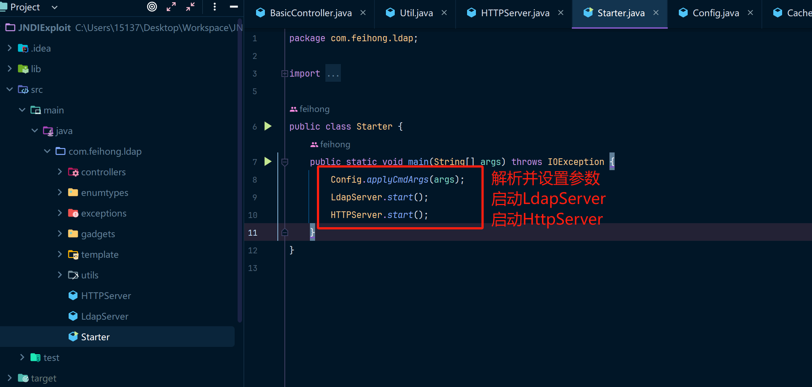
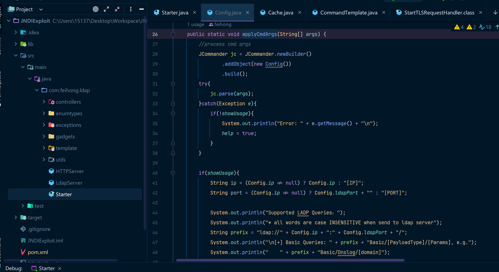
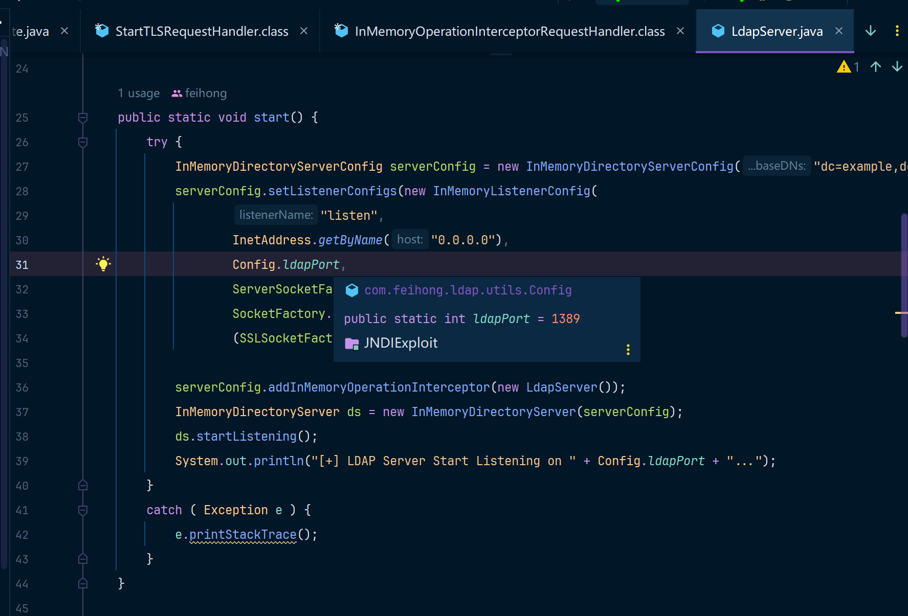
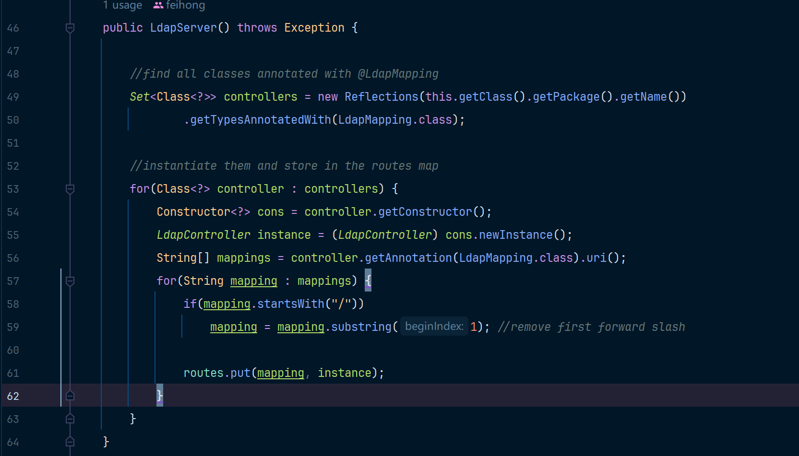
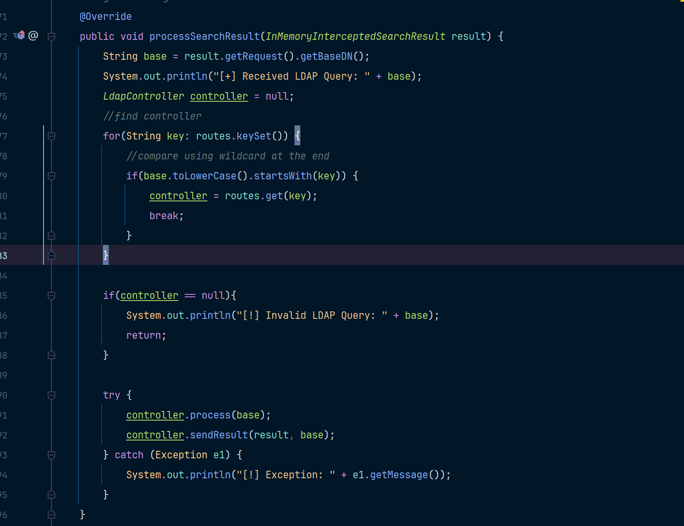
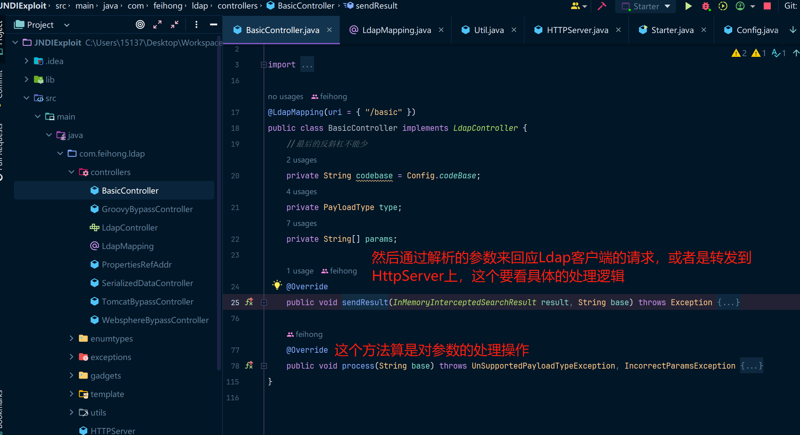
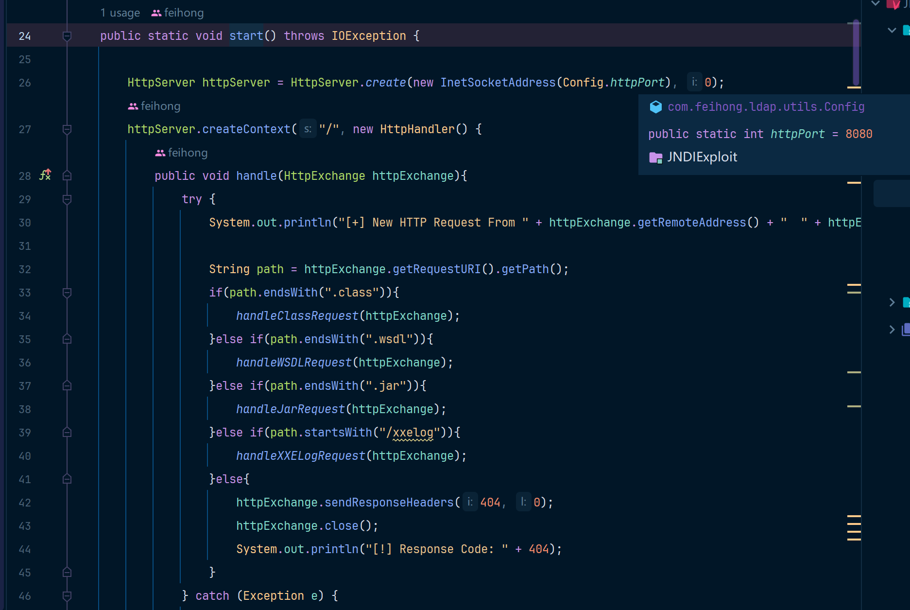
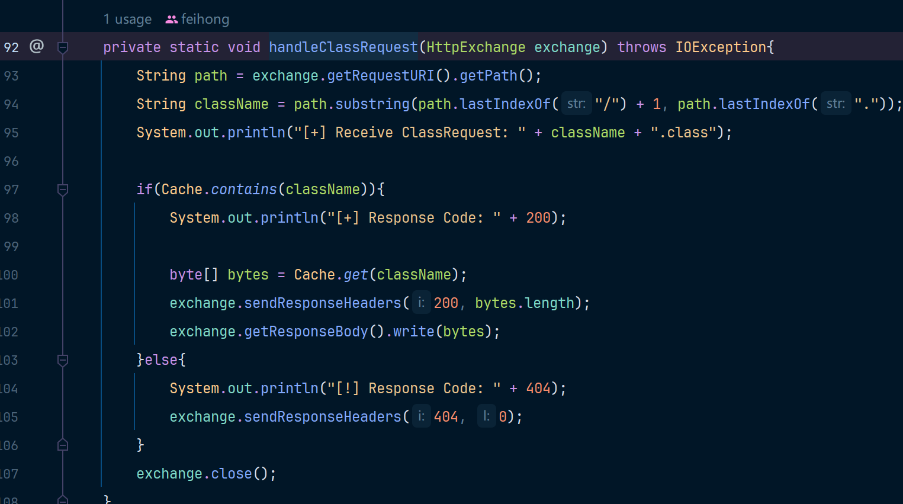
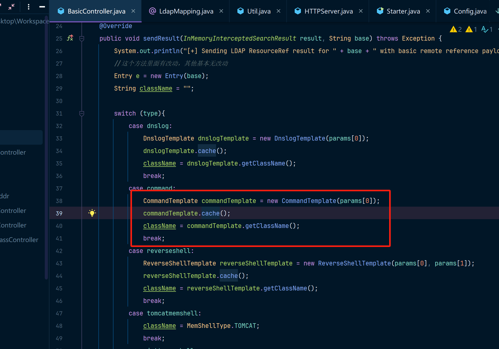
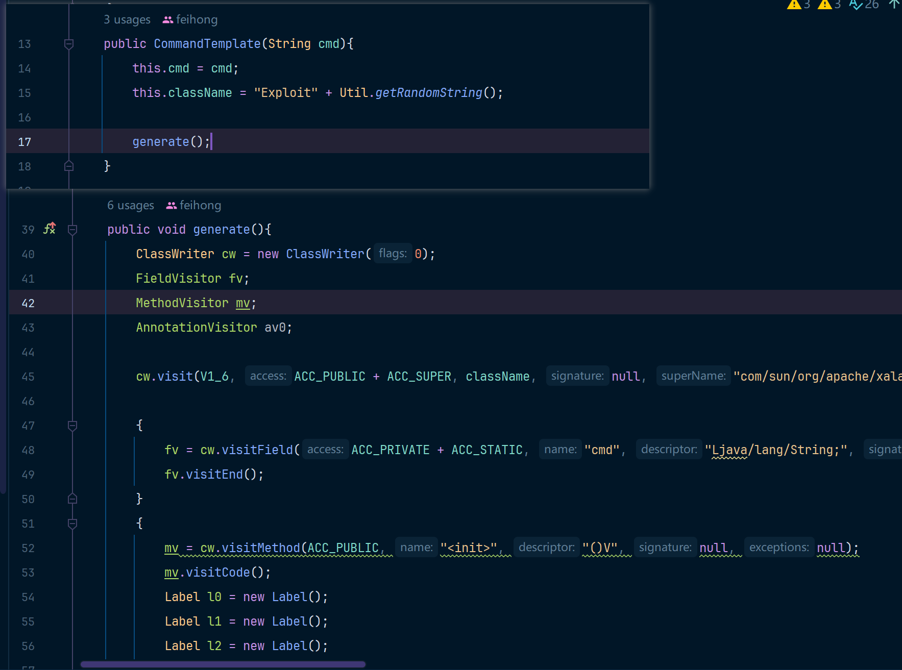

本篇文章是分析了一个Github中的一个JNDI利用工具的代码，里边的代码并不复杂。

但是这个设计就会让漏洞利用的时候非常方便，嘿嘿嘿，每天学到一个知识点~

### JNDIExploit分析

这个项目其实就是封装了一下[JNDI-Injection-Exploit](https://github.com/welk1n/JNDI-Injection-Exploit)的服务端，让其用起来更加方便，这里简单分析一下，主要是我也想看一下它写的逻辑，hhhhhhh

#### JNDIServer分析

我们先静态分析一下

在applyCmdArgs方法中，解析了所有的配置项，然后把配置存入到Config这个类中，这个类中的所有字段都是public static的，可以理解是全局访问的变量，而且全局只有一份。

然后看一下LdapServer中的内容，大概意思就是起一个Ldap服务，监听所有IP请求(0.0.0.0)，因为我们没有配置ldap端口所以使用默认ldap端口，在配置完成后启动LDAP服务监听。

然后我们知道要连接的肯定是Ldap服务器，所以我们看一下LdapServer这个里边是怎么写的，也就是new LdapServer这个构造方法中干了什么事儿。

这个其实就是获取到所有用了LdapMapping注解的类，然后通过routes将所有的路径都存储起来，而LdapServer重写了processSearchResult函数，逻辑如下：

从routes中拿到第一段URL，通过URL匹配到对应的controller，然后调用这个controller的process方法和sendResult方法。

这里以BasicController为例，process其实就是对请求参数做处理的方法，sendResult就是回应Ldap客户端请求的方法，这里有可能会根据请求的不同来选择是否要转到HttpServer上。

#### HTTPServer分析

HttpServer.start方法中会开启一个HTTP服务器，然后创建一个监听 "/"的路由。可以看到在这个Handler中，他处理了所有以class、wsdl、jar、xxelog为结尾的请求，否则就会访问404状态码

然后我们这里其实是用到了.class，所以看一下handleClassRequest里边是个啥。

其实就是把Cache中存放的二进制字节拿出来，然后发送出去，没了......

Cache是什么时候放进去的呢，在BasicController中是这么写的，如果对应的type是command，那么就生成一个命令执行的代码执行模板，然后将其放入到缓存中，我们看一代码执行模板是怎么被创建出来的。

就是这么一个逻辑，根据要执行的cmd命令生成一个随机类名，然后使用ASM来直接生成一份包含了Runtime.getRuntime().exec()这个方法，exec方法的参数就是cmd中的内容。

OK，对我们学习该漏洞帮助的JNDIExploit这个项目差不多就这么多了。可能这个老哥考虑的东西比较多（可能是想写的更加灵活一点），所以加了个HttpServer来完成其他方式的攻击吧，其实这里不使用HttpServer也行直接把ASM的代码移植到Ldap那里是一样的效果。

其实就是JNDI的普通注入，可以参考大佬写的这篇分析JNDI的博客：[mi1k7ea - 浅析JNDI注入](https://www.mi1k7ea.com/2019/09/15/%E6%B5%85%E6%9E%90JNDI%E6%B3%A8%E5%85%A5/)