本篇内容是根据CodeQL官方文档的相关介绍进行安装配置。本文相关内容皆来自：[codeql官方文档](https://codeql.github.com/docs/)

因为这是代码审计篇中的内容，所以在开始之前，我就会默认你已经具备对应的代码能力。如你要审计java代码，我会默认你已经会JAVA环境变量配置、JAVA基础、mvn打包工具等。

## CodeQL简介

CodeQL 是一种用于代码分析的语言和工具链。它旨在让安全研究人员扩展对单个漏洞的了解，以便在广泛的代码库中识别该漏洞的变体。它还旨在让开发人员自动执行安全检查并将其集成到他们的开发工作流程中。

此外，多提一嘴。GitHub 本身使用 CodeQL 进行代码扫描，并在 **GitHub Advanced Security（GHAS）** 中集成了 CodeQL 来检测安全漏洞。GitHub 还定期构建开源项目的 CodeQL 数据库，允许用户直接下载使用。此外，GitHub Actions 也支持 CodeQL，可在 CI/CD 过程中自动执行安全分析。CodeQL 原本由 Semmle 公司开发，GitHub 在 2019 年收购了 Semmle，并将 CodeQL 作为官方安全工具之一。

## CodeQL本地环境配置

### 支持的平台

| 操作系统 | 支持的版本                                                   | 支持的CPU架构                 |
| :------- | :----------------------------------------------------------- | :---------------------------- |
| Linux    | Ubuntu 20.04Ubuntu 21.04Ubuntu 22.04                         | x86-64                        |
| Windows  | Windows 10 / Windows Server 2019Windows 11 / Windows Server 2022 | x86-64                        |
| macOS    | macOS 13 VenturamacOS 14 Sonoma                              | x86-64, arm64 (Apple Silicon) |

我使用的是Windows 11(x86_64)，然后我们开始安装。

GitHub 提供了 CodeQL 命令行界面和 CodeQL for Visual Studio Code，用于对开源代码库执行 CodeQL 分析。

### CodeQL CLI安装

CodeQL 命令行界面 (CLI) 主要用于创建用于安全研究的数据库。您还可以直接从命令行或使用 Visual Studio Code 扩展查询 CodeQL 数据库。可以从“ [GitHub 发布](https://github.com/github/codeql-cli-binaries/releases)”下载 CodeQL CLI。

我这里下载的是Windows，所以我选择的是Windows平台

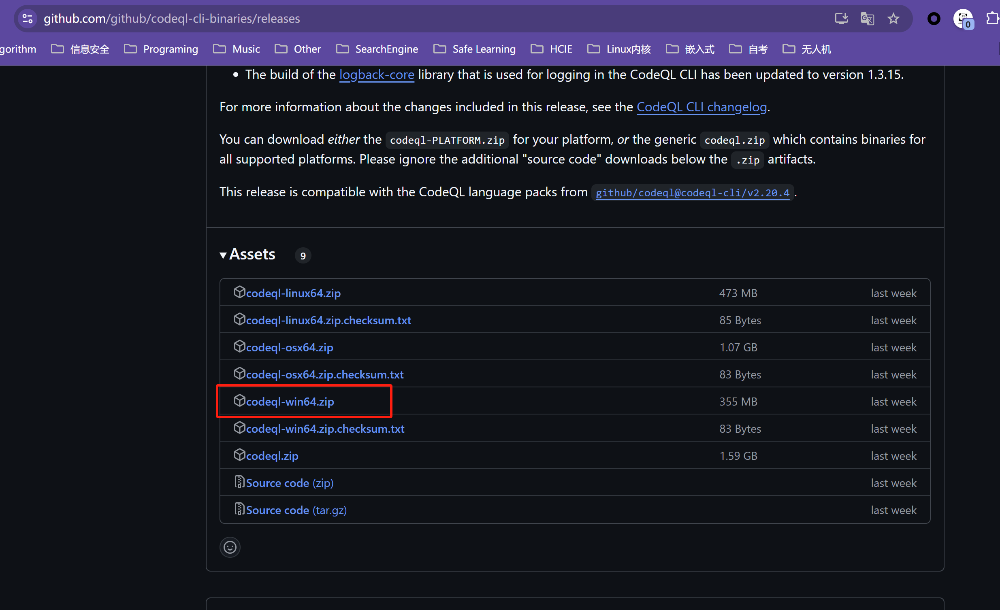

下载，解压之后，这应该是一个codeql的路径，将其配置到环境变量中。

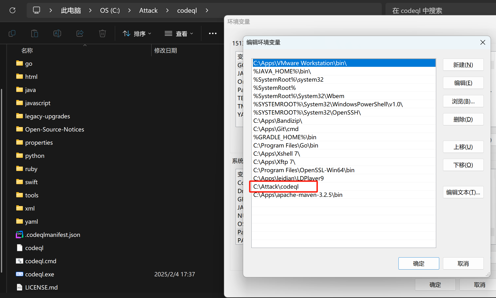

然后在终端中你应该可以使用codeql命令，就像这样：

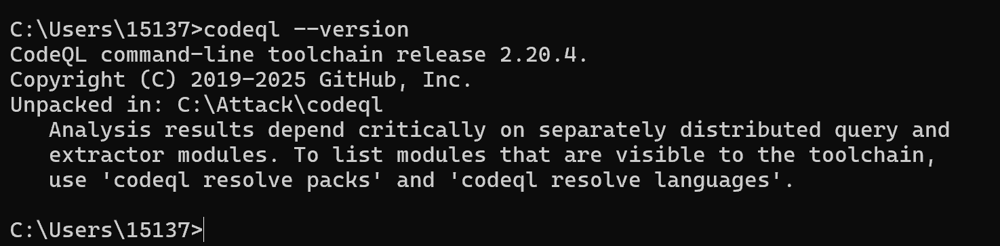

### CodeQL for vscode安装

在vscode中搜索CodeQL来安装对应的插件。

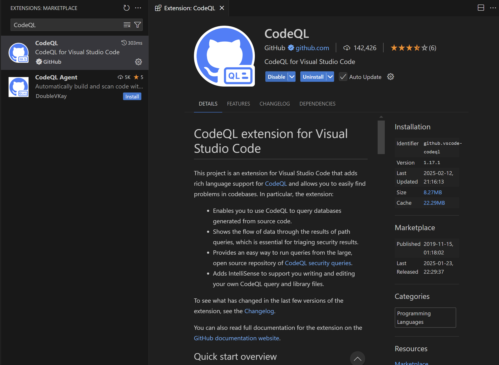

然后打开Settings

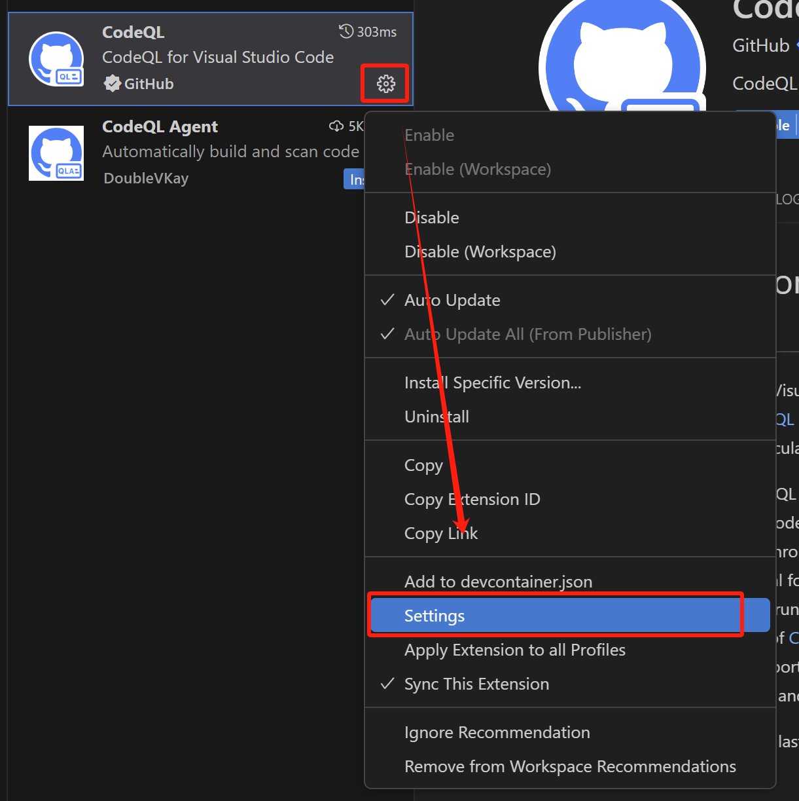

在这里配置codeql的可执行文件路径，也就是前边环境变量中配置的那个路径，但是要具体到codeql可执行文件。

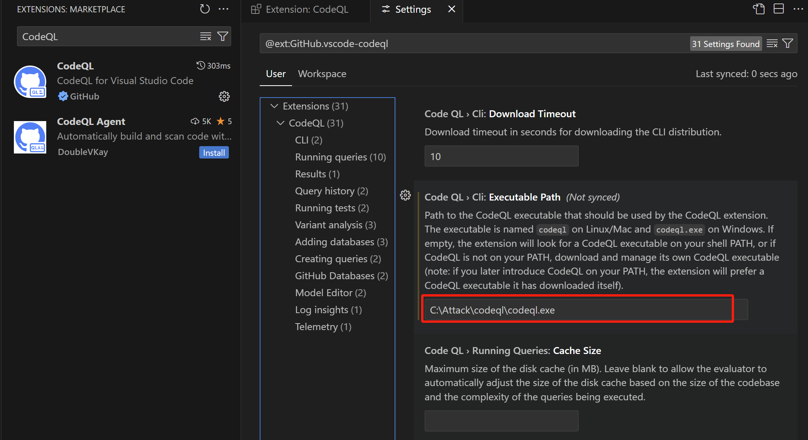

### CodeQL项目安装

这里是把codeql的项目clone到本地了，主要是为了方便使用里边的一些查询脚本，如果不clone也是可以的。

```bash
git config --global http.postBuffer 524288000
# 使用HTTP1.1
git config --global http.version HTTP/1.1
 
# clone codeql仓库的代码
git clone https://github.com/Semmle/ql --depth 1
```

### git clone踩坑

我在clone过程中报错了，如下：

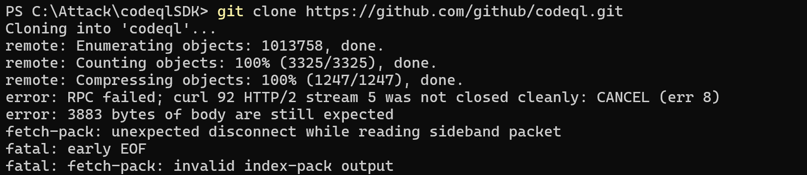

解决方案参考的StackOverFlow中的内容：[RPC failed; curl 92 HTTP/2 stream 0 was not closed cleanly: PROTOCOL_ERROR (err 1)](https://stackoverflow.com/questions/59282476/error-rpc-failed-curl-92-http-2-stream-0-was-not-closed-cleanly-protocol-erro)

```bash
# 执行完这两条命令就好了
git config --global http.version HTTP/1.1
git config --global http.postBuffer 524288000
```

## CodeQL流程使用

CodeQL 分析包括三个步骤：

1. 通过创建 CodeQL 数据库来准备代码（code -> extractor -> Database）
2. 对数据库运行 CodeQL 查询(QL Query -> Database)
3. 解释查询结果(Result)

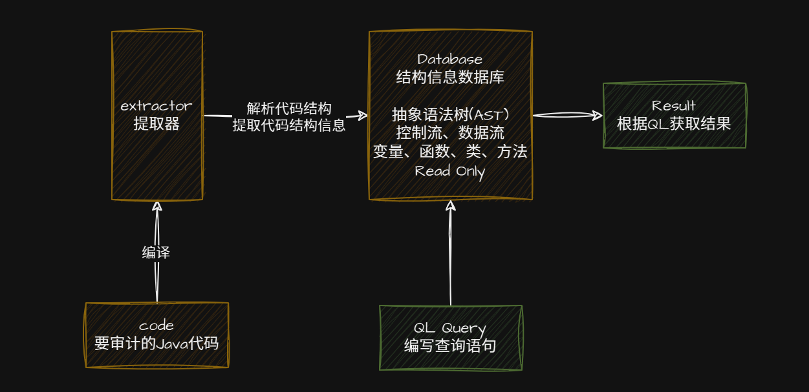

### 创建数据库

我这里以[JavaSecLab](https://github.com/whgojp/JavaSecLab)为例，先将这个项目clone到本地：

```bash
git clone https://github.com/whgojp/JavaSecLab.git
```

然后执行以下命令创建CodeQL数据库：

```bash
codeql database create C:\Attack\codeQLDB\JavaSecLab --language=java  --command="mvn clean ins
tall --file pom.xml -Dmaven.test.skip=true" --source-root=./JavaSecLab
```

这条命令的意思是

```bash
# 创建一个 CodeQL 数据库（用于后续的代码分析）
codeql database create 

# 指定 CodeQL 数据库存储的路径（该路径需预先创建好）
# 这里的路径 C:\Attack\codeQLDB\JavaSecLab 是 CodeQL 存储解析后的代码数据库的地方
C:\Attack\codeQLDB\JavaSecLab 

# 指定待分析的编程语言，这里是 Java
--language=java  

# 指定项目的编译命令
# 这里的命令含义：
# - 使用 `mvn clean install` 进行 Maven 构建
# - `--file pom.xml` 明确指定 Maven 的构建文件（可省略，默认就是 `pom.xml`）
# - `-Dmaven.test.skip=true` 表示跳过单元测试，以加快编译速度
--command="mvn clean install --file pom.xml -Dmaven.test.skip=true" 

# 指定源代码所在的路径，CodeQL 会从该路径解析代码并生成数据库
--source-root=./JavaSecLab
```

数据库创建过程如下：

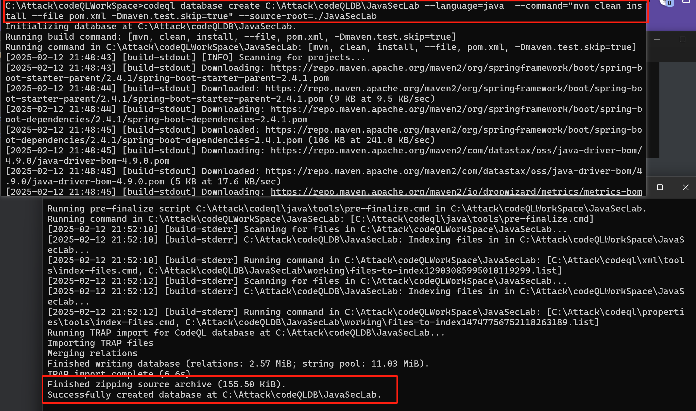

### 使用数据库

在Visual Code中打开这个数据库

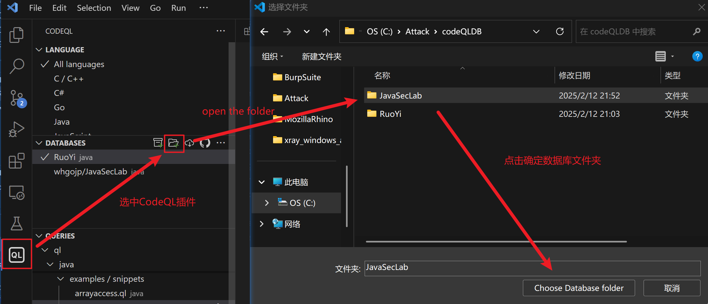

然后在`DATABASES`中选中这个数据库，对数据库点击`Select`即可选中。

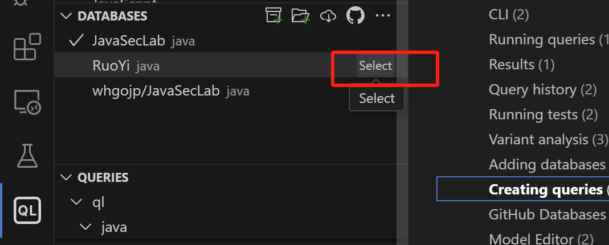

### 执行QL语句

然后在vscode的界面上打开我们刚才的CodeQL项目。

在java->ql->examples->snippets中新建一个substring.ql文件，代码如下：

```java
 import java

 from MethodCall mc
 where
   mc.getMethod().hasName("substring") and
   mc.getMethod().getDeclaringType().hasQualifiedName("java.lang", "String")
 select mc, "Found a substring method call."
```

该查询语句会查询所有调用了`java.lang.String.substring`方法的代码。

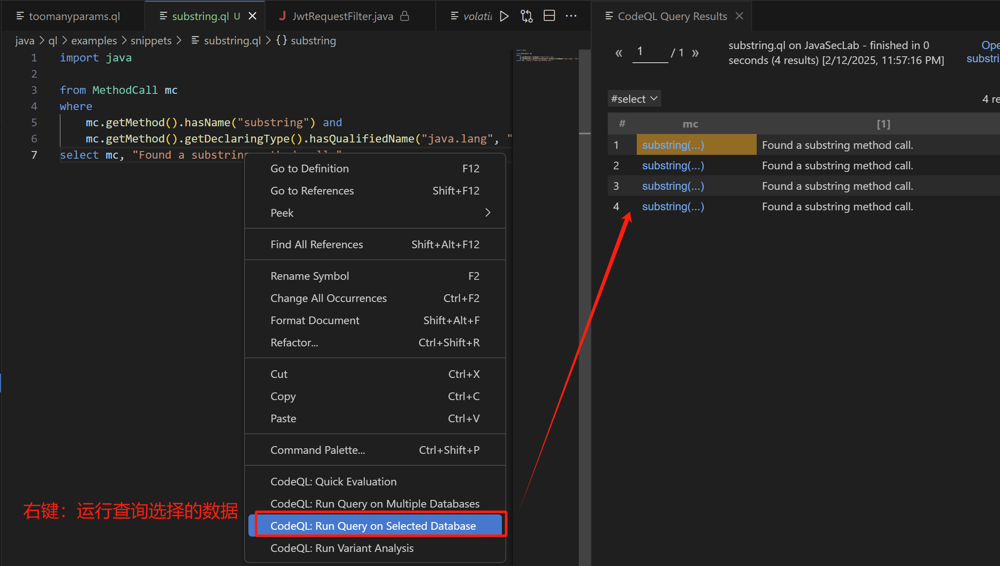

然后点击对应的方法即可跳转到对应的代码。

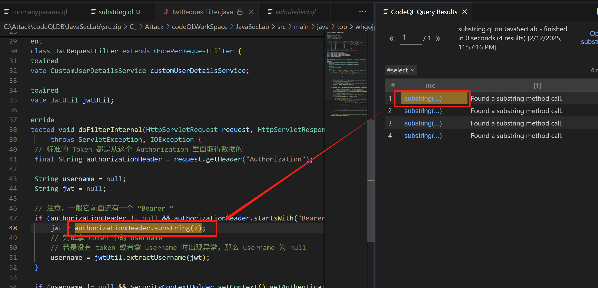

## 总结

感觉CodeQL学习成本还是比较高的，网上好多帖子看的我云里雾里的，最后还是看着官方文档整的，这篇就先介绍到这里。后边应该会更新一些CodeQL的用法之类的，我也是在学习的过程中......