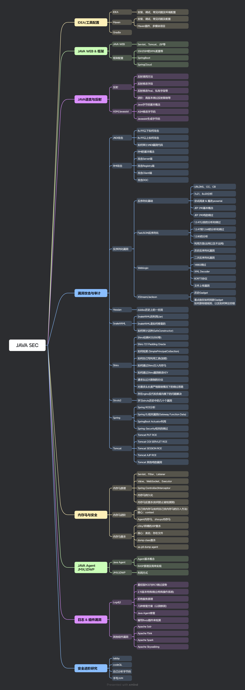

# JavaSec

嗨，师傅们，我是从2024年底开始踏入Java安全领域的新手。从零开始学，走过不少弯路，也遇到不少“师傅们”默认你已懂的代码细节，比如FastJson TemplatesImpl漏洞利用中那一大段base64脚本(还是截图)，真是调试不起来啊！

因此，这个仓库记录了我从最初迷茫到逐步掌握Java安全技术的全过程。不论是漏洞原理解析、代码调试，还是IDEA调试Tomcat的实战技巧，我都力求把每一步讲得清清楚楚，帮助同样处于起步阶段的小伙伴们避开那些坑。

欢迎师傅们指点，喜欢的朋友也别忘了点个Star，共同见证从0到1的成长旅程！

如果看完本笔记，你有不理解的地方，欢迎在issue中提问题哦~ 我会持续优化这份学习笔记。

## Java基础

在基础篇内容中主要提及字节码技术(ASM、Javassist)、反射、JNDI、RMI、SPI等内容，这些知识会在反序列化链中被应用。同时也会记录一些小知识，比如IDEA中的Debug技巧、Java中的反弹shell等。

- 反射机制: [JAVA反射基础知识 + 修改被private final修饰的字段](./A%20-%20JAVA基础/Java反射/main.md)
- ClassLoader: [BootstrapClassLoader + ExtClassLoader + AppClassLoader + 双亲委派](./A%20-%20JAVA基础/详解%20JAVAClassLoader/main.md)
- 静态代理&动态代理: [静态代理 + Proxy动态代理](./A%20-%20JAVA基础/JAVA动态代理&静态代理/main.md)
- ASM: [访问者模式 + 动态操作(访问/修改)class字节码](./A%20-%20JAVA基础/JAVA%20ASM/main.md)
- RMI(远程方法调用): [RMI基本原理 + 客户端/服务端/注册中心 攻击手法 + Bypass JEP290](./A%20-%20JAVA基础/RMI远程方法调用/main.md)
- JNDI(命名空间及目录服务): [JNDI基本概念 + JNDI/RMI攻击手法 + JNDI/LDAP攻击手法](./A%20-%20JAVA基础/JNDI注入/main.md)
- SPI机制: [SPI基本概念 + SPI攻击](./A%20-%20JAVA基础/SPI/main.md)
- Debug Tomcat源码: [Tomcat安装 + IDEA创建JAVA WEB项目 + IDEA开启调试Tomcat](./C%20-%20内存马/B%20-%20JAVA%20WEB调试环境搭建/main.md)
- 为什么Java的反弹Shell这么奇怪: [Runtime的解析规则 + Base64编码 + 反弹shell示例](./A%20-%20JAVA基础/Runtime反弹shell/main.md)
- IDEA调试技巧: [关闭toString + maven依赖源码下载](./A%20-%20JAVA基础/IDEA调试技巧/debug.md)

### JDK下载资源

- [\*推荐\* - Oracle官方全版本JDK归档下载](https://www.oracle.com/cn/java/technologies/downloads/archive/)
- [华为JDK镜像站](https://repo.huaweicloud.com/java/jdk/)
- [编程宝库JDK下载地址](http://www.codebaoku.com/jdk/jdk-oracle-jdk1-8.html)
- [InJDK下载地址/镜像源导航](https://injdk.cn/)

## 反序列化 & JNDI

在 Java 安全领域，Java 反序列化漏洞 和 JNDI 注入 是两种常见且严重的安全威胁，攻击者可以利用它们进行 远程代码执行（RCE），从而控制目标服务器。

### 反序列化基础

- 反射机制: [JAVA反射基础知识 + 修改被private final修饰的字段](./A%20-%20JAVA基础/Java反射/main.md)
- ClassLoader: [BootstrapClassLoader + ExtClassLoader + AppClassLoader + 双亲委派](./A%20-%20JAVA基础/详解%20JAVAClassLoader/main.md)
- 详解BCEL类加载反序列化: [lookupClass + Utility.encode + ClassLoader + loadClass](./A%20-%20JAVA基础/BCEL/main.md)
- 静态代理&动态代理: [静态代理 + Proxy动态代理](./A%20-%20JAVA基础/JAVA动态代理&静态代理/main.md)
- Java类转字节码工具：[Java类转Base64编码字符串 + Base64编码字符串转.class文件](./B%20-%20反序列化/Java类转字节码工具/main.md)
- 基础知识：[反序列化漏洞的起源 + JAVA反序列化 + URLDNS](./B%20-%20反序列化/JAVA反序列化学习-前置知识（基于ysoserial）/反序列化与反射介绍.md)
- 详解TemplatesImpl反序列化：[XSLT + Templates + TransletClassLoader](./B%20-%20反序列化/详解TemplatesImpl/main.md)
- AmazingCode (1)绕过构造方法的限制：[Object默认构造 + 创建目标无参构造实例](./B%20-%20反序列化/BeautifulCode1/main.md)
- 从一个Demo示例学习序列化协议: [反序列化工具介绍 + 反序列化Demo调试 + 010Editor修改字节码](./A%20-%20JAVA基础/反序列化协议分析/main.md)
- 序列化协议-官方文档(翻译 + 补充): [官方文档翻译 + 内容补充](./A%20-%20JAVA基础/反序列化协议.官方文档(翻译%20+%20补充)/main.md)

### ysoserial反序列化链

这里主要以调试`ysoserial`中的攻击链为主，可能也会在此基础上进行改进、补充。

每篇文章都会记录依赖库版本、JDK版本、基础知识、可单个java文件运行的poc，适合小白调试反序列化。

  - CommonsCollections1：[AnnotationInvocationHandler + Proxy + LazyMap + Transformer](./B%20-%20反序列化/CommonsCollections1（基于ysoserial）/main.md)
  - CommonsCollections2：[PriorityQueue + TransformingComparator + Transformer + TemplatesImpl](./B%20-%20反序列化/CommonsCollections2（基于ysoserial）/main.md)
  - CommonsCollections3：[AnnotationInvocationHandler + Proxy + LazyMap + Transformer + TrAXFilter + TemplatesImpl](./B%20-%20反序列化/CommonsCollections3（基于ysoserial）/main.md)
  - CommonsCollections4：[PriorityQueue + TransformingComparator + TrAXFilter + TemplatesImpl](./B%20-%20反序列化/CommonsCollections4（基于ysoserial）/main.md)
  - CommonsCollections5：[BadAttributeValueExpException + TiedMapEntry + LazyMap + Transformer](./B%20-%20反序列化/CommonsCollections5（基于ysoserial）/main.md)
  - CommonsCollections6：[HashSet + HashMap + TiedMapEntry + LazyMap + Transformer](./B%20-%20反序列化/CommonsCollections6（基于ysoserial）/main.md)
  - CommonsCollections7：[HashTable + TiedMapEntry + LazyMap + Transformer](./B%20-%20反序列化/CommonsCollections7（基于ysoserial）/main.md)
  - CC2+CC5：[BadAttributeValueExpException + TiedMapEntry + LazyMap + ChainedTransformer + TrAXFilter + TemplatesImpl](./B%20-%20反序列化/CC2+CC5变种笔记/CC2+CC5变种笔记.md)
  - CommonsBeanUtils1：[PriorityQueue + BeanComparator + TemplatesImpl](./B%20-%20反序列化/CommonsBeanUtils1（基于ysoserial）/main.md)
  - JDK7u21：[HashSet + HashMap + AnnotationInvocationHandler + TemplatesImpl](./B%20-%20反序列化/JDK7u21/main.md)
  - Groovy：[AnnotationInvocationHandler + ConvertedClosure + MethodClosure](./B%20-%20反序列化/Groovy1/main.md)
  - FileUpload：[DiskFileItem + DeferredFileOutputStream](./B%20-%20反序列化/FileUpload/main.md)
  - Wicket：[FileUpload Gadget chain](./B%20-%20反序列化/Wicket1/main.md)
  - Hibernate1：[HashMap + TypedValue + ValueHolder + DeferredInitializer + ComponentType + PojoComponentTuplizer + BasicPropertyAccessor$BasicGetter / GetterMethodImpl + TemplatesImpl](./B%20-%20反序列化/Hibernate1/main.md)
  - Hibernate2：[HashMap + TypedValue + ValueHolder + DeferredInitializer + ComponentType + PojoComponentTuplizer + BasicPropertyAccessor$BasicGetter / GetterMethodImpl + JdbcRowSetImpl](./B%20-%20反序列化/Hibernate2/main.md)
  - Spring1：[MethodInvokeTypeProvider + TypeProvider + ObjectFactoryDelegatingInvocationHandler + AnnotationInvocationHandler + TemplatesImpl](./B%20-%20反序列化/Spring1/main.md)
  - Spring2：[MethodInvokeTypeProvider + TypeProvider + AnnotationInvocationHandler + JdkDynamicAopProxy + TemplatesImpl](./B%20-%20反序列化/Spring2/main.md)
  - MozillaRhino1: [BadAttributeValueExpException + NativeError + ScriptableObject + IdScriptableObject + NativeJavaMethod + MemberBox + TemplatesImpl](./B%20-%20反序列化/MozillaRhino/main1.md)

### 其他反序列化攻击 & JNDI

- fastjson漏洞利用原理: [FastJson序列化/反序列化核心代码分析 + JdbcRowSetImpl + TemplatesImpl](./B%20-%20反序列化/FastJSON/main.md)
- fastjson BCEL链原理分析: [parseObject代码分析 + BCEL链 + parse代码分析](./B%20-%20反序列化/FastJSON/main.md)
- SnakeYAML 反序列化：[SnakeYAML代码分析 + SPI + JdbcRowSetImpl](./B%20-%20反序列化/SnakeYaml/main.md)
- JNDIExploit攻击工具分析：[JNDI-Injection-Exploit](./D%20-%20JNDI注入/JNDI-Exploit分析/main.md)
- JdbcRowSetImpl分析：[connect + getDatabaseMetaData + setAutoCommit + prepare + execute](./D%20-%20JNDI注入/JdbcRowSetImpl/main.md)
- log4j2 注入/远程代码执行 漏洞 CVE-2021-44228：[log4j2漏洞点分析 + 漏洞代码分析](./D%20-%20JNDI注入/log4j2%20变量注入漏洞-1(CVE-2021-44228)/main.md)
- log4j2 注入/远程代码执行-2 漏洞：[WAF绕过 + 协议总结 + 信息泄露用法](./D%20-%20JNDI注入/log4j2%20变量注入漏洞-2/main.md)

## 内存马

内存马是一种无文件Webshell，简单来说就是服务器上不会存在需要链接的webshell脚本文件。 传统webshell会在目标服务器中留存具体的payload文件，但现在安全软件对于静态webshell的查杀能力已经非常的强，可能payload文件在写入的一瞬间就会被查杀，而内存马的原理就是在web组件或者应用程序中，注册一层访问路由，访问者通过这层路由，来执行我们控制器中的代码，一句话就能概括，那就是对访问路径映射及相关处理代码的动态注册。

- JAVA WEB & Tomcat: [Servlet + Filter + Listener + Connector(连接器) + Container(Servlet容器)](./C%20-%20内存马/A%20-%20JAVA%20WEB与Tomcat基本组件概念/main.md)
- JAVA WEB环境搭建: [Tomcat安装 + IDEA创建JAVA WEB项目 + IDEA开启调试Tomcat](./C%20-%20内存马/B%20-%20JAVA%20WEB调试环境搭建/main.md)
- Servlet内存马: [Context概念 + Debug Servlet加载过程 + 补充内容](./C%20-%20内存马/C%20-%20Servlet内存马/main.md)
- Listener内存马: [Listener示例 + ApplicationListener Debug + Listener内存马代码](./C%20-%20内存马/D%20-%20Listener内存马/main.md)
- Filter内存马: [Filter代码Debug + Filter内存马代码 + 运行](./C%20-%20内存马/E%20-%20Filter内存马/main.md)

## 代码审计

* [CodeQL环境配置](./G%20-%20代码审计/codeql/1-环境配置.md)

## CVE复现

 - TOCTOU竞争导致的Tomcat任意代码执行[CVE-2024-50379](./F%20-%20漏洞复现/CVE-2024-50379%20条件竞争%20&%20任意代码执行/main.md)

## CTF篇

一直在学Java安全相关的内容，一直没地方实践，让我挖一条新的利用链又不现实，自己也不太能找到好玩的靶场，也不想准备环境。突然就想到做一些CTF题目了，好玩还能加深一下知识点的印象，下边就是一些关于Java安全的题目，主要来自于BUUCTF平台，不过我看BUU上边并没有很多Java安全的题目，还有兄弟们知道哪些oj平台有好玩的Java安全CTF题目吗。

- [VNCTF2022公开赛(easy-java)](./E%20-%20CTF题解/[VNCTF2022公开赛]easyJava/main.md)
- [2022DASCTF Apr X FATE 防疫挑战赛(warmup-java)](./E%20-%20CTF题解/[DASCTF2022]warmup-java/main.md)

## 学习路线图

